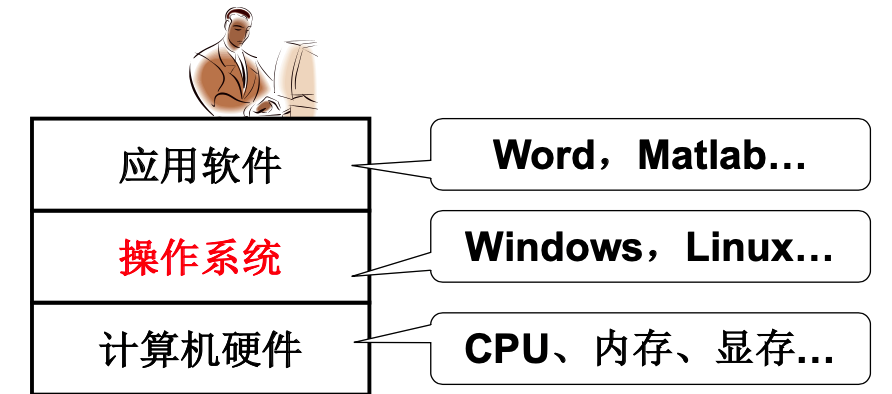
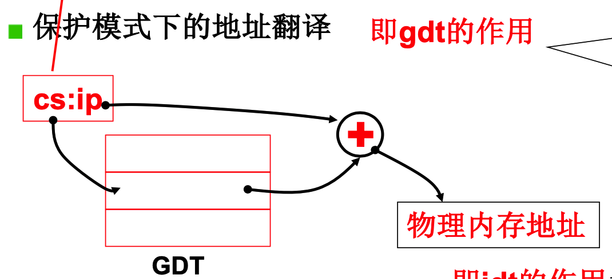
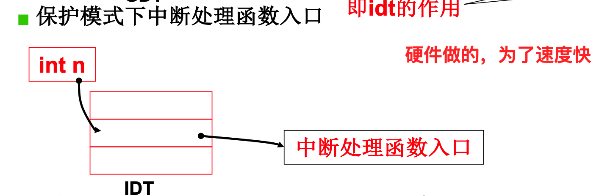
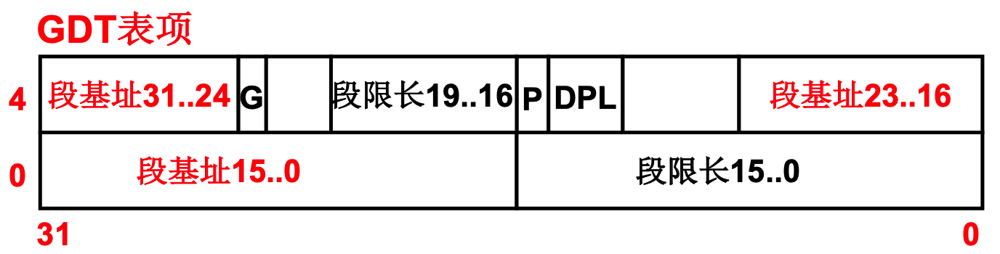

## 01 操作系统启动

### 1. 什么是操作系统

计算机硬件由很多设备组成，比如CPU、内存、磁盘、输入输出设备等等。如果程序员或者普通用户直接在这些硬件上进行操作，那无疑计算机不会像现在这样普及。所以操作系统就像是给硬件穿上了一件衣服。它替我们管理系统资源(CPU, 内存等)，同时抽象出各种接口供上层开发人员进行使用。就如下图所示：

### 2. 操作系统启动过程概览

计算机的本质：**取指执行**。

当按下开机键之后，经历了如下的过程：

1. X86 PC刚开机时CPU处于实模式，(和保护模式对应，实模式的寻址方式是CS:IP CS寄存器左移四位+IP， 可以访问的内存只有1M)

2. 刚开时, `CS=0XFFFF`; `IP=0X0000`,这个地址的指令是运行的第一条指令。这个部分的代码是固化的BIOS程序，执行一些硬件检查工作，如RAM， 键盘、显示器、软硬磁盘等。在检查结束之后，将磁盘0磁道0扇区(一共512个字节)读入`0x7c00`处

3. 设置`CS = 0x7c0, IP=0x0000`,所以接下来就执行的是磁盘0磁道0扇区的代码。这也是操作系统的第一部分代码，称为`bootsect.s`,引导扇区代码。(引导扇区的末尾的最后两个字节都是`0xAA55`，BIOS用于识别引导扇区)

4. `bootsect.s`的代码主要做了以下几个工作

   - 将引导扇区的代码搬到`0x9000:0x0000`处(为了避免后面的将操作系统搬移到0地址处将这部分正在运行的代码覆盖)
   - 将引导扇区后面的四个扇区的代码`setup.s`读到紧邻`bootsect.s`的地址处`0x9020:0x0000`处
   - 然后将`setup`四个扇区后面的`system`模块的代码读取到内存中，同时在屏幕中显示加载系统的动画。(打印字符串等等)
   - 完成上述工作之后，跳转到`setup`部分的代码进行执行。

5. `setup.s`，操作系统需要知道当前计算机的信息，各个硬件的信息，如内存大小，为后面的代码建立数据结构来管理对应的资源做好铺垫工作，所以叫`setup`，初始化各个信息。代码主要完成以下几个工作

   - 获取各个硬件参数，位置后管理做准备
   - 将操作系统挪到0地址处
   - 执行指令，启动保护模式
   - 跳到0地址处进行执行

   **注意：**

   - 之前0地址处是BIOS的中段向量表，供汇编指令`int`使用。但是在保护模式下，`int n` 和`CS:IP`的解释和实模式不再相同。`CS`称为了选择子，在`GDT`表中进行查表选择基址，然后和`IP`拼接为物理地址。在`setup.s`代码中，临时初始化了`GDT`表，为跳到零处和启动保护模式做准备。后面的代码还需要再创建`GDT`表。

   - 实模式下的寻址方式为`CS<<4+IP`一共只能范文20位的地址，也就是`1M`。切换到保护模式，32位的话，可以访问`4G`内存。

   - 操作系统是在实模式还是保护模式下工作主要是取决于`cr0`寄存器中的一位`PE`。

     

     

     

6. `head.s`，system模块有很多文件编译而成，其中第一部分代码是`head.s`。这一部分也是system模块运行的第一块代码。`head.s`之后运行的是代码是`main.c`文件。在`head.s`文件中主要执行了如下的工作：

   - 重新设置`IDT, GDT`表，这一部分是在保护模式下的，所以是32位汇编代码。
   - 初始化其他的操作。
   - `setup`是进入保护模式，`head`是进入之后的初始化。
   - 之后是跳转到`main`函数来运行。然后运行`main`函数，`mian`函数永不会返回，如果返回的话，会跳入到一个死循环。

7. `main.c`。`main`也是进行一系列设备的初始化工作，如内存初始化等。建立对应的数据结构来记录各种资源的利用状态等等。(如搭建一个数组记录页的使用情况等等)。

### 3. 总结

操作系统启动就是主要做了两件事：

1. 将操作系统读入到内存合适的位置
2. 初始化数据结构，为之后管理各种资源做准备。