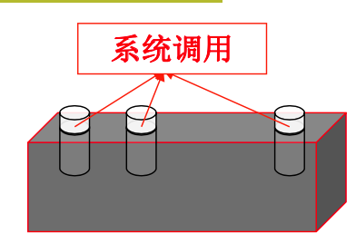
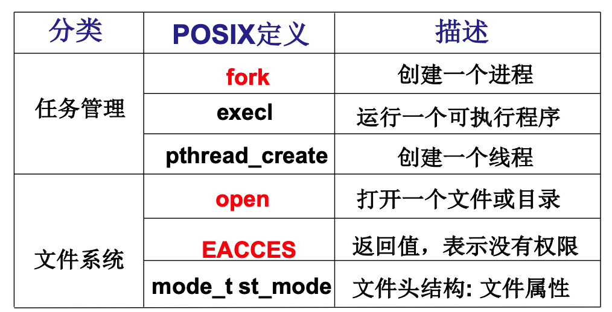
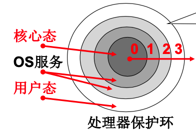
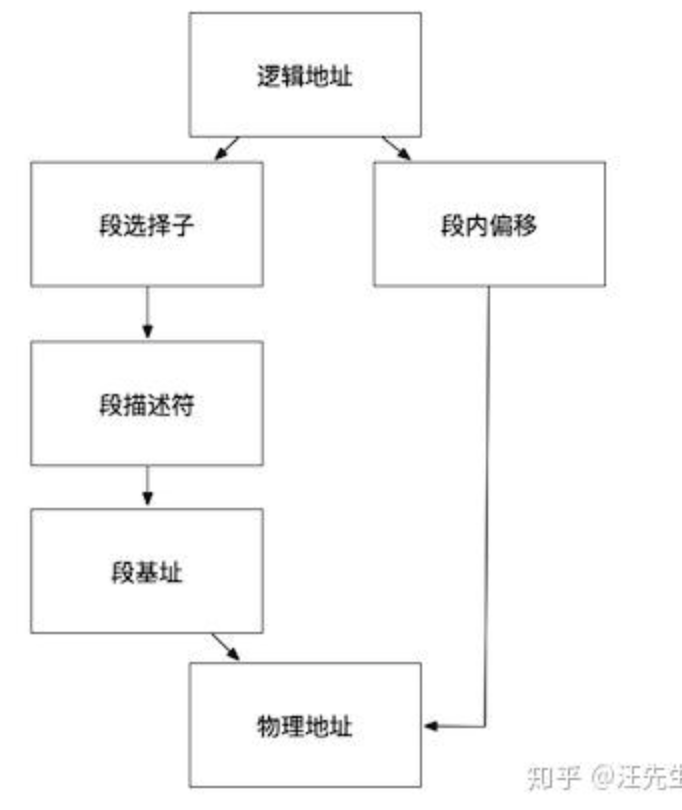
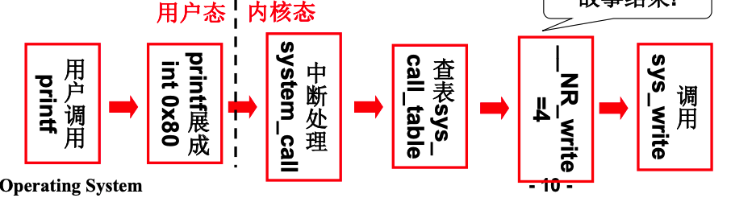
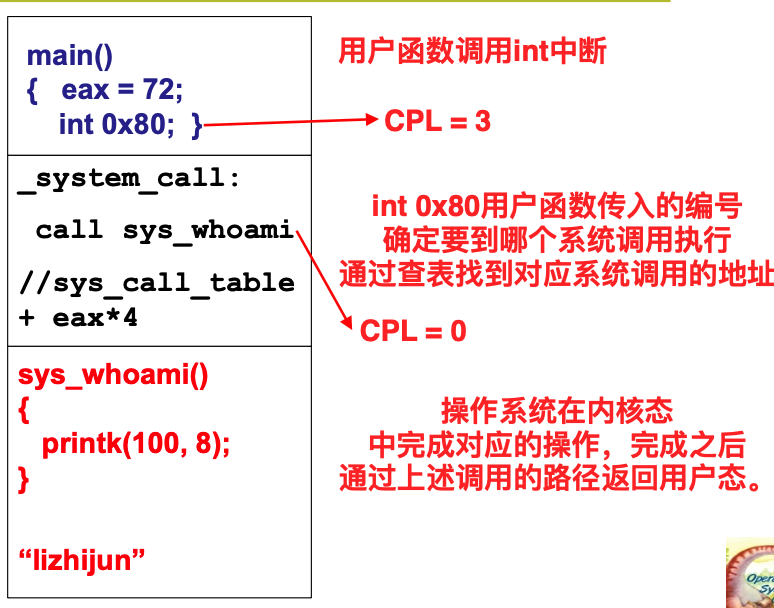

## 02.系统调用

### 1. 什么是接口

接口是操作系统对底层的分装之后，对上层软件暴露的接口。连接上层用户和底层，屏蔽不必要的细节。

操作系统接口就是系统调用，就是操作系统提供的一些函数。如`fork,open,write,read`。

`POSIX`说明了操作系统需要对上层应用提供什么接口，实现什么功能。只要实现的系统符合这个接口，那么在linux上开发的程序也能跑。

操作系统接口连接的不是用户，而是应用软件。用户交互的是各种应用软件。应用软件通过操作系统提供的接口来申请计算机的资源，所有的资源由操作系统统一进行管理。


`shell`也是一段程序。在使用命令行的时候，其实就是在`shell`程序中输入了一个字符串，然后`shell`程序解析这个字符串，

并`fork`一个新的进程来执行其对应的应用程序。所以使用`shell`也是用户在和应用软件进行交互。

图形界面其实也是一个包括画图的C程序，捕捉鼠标的动作，然后对动作进行解析，并执行对应的操作。所以图形界面也是用户和应用软件进行交互。

操作系统接口是连接操作系统和应用软件的，通过C语言来进行链接。在`C`语言中，某些重要的库函数内部需要调用操作系统接口

才能够完成任务，如`printf`函数，底层其实调用了操作系统提供的函数。这些重要的函数就是操作系统的接口。接口表现为函数调用，由系统提供，所以称为系统调用。



下面是POSIX定义的一些系统调用接口：



### 2. 系统调用的实现

为什么要系统调用呢？

因为操作系统管理了一些非常重要的信息，如`root`的密码，这些东西是不能够让用户直接进行访问的。所以一些核心的功能必须封装起来。同时不同的APP的内存空间也不能随意访问，这就涉及到虚拟内存。

如何将内核程序和用户程序进行隔离呢？

区分内核态和用户态。通过处理器的硬件设计，当前运行的指令能够访问的地址进行约束(对跳转指令也一样实现了隔离，不能够随意跳转到内核部分的代码执行。)。如果当前处于用户态的话，其不能够访问内核的数据。处于内核态的则可以访问任何数据。



如何确定当前程序执行在什么态呢？`CS:IP`是当前指令，用`CS`的最低两位来表示：0是内核态，3是用户态。

**补充：保护模式下的寻址方式**

段寄存器`CS`中存储的不再是段基址，而是段选择子，通过这个索引在`GDT`表中查找对应的段描述符，段描述符中长度为`64`位，其中32为存放的是段基址，剩下的32为存放着段边界权限等信息。下面图是整个流程。如果开启了分页机制的话，那么这个流程最后得到是线性地址，还需要经过页部件才转换成物理地址。



硬件如何确保用户态的指令无法访问到内核态的数据呢？

通过比较当前的特权级和目标特权级之间的大小关系。`DPL`是目标特权级，存放在`GDT`表中，`CPL`表示当前的特权级，存放在`CS`寄存器中，如果`DPL >= CPL`则可以访问，否则就是不合法的。


那么用户程序如何才能够进入内核态呢？

硬件提供了“主动进入内核的方法”，通过调用中断指令`int 0x80`,进入内核(只有通过设计的一些中断才能进入内核，不能通过jump, mov等指令)，然后之后的操作流程都有操作系统接管，操作系统通过用户对固定寄存器的赋值情况，进而执行不同的内核代码来进行处理提供服务。

操作系统调用的核心：

1. 用户程序中包含一段包含`int`指令的代码,(有库函数提供)
2. 操作系统写中断处理，获取想调程序的编号。
3. 操作系统根据编号执行相应的代码

**注意：**

- 用户程序能够调`int 0x80`,表明调用完`int 0x80`之后的CPL任然是3，下面再进行跳转，CPL就变为0了。(总得开个口给用户来调)


### 3. printf函数运行流程



在用户态中，通过系统提供的库函数展成包含`int 0x80`的代码，然后进入内核态之后，通过传入的系统调用号，找到对应的系统调用函数的入口地址，跳转过去执行，执行完之后按照调用返回结果即可。



### 4. Linux源码分析

下面就`Linux 0.11`的源码部分中关于系统调用部分代码进行追踪分析。以系统提供的`close`函数为例

```c
// lib/close.c程序
#define __LIBRARY__
#include <unistd.h>


// 在用户空间的接口函数，将本文件include之后，调用close() 函数就转为了调用下面的函数。_syscall1是在unistd.h中定义
_syscall1(int, close, int, fd)
```

```c
// 这个是在unistd.h中对_syscall1的定义
#define _syscall1(type,name,atype,a) \
type name(atype a) \
{ \
long __res; \
__asm__ volatile ("int $0x80" \
    : "=a" (__res) \
    : "0" (__NR_##name),"b" ((long)(a))); \
if (__res >= 0) \
    return (type) __res; \
errno = -__res; \
return -1; \
}

//可以看到其是一个宏，所以上面close.c程序就会被展开成下面的代码
int close(int fd)
{
    long __res;
    __asm__ volatile ("int $0x80"
        : "=a" (__res)
        : "0" (__NR_close),"b" ((long)(fd)));
    if (__res >= 0)
        return (int) __res;
    errno = -__res;
    return -1;
}
// 这样就定义好了close函数。因为各个最终调用int 0x80的代码其实结构是差不多的，所以可以直接定义好框架，然后使用相当于配置的方法就可以直接生成系统调用函数。
// 参数个数不同，用不同的模板。
```

它先将宏 `__NR_close` 存入 EAX，将参数 fd 存入 EBX，然后进行 0x80 中断调用。调用返回后，从 EAX 取出返回值，存入 `__res`，再通过对 `__res` 的判断决定传给 API 的调用者什么样的返回值。

`__NR_close`就是系统调用的编号，其在`include/unistd.h`中被定义。

```c
#define __NR_close    6
/*
所以添加系统调用时需要修改include/unistd.h文件，
使其包含__NR_whoami和__NR_iam。
*/
```

按照上面的流程就能够通过修改对应的代码，添加自己的系统调用。

- 添加自己的系统调用号(还需要修改其他的部分文件，具体见哈工大实验参考书)
- 在系统调用中断处理函数中扩大系统调用函数的数量，随后根据`call sys_call_table(, %eax, 4)`将内核函数加入到内核函数表中
- 在用户空间通过类似配置的方式定义好接口函数
- 在内核代码中实现对应系统调用的函数