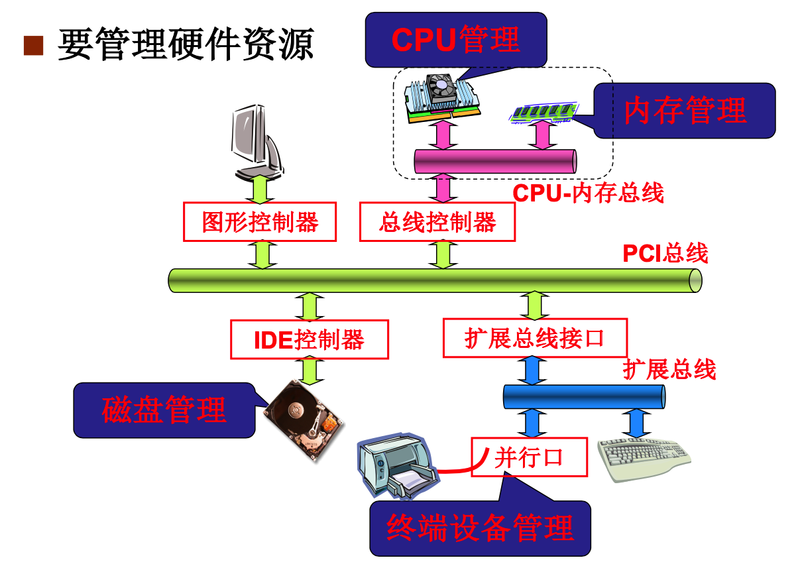
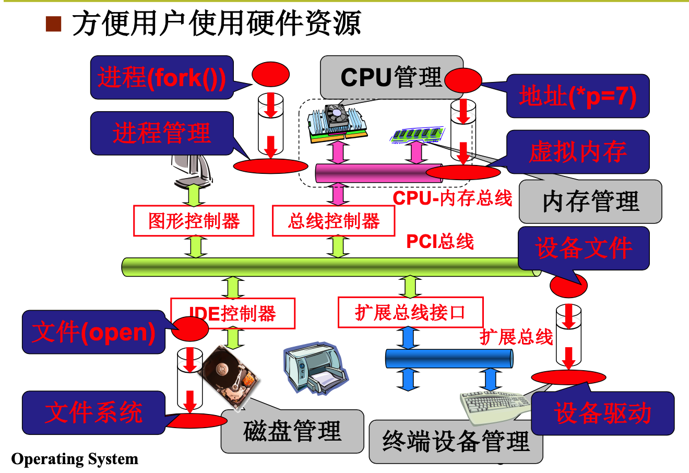

## 操作系统简史

- 早期的计算机是只用来进行计算任务的，当有多个作业需要完成的时候，这些作业一个一个被送入

  计算机进行执行，只有一个简单的监控系统来进行监控。

- 然后计算机开始进入了各个行业，如科学计算、银行等。这个时候需要让一台计算机做很多事，如IO、计算等。如果还按照之前的模式来进行处理的话，如果当前作业发生了IO等，就会占用计算机，使得机器空闲，后面的作业等待。所以需要能够让多个程序之间能够切换，当一个作业发生阻塞的时候，就切换到其他就绪的作业上继续执行。**多道程序**(multiprogramming)的概念就产生了。作业之间的切换和调度成为核心。

- 计算机进入多个行业，使用人数也在增加，需要多个人同时使用一台计算机，每个人启动一个作业，作业之间快速切换，而且还不能在一个人的作业上花费过多的时间，这样其他用户会体验会非常差，所以这个时候**分时系统**(timesharing)的概念就产生了。核心还是任务切换，但是**资源需要复用**(有多个用户)，虚拟内存就是一种复用的思想。

- 之后各大操作系统，如UNIX，Linux，WINDOWS，MACOS等。

总结：

1. 操作系统需要管理多个程序合理推进，这就是进程管理
2. 多进程推进时需要内存复用。
3. 多继承结构是操作系统的基本图谱。
4. 用户体验逐渐变得重要，文件、编程环境、图形界面等。

所以需要掌握：

- 实现操作系统的多进程图谱
- 实现操作系统的文件操作视图。(设备即文件)

### 学习任务

操作系统要管理硬件资源，那么有哪些硬件资源需要管理呢？

`CPU , 内存，  磁盘，  设备等`

如何方便用户使用这些资源？

- 用户想要运行程序，那么需要创建对应的进程，为其分配对应的内存和CPU

- 程序想访问某个地址，操作系统需要保证安全，所以需要对内存进行管理，虚拟化

- 用户想要读写文件，操作系统就需要对文件系统进行管理，给出合适的接口供用户使用

- 用户有很多设备，操作系统还需要对这些设备进行管理，在linux系统中，设备就是文件

所以需要实现如下的内容：

- **CPU管理**：CPU到进程的抽象 -> 多进程基本结构  -> 多进程引发的问题  - > fork如何工作的
- **内存管理**：物理地址到虚拟地址  -> 进程的虚拟内存如何产生的
- **设备管理**：设备使用的基本结构 -> 从设备到文件的抽象 -> `open/read/write`的背后

