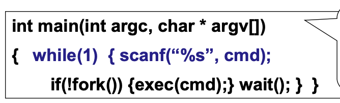
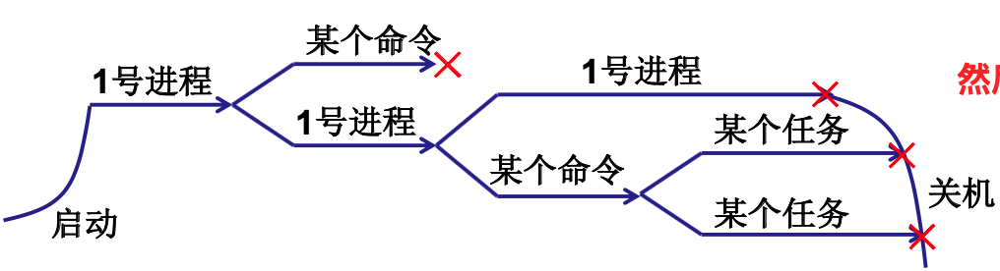
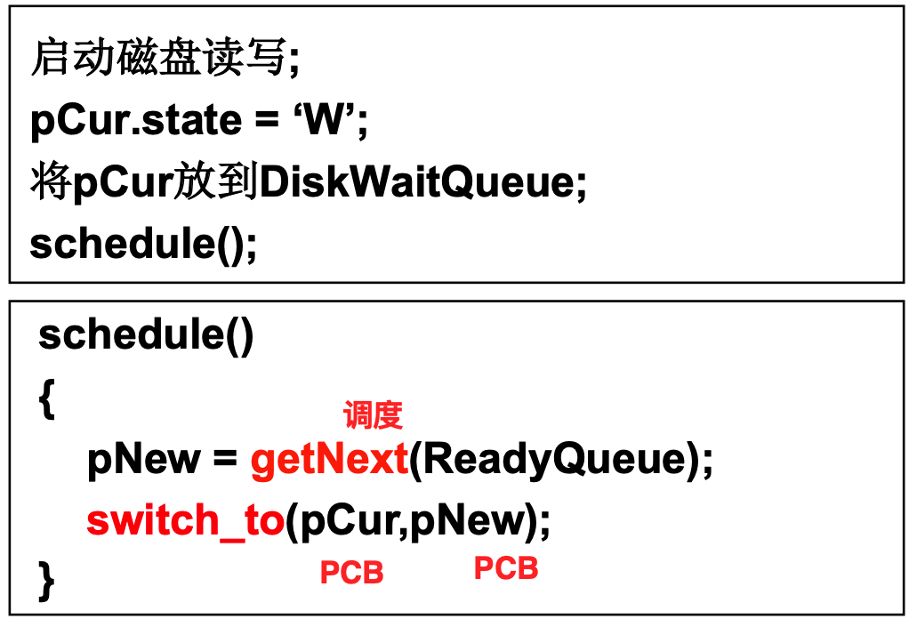
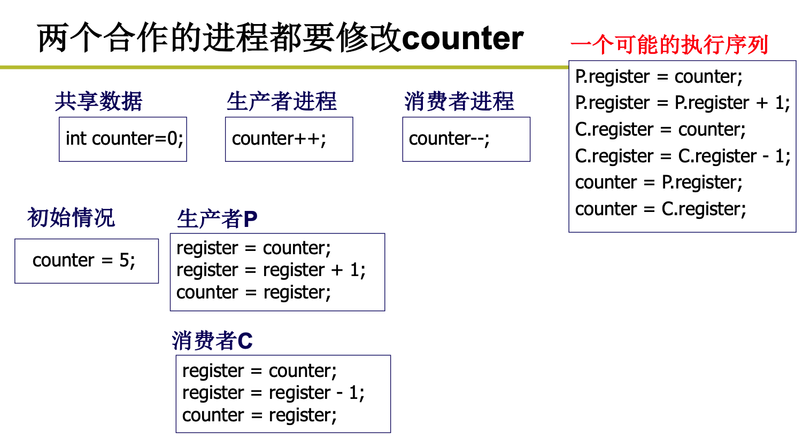

## CPU管理1

### 1. 直观想法及问题解决

计算机的本质就是不断地进行**取指执行**,当计算机上电的那一颗开始，一切的动作都是按照预先设定好的来进行。

一条指令的执行可以分为五个步骤：

- 取指：取出PC指针对应地址处的指令
- 译码：翻译指令，产生对应的各个模块的控制信号等
- 访存：访问内存中的某个地址，取出对应的数据
- 运算：ALU单元计算出结果
- 写回：将计算结果写到对应的位置

当一条指令执行完之后，PC指针就已经计算好了下一条指令的地址，这样按照时钟一步一步地执行下去。

详细执行过程见《计算机组成原理》。

所以如何让一个程序运行起来呢？直接把PC指针赋值给这个程序的第一行代码所在的地址就行了！

但是这样存在问题，如果这个程序发生了IO操作等，会非常耗时，如果一直让它占着CPU，会导致浪费。

所以当一个程序发生了阻塞，则将其他就绪的程序切换到CPU上执行即可。等阻塞解除了，还可以再放回来继续执行。这就需要将多个程序放入到内存中。

一个CPU上交替地执行多个程序称为**并发**。

切换的时候只需要将PC修改就好了么？

如果直接切换PC的话，那么想再回来运行就会发现很多东西找不到了。比如当前的PC值，CPU中的各个寄存器的值，等等。

所以运行的程序和静态的代码是不一样的，还需要存储各种信息。所以操作系统对于每个运行的程序都要有一个数据结构来记录这些信息，这个结构就是**PCB**!

运行的程序和静态程序不一样，这种不一样都表现在了PCB中。这样就有了进程的概念。

进程是执行中的程序：

- 进程有开始，有结束，程序没有
- 进程会走走停停，走停对程序无意义
- 进程需要记录ax, bx,..., 程序不用

### 2. 多进程图像

对于用户来说，他们看到的就是现在有很多的程序正在执行，但是对于操作系统而言，其需要把这些进程记录好，让他们按照合理的次序推进(分配资源、进行调度)等等。操作系统对于进程的感知和管理就是通过`PCB`来进行的。

从开机到关机，操作系统的进程图像是什么样的呢？

操作系统在开机的`main`函数中，执行了`shell`，然后再由`shell`启动其他进程。在`shell`中输入一个命令后，`shell`启动一个进程，然后返回到`shell`，再启动其他进程。

操作系统如何管理多进程？

`PCB(Process Control Block)`是用来记录进程信息的数据结构。所以可以在`PCB`结构体之上建立一些数据结构来进行管理。如各个状态的队列等等。

每个进程现在可能处于不同的状态，下面是每个进程的状态转移图。

- 当一个进程需要某些资源，如磁盘、网卡等，就会从运行态转为阻塞态
- 资源得到满足时，变为就绪态。
- 一个进程运行中，可能有优先级更高的进程来了，那么就会由运行态变为就绪态
- 程序运行结束，称为终止态。

多个进程之间如何进行调度呢？

比如当前进程启动了磁盘读写，然后就需要将当前进程的状态置为`W`状态，然后将当期那进程的PCB放到`DiskWaitQueue`队列中，然后操作系统运行`schedule`算法。

`schedule`函数的功能是：

- 通过调度算法，确定下一个要运行的是哪一个进程
- 进行进程的切换，(保护线程、恢复现场)

所以进程切换可以分为三个步骤：

1. 队列操作
2. 调度
3. 切换

调度的算法之后再详细总结。简单的有`FIFO/优先级队列`。

在切换的时候做了哪些事儿呢？

因为PCB是操作系统管理进程的数据结构，所以将现在正在运行的进程的相关信息，如各个寄存器，存储到这个进程对应的数据结构中，然后将要调度的进程的信息恢复到CPU等位置上，就可以切换到下一个进程上进行执行。

如果内存中同时存在多个进程，如何保证各个进程之间的隔离？

如果多个进程同时放在内存中，必须确保一个进程不能够随意访问另一个进程的地址空间。内存管理建立虚拟内存就是解决这个问题的。将逻辑地址转为线性地址然后再转为物理地址。不同的进程具有不同的逻辑地址到物理地址的映射关系，通过这种映射关系，将各个进程的地址空间隔离开来。

如果内存中同时存在多个进程，如何保证各个进程之间的合作？

多个进程同时在进行工作的时候，如何保证各个进程之间的合作呢？比如打印服务，如果两个进程交替地向缓冲区写入内容，那么最终将会乱套。对于共享的资源，在某个进程对它进行写的时候，必须保证整个写动作是`原子性`的。不然可能会在寄存器级别发生不一致的情况。导致逻辑错误。如下面的情况。

#### 如何形成多进程图像

1. 读写PCB，OS中最重要的结构，贯穿始终
2. 操作寄存器完成切换
3. 写调度程序
4. 进程之间同步与合作
5. 地址映射