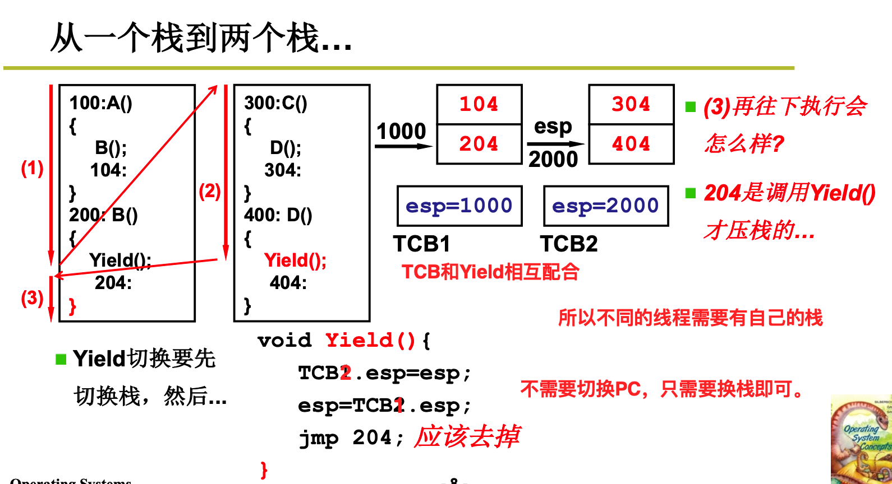
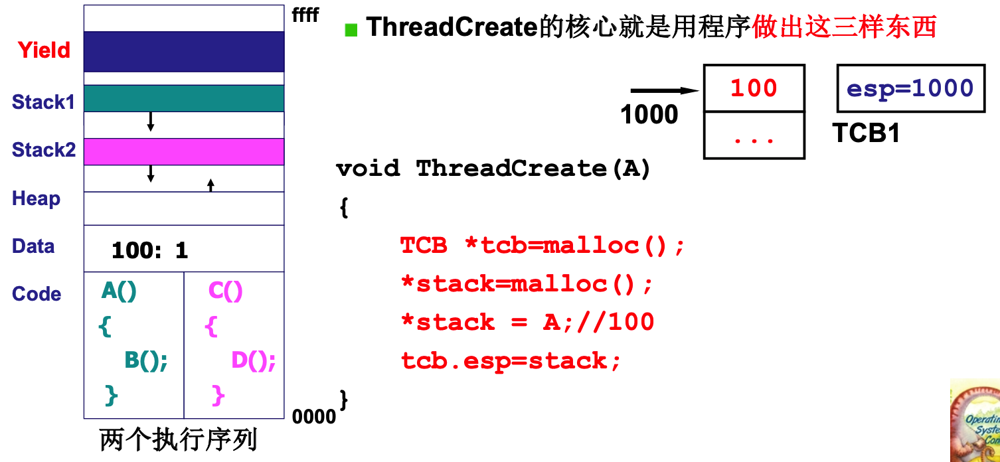
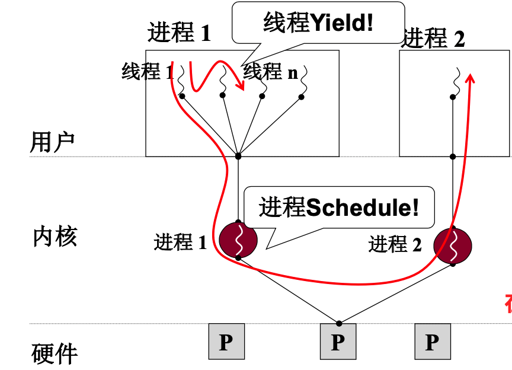
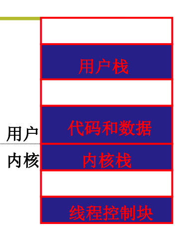
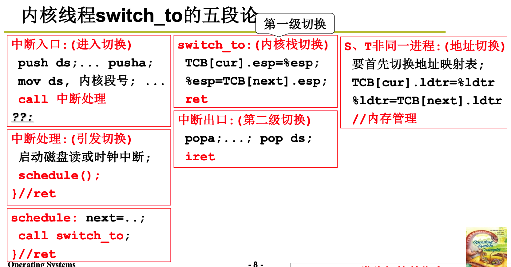
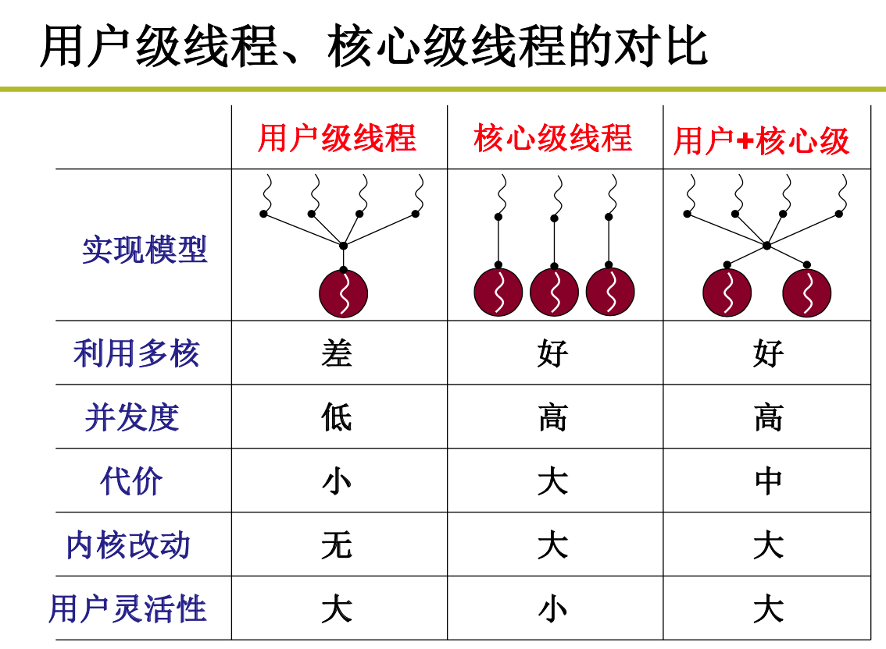

## CPU管理2

### 1. 用户级线程

`进程 = 资源 + 指令执行序列`

由于进程切换的过程总，需要将各个资源进行维护，所以消耗较大。有些时候可能希望多个指令序列对应着一份资源。也就是将资源和指令序列解耦合。一个资源+多个指令执行序列。这个时候就引入了线程的概念。

在线程进行切换的时候，只需要维护好寄存器影响、PC指针以及自己的调用栈即可。

多个执行序列+一个地址空间的真实场景：浏览器

- 一个线程用来从服务器接受数据
- 一个线程用来显示文本
- 一个线程用来处理图片(如解压缩)
- 一个线程用来显示图片

这些线程需要贡献资源，接受的数据显示进程需要读取，所有的文本和图片都显示在一个屏幕上。

多个线程执行的时候，每个线程都要有自己的栈，不然的话，调用顺序会发生混乱。

而且多个是多个栈的话，在线程切换的时候，只需要切换栈指针，不用切换PC，因为遇到`}`的时候会直接执行`iret`指令，这个时候刚好把栈顶的地址弹出并执行，这个刚好就是目标进程的下一个地址！(人脑模拟一下~)

所以两个线程的时候，只需要两个`TCB`来记录每个执行序列的栈指针，两个栈，切换的PC指针刚好就存放在了各自的栈中。

`ThreadCreate`的核心就是创造出上面的数据结构。

为什么是用户级线程？

因为`yield`函数是在用户态的，线程的切换都是在用户态进行的，操作系统完全感受不到它的存在，操作系统值看到有一个进程。这就有一个问题，当用户级线程进行IO时，比如`getData`接受数据的时候，进入到内核态，发生阻塞，但是操作系统看不到他是一个线程，所以会切换到其他进程而不是这个进程的其他线程执行，所以当期进程的所有线层都会被阻塞！

要想实现一个进程的某个线程阻塞之后，当期进程的其他线程还能够继续运行，就必须让操作系统能够“感知”到不同线程的存在。这就是**核心级线程**。用户级线程可以有用户实现各个线程之间的调度，内核级线程完全由操作系统进行调度，用户是无法控制的。

### 2. 内核级线程

不存在用户态进程，因为进程是需要分配资源的，而资源是操作系统进行管理的，所以没有用户态进程这一说法。

一般而言，用户级线程、核心级线程和进程三者都有，这样系统才足够灵活。

只有支持核心级线程，多核CPU才能发挥优势。

多核和多CPU的区别：

- 多核是多个计算单元共享一个Cache和MMU。`MMU`对应着内存地址映射，所以多核CPU上每个核心跑的指令序列要对应着一个进程。
- 多处理器，每个CPU有自己的`Cache`和`MMU`，多以可以同时跑多个进程。

如果不支持核心级线程的话，那么多核就没用，因为计算资源只能按照进程来进行分配，所以一个进程只能后分配到一个`CPU`，就算他有用户级线程，也不能在`CPU2`上跑。所以线程必须进入到核心，这样操作系统就可以给每个线程分配一个CPU，这样才真正实现了并行。如果用户级线程的话，操作系统看不到他，就无法给它分配硬件。

所有多进程不能发挥多核的价值，用户级线程也不能发挥多核的价值，核心级线程才能够发挥多核的价值！

用户级线程和核心级线程的区别？

要想实现核心级线程，那么这个线程不仅会在用户态中运行指令、进行函数调用，还需要再内核态中运行指令，进行函数调用。所以在用户态中要有一个栈，在内核态中也要有一个栈，所以每个线程需要有一套栈！

同时用户级线程的情况下，`TCB`是在用户空间的，内核级线程下，因为操作系统需要进行调度，所以`TCB`是位于内核空间中的。

同时在切换栈的时候，用户级线程只需要根据`TCB`切换一个栈即可，核心级线程需要`TCB`切换，然后根据`TCB`切换一套栈。

用户栈和内核栈直接的关联

当在用户态执行的时候，如果发生了中断，如`INT`指令，那么就会由硬件将用户栈的栈指针压如到内核栈中保存，同时还需要记录用户态中代码执行到了哪条指令，也就是`PC`指针的值，以及其他的一些信息。所有中断(时钟、外设、INT、指令)都会引起上述的切换。

核心级线程的切换过程？

假设要从线程1切换到线程2，那么首先会将线程1的用户栈的各个指针、信息等压入线程1的内核栈中，然后将线程1的内核栈的指正存到线程1的`TCB`中，然后找到线程2的`TCB`，将其中存储的线程2的内核栈的指针取出来，赋给对应的物理内存器，完成了内核栈的切换，然后再使用`iret`指令完成用户栈的切换。这样就完成了线程的切换。

内核级线程切换的五段论：

1. 中断入口，进入切换
2. 中断处理，引发切换
3. 根据调度算法，选择下一个要执行的线程
4. 根据`TCB`完成内核栈的切换
5. 将对应的用户栈的信息弹出，运行`iret`指令，完成用户栈的切换。(中断出口)

如果是进程切换的话，还需要加上内存的映射表切换，就完事儿了。

如何创建核心级线程呢？

初始化核心级线程只需要将一个线程做成要切换后去的样子就可以了。当切换到它进行处理的时候，直接将指针切过去就可以了。

申请数据结构，申请用户栈空间，申请内核栈空间，然后用户栈地址放到内核栈中，将内核栈指针放到TCB中，然后将TCB状态置为就绪，然后将TCB入队列，就可以了！

### 用户级线程、核心级线程的对比

用户级线程非常灵活，想启动多少个线程都是可以的。

但是内核级线程不行，因为每个内核级线程都需要在内核空间创建对应的数据结构进行维护，所以支持不了太多内核级线程。

用户级线程用户可以自己实现调度函数，根据产品的特点自己实现各个线程的调度，但是内核级线程只有操作系统可以调度，用户无法控制调度流程。

`用户+核心级`线程具有很大的优点！