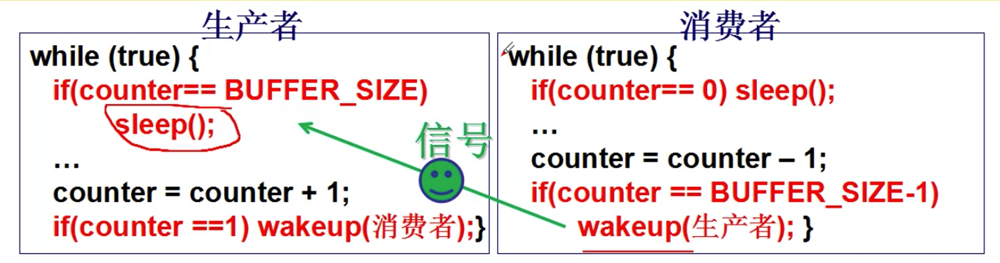
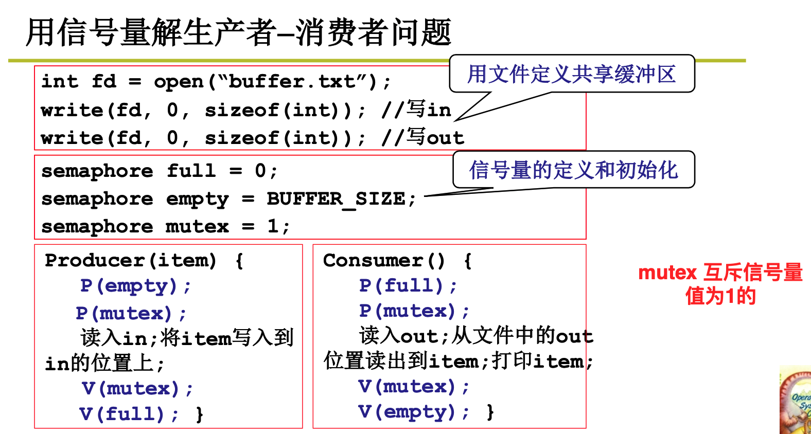
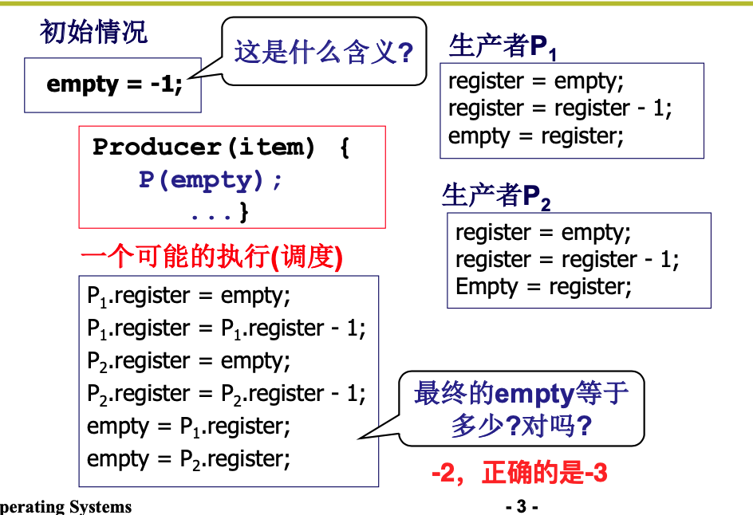
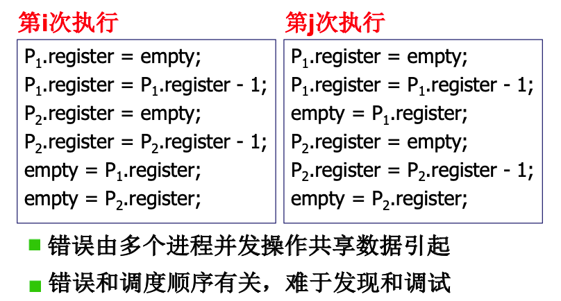
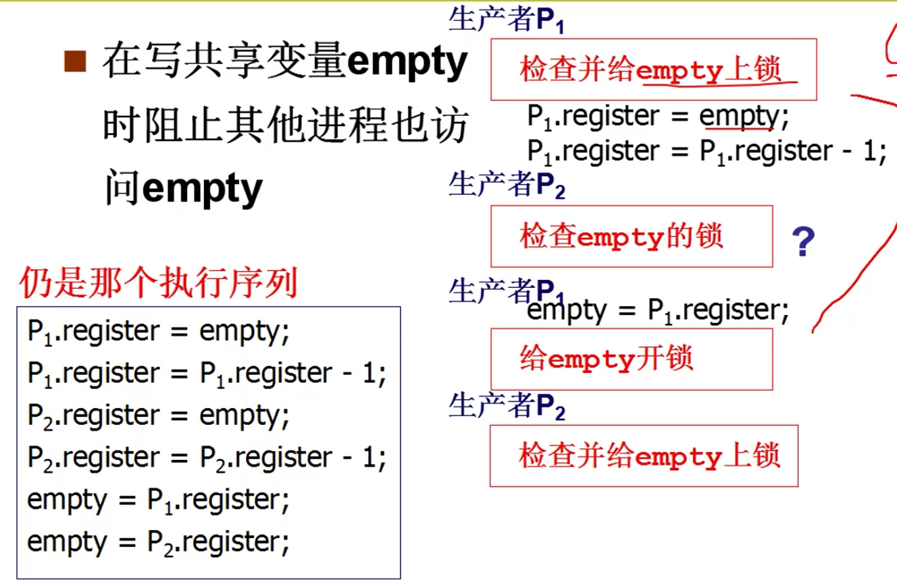
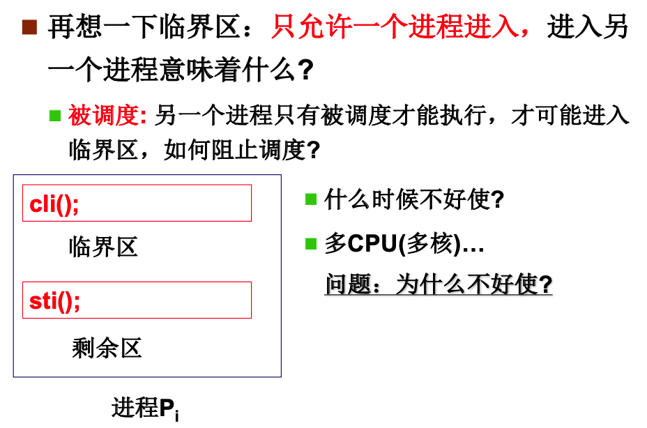
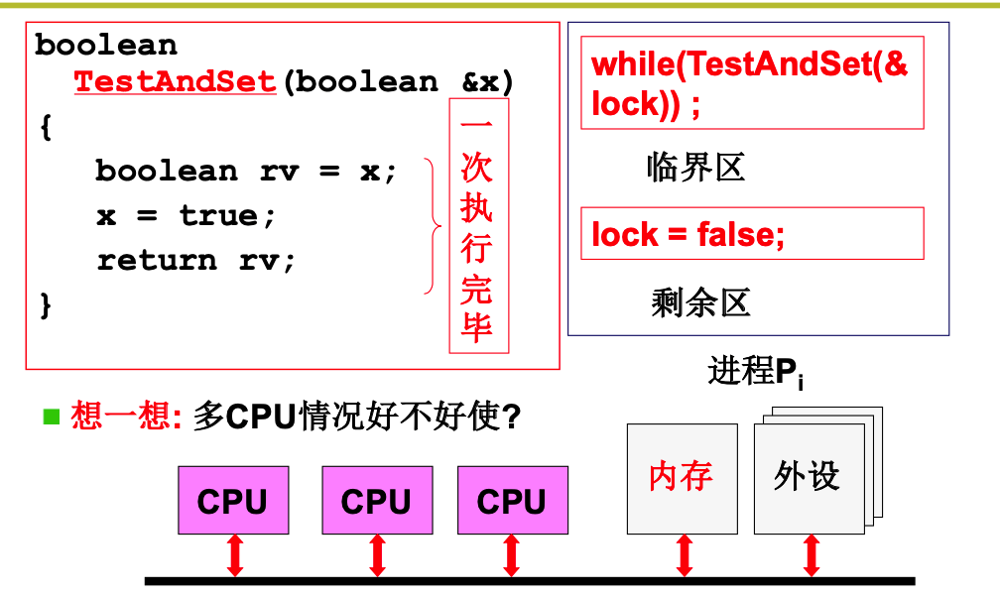

## CPU管理4--进程间合作

让多个进程合理有序地执行，需要使用信号量来进行辅助。

比如死机是一个进程，售票员是一个进程。每个进程都有自己的一套执行序列。


司机运行的时候，必须等待着来自售票员发出的信号，才能够继续执行启动车辆的指令。

当售票员把门关上的时候，就会给司机发送一个信号，告诉司机可以启动了，司机才会启动。

当司机到站把车停稳了，给售票员发送一个信号，这个时候售票员才能够执行开门的指令。

所以如果需要多个进程合理有序的执行，需要使用一种信号机制，于是有了信号量！

### 生产者、消费者模型

共享一个数据，生产者向缓冲区添加内容，消费者从缓冲区拿出内容。那么当缓冲区空的时候，消费者需要陷入等待，来等一个信号才能继续执行。当缓冲区满的时候，生产者需要陷入等待，来了一个信号，表示缓冲区有空间时，才能够继续执行。

**需要让进程走走停停来保证多进程合作的合理有序，这就是进程同步**

我们需要分析清除在什么情况下，让进程停下来；什么情况下能够让它继续执行。



但是，信号携带的信息还是太少了。比如，如果有多个生产者阻塞，然后消费者消费了一个，就会发送一个信号，来唤醒生产者。

但是这个时候唤醒了一个生产者，这个时候还有生产者在阻塞状态。之后的情况下，可能消费者都不会遇到缓冲区慢的情况，那么

就会导致有一个生产者永远不能被唤醒的情况。

所以不仅仅需要知道有多少缓冲区，还需要记录有多少个生产者在睡眠！counter不能够满足我们的要求，还需要另外一个量来决定要不要发信号，而不是需要另外一个量来决定是不是需要发信号。这个就是信号量！不能只是等信号、发信号，还需要用一个量来记录更全面的信息。

> 信号量是记录一些信息的量，并根据这个信息决定睡眠还是唤醒(信号)

信号量表示当前资源的剩余个数。当一个进程运行到某一步需要申请某个资源的时候，需要首先看一下这个信号量，将其减1，如果信号量小于零，说明资源不足，而且自己也没有申请到资源，那么就需要进入阻塞状态。当另一个进程释放了这个资源，那么就需要将这个资源对应的信号量加1，如果这个时候信号量个数小于等于零，说明还有进程在这个资源上阻塞了，那么就需要发送一个信号，来将阻塞的进程唤醒一个。

所以一个信号量里面需要有一个量来记录其记录的资源的剩余个数。同时，还需要一个队列，来记录阻塞的进程的`PCB`。

```cpp
struct semaphore{
  
  int value;  // 记录资源的个数
  PCB *queue;  // 记录等待在该信号量上的进程
}
P(semaphore s); // 消费资源
V(semaphore s); // 产生资源

P(semaphore s){
  
  s.value --;
  if(s.value < 0){
    sleep(s.queue);
  }
}

V(semaphore s){
  s.value ++;
  if(s.value <= 0){
    weakup(s.queue);
  }
}
```



`mutex`来控制只有一个进程访问共享资源。

### 信号量临界区保护

如果只要上面的信号量，还不能保证正常工作。真正的故事是`临界区保护信号量，信号量实现进程之间的同步！`

下面是两个生产者的执行序列：



通过对上面代码执行，我们发现最终的值并不是我们希望的结果。这是因为，一个进程在执行修改`empty`的代码的时候，另外一个进程将其打断，也执行了自己的修改`empty`的代码。这个时候就会发生问题。

> 竞争条件：和调度有关的共享数据语义错误。



解决上面的问题的直观想法是，在一个进程使用一个共享变量的时候，要不就全部修改完成，要不就一点不做。所以在使用的时候，将这个变量加上一个锁，使用完了再释放这个锁。



> 一段代码，一次值允许一个进程进入。可能多个进程在执行相同的代码，但是有些代码是一次只能有一个进程进入。在某个进程执行的过程中，其他进程不能也执行这段代码！不能够被其他进程竞争走！

> 临界区：一次只允许一个进程进入的该进程的那一段代码！


**那么如何实现加锁呢？**

有各种软件的算法来实现，但是都比较复杂，下面是两个比较简单的硬件的实现。

1. 关中断

   

   但是每个CPU有自己的时钟中断处理，所以如果是多核的话，多个CPU同时在处理，同时将自己的中断关了，那么也会同时运行临界区代码。

   2. 硬件原子指令法。

      

      不能够用信号量来实现锁，因为在修改锁的时候，也需要对锁进行保护，这样就无穷地递归下去了。。。。

      所以需要使用硬件来实现互斥！所**以需要硬件来支持原子指令。**要不执行，要不不执行！


> 核心：用临界区保护信号量，用信号量实现同步！