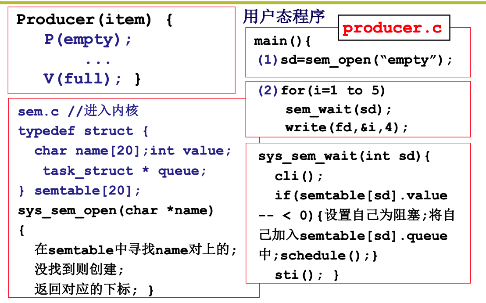
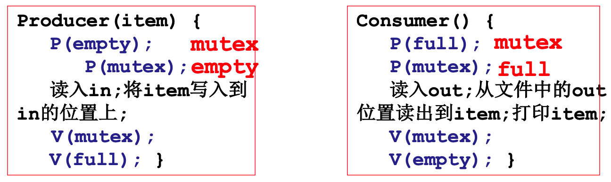
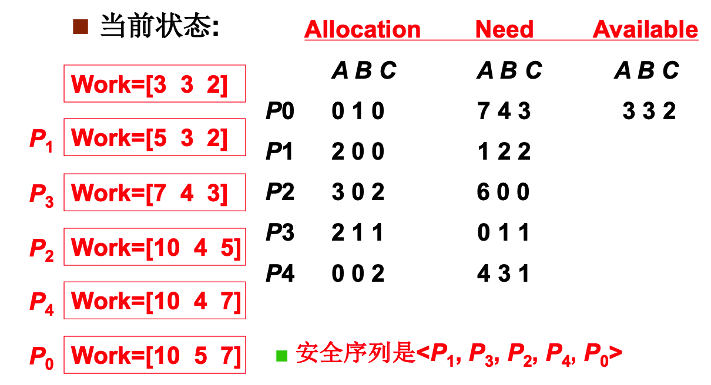
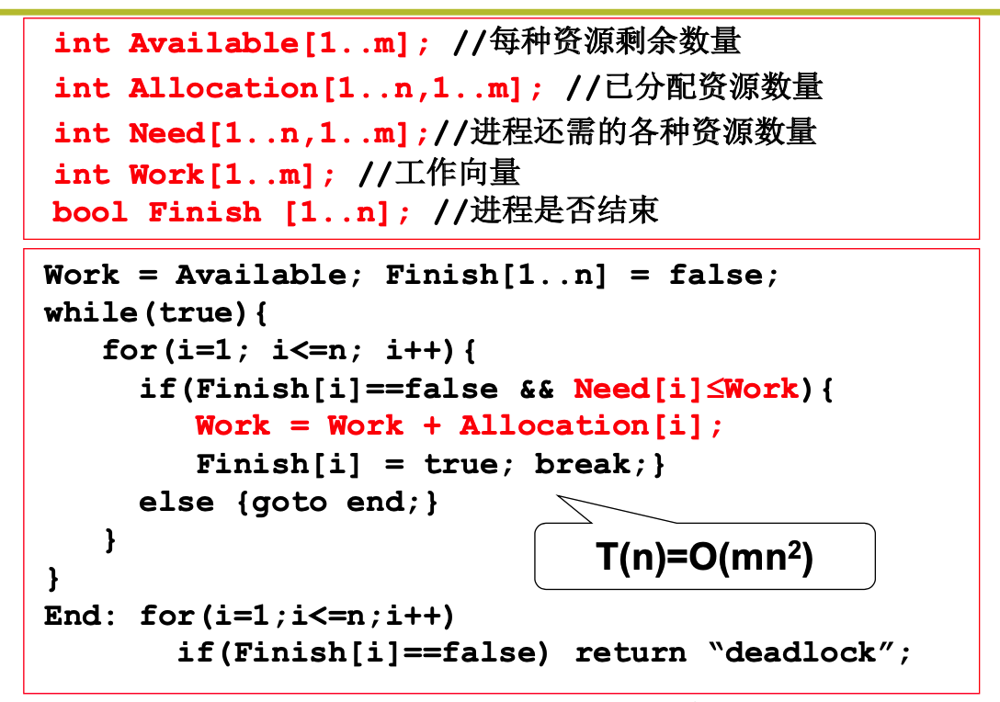

## CPU管理5

### 信号量的代码实现

在内核中定义一个结构体数组，结构体中的每一项存储以下内容：

- 信号量的名字，方便多个用户进程通过名字访问同一个信号量
- 信号量的值
- 在当前信号量上阻塞的进程队列。

同时，操作系统还需要提供一下的西系统调用：

- 按照名字创建一个信号量
- P操作
- V操作

在实现`P`, `V`操作的时候，需要通过开关中断来实现对临界区的保护。

#### Linux 0.11中的实现方式

在Linux 0.11 中，通过使用极其隐蔽的方式实现了如果一个信号量上阻塞了多个进程，那么当一个信号来了之后，会将在这个信号量上阻塞的进程全部唤醒。这样其实有一个好处，就是避免了优先级反转的问题：

当先来的进程在某个信号量上阻塞了，然后一个优先级更高的进程也在这个信号量上阻塞了。那么当这个资源有了时候，按照上面的方法，优先级低的先到的会被先唤醒，先执行。这样就导致了`优先级反转`，一般应该让优先级高的进程执行。

如果信号来了之后将所有的进程都会变唤醒，那么完全由操作系统来进行调度，优先级高的进程及会被执行，就避免了优先级反转的问题。

### 死锁问题

考虑生产者消费者问题：

如果将两个信号量的次序交换，则有可能出现以下的问题：

当缓冲区慢的时候，如果这个时候P拿到了`mutex`，然后在`empty`上阻塞了，要想唤醒P，则必须要有消费者拿走一个物品。但是由于P占有了`mutex`，所以不可能有消费者能够进入到临界区，这样就造成了死锁！所有进程都无法继续执行。可以看出来，是P占有了mutex，希望C执行`V(empty)`,然后C要想执行`V(empty)`，就需要P执行`V(empty)`。形成了互相等待。

> 多个进程由于相互等待对方持有的资源而造成谁都无法执行的情况叫死锁。

如果一个发生了死锁，那么这写进程拥有的资源都无法被释放，那么就会导致其他进程如果也申请这些资源的时候，也会陷入到死锁中。最终死锁的进程会越来越多。

发生死锁的4个必要条件：

1. 互斥使用，资源的固有特性
2. 不可抢占，资源只能自愿放弃，
3. 请求和保持，进程必须占有资源，再去申请
4. 循环等待，在资源分配图中存在一个环路

死锁的处理方法：

- 死锁预防、破坏死锁出现的条件
- 死锁避免，检测每个资源请求，如果造成死锁就拒绝
- 死锁检测+恢复，检测到死锁时，让一些进程回滚，让出资源
- 死锁忽略，假装死锁没有出现一样

死锁预防的方法：

- 进程执行前，一次性申请所有需要的资源。
  - 需要预知未来，编程困难
  - 许多资源分配后很长时间后才使用，资源利用率低。
- 对资源类型进行排序，资源申请必须按序执行，不会出现环路等待。
  - 仍然造成资源的浪费

死锁避免的方法：

如果系统中的所有进程存在一个可完成的执行序列`P1, P2, .... Pn`,则成系统处于安全状态。

找安全序列使用银行家算法：

算法核心思想：

- 从剩余的进程中选择一个当前剩余资源能够支撑其完成的进程。然后假装这个进程完成了，那么其现在拥有的资源就可以释放了，加到word向量中。
- 持续下去，直到所有的进程都可以被执行完，就说明存在这样一个序列。

在请求的时候，假装给 其分配资源，然后调用银行家算法，如果存在着合法序列，则分配给他，否则就不分配。

这个问题是每次申请都需要执行`O(mn^2)`，效率低。

死锁恢复算法：发现问题再处理

- 选择那些进程回滚？优先级？占用资源多的？
- 如何实现回滚？已经修改的文件怎么办？

现在的通用操作系统，如`Linux/Windows`都是采用忽略的策略处理。

