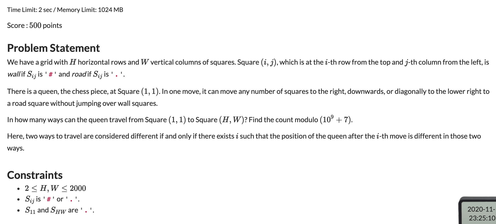
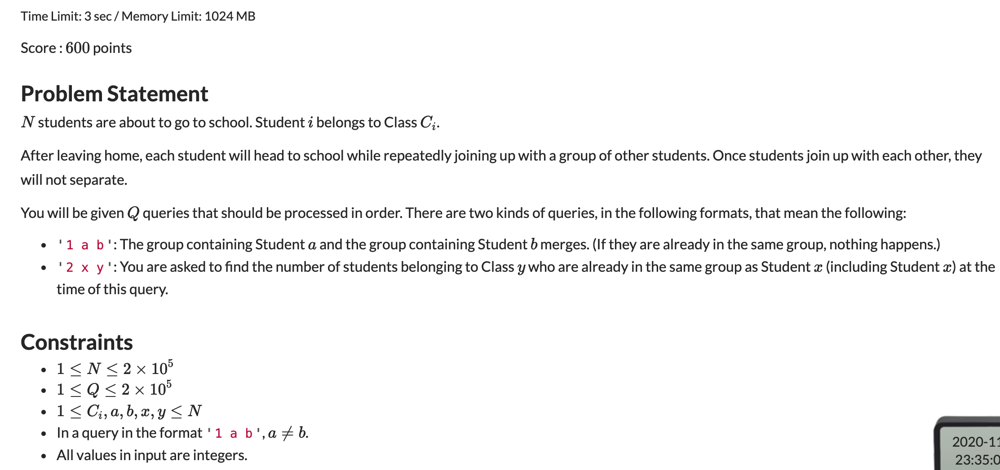

## ABC183题解

### [E题](https://atcoder.jp/contests/abc183/tasks/abc183_e)



典型的动态规划问题。

考虑从起点到终点这个问题，我们按照最后一步来对它进行分为三类：

1. 最后一步从上到下
2. 最后一步从左到右
3. 最后一步从左上到右下

用公式表达就是如下的结果：

$$dp[i][j] = \sum_{k=1}^{K_1}dp[i-k][j] + \sum_{k=1}^{K_2}dp[i][j - k] + \sum_{k = 1}^{K_3}dp[i-k][j-k]$$

其中的$K_1， K_2, K_3$是从这个点向上，向左，向斜上方走的最远的没有遇到障碍物的距离。

如果直接进行裸的DP的话，时间复杂度是$O(N^3)$,会超时。我们可以开三个记录数组来优化当前位置在三个方向满足条件的累加和。这样的时间复杂度是$O(N^2)$。(画一个方格图就理解了) 这样的二维DP，然后在运行的过程中开数据结构来优化的题目比较爱考。

#### 代码

```c++
#include <iostream>
using namespace std;

const int N = 2010, MOD = 1e9 + 7;
char q[N][N];
typedef long long LL;
LL dp[N][N];
LL rec1[N][N], rec2[N][N], rec3[N][N];
int n, m;

int main() {
	
	ios::sync_with_stdio(false);
	cin.tie(nullptr);
	cout.tie(nullptr);
	
	cin >> n >> m;
	for (int i = 1; i <= n; i ++) {
		for (int j = 1; j <= m; j ++) {
			cin >> q[i][j];
		}
	}
	for (int i = 1; i <= n; i ++) {
		for (int j = 1; j <= m; j ++) {
			if (i == 1 && j == 1) {
				dp[i][j] = rec1[i][j] = rec2[i][j] = rec3[i][j] = 1;
				continue;
			}
			if (q[i][j] == '#') {
				dp[i][j] = rec1[i][j] = rec2[i][j] = rec3[i][j] = 0;
			} else {
				dp[i][j] = rec1[i][j - 1] + rec2[i - 1][j] + rec3[i - 1][j - 1];
				dp[i][j] %= MOD;
				rec1[i][j] = (rec1[i][j - 1] + dp[i][j]) % MOD;
				rec2[i][j] = (rec2[i - 1][j] + dp[i][j]) % MOD;
				rec3[i][j] = (rec3[i-1][j-1] + dp[i][j]) % MOD;
			}
		}
	}
	cout << dp[n][m];
	return 0;
	
}
```

### [F题](https://atcoder.jp/contests/abc183/tasks/abc183_f)



#### 解题思路

比较容易可以想到用并查集维护两个集合合并的问题，不过这里需要合并的过程中，将一个集合中的元素都插入到另一个集合中去。暴力合并的话，时间复杂度为$O(n^2)$，会超时。这个时候就需要使用**启发式合并**，每次将元素个数较少的那个合并到元素较多的集合中。时间复杂度为$O(N\log(N))$，可以通过此题。

#### 代码

```c++
#include <iostream>
#include <map>
#include <cstdio>
using namespace std;

const int N = 2e5 + 10;

int fa[N]; // 并查集
int cnt[N];  // 记录集合元素多少
map<int, int> rec[N]; // 每个集合用一棵树维护
int n, q;

int find(int a) {
	return a == fa[a] ? a : fa[a] = find(fa[a]);
}

int main() {
	
	
	cin >> n >> q;
	for (int i = 1; i <= n; i ++) {
		fa[i] = i;
		cnt[i] = 1;
		int x;
		scanf("%d", &x);
		rec[i][x] ++;
	}
	while (q --) {
		int t, a, b;
		scanf("%d%d%d", &t, &a, &b);
		if (t == 1) {
			int ffa = find(a), ffb = find(b);
			if (ffa == ffb) continue;
			if (cnt[ffa] > cnt[ffb]) swap(ffa, ffb); 
			fa[ffa] = ffb;
			cnt[ffb] += cnt[ffa];
			for (auto x : rec[ffa]) {  // 启发式合并
				rec[ffb][x.first] += x.second;
			}
		} else {
			printf("%d\n", rec[find(a)][b]);
		}
	}
	return 0;
	
}
```