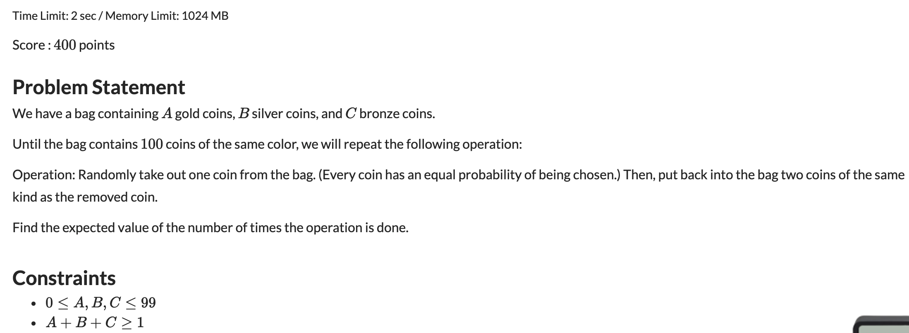
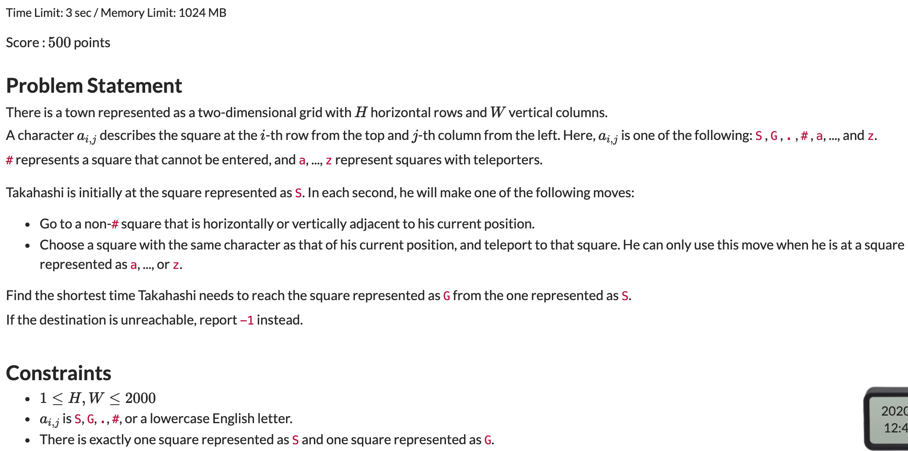
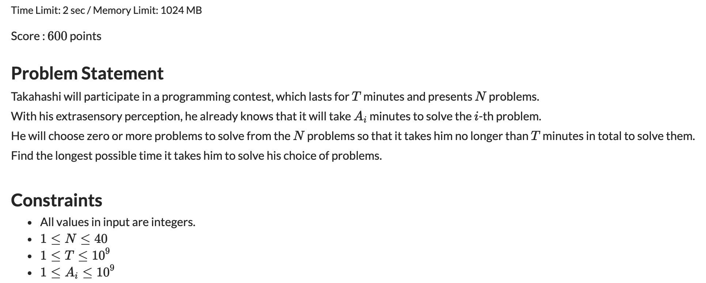

## [ABC184题解](https://atcoder.jp/contests/abc184/tasks)

### [D](https://atcoder.jp/contests/abc184/tasks/abc184_d)



#### 解题思路

典型的期望型动态规划。主要利用的期望的线性性质。

若随记变量$X$可以写成若干个随记变量的线性组合。即

$$X = \sum_{i=1}^{N} \alpha_i Y_i$$

则有

$$E(X) = \sum_{i = 1}^{N} \alpha_i E(Y_i)$$

这条性质的试用范围非常广，不管$X$和$Y$直接是否相关，都可以直接使用。具体证明略。

然后可以定义状态`dp[i][j][k]`表示当前`i`个金，`j`个银，`k`个桐的时候，需要操作数的期望。那么从当前状态出发，有

$$dp[i][j][k] = \frac{i}{i + j + k} \times dp[i + 1][j][k] + \frac{j}{i + j + k} \times dp[i][j + 1][k] + \frac{k}{i + j + k} \times dp[i][j][k + 1] + 1$$

边界情况是，任意`i, j, k` 等于100的时候，返回0即可。

这里使用记忆化搜索的方式实现。

#### C++代码

```c++
#include <iostream>
#include <cstdio>

using namespace std;
const int N = 105;
double dp[N][N][N];

double find(int a, int b, int c) {
    if (a == 100 || b == 100 || c == 100) return 0;
    if (dp[a][b][c] != 0) return dp[a][b][c];
    dp[a][b][c] = (double)a / ( (double)a + b + c) * find(a + 1, b, c) + b / ( (double)a + b + c) * find(a, b + 1, c) + c / ( (double)a + b + c) * find(a, b, c + 1) + 1;
    return dp[a][b][c];
}

int main() {
    
    int a, b, c;
    cin >> a >> b >> c;
    
    printf("%.13f", find(a, b, c));
    return 0;
}
```

### [E](https://atcoder.jp/contests/abc184/tasks/abc184_e)



#### 解题思路

最短路模型，使用BFS进行搜索。可以记录一下各个字母出现的所有位置，然后将这些位置各自连一条边，BFS即可。

#### C++代码

```c++
#include <iostream>
#include <cstring>
#include <vector>
#include <queue>
using namespace std;

const int N = 2005;

typedef pair<int, int> PII;
string q[N];
int n, m;
int dis[N][N];
bool vis[N][N];
bool trans[30];

vector<PII> rec[30];
int dx[4] = {0, 0, 1, -1};
int dy[4] = {-1, 1, 0, 0};


int main() {

    cin >> n >> m;
    for (int i = 0; i < n; i ++) cin >> q[i];
    int si, sj, ei, ej;
    for (int i = 0; i < n; i ++) {
        for (int j = 0; j < m; j ++) {
            if (q[i][j] == '.') continue;
            else if (q[i][j] == 'S') si = i, sj = j;
            else if (q[i][j] == 'G') ei = i, ej = j;
            else rec[q[i][j] - 'a'].push_back({i, j});
        }
    }
    queue<PII> stk;
    stk.push({si, sj});
    vis[si][sj] = true;
    while(!stk.empty()) {
        auto ele = stk.front();
        stk.pop();
        int x = ele.first, y = ele.second;
        for(int i = 0; i < 4; i ++) {
            int xx = x + dx[i], yy = y + dy[i];
            if (xx < 0 || xx >= n || yy < 0 || yy >= m) continue;
            if (vis[xx][yy]) continue;
            if (q[xx][yy] == '#') continue;
            dis[xx][yy] = dis[x][y] + 1;
            if (xx == ei && yy == ej) {
                cout << dis[xx][yy];
                return 0;
            }
            vis[xx][yy] = true;
            stk.push({xx, yy});
        }
        if (q[x][y] >= 'a' && q[x][y] <= 'z' && !trans[q[x][y] - 'a']) {
            for (auto ele : rec[q[x][y] - 'a']) {
                if (!vis[ele.first][ele.second]) {
                    dis[ele.first][ele.second] = dis[x][y] + 1;
                    vis[ele.first][ele.second] = true;
                    stk.push(ele);
                }
            }
            trans[q[x][y] - 'a'] = true;
        }
    }
    cout << -1;
    return 0;
}s
```

### [F](https://atcoder.jp/contests/abc184/tasks/abc184_f)



#### 解题思路

将N分成两半，然后分别求各自所有可能的情况，然后再进行二分。

#### C++代码

```c++
#include <iostream>
#include <set>
using namespace std;

const int N = 45;
int q[N];
int n, T;

int main() {
	
	cin >> n >> T;
	for (int i = 0; i < n; i ++) cin >> q[i];
	set<int> L, R;
	int l = n >> 1, r = n - l;
	
	for (int i = 0; i < (1 << l); i ++) {
		long long t = 0;
		for (int j = 0; j < l; j ++) {
			if ((i >> j) & 1) {
				t += q[j];
				if (t >= T) break;
			}
		}
		if (t <= T) L.insert(t);
	}
	for (int i = 0; i < (1 << r); i ++) {
		long long t = 0;
		for (int j = 0; j < r; j ++) {
			if ((i >> j) & 1) {
				t += q[j + l];
				if (t >= T) break;
			}
		}
		if (t <= T) R.insert(t);
	}
	int ans = 0;
	for (auto x : L) {
		auto y = R.upper_bound(T - x);
		if (y == R.begin()) continue;
		-- y;
		ans = max(ans, x + *y);
	}
	cout << ans;
	return 0;	
}
```

