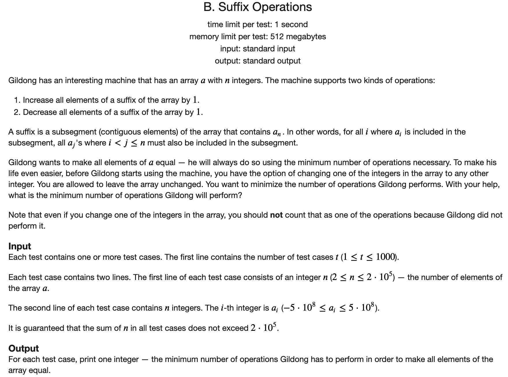

## [CF Codeforces Round 688 (Div. 2)题解](https://codeforces.com/contest/1453)

### [A](https://codeforces.com/contest/1453/problem/A)

#### 解题思路

题目比较简单，其实就是求两个有序数组相同元素的个数，使用双指针进行扫描即可。

#### C++代码

```c++
#include <iostream>
using namespace std;

const int N = 105;
int a[N], b[N];

int main() {
	int t;
	cin >> t;
	while (t --) {
		int n, m;
		cin >> n >> m;
		for (int i = 1; i <= n; i ++) cin >> a[i];
		for (int i = 1; i <= m; i ++) cin >> b[i];
		int ans = 0;
		int p = 1, q = 1;
		while (p <= n && q <= m) {
			if (a[p] == b[q]) {
				ans ++;
				p ++;
				q ++;
			} else if (a[p] < b[q]) p ++;
			else q ++;
		}
		cout << ans << '\n';
	}
	return 0;
}
```

### [B](https://codeforces.com/contest/1453/problem/B)



#### 解题思路

首先我们考虑不更改数组的情况，该如何操作使得次数最少。由于我们每次只能选择一个后缀进行操作。所以我们将所有操作选择的后缀长度按照升序排好序，可以观察到如下的性质：

1. 同一个长度的后缀要不都执行增，要不都执行减，要不不执行。不可能有的执行增，有的执行减。因为相互抵消，不执行次数会更少。

所以我们按照这样的操作，而且还要保证数字都相同，那只可能是调整最后一个数使得它和导数第二个相同，然后再调整最后两个数使得它们和导数第三个相同，依次类推，答案为

$$\sum_{i=n}^{2} |a[i] - a[i-1]|$$

然后我们考虑修改一个数带来的影响。

假设我们选择修改元素`a[i]`，那么将其修改为多少才是最优的呢。由于修改`a[i]`只会影响它的相邻的两个元素，也就是我们希望$|a[i-1] - x| + |a[i + 1] - x|$最小，由绝对值不等式可知，当`a[i]`边成`a[i-1]`与`a[i + 1]`的中位数是，操作次数最小。

这样就可以枚举所有的`a[i]`，然后找到一个使得总次数减少最多的即可。边界的时候需要额外处理一下。

#### C++代码

```c++
#include <iostream>
using namespace std;

const int N = 2e5 + 5;
int q[N];


int main() {
	
	ios::sync_with_stdio(false);
	cin.tie(nullptr);
	cout.tie(nullptr);
	
	int t;
	cin >> t;
	while (t --) {
		int n;
		cin >> n;
		for (int i = 1; i <= n; i ++) cin >> q[i];
		long long ans = 0;
		for (int i = 2; i <= n; i ++) ans += abs(q[i] - q[i - 1]);
		int t = max(abs(q[1] - q[2]), abs(q[n] - q[n - 1]));
		for (int i = 2; i <= n - 1; i ++) {
			t = max(t, abs(q[i-1] - q[i]) + abs(q[i] - q[i + 1]) - abs(q[i- 1] - q[i + 1]));
		}
		cout << ans - t << '\n';
	}
	return 0;
	
}
```

### [C](https://codeforces.com/contest/1453/problem/C)


#### 解题思路

分情况枚举即可。

我们枚举修改的数的类型：

1. 这个数最终是三角形的顶点(对边与某个轴平行)
2. 这个数最终是三角形的底点

然后对于每个数，第一种情况找到每一行的最左边和最右边的数，再看这一行距离上边界和下边界的最大值即可。左右也一样。

第二种情况，枚举底边所在的行，然后看这一样最左侧的位置和最后测的位置，再看这一行高的最大值即可。

#### C++代码

```c++
#include <iostream>
using namespace std;

const int N = 2005;
int q[N][N];
int minx[10], maxx[10], miny[10], maxy[10];
int l[10][N], r[10][N], u[10][N], d[10][N];

int n;

int main() {

    ios::sync_with_stdio(false);
    cin.tie(nullptr);
    cout.tie(nullptr);
    int t;
    cin >> t;

    while (t --) {
        cin >> n;
        for (int i = 0; i < 10; i ++) {
            minx[i] = miny[i] = 1e9;
            maxx[i] = maxy[i] = -1e9;
        }
        for (int i = 0; i < 10; i ++) {
            for (int j = 1; j <= n; j ++) {
                l[i][j] = u[i][j] = 1e9;
                r[i][j] = d[i][j] = -1e9;
            }
        }
        for (int i = 1; i <= n; i ++) {
            for (int j = 1; j <= n; j ++) {
                char c;
                cin >> c;
                int cc = c - '0';
                q[i][j] = cc;
                minx[cc] = min(minx[cc], i);
                maxx[cc] = max(maxx[cc], i);
                miny[cc] = min(miny[cc], j);
                maxy[cc] = max(maxy[cc], j);
                l[cc][i] = min(l[cc][i], j);
                r[cc][i] = max(r[cc][i], j);
                u[cc][j] = min(u[cc][j], i);
                d[cc][j] = max(d[cc][j], i);
            }
        }
        for (int i = 0; i < 10; i ++) {
            long long ans = 0;
            //枚举修改的是顶点
            // 上下方向
            for (int j = 1; j <= n; j ++) {
                ans = max(ans, (long long)(r[i][j] - l[i][j]) * max(j - 1, n - j));
            }
            // 左右方向
            for (int j = 1; j <= n; j ++) {
                ans = max(ans, (long long)(d[i][j] - u[i][j]) * max(j - 1, n - j));
            }

            // 枚举平行边
            for (int j = 1; j <= n; j ++) {
                ans = max(ans, (long long)max(n - l[i][j], r[i][j] - 1) * max(abs(j - minx[i]), abs(maxx[i] - j)));
            }

            for (int j = 1; j <= n; j ++) {
                ans = max(ans, (long long)max(n - u[i][j], d[i][j] - 1) * max(abs(j - miny[i]), abs(maxy[i] - j)));
            }
            cout << ans << ' ';
        }
        cout << '\n';
    }
    return 0;
}
```

### [D](https://codeforces.com/contest/1453/problem/D)


#### 解题思路

这道题比较有意思。

首先我们观察，在跳跃的过程中，如果跳到了一个`checkpoint`的话，那么后面的状态不可能再回到之前的状态。所以这两部分可以看做是独立的。所以他们各自的跳跃次数的均值可以单独计算。

而且还可以观察到，如果所有的位置都是`checkpoint`的话，从前一个`stage`到后一个`stage`的步数的期望是2.

比较难处理的情况是，如果两个`checkpoint`中间夹杂着一些空白，该如何处理。

假设中间夹着`m`个空白的`checkpoint`跳跃次数的期望为`f[m]`，下面来计算。

先看`m=1`的情况。$f[1] = 6$


对于中间有`m`个节点的情况，我们可以采用递推的方法


即

$$f[n + 1] = \frac{1}{2}  \times (f[n] + 1) + \frac{1}{2} \times (f[n] + f[n + 1] + 1)$$

$$f[n + 1] = 2 \times (f[n] + 1)$$

又由于$f[1] = 1$，所以有

$$f[n] = 2 ^{n + 2} - 2$$

注意到两个相邻的`checkpoint`次数期望是2，所以对于下面的形式的摆放，需要跳跃的次数为$2^n$


由于我们可以凑出来任意一个2的幂次，所以只要个数足够，就可以凑出来任意一个数。

但是由于没有办法凑出来1，所以所有的奇数都是不可能的。

下面我们看2000够不够。

给的数据最大为`1e18`，二进制表示最多有60位。撑破天也没有到2000。所以对于任意一个偶数，都有解。

只需要找到其二进制表示，然后将所有的$2^n$构造出来一个上面的序列即可。

时间复杂度$O(\log k)$

#### C++代码

```c++
#include <iostream>
#include <vector>
using namespace std;

int main() {
	
	int t;
	cin >> t;
	while (t --) {
		long long a;
		cin >> a;
		if (a % 2) cout << -1 << '\n';
		else {
			int cnt = 0;
			vector<int> rec;
			for (int i = 1; i <= 61; i ++) {
				if ((a >> i) & 1) {
					cnt += i;
					rec.push_back(i);
				}
			}
			cout << cnt << '\n';
			for (auto x : rec) {
				cout << 1 << ' ';
				for (int i = 2; i <= x - 1; i ++) cout << 0 << ' ';
				if (x != 1) cout << 1 << ' ';
			}
			cout << '\n';
		}
	}
	return 0;
	
}
```


