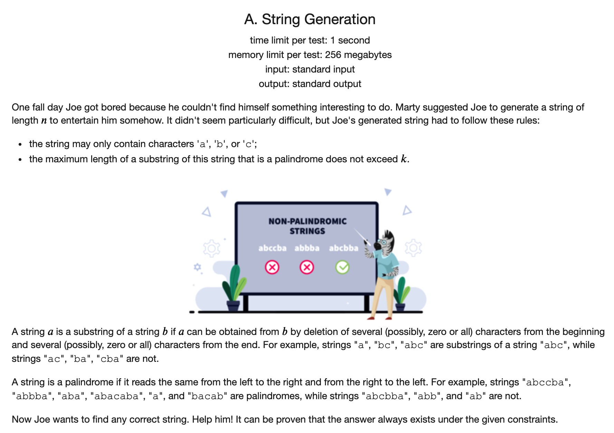
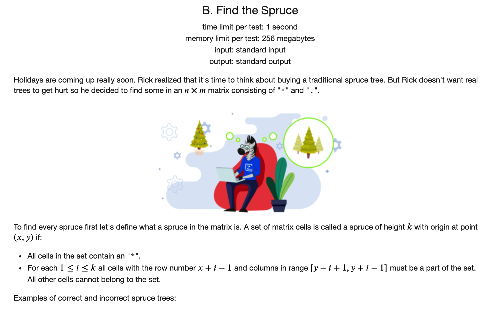
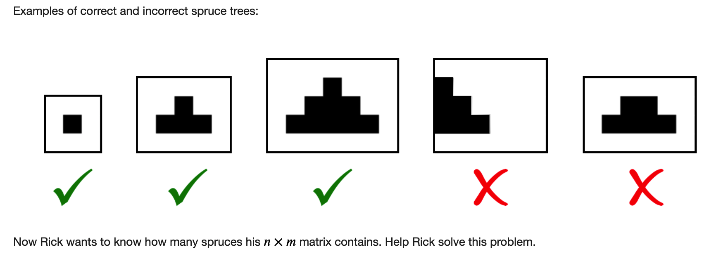
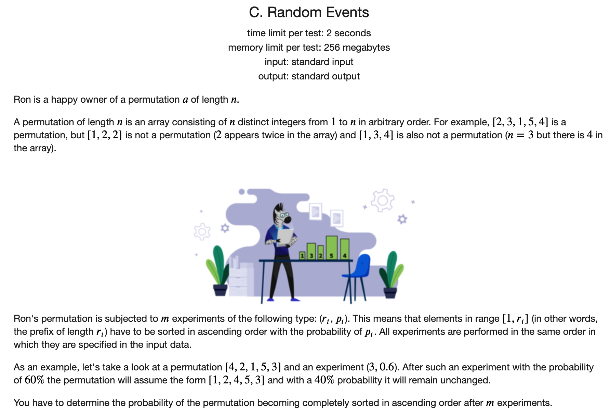
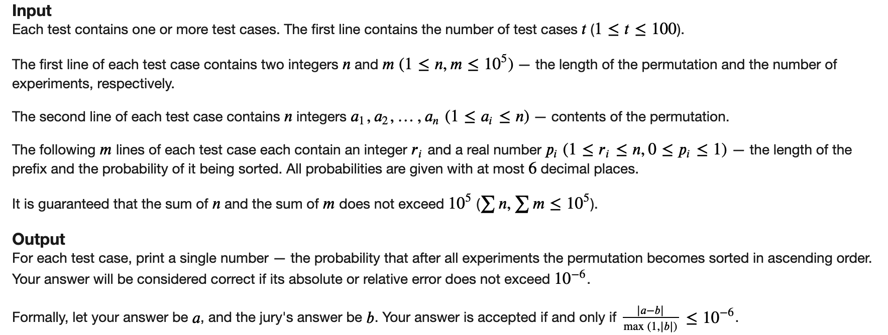
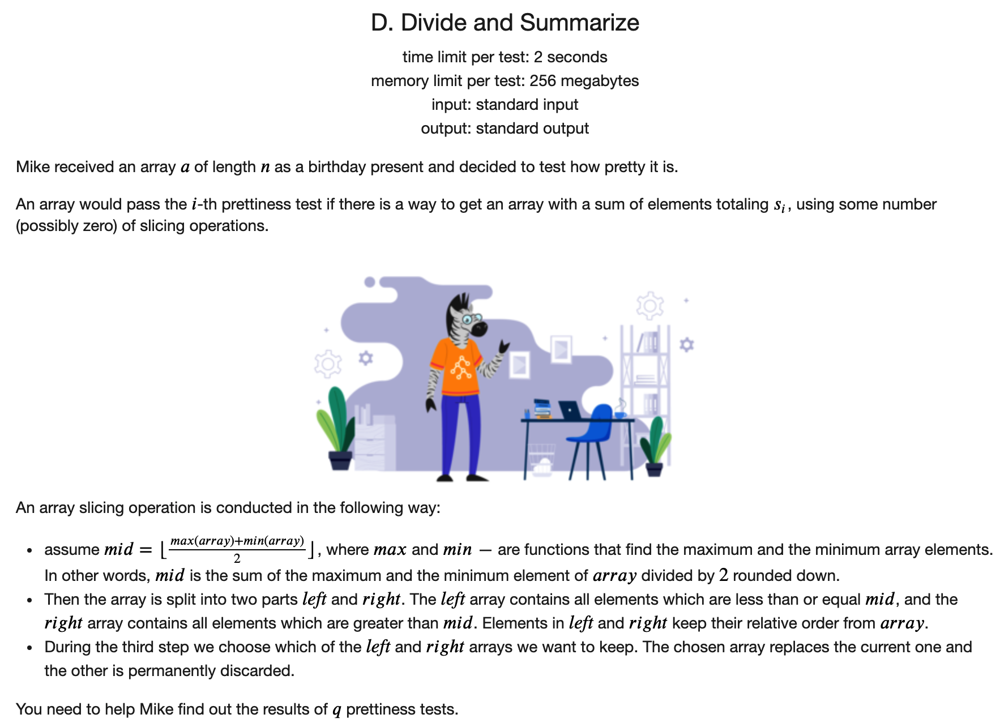
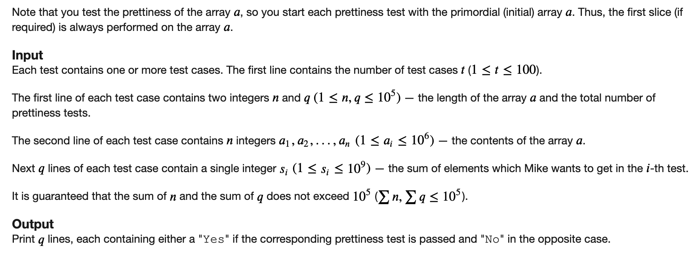

## [Codeforces Div2 689题解](https://codeforces.com/contest/1461)

### [A](https://codeforces.com/contest/1461/problem/A)



#### 解题思路

只需要输出回文串长度不超过1的即可。对于任何一种情况，直接输出`abcabc....`(任何一个字符，左右两个字符都不相同)

#### C++代码

```c++
#include <iostream>
using namespace std;


int main() {
	
	ios::sync_with_stdio(false);
	cin.tie(nullptr);
	cout.tie(nullptr);
	
	int t;
	cin >> t;
	while (t --) {
		int n, k;
		cin >> n >> k;
		string ans;
		for (int i = 0; i < n; i ++) {
			if (i % 3 == 0) ans += 'a';
			else if (i % 3 == 1) ans += 'b';
			else ans += 'c';
		}
		cout << ans << '\n';
	}
	return 0;
}
```

### [B](https://codeforces.com/contest/1461/problem/B)





#### 解题思路

动态规划。定义`dp[i][j]`表示以方格`(i, j)`为顶部的满足条件的最大高度。那么如果`q[i+1][j] ==  '.'`，则`dp[i][j] == 1`，否则的话，

$$dp[i][j] = min(dp[i+1][j-1], dp[i+1][j+1]) + 1$$

然后将每个位置的答案累加起来即可。

#### C++代码

```c++
#include <iostream>
using namespace std;

const int N = 505;

char q[N][N];
int dp[N][N];


int main() {
	
	ios::sync_with_stdio(false);
	cin.tie(nullptr);
	cout.tie(nullptr);
	
	int t;
	cin >> t;
	while (t --) {
		int n, m;
		cin >> n >> m;
		for (int i = 1; i <= n; i ++) {
			for (int j = 1; j <= m; j ++) {
				cin >> q[i][j];
			}
		}
		long long ans = 0;
		for (int i = 0; i <= m; i ++) dp[n + 1][i] = 0;
		for (int i = 0; i <= n; i ++) dp[i][m + 1] = 0;
		for (int i = n; i >= 1; i --) {
			for (int j = 1; j <= m; j ++) {
				if (q[i][j] == '.') dp[i][j] = 0;
				else {
					dp[i][j] = 1;
					if (q[i + 1][j] == '*') dp[i][j] = min(dp[i + 1][j - 1], dp[i + 1][j + 1]) + 1; 
				} 
				ans += dp[i][j];
			}
		}
		
		cout << ans << '\n';
	}
	return 0;
	
}
```

### [C](https://codeforces.com/contest/1461/problem/C)





#### 解题思路

我们可以考虑当前数组中，最后一个乱序的位置，也就是满足`1-n`范围内，$max_{i=1}^{n}(q[i]) != n$的最后一个位置。

我们可以发现，当这个位置以及之后的没有被选到的话，前面选了也没用。当这个位置及之后的位置被选到了的话，前面不选也没关系。所以这个位置是最关键的地方。

然后考虑反面。当这个位置之后的都没有被选到的概率，再用1减去即可。

#### C++代码

```c++
#include <iostream>
using namespace std;

const int N = 1e5 + 5;

int q[N];
double p[N];
int loc[N];

int main() {
	
	int t;
	cin >> t;
	while (t --) {
		int n, m;
		cin >> n >> m;
		for (int i = 1; i <= n; i ++) cin >> q[i];
		for (int i = 1; i <= m; i ++) cin >> loc[i] >> p[i];
		int idx = 0;
		int cur_max = 0;
		for (int i = 1; i <= n; i ++) {
			cur_max = max(cur_max, q[i]);
			if (cur_max == i && q[i] == i) continue;
			else idx = i;
		}
		if (idx == 0) printf("%.13f\n", 1.0);
		else {
			double tt = 1.0;
			for (int i = 1; i <= m; i ++) {
				if (loc[i] >= idx) tt *= (1 - p[i]);
			}
			printf("%.13f\n", 1.0 - tt);
		}
	}
	return 0;
	
}
```

### [D](https://codeforces.com/contest/1461/problem/D)





#### 解题思路

可以看到每次划分是确定的，所以可以先将数组中的所有元素进行排序，然后分治法将所有可能的划分的结果算出来，然后再对每个查询进行离线处理。

#### C++代码

```c++
#include <iostream>
#include <algorithm>
#include <unordered_set>
using namespace std;

const int N = 1e5 + 5;

long long q[N];
long long s[N];

void get(unordered_set<long long> &se, int l, int r) {
    if (l >= r) return;
    if (q[l] == q[r]) return ;
    int mid = (q[l] + q[r]) >> 1;
    auto tt = upper_bound(q + l, q + r + 1, mid) - q;  // 二分找到分界点
    se.insert(s[tt - 1] - s[l - 1]);
    se.insert(s[r] - s[tt - 1]);
    get(se, l, tt - 1);
    get(se, tt, r);

}

int main() {

    ios::sync_with_stdio(false);
    cin.tie(nullptr);
    cout.tie(nullptr);

    int t;
    cin >> t;
    while (t --) {
        int n, Q;
        cin >> n >> Q;
        for (int i = 1; i <= n; i ++) cin >> q[i];
        sort(q + 1, q + n + 1);
        for (int i = 1; i <= n; i ++) s[i] = s[i - 1] + q[i];
        unordered_set<long long> se;  // 存储所有可能的查询结果
        se.insert(s[n]);
        get(se, 1, n);
        while (Q --) {
            int x;
            cin >> x;
            if (se.count(x)) cout << "Yes" << '\n';
            else cout << "No" << '\n';
        }
    }
    return 0;
}

```


