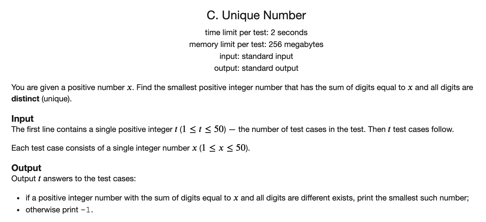
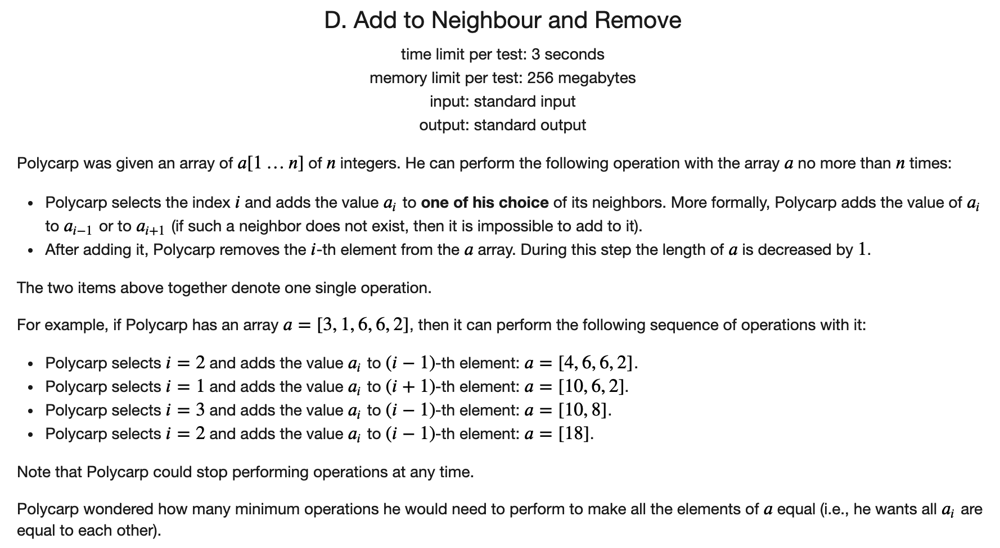
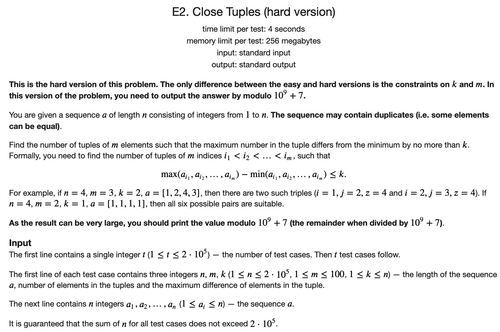
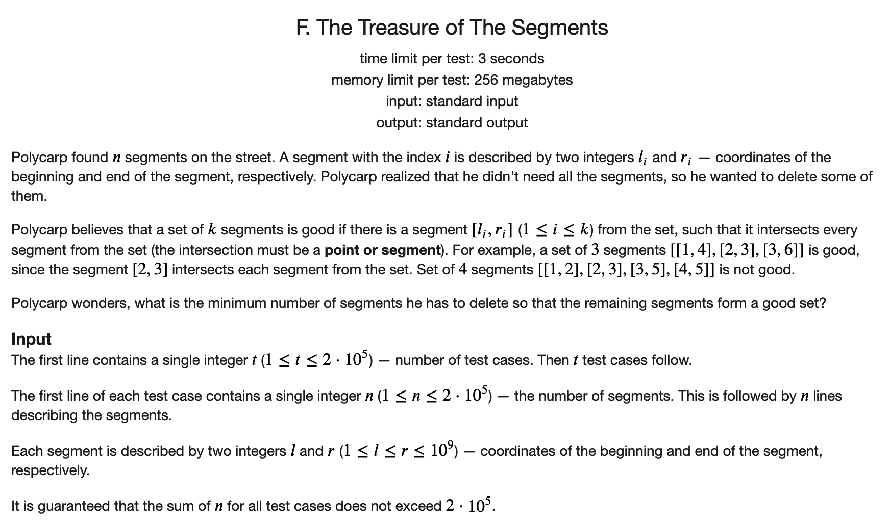

## [Codeforces 690 Div3](https://codeforces.com/contest/1462)

### [C](https://codeforces.com/contest/1462/problem/C)



#### 解题思路

首先希望位数尽可能地少，然后希望大的尽可能地放到后面。所以就贪心地选择即可。

#### C++代码

```c++
#include <iostream>
#include <algorithm>
#include <vector>
using namespace std;

int main() {
	
	int t;
	cin >> t;
	while (t --) {
		int x;
		cin >> x;
		if (x < 10) cout << x << '\n';
		else if (x > 45) cout << -1 << '\n';
		else {
			int cnt = 0;
			vector<int> digs;
			for (int i = 9; i >= 1 && x >= i; i --) {
				cnt ++;
				x -= i;
				digs.push_back(i);
			}
			if (x) digs.push_back(x);
			reverse(digs.begin(), digs.end());
			for (auto c : digs) cout << c;
			cout << '\n';
		}
	}
	return 0;
	
}
```

### [D](https://codeforces.com/contest/1462/problem/D)



#### 解题思路

相当于是将原数组分为若干个子数组，使的每个子数组中元素的和相同。可以考虑如果每个子数组的元素相同的话，则子数组中元素的和必然是总和的因数，所以可以枚举总和的因素，然后再$O(n)$的判定是否合法以及维护答案的最小值即可。

#### C++代码

```c++
#include <iostream>
using namespace std;

const int N = 3005;
int q[N];

int n;
int ans;


void check(int a) {
	
	int last = 0;
	int cnt = 0;
	for (int i = 1; i <= n; i ++) {
		if (q[i] - q[last] == a) {
			cnt += i - last - 1;
			last = i;
		} else if (q[i] - q[last] > a) {
			return;
		}
	}
	ans = min(ans, cnt);
	
}

int main() {
	
	int t;
	cin >> t;
	while (t --) {
		cin >> n;
		for (int i = 1; i <= n; i ++) cin >> q[i];
		for (int i = 1; i <= n; i ++) q[i] += q[i - 1];
		ans = n - 1;
		for (int i = 1; i <= q[n] / i; i ++) {
			if (q[n] % i == 0) {
				check(i);
				if (q[n] / i != i) check(q[n] / i);
			}
		}
		cout << ans << '\n';
		
	}
	return 0;
	
}
```

### [E2](https://codeforces.com/contest/1462/problem/E2)




#### 解题思路

枚举三元组的最小的位置，然后预处理好组合数，在用双指针求最小值确定之后合法的另外两个元素的个数。

#### C++代码

```c++
#include <iostream>
#include <algorithm>
using namespace std;


const int N = 2e5 + 5, M = 105;
const int mod = 1e9 + 7;

int rec[N][M];

int q[N];


int main() {

	ios::sync_with_stdio(false);
	cin.tie(nullptr);
	cout.tie(nullptr);

    int t;
    cin >> t;
	rec[0][0] = 1;
    for (int i = 1; i <= 200000; i ++) {
        rec[i][0] = 1;
        if (i <= 100) rec[i][i] = 1;
        for (int j = 1; j <= min(100, i - 1); j ++) rec[i][j] = (rec[i-1][j] + rec[i-1][j-1]) % mod;
    }
    // cout << t << endl;
//
    while (t --) {
        int n, m, k;
        cin >> n >> m >> k;
        for (int i = 0; i < n; i ++) cin >> q[i];
        sort(q, q + n );
        q[n] = 2e9;
        int l = 0, r = 0;
        long long ans = 0;
        while (l < n) {
            while (r < n && q[r] - q[l] <= k) r ++;
            int t = r - l - 1;
            if (t >= m - 1) {
                ans += rec[t][m-1];
                ans %= mod;
            }
            l ++;
        }
        cout << ans << '\n';

    }
    return 0;

}
```

### [F](https://codeforces.com/contest/1462/problem/F)



#### 解题思路

枚举作为中心的区间，然后求出所有区间中和这个区间不想交的区间的个数。对所有的答案取最小值即可。

求和当前区间不想交的区间个数可以先将所有的区间的左边界和右边界机型排序，然后二分即可。

时间复杂度$O(n \log n)$。

#### C++代码

```c++
#include <iostream>
#include <algorithm>

using namespace std;

typedef pair<int, int> PII;
const int N = 2e5 + 5;

int l[N], r[N];
PII q[N];

int n;

int main() {
	
	int t;
	cin >> t;
	while (t --) {
		cin >> n;
		for (int i = 0; i < n; i ++) {
			cin >> l[i] >> r[i];
			q[i] = {l[i], r[i]};
		}
		sort(l, l + n);
		sort(r, r + n);
		int ans = n - 1;
		for (int i = 0; i < n; i ++) {
			int ll = q[i].first, rr = q[i].second;
			int n1 = lower_bound(r, r + n, ll) - r;
			int n2 = (l + n) - upper_bound(l, l + n, rr);
			ans = min(ans, n1 + n2);
		}
		cout << ans << '\n';
		
	}
	return 0;
	
}
```


