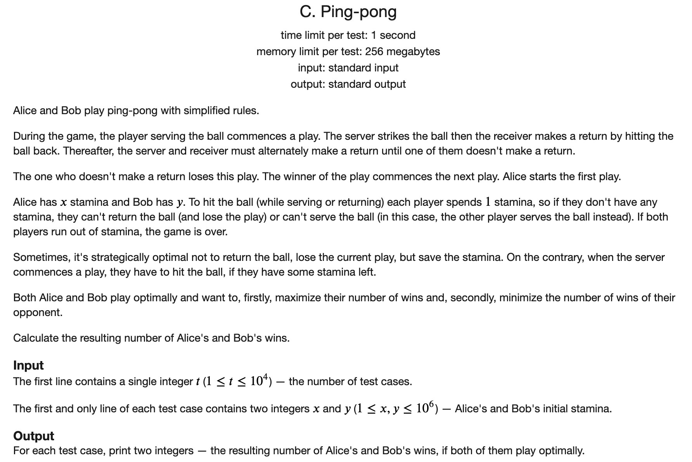

## CF Educational Codeforces Round 99 A-D题解

### [A](https://codeforces.com/contest/1455/problem/A)


#### 解题思路

通过对`x`进行两次`f`操作，实际上做的事情就是将`x`的末尾的零都去掉。

考虑如果`x`末尾有`k`个零的话，`g(x)` = $10^k$。所以最小为1，最大为10的`x`的位数次幂。所以答案就是`x`的十进制表示的位数

#### C++代码

```c++
#include <iostream>

using namespace std;

int main() {
	
	ios::sync_with_stdio(false);
	cin.tie(nullptr);
	cout.tie(nullptr);
	
	int t;
	cin >> t;
	while (t --){
		string s;
		cin >> s;
		cout << s.size() << '\n';
	}
	return 0;
	
}
```

### [B](https://codeforces.com/contest/1455/problem/B)


#### 解题思路

这道题还是很有意思的一道题目。直观的想法是暴力搜索。但是之后发现并不行。因为一个点被访问过之后可能还会再次被访问。

下面是给的样例。


在求4的时候，我们发现直接bfs加标记是不对的。可能会走到一个之前走到的状态，因为这里的`k`是变化的。

我们可以观察性质。抽象成数学问题就是，给定一个数`x`，求长度为`k`的序列，这个序列的第`i`位要不是`-1`，要不是`i`，求使得序列和为`x`的`k`的最小值。


假设我每次都向前跳`k`次，直到第一次到达不小于`x`的位置，假设这个位置为`y`。

然后我们知道$y -  x < k$，然后我们发现这`k`步中，我们将第`i`步变成`-1`，对整体的影响是减`-i - 1`。之前的步数可以覆盖`-2 ~ -k - 1`。所以我们看`x`和`y`的差距是多少，然后将对应的位置变成-1即可。这里没有包含-1,所以当`x`比`y`小1时，需要 再跳一次，答案是`k + 1`。

#### C++代码

```c++
#include <iostream>
#include <cstring>
#include <queue>
using namespace std;

typedef pair<int, int> PII;

const int N = 10;

int dp[N];


int main() {
	
	ios::sync_with_stdio(false);
	cin.tie(nullptr);
	cout.tie(nullptr);
		
	int t;
	cin >> t;
	while (t --) {
		int x;
		cin >> x;
		int i = 1;
		int sum = 0;
		for (; sum < x; i ++) sum += i;
		i --;
		if (sum - x == 1) cout << i + 1 << '\n';
		else cout << i << '\n';
	}
	return 0;
	
}
```

### [C](https://codeforces.com/contest/1455/problem/C)



#### 解题思路

首先考察后手的最优策略。他会让先手一直发球，直到先手剩下一个球的时候，自己反击。这样自己就可以赢`y`场，是最大的。

然后这个时候先手只能赢`x - 1`场。

#### C++代码

```c++
#include <iostream>
using namespace std;

int main() {
	
	ios::sync_with_stdio(false);
	cin.tie(nullptr);
	cout.tie(nullptr);
	int t;
	cin >> t;
	while (t --) {
		int a, b;
		cin >> a >> b;
		cout << a - 1 << ' ' << b << '\n';
	}
	return 0;
	
}
```

### [D](https://codeforces.com/contest/1455/problem/D)


#### 解题思路

可以观察出来一个性质，就是数组中的所有数只可能变小，不可能变大。然后`x`只可能越来越大，不可能越来越小。

然后我们从前向后扫描，当发现一个不满足非递减的性质的时候，就从前面找到第一个大于当前`x`的位置，然后将整体向后移动一位。如果发现满足了，就继续走，不满足就返回-1.

这里需要注意，当发现在移动的时候遇到了相同的元素的时候，相同的是不需要变动的。

#### C++代码

```c++
#include <iostream>
using namespace std;

const int N = 505;
int n;
int q[N];

int main() {
	
	ios::sync_with_stdio(false);
	cin.tie(nullptr);
	cout.tie(nullptr);
	
	int t;
	cin >> t;
	while( t--) {
		int n, x;
		cin >> n >> x;
		for (int i = 1; i <= n; i ++) cin >> q[i];
		int ans = 0;
		for (int i = 2; i <= n; i ++) {
			if (q[i] < q[i - 1]) {
				int j = i - 1;
				while (j && q[j] > x) j --;
				j ++;
				for (int k = j; k <= i - 1; k ++) {
					if (x == q[k]) {
						continue;
					}
					ans ++;
					swap(x, q[k]);
				}
				if (q[i] < q[i - 1]) {
					ans = -1;
					break;
				}
			}
		}
		cout << ans << '\n';
	}
	
	return 0;
}
```

