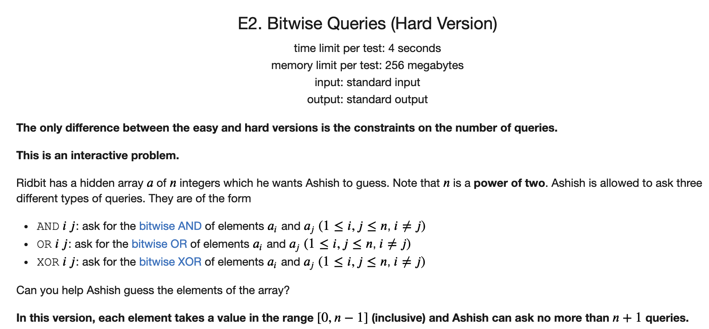

## [CF Round685题解](https://codeforces.com/contest/1451)

### [A](https://codeforces.com/contest/1451/problem/A)


#### 解题思路

可以分为两类：

1. 如果是偶数的话，则直接第一步变成2，然后变成1
2. 如果是奇数的话，可以先减1变成偶数，然后再变成2，再变成1

当然对于数较小的时候需要特判，比如3的时候是2，2的时候是1.

#### C++代码

```c++
#include <iostream>
using namespace std;

int main() {
	
	int t;
	cin >> t;
	while (t --) {
		int x;
		cin >> x;
		if (x == 2) cout << 1 << '\n';
		else if (x == 1) cout << 0 << '\n';
		else if (x  == 3) cout << 2 << '\n';
		else if (x % 2) cout << 3 << '\n';
		else cout << 2 << '\n';
	} 
	return 0;
	
}
```

### [B](https://codeforces.com/contest/1451/problem/B)


#### 解题思路

我们可以贪心地来选择。给了`l, r`，我们判断`r`位置的字符是不是整个字符串最后一个和它相同的字符。以及`l`位置的字符是不是整个字符串第一个和它相同的字符。

也就是我们总是考察是否存在`[l, r - 1]`和一个字符拼成目标串和`[l + 1, r]`和一个字符拼成目标串。

如果存在，则一定可以，如果不存在，则一定不可以。可以使用反正法。

假设可以的答案所在的第一个字符和最后一个字符的位置必然要不一个在左边或者一个在右边。这就矛盾了。

#### C++代码

```c++
#include <iostream>
using namespace std;

int main() {
	
	ios::sync_with_stdio(false);
	cin.tie(nullptr);
	cout.tie(nullptr);
	int t;
	cin >> t;
	while (t --) {
		int n, q;
		string s;
		cin >> n >> q >> s;
		s = " " + s;
		
		int l0 = n + 1, l1 = n + 1, r0 = 0, r1 = 0;
		for (int i = 1; i <= n; i ++) {
			if (s[i] == '1') l1 = min(l1, i), r1 = max(r1, i);
			if (s[i] == '0') l0 = min(l0, i), r0 = max(r0, i);
		}
		while (q --) {
			int l, r;
			cin >> l >> r;
			bool flag = false;
			if (s[r] == '0') {
				if (r0 > r) flag = true;
			} else {
				if (r1 > r) flag = true;
			}
			if (s[l] == '0') {
				if (l0 < l) flag = true;
			} else {
				if (l1 < l) flag = true;
			}
			if (flag) cout << "YES" << '\n';
			else cout << "NO" << '\n';
		}
	}
	return 0;
	
}
```

### [C](https://codeforces.com/contest/1451/problem/C)


#### 解题思路

首先我们观察到两个字符串中字符的顺序是没有影响的，因为`a`可以任意交换相邻的字符，也就是`a`可以变成任意一个全排列。

所以我们只需要考察`a`中的字符串是否可以通过操作2变成`b`中有的字符串即可。

我们可以从最小的字符`a`开始，先去除第二个字符串中字符`a`的个数，然后再将所有的`a`字符通过`k`个一组变成`b`。这样依次枚举，看最后每个字符是够都能够满足即可。

注意：每次必须选k个一组进行操作！

#### C++代码

```c++
#include <iostream>
using namespace std;

const int limit = 1e6 + 5;
int n, k;

char a[limit],b[limit];
int ba[limit],bb[limit];
void solve(){
    cin>>n>>k;
    cin>>a+1;
    cin>>b+1;
    for (int i = 0; i <= 30; i ++) ba[i] = bb[i] = 0;
    for (int i = 1; i <= n; i ++) {
       ba[a[i] - 'a']++;
       bb[b[i] - 'a']++;
    }
    for (int i = 0; i <= 25; i ++){
        if(ba[i] < bb[i]){
            cout<<"No"<<endl;
            return;
        }
        ba[i] -= bb[i];
        ba[i+1] += (ba[i] / k) * k;
    }
    cout<<"Yes"<<endl;

}

int main() {
	
	ios::sync_with_stdio(false);
	cin.tie(nullptr);
	cout.tie(nullptr);
	int t;
	cin >> t;
	while (t --) {
		solve();
}	
	return 0;
	
}
```

### [D](https://codeforces.com/contest/1451/problem/D)


#### 解题思路

典型的博弈论题目。

我们考察后手操作。

如果沿着45度角的方位我们找到最后一个是`k`的整数倍的点。然后我们看这个点向右走是否会走出圆外。

1. 如果可以走出圆外的话，则先手必胜。
2. 如果不可以走出圆外的话，则先手必败。

因为我们考虑第一种情况，如果可以走出圆外的话，则不管第一个增加`x`还是`y`，第二个人都增加另一个方向，这样第二个人可以保证自己一直在45度这条线上，所以最后第一个人就无路可走。

第二种情况下，第一个人先向右走一步，不管第二个人怎么走，第一个人都可以让自己在45度线向下平移`k`个单位长度的线上。

而这个线最终会让第二个人无路可走。

#### C++代码

```c++
#include <iostream>
#include <cmath>
using namespace std;


int main() {

    ios::sync_with_stdio(false);
    cin.tie(nullptr);
    cout.tie(nullptr);
    int t;
    cin >> t;
    while (t --) {
        long long d, k;
        cin >> d >> k;
        long long aa = d / sqrt(2);
        aa = aa / k * k;
        if (aa * aa + (aa + k) * (aa + k) <= d * d) cout << "Ashish" << '\n';
        else cout << "Utkarsh" << '\n';
    }
    return 0;

}
```

### [E2](https://codeforces.com/contest/1451/problem/E2)




#### 解题思路

这道题是一道交互题，也是自己第一次做这种题。比赛的时候没有写出来。之后看了官方的题解才知道怎么处理。

我们分析这三种操作各自的特定：

1. 与操作，如果我们知道两个数`a, b`与的结果`x`，然后知道其中一个数`a`，那么另外一个数是没有办法恢复的，因为在`a`为零的位置我们不知道`b`是零还是一。
2. 或操作，如果我们知道两个数`a， b`或的结果`x`，然后知道了其中一个数`a`，那么另外一个数也是没有办法恢复的，因为在`a`为1的位置我们不知道`b`是零还是1.
3. 异或操作。我们知道两个数`a, b`异或的结果`x`，然后知道了其中一个数`a`， 那么`b = x ^ a`。

所以异或操作应该是这里的核心。如果我们知道了某个数和其他数的异或的结果，然后又知道了这个数，那么就知道了所有的数。

接下来就是一个np的公式

**$$x + y = 2 * (x \& y) + (x \oplus y)$$**

我们可以通过3次操作得到`x, y, z`各自与的结果。

然后再通过两次操作，得到`x, y, z`各自异或的结果。

然后就可以得到关于`x, y, z`的三元一次方程组，就可以解出来`x`。

然后就可以求出来所以其他的数。

一共的操作次数是异或`n - 1` 加上与`3` 为`n + 2`。

对于困难的难度，我们需要最多`n + 1`次询问。

通过观察题目，我们发现有一个信息没有使用，就是长度为`n`的数组，数字都在`[0, n -1]`内，且`n`为2的整数次幂。

我们可以分为如下两种情况讨论：

1. 如果数组存在两个相同的数，我们可以找到这两个数的下标，然后让这两个数相与，就可以得到这两个数，然后就可以得到所有其他的数。
2. 如果数组中的数各不相同，则必然是`[0, n - 1]`各出现一次。然后我们对于任何一个数，我们都可以找到另一个数，使得他们的异或为`n - 1`。（因为`n`是2的整数次幂）。然后这两个数的与一定是0.我们就可以少进行一次与操作。这样就把操作次数变成了`n + 1`.

#### C++代码

```c++
// 简单版本的代码
#include <iostream>
#include <string>
using namespace std;

const int N = 1e5 + 5;
int q[N];
int xorres[N];
int n;

inline
int query(string s) {
    cout << s << endl;
    cout.flush();
    int des;
    cin >> des;
    return des;
}

int main() {

    cin >> n;
    int and12, and13, and23;
    and12 = query("AND 1 2");
    and23 = query("AND 2 3");
    and13 = query("AND 1 3");
    for (int i = 2; i <= n; i++) {
        xorres[i] = query("XOR 1 " + to_string(i));
    }

    int a = and12 * 2 + xorres[2], b = and13 * 2 + xorres[3], c = and23 * 2 + (xorres[2] ^ xorres[3]);
    q[1] = (a + b + c) / 2 - c;
    for (int i = 2; i <= n; i ++) q[i] = xorres[i] ^ q[1];
    cout << "! ";
    for (int i = 1; i <= n; i ++) cout << q[i] << ' ';
    cout.flush();
    return 0;

}

// 困难版本的代码
#include <iostream>
#include <map>
using namespace std;

const int N = 1e5 + 5;
int q[N];
int xorres[N];
int n;
map<int, int> mp;

inline
int query(string s) {
    cout << s << endl;
    cout.flush();
    int des;
    cin >> des;
    return des;
}

inline
void cout_ans() {
    cout << "! ";
    for (int i = 1; i <= n; i ++) cout << q[i] << ' ';
    cout.flush();
}

int main() {

    cin >> n;
    for (int i = 2; i <= n; i++) {
        xorres[i] = query("XOR 1 " + to_string(i));
    }
    int idx = 0;
    for (int i = 2; i <= n; i ++) {
        if (xorres[i] == 0) {
            idx = i;
            break;
        }
    }
    if (idx) {
        q[1] = query("AND 1 " + to_string(idx));
        for (int i = 2; i <= n; i ++) {
            q[i] = xorres[i] ^ q[1];
        }
        cout_ans();
        return 0;
    }

    int a = 0, b = 0;
    for (int i = 2; i <= n; i ++) {
        if (mp[xorres[i]]) {
            a = mp[xorres[i]];
            b = i;
            break;
        } else {
            mp[xorres[i]] = i;
        }
    }
    if (a) {
        q[a] = q[b] = query("AND " + to_string(a) + " " + to_string(b));
        q[1] = xorres[a] ^ q[a];
        for (int i = 2; i <= n; i ++) q[i] = xorres[i] ^ q[1];
        cout_ans();
        return 0;
    }

    for (int i = 2; i <= n; i ++) {
        if (xorres[i] == n - 1) {
            idx = i;
            break;
        }
    }
    int idx2;
    if (idx + 1 <= n) idx2 = idx + 1;
    else idx2 = idx - 1;

    int and1idx2 = query("AND 1 " + to_string(idx2));
    int andidxidx2 = query("AND " + to_string(idx) + " " + to_string(idx2));
    a = n - 1, b = 2 * and1idx2 + xorres[idx2];
    int c = 2 * andidxidx2 +  (xorres[idx] ^ xorres[idx2]);
    q[1] = (a + b + c) / 2 - c;
    for (int i = 2; i <= n; i ++) q[i] = xorres[i] ^ q[1];
    cout_ans();
    return 0;
}
```


