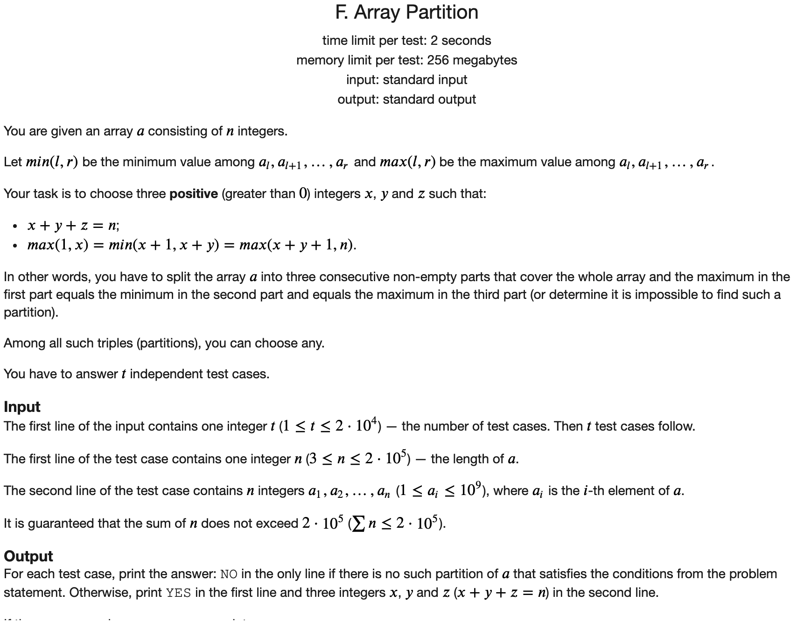

## CF686_Div3题解

### [D](https://codeforces.com/contest/1454/problem/D)


#### 解题思路

首先我们将$n$进行素因子分解，得到如下的表达式:

$$n = p_1^{\alpha_1}p_2^{\alpha_2}...p_l^{\alpha_l}$$

假设我们得到的$k$个数进行素因子分解，得到的结果是:

$$a_i = p_1^{b^i_1}p_2^{b^i_2}...p_l^{b^i_l}$$

由于后面的数都可以整数前面的数，所以有

$$b^i_{j} \le b_{j}^{i+1} \quad  \forall i, j$$

$$\sum_{i=1}^{k}b^i_{j} = \alpha_j$$

所以可以看到，$K$的最大值取决于$\alpha$的最大值。

在构造的时候，我们令前$k - 1$个数都是指数最大的那个素因子，最后一个用整个除以前面的即可。

时间复杂度$O(\sqrt{n})$

#### C++代码

```c++
#include <iostream>
using namespace std;


int main() {
	
	ios::sync_with_stdio(false);
	cin.tie(nullptr);
	cout.tie(nullptr);
	
	int t;
	cin >> t;
	while (t --) {
		long long n;
		cin >> n;
		long long n_bak = n;
		long long max_cnt = 0, max_prim = -1;
		for (long long i = 2; i * i <= n && n > 1; i++) {  // 进行素因子分解
			if ((n % i) == 0) { // 找到一个素因子，全部除尽
				long long cnt = 0;
				while ((n % i) == 0) {
					cnt ++;
					n /= i;
				}
				if (cnt > max_cnt) {  // 记录指数最大的素因子
					max_cnt = cnt;
					max_prim = i;
				}
			}
		}
		if (n) {
			if (max_cnt < 1) {
				max_cnt = 1;
				max_prim = n;
			}
		}
		cout << max_cnt << '\n';
		for (int i = 1; i < max_cnt; i ++) { 
			cout << max_prim << ' ';
			n_bak /= max_prim;
		}
		cout << n_bak << '\n';
	}
	return 0;
	
}
```


### [E](https://codeforces.com/contest/1454/problem/E)


#### 解题思路

$n$个节点，$n$条边的连通图，是在一棵树的基础上增加一条边得到的结果。

得到的图也可以看做是一个环，然后换的每个节点上面挂了一棵树，就像下面的图一样。


然后我们考虑每棵树内部节点的贡献。

对于蓝色所标的子树中的节点而言，其内部两个点之间只有一条路径，所以答案是$\frac{cnt_i * (cnt_i - 1)}{2}$

从蓝色节点到任何一个其他节点，都存在两条不同的路径，所以路径条数为$2 * cnt_i * (n - cnt_i)$

但是在统计每个子树的时候，第二种路径会被统计两次，所以最终的答案就是

$$\sum_{i} ( \frac{cnt_i * (cnt_i - 1)}{2} + cnt_i * (n - cnt_i) )$$

为了统计每棵子树的大小，可以使用tarjan算法。这里可以用一个简单的方法，模仿拓扑排序的思想。从叶子节点向里面扩展。具体方法参考下面的代码。

#### C++代码

```c++
#include <iostream>
using namespace std;

const int N = 2e5 + 5, M = N * 2;
int h[N], e[M], ne[M], idx;
int deg[N];
int stk[N], top = 0;
int cnt[N];
bool vis[N];

void add(int a, int b) {
	e[idx] = b, ne[idx] = h[a], h[a] = idx ++;
}

void solve() {
	
	int n;
	cin >> n;
	for (int i = 1; i <= n; i ++) {
		h[i] = -1;
		deg[i] = 0;
		cnt[i] = 1;
		vis[i] = false;
	}
	idx = 0;
	for (int i = 0; i < n; i ++) {
		int a, b;
		cin >> a >> b;
		add(a, b);
		add(b, a);
		deg[a] ++;
		deg[b] ++;
	}
	
	top = 0;
	for (int i = 1; i <= n; i ++) {
		if (deg[i] == 1) stk[++top] = i, vis[i] = true;
	}
	while (top) {
		int node = stk[top --];
		for (int i = h[node]; ~i; i = ne[i]) {
			int t = e[i];
			if (vis[t]) continue;
			deg[t] --;
			cnt[t] += cnt[node];
			if (deg[t] == 1) {
				stk[++ top] = t;
				vis[t] = true;
			}
		}
	}
	long long ans = 0;
	for (int i = 1; i <= n; i ++) {
		if (vis[i]) continue;
		ans += (long long)cnt[i] * (cnt[i] - 1) / 2 + (long long)cnt[i] * (n - cnt[i]);
		// cout << i << ' ' << cnt[i] << ' ' << ans << '\n';
	}
	
	cout << ans << '\n';
	return ;
}


int main() {
	
	ios::sync_with_stdio(false);
	cin.tie(nullptr);
	cout.tie(nullptr);
	
	int t;
	cin >> t;
	while (t --) {
		solve();
	}
	
	return 0;
	
}
```

### [F](https://codeforces.com/contest/1454/problem/F)



#### 解题思路

先使用ST表处理，便于在$O(1)$的时间内得到任意一个区间的最大最小值。然后首先枚举第一个分界点。

利用单调性，两次二分找到使得第二个区间满足的左右边界。在利用单调性二分找到第三个区间满足的点即可。

时间复杂度$O(n \log n)$

#### C++代码

```c++
#include <iostream>
#include <cmath>

using namespace std;

const int N = 2e5 + 5;

int st1[N][20], st2[N][20];
int q[N];

void build(int n) {
	for (int i = 1; i <= n; i ++) st1[i][0] = st2[i][0] =  q[i];
	for (int j = 1;  (1 << j) <= n; j ++) {
		for (int i = 1; i + (1 << j) - 1 <= n; i ++) {
			st1[i][j] = min(st1[i][j - 1], st1[i + (1 << (j - 1))][j - 1]);
			st2[i][j] = max(st2[i][j - 1], st2[i + (1 << (j - 1))][j - 1]);
		}
	}
}

int query_max(int l, int r) {
	int j = log(r - l + 1) / log(2);
	return max(st2[l][j], st2[r - (1 << j) + 1][j]);
}

int query_min(int l, int r) {
	int j = log(r - l + 1) / log(2);
	return min(st1[l][j], st1[r - (1 << j) + 1][j]);
}

void solve() {
	int n;
	cin >> n;
	for (int i = 1; i <= n; i ++) cin >> q[i];
	build(n);
	
	for (int i = 1; i <= n - 2; i ++) {
		int target = query_max(1, i);
		int l = i + 1, r = n - 1;
		while (l < r) {
			int mid = l + r >> 1;
			if (query_min(i + 1, mid) > target) l = mid + 1;
			else r = mid;
		}
		if (query_min(i + 1, l) != target) continue;
		int ll = l;
		l = i + 1, r = n - 1;
		while (l < r) {
			int mid = l + r + 1 >> 1;
			if (query_min(i + 1, mid) < target) r = mid - 1;
			else l = mid;
		}
		int rr = l;
		l = ll + 1, r = rr + 1;
		while (l < r) {
			int mid = l + r + 1 >> 1;
			if (query_max(mid, n) < target) r = mid -  1;
			else l = mid;
		}
		if (query_max(l, n) == target) {
			cout << "YES" << '\n';
			cout << i << ' ' << l - i - 1 << ' ' << n - l + 1 << '\n';
			return ;
		}
	}
	cout << "NO" << '\n';
	
}


int main() {
	
	int t;
	cin >> t;
	while (t --){
		solve();
	}
	return 0;
	
}
```


