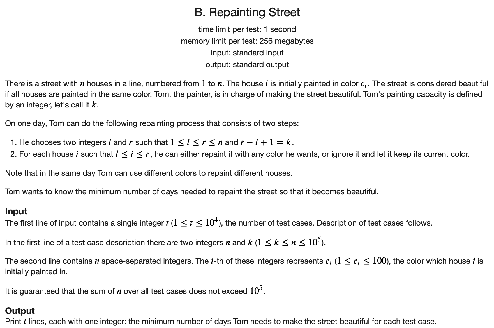

## [CF687题解](https://codeforces.com/contest/1457)

### [A](https://codeforces.com/contest/1457/problem/A)


#### 解题思路

不可以直接进行BFS。考虑到一个点每次只能使x或者y增加1或者减少1，所以直接考虑四个定点到这个点的城市距离的最大值即可。

#### C++代码

```c++
#include <iostream>
using namespace std;

int main() {
	
	ios::sync_with_stdio(false);
	cin.tie(nullptr);
	cout.tie(nullptr);
	
	int t;
	cin >> t;
	while (t --) {
		int n, m, a, b;
		cin >> n >> m >> a >> b;
		int ans = 0;
		ans = max(ans, a - 1 + b - 1);
		ans = max(ans, a - 1 + m - b);
		ans = max(ans, n - a + b - 1);
		ans = max(ans, n - a + m - b);
		cout << ans << '\n';
	}
	return 0;
}
```

### [B](https://codeforces.com/contest/1457/problem/B)



#### 解题思路

枚举每一种颜色，然后从左向右贪心地进行染色。最后取最小值即可。

#### C++代码

```c++
#include <iostream>
using namespace std;

const int N = 1e5 + 5;

int q[N];
int n, k;

int main() {
	
	ios::sync_with_stdio(false);
	cin.tie(nullptr);
	cout.tie(nullptr);
	
	int t;
	cin >> t;
	while (t --) {
		cin >> n >> k;
		for (int i = 1; i <= n; i ++) {
			cin >> q[i];
		}
		int ans = 2e9;
		for (int i = 1; i <= 100; i ++) {
			int cnt = 0;
			int j = 1;
			while (j <= n) {
				if (q[j] != i) {
					cnt ++;
					j += k;
				} else {
					j ++;
				}
			}
			ans = min(ans, cnt);
		}
		cout << ans << '\n';
	}
	return 0;	
}
```

### [C](https://codeforces.com/contest/1457/problem/C)


#### 解题思路

暴力枚举每一个起点。然后选择好起点之后，我们发现后面球会落到的地方对`k`取模都相同，所以可以预处理好模`k`相同的位置的`0`的个数，然后就可以在`O(1)`的时间得到需要修砖块的消耗。

#### C++代码

```c++
#include <iostream>
using namespace std;

const int N = 1e5 + 5;

int cnt[N];
int n, p, k;

void solve() {
	
	cin >> n >> p >> k;
	string s;
	cin >> s;
	int x, y;
	cin >> x >> y;
	s = " " + s;
	for (int i = 0; i < k; i ++) cnt[i] = 0;
	for (int i = p; i <= n; i ++) {
		if (s[i] == '0') {
			cnt[i % k] ++;
		}
	}
	int ans = 2e9;
	for (int i = 0; i <= n - p; i ++) {
		int t = i * y;
		t += cnt[(i + p) % k] * x;
		ans = min(ans, t);
		if (s[i + p] == '0') cnt[(i + p) % k] --;
	}
	cout << ans << '\n' ;
	return ;
		
}

int main() {
	
	ios::sync_with_stdio(false);
	cin.tie(nullptr);
	cout.tie(nullptr);
	
	int t;
	cin >> t;
	while (t --) {
		solve();
	}
	return 0;
	
}
```

### [D](https://codeforces.com/contest/1457/problem/D)


#### 解题思路

首先整数最多有32位。如果有超过3个的最高位相同的话，那么选择后两个进行异或，就一定比前一个小。（最高位从1变成0了）。由鸽巢原理可知，如果N大于64的话，就必然存在3个，直接输出1即可。否则的话，暴力求解。枚举最后两个数的分界点，再不断向两边扩展即可。

#### C++代码

```c++
#include <iostream>
using namespace std;

const int N = 1e5 + 5;

int q[N];
int n;

int main() {
	
	ios::sync_with_stdio(false);
	cin.tie(nullptr);
	cout.tie(nullptr);
	
	cin >> n;
	int ans = 2e9;
	for (int i = 1; i <= n; i ++) cin >> q[i];
	for (int i = 1; i <= n; i ++) q[i] ^= q[i - 1];
	if (n > 64) {
		cout << 1;
		return 0;
	} else {
		for (int i = 1; i < n; i ++) {
			
			for (int k = i; k >= 1; k --) {
				int ll = q[i] ^ q[k - 1];
				for (int j = i + 1; j <= n; j ++) {
					int rr = q[j] ^ q[i];
					if (ll > rr) {
						ans = min(ans, i - k + j - i - 1);
						break;
					}
				}
			}
		}
	}
	if (ans == 2e9) cout << -1;
	else cout << ans;
	return 0;

}
```


