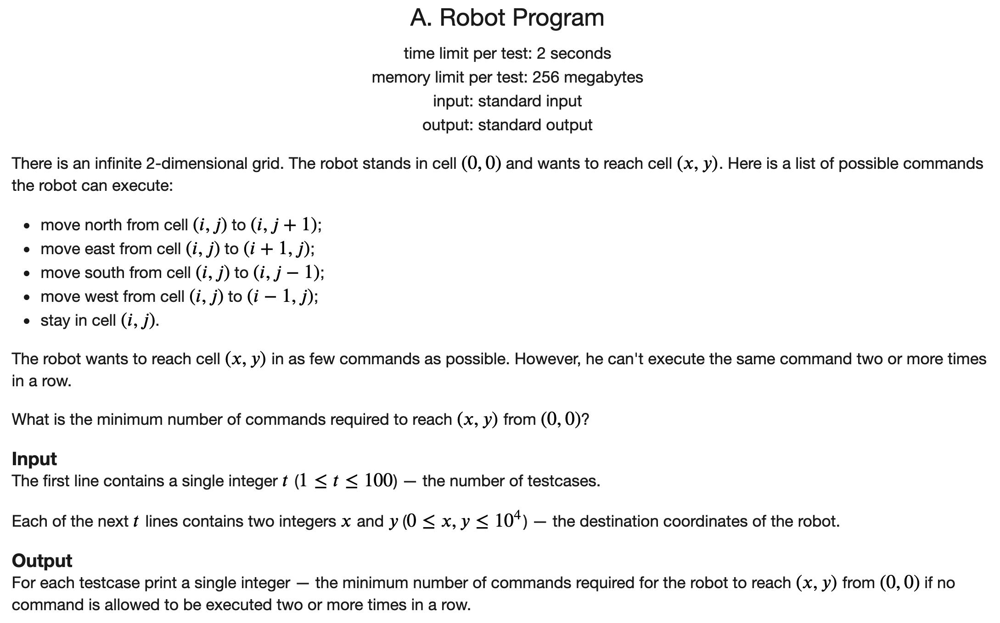
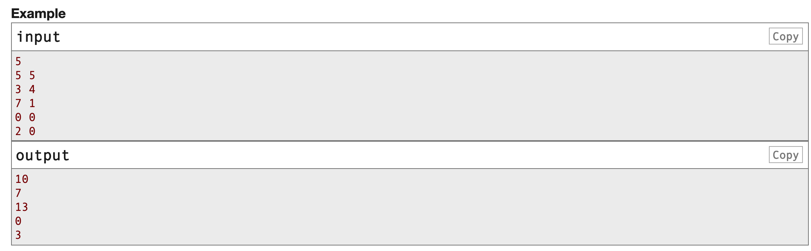
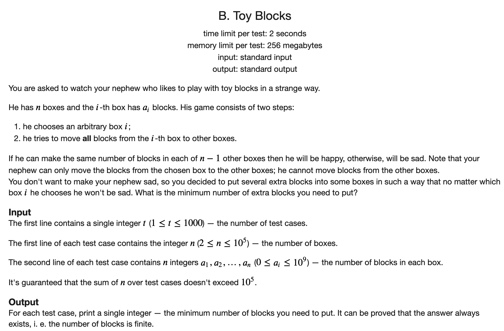
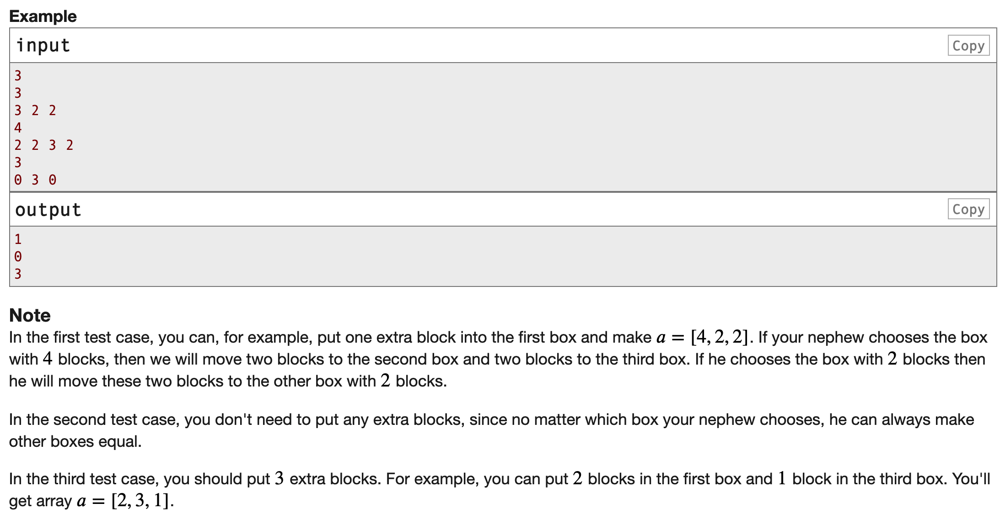
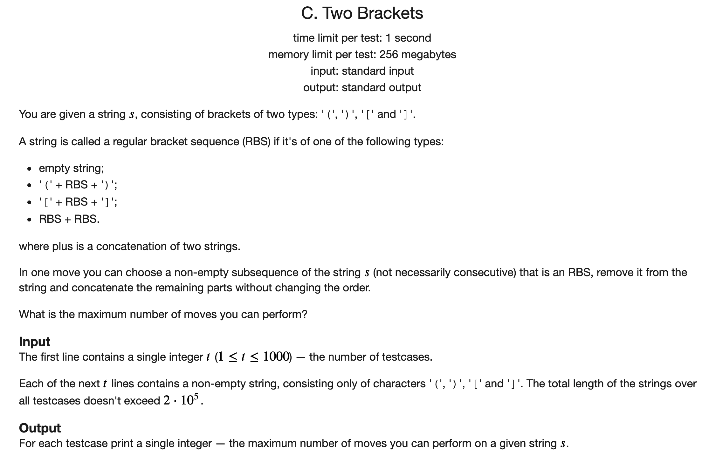
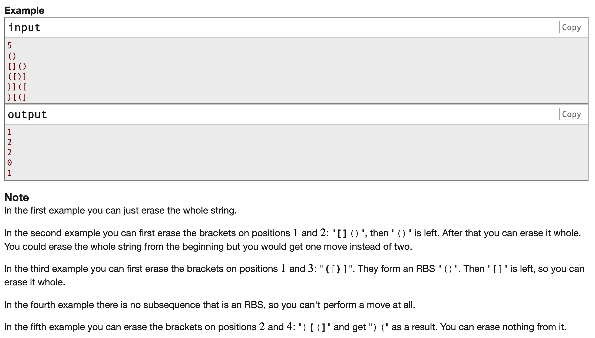
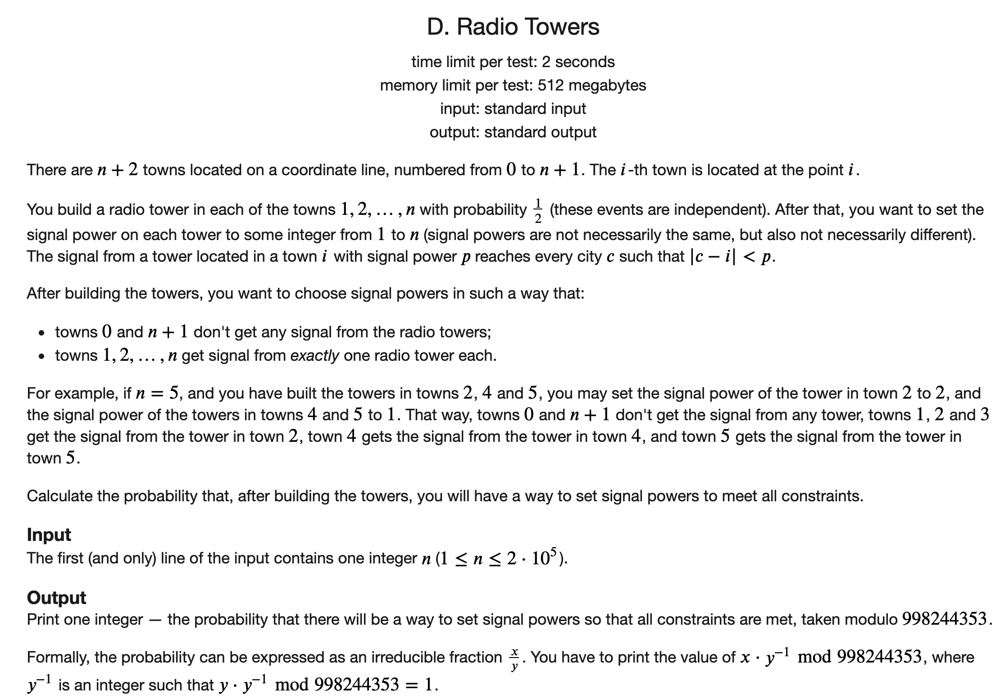
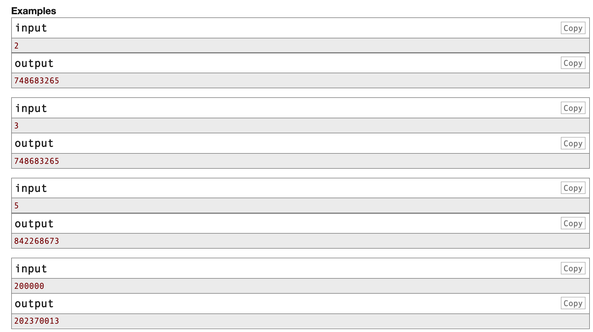

## [CF Educational Codeforces Round 98题解](https://codeforces.com/contest/1452)

### [A](https://codeforces.com/contest/1452/problem/A)





#### 解题思路

一共有四种选择，最终要走到右下角。这里可以贪心地向右下角走。因为如果向上或者向左走了，那么就还需要再向下或者向右走一次才能抵消这个效果，还不如直接挺一次只消耗一步。所以就直接右下右下或者下右下右开始走，走到某个边界的时候再走停走停。

分为如下两种情况：

- 如果$x = y$，则直接$2 \times x$
- 如果$x$不等于$y$，则答案是$2 * max(x, y) - 1$。

#### C++代码

```c++
#include <iostream>
using namespace std;

int main() {
	
	ios::sync_with_stdio(false);
	cin.tie(nullptr);
	cout.tie(nullptr);
	
	int t;
	cin >> t;
	while (t --) {
		int n, m;
		cin >> n >> m;
		if (n == m) {
			cout << 2 * n << '\n';
			continue;
		}
		if (n > m) swap(n, m);
		cout << 2 * n + m - n + m - n - 1 << '\n';
	}
	return 0;
	
}
```

### [B](https://codeforces.com/contest/1452/problem/B)





#### 解题思路

首先我们对问题进行分析。

1. 在将一个元素移除之后，其它的$n - 1$个元素的值都相同，说明修改完之后的整个数组的元素的和是$n - 1$的整数倍。

2. 假设当前数组中元素的个数和是$s$，那么我们可以补齐到$n - 1$的最小的整数倍数是$\lceil \frac{s}{n - 1} \rceil$
3. 然后我们看当前数组中最大的元素，因为这个最大的元素不超过这个最小整倍数的话，就可以满足条件。如果它超过了这个最小整倍数的话，那么就需要补齐到这个最大的元素。

#### C++代码

```c++
#include <iostream>
using namespace std;
typedef long long LL;

int main() {
	
	ios::sync_with_stdio(false);
	cin.tie(nullptr);
	cout.tie(nullptr);
	
	int t;
	cin >> t;
	while (t --) {
		int n;
		cin >> n;
		LL ma = 0, sum = 0;
		for (int i = 0; i < n; i ++) {
			LL x;
			cin >> x;
			ma = max(x, ma);
			sum += x;
		}
	
		LL t = (sum + n - 2) / (n - 1);
		if (t >= ma) cout << t * (n - 1) - sum << '\n';
		else cout << ma * (n - 1) - sum << '\n';
	}
	return 0;
	
}
```

### [C](https://codeforces.com/contest/1452/problem/C)





#### 解题思路

直接找到所有可以匹配的括号对即可。从前向后进行扫描，维护当前剩下的`[`和`(`的个数。然后遇到一个`]`或者`)`就配一个即可。

#### C++代码 

```c++
#include <iostream>
using namespace std;

int main() {
	
	ios::sync_with_stdio(false);
	cin.tie(nullptr);
	cout.tie(nullptr);
	
	int t;
	cin >> t;
	while (t --) {
		string s;
		cin >> s;
		int ans = 0;
		int n1 = 0, n2 = 0;
		for (auto x : s) {
			if (x == '(') n1 ++;
			else if (x == '[') n2 ++;
			else if (x == ')') {
				if (n1) ans ++, n1 --;
			} else {
				if (n2) ans ++, n2 --;
			}
		}
		cout << ans << '\n';
	}
	return 0;
}
```

### [D](https://codeforces.com/contest/1452/problem/D)





#### 解题思路

这道题比较有意思。

由于每个位置是否安装信号塔的概率都是$\frac{1}{2}$，所以我们可以先分别求分子和分母。

分母是$2^n$。

分子可以用DP来求。

现在有$n$个塔，那么我们枚举最后一个信号塔的位置。则有

$$dp[n] = dp[n - 1] + dp[n - 3] + dp[n - 5] + ...$$

初始状态是$dp[1] = 1, dp[2] = 1$

这样的时间复杂度是$O(n^2)$，不可行。

我们再对状态转移方程进行一些观察。发现有如下的等式：

$$dp[n] = dp[n - 1] + dp[n - 3] + dp[n - 5] + ...$$

$$dp[n - 2] = dp[n - 3] + dp[n - 5] + dp[n - 7] + ...$$

$$dp[n] = dp[n -1] + dp[n -2]$$

这样的时间复杂度就变成了$O(n)$

然后再分别利用快速幂求分母和其逆元。输出答案即可。

#### C++代码

```c++
#include <iostream>
using namespace std;
typedef long long LL;
const int MOD = 998244353;

int qmi(int a, int b) {
	if (!b) return 1;
	long long ans = qmi(a, b >> 1);
	ans *= ans;
	ans %= MOD;
	if (b & 1) ans *= a;
	ans %= MOD;
	return ans;
}

int dp[200005];
int main() {
	
	int n;
	cin >> n;
	dp[1] = 1, dp[2] = 1;
	for (int i = 3; i <= n; i ++) {
		dp[i] = dp[i - 1] + dp[i -2 ];
		dp[i] %= MOD;
	}
	LL ans = qmi(2, n);
	ans = qmi(ans, MOD - 2);
	cout << (ans * dp[n]) % MOD;
	return 0;
}
```

