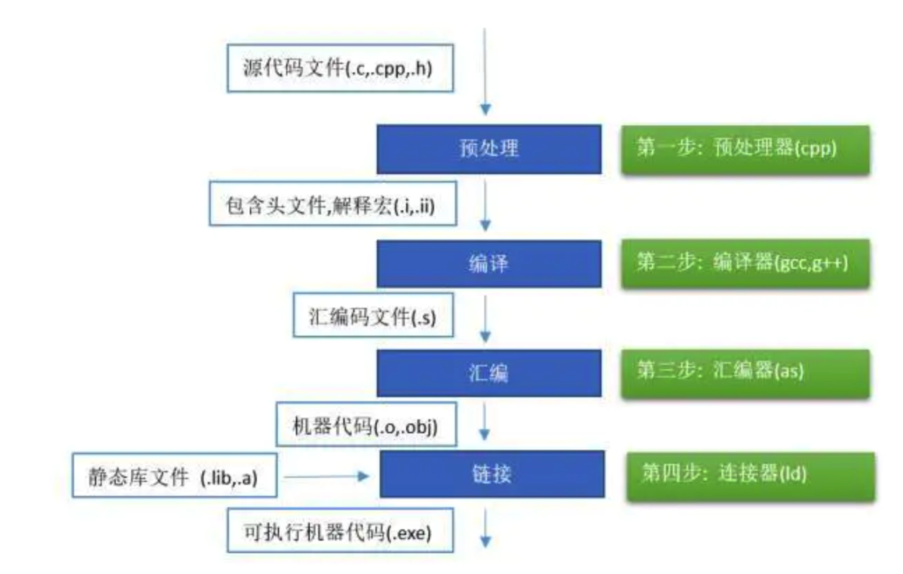
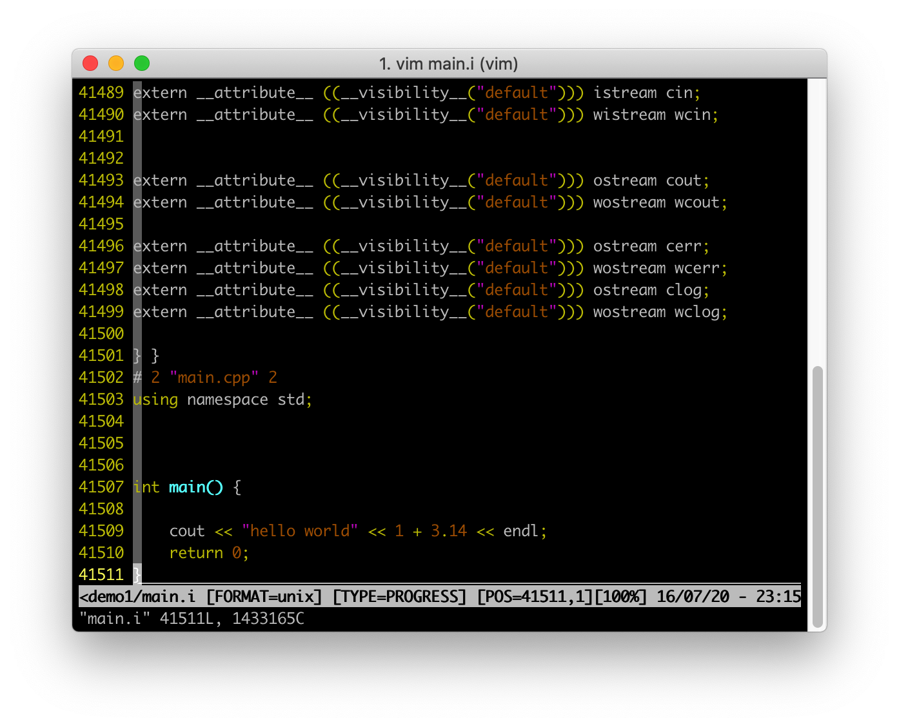
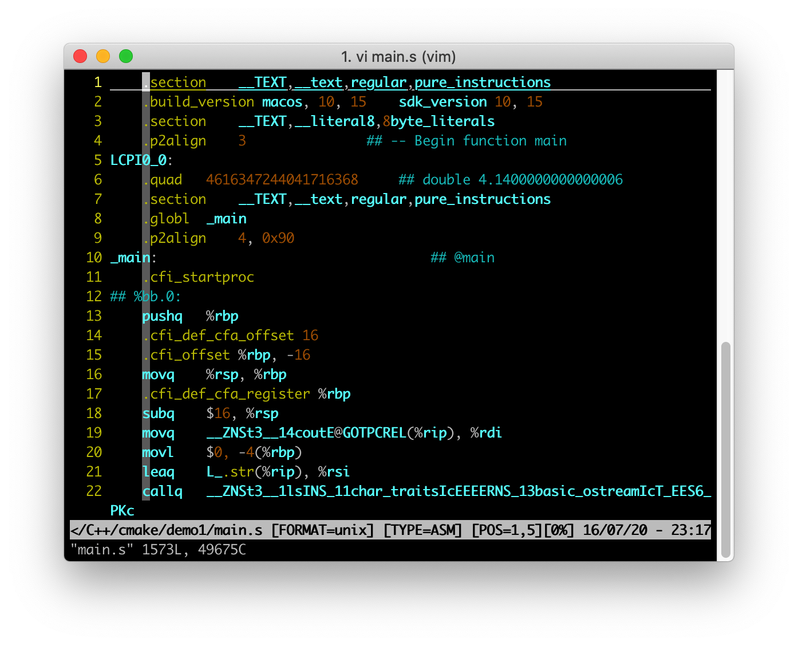
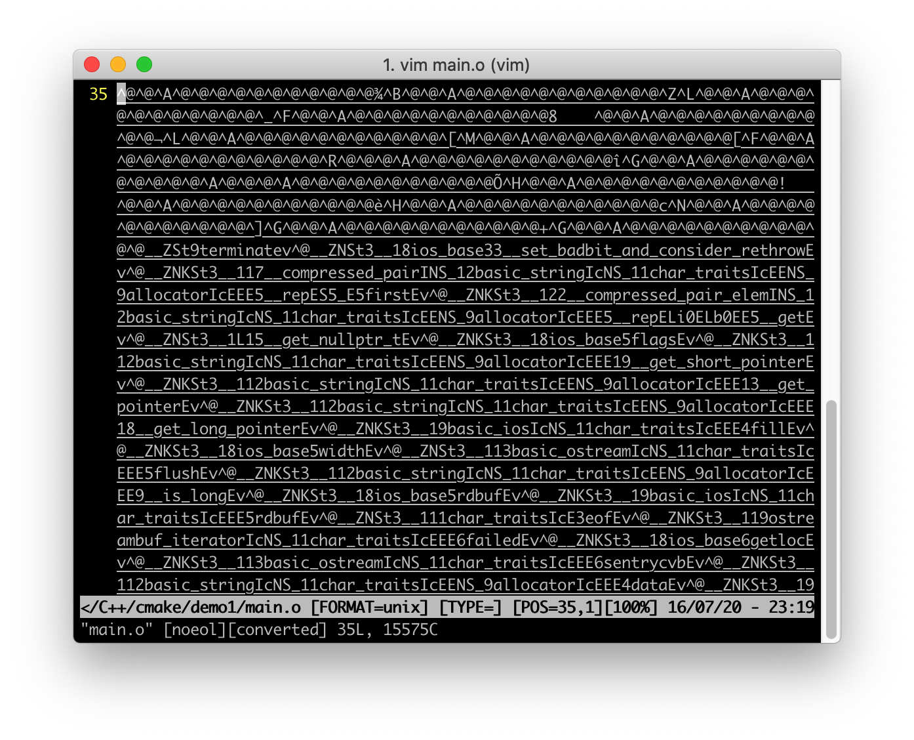
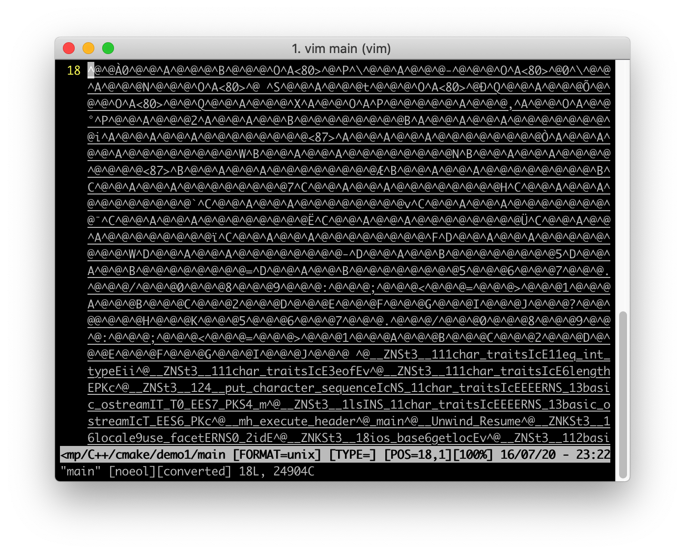
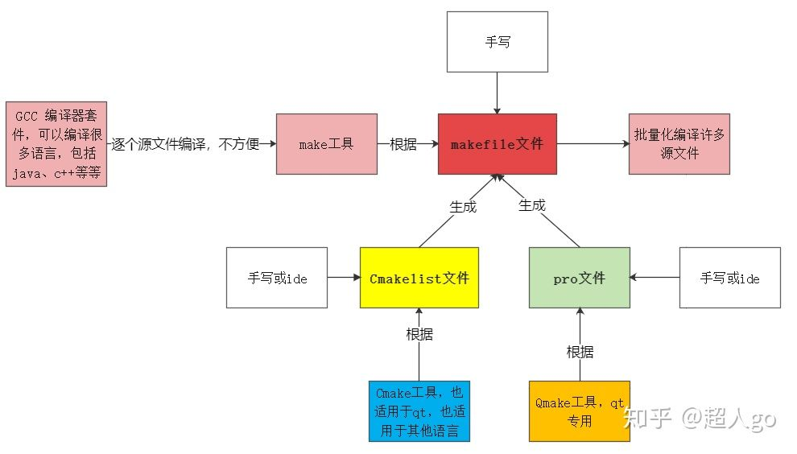

### 1. g++编译的四个过程

1. 预处理，生成`.i`文件。
2. 编译， 将预处理后的文件转为汇编语言，生成`.s`文件
3. 汇编，将汇编语言转为目标代码(机器代码)，生成`.o`文件
4. 链接，连接目标代码，生成可执行程序



下面以一个简单的代码执行如下的四个过程。

```c++
#include <iostream>
using namespace std;

#define pi 3.14

int main() {

    cout << "hello world" << 1 + pi << endl;
    return 0;
}
```

#### 1.1 预处理阶段

```shell
g++ -E main.cpp -o main.i
```

这一步的功能为：宏的替换，注释的消除，找到相关的库文件，将`#include`文件的全部内容插入。

- 若用`<>`扩起文件则在系统的`INCLUDE`目录中寻找文件
- 若用`""`扩起的文件则在当前目录中寻找文件

如下是替换之后的部分文件。



可以看到文件行数暴增，而且后面的部分没有发生什么变化，前面进行了替换，而且对宏进行了替换。

#### 1.2 将预处理的文件转为汇编文件

```shell
g++ -S main.i
```

上述命令会生成`main.s`文件，内容如下，为汇编指令。



#### 1.3 汇编文件变为目标代码`.o`文件

```shell
g++ -c main.s
```

这一步生成了`.o`文件，用编辑器打开为二进制机器码。



#### 1.4 链接目标代码，生成可执行程序

```shell
g++ main.o -o main #  -o用于指定生成的文件名，如果不指定-o的话，则会生成a.out文件
```

下面是文件的内容。



从大的方面来看，整个过程可以分为`编译`和`链接`两个阶段。


分阶段编译最大好处：可以进行部分编译，只编译有变更的部分。

#### 程序库

可复用的代码，一般编译成程序库来使用，可以分为两种：

1. 静态链接库，在程序编译阶段被链接进可执行程序。一般为`.a`结尾
2. 动态链接库，不连接进可执行程序，程序记录需要的动态库，运行的时候才搜索加载。采用动态编译库的程序，编译后生成的可执行文件更为短小。一般为`.so`结尾。
3. 程序启动后需要搜索动态链接库，默认在`/lib、/usr/lib`等路径下搜索动态库，还可以通过修改`LD_LIBRARY_PATH`环境变量来指定动态库搜索路径。
4. 静态库和动态库都是由`.o`文件创建的。

### 2. Cmake

1. `makefile`是类Unix环境下的类似批处理脚本。基本语法是**目标+依赖+命令**，目标文件不存在，或者目标比依赖的文件更旧，命令才会被执行。makefile和make可用于任意工作，不限于编程。`make`是用来执行`makefile`的。
2. `makefile + make`可以看做项目管理工具，但是过于底层，跨平台性不好，抽象程度不高。所以有了跨平台的项目管理工具`cmake`。
3. `cmake`是跨平台的项目管理工具，用更抽象的语法组织项目。从一个抽象规则出发，为各个编译器定制工程文件。其是抽象层次更高的项目管理工具，`cmake`命令执行`CMakeLists.txt`文件。
4. `make`用来执行`Makefile`，`cmake`用于执行`CMakeLists.txt`,然后生成一个`Makefile`。一般写`CMakeLists.txt`即可。然后`cmake .`生成`Makefile`，再`make`进行编译。



### 参考文献

[gcc/g++ 实战之编译的四个过程](https://www.cnblogs.com/zjiaxing/p/5557549.html)

[知乎](https://www.zhihu.com/question/27455963)

[C/C++开发环境](https://linux.fasionchan.com/zh_CN/latest/development-environment/c-cpp.html)

[cmake入门实战](https://www.hahack.com/codes/cmake/#什么是-CMake)

[cmake使用示例与整理总结](https://blog.csdn.net/wzzfeitian/article/details/40963457)

[cmake学习笔记](https://juejin.im/post/5deb47146fb9a01662435779)

