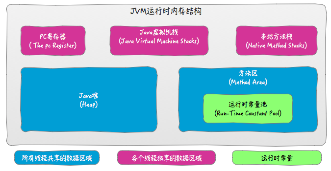
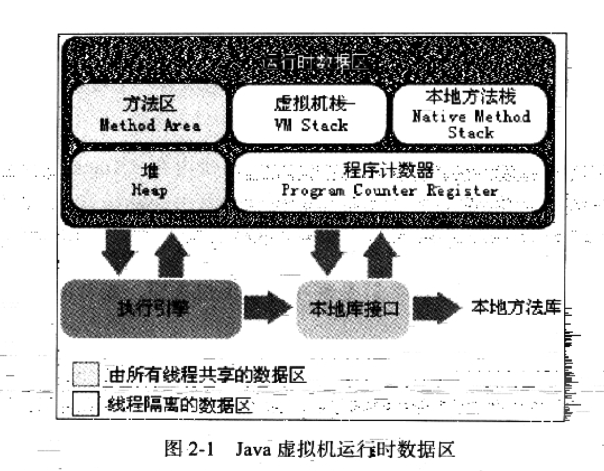
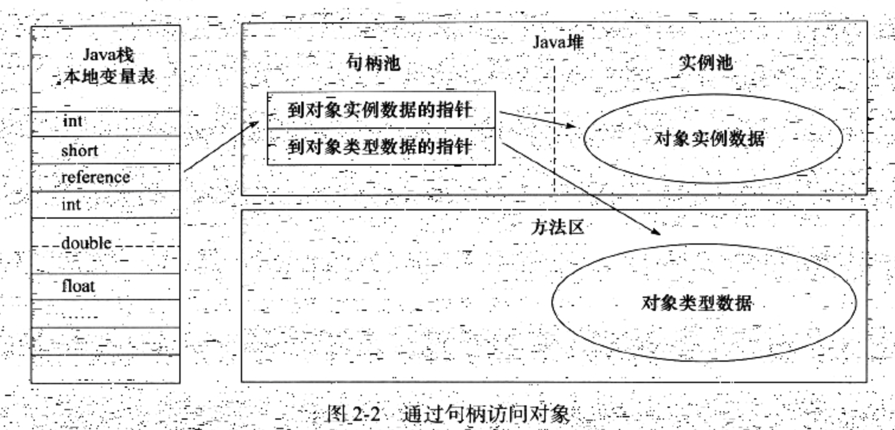
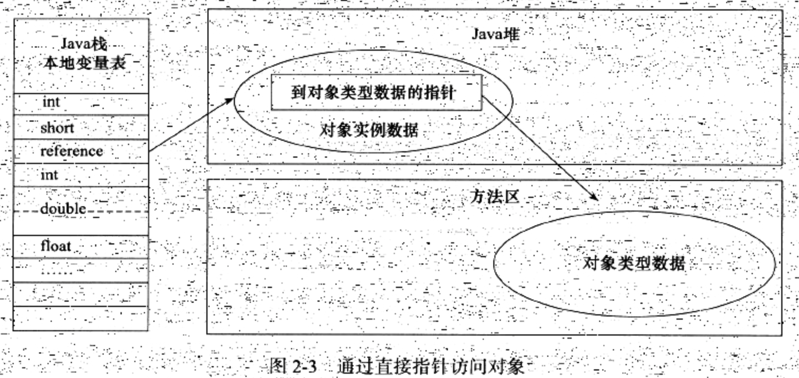

## 1. JVM内存结构

`Java` 虚拟机在运行 `Java` 程序 时，把它所管理的内存划分为若干个不同的数据区域，主要包括以下五个部分：程序计数器、`Java` 堆、`Java` 虚拟机栈、方法区和本地方法栈。

### 1. 程序计数器

程序计数器是当前线程所执行的字节码的行号指示器，它会指出下一条将要执行的指令的地址，字节码解释器就是通过改变计数器的值来选取程序接下来执行的操作。

程序计数器是线程私有的一小块内存，每条线程都要有一个独立的程序计数器，以使线程切换后恢复到正确的执行位置。

- 如果线程正在执行 `Java`方法，则计数器记录的是正在执行的虚拟机字节码指令的地址
- 如果执行 `native`方法，则计数器为空

它也是唯一一个不会出现 `OutOfMemoryError`的内存区域。

### 2. Java虚拟机栈

与程序计数器一样，`Java`虚拟机栈也是线程私有的，在线程创建时 `Java`栈会被创建，每个方法在在执行的同时都会创建一个栈帧，用于存放局部变量表，操作数栈，动态链接，方法出口等信息。每一个方法从调用直至执行完成，都对应着一个栈帧在虚拟机栈中入栈到出栈的过程。

一般所谓的“栈”，指的是虚拟机栈中局部变量表部分，其中存放了各种基本数据类型( `8`种)，对象引用(`reference`类型) 和 `returnAddress`类型。局部变量表所需的空间在编译期就已经确定并完成分配，在方法运行期间不会被改变。

`Java`虚拟栈中可能出现两种异常：

- `StackOverflowError`：线程请求的栈深度大于虚拟机所允许的深度
- `OutOfMemoryError`：虚拟机栈扩展时无法申请到足够的内存

### 3. 本地方法栈

本地方法栈与 `Java`虚拟机栈的作用类似，区别是 `Java`虚拟机栈为虚拟机执行 `Java`方法服务，而本地方法栈为虚拟机执行 `Native`方法服务。有的虚拟机（例如 `HotSpot`虚拟机）直接把本地方法栈和 `Java`虚拟机栈合并在一起。

本地方法栈也可能会抛出 `StackOverflowError`和 `OutOfMemoryError`异常。

**Native方法是Java中使用其他语言实现的方法，如C**

### 4. Java 堆

`Java`堆是是虚拟机中最主要的内存区域。它为线程共享，在虚拟机启动时创建，几乎所有的对象实例都存储在 `Java`堆中。

`Java`堆也被称作 `"GC"`堆。从内存回收角度看，可分为新生代和老年代。而新生代又可分为 `Eden`区、`From Survivor`区、`To Survivor`区等。

`Java`堆的实现，既可以实现为固定的，也可以是扩展的。当前虚拟机都按照可扩展来实现，通过 `-Xmx`和 `-Xms`控制堆大小。

如果堆中没有内存并且也无法再扩展时，会抛出 `OutOfMemeoryError`异常。

在Java中使用`new`关键字创建的对象一般放在堆中，然后引用是在`Java虚拟机栈`中。

### 5. 方法区

方法区与 `Java` 堆一样，为线程共享。用于存储已被虚拟机加载的**类信息**，**常量**，**静态变量**，即时编译器编译后的代码等数据。也叫作 `Non-Heap`（非堆）。

如果方法区无法满足内存分配需求，会抛出 `OutOfMemoryError` 异常。

JVM加载`Class`文件之后对每个类生成的class对象存放在这个区域。

### 6. 运行时常量池

运行时常量池是方法区的一部分。`Class`文件中的常量池用于编译期生成的各种字面量和符号引用，这部分内容在类加载后被存入运行时常量池。

动态性是运行时常量池相对于 `Class`文件常量池的一个重要特征，即不要求常量一定只有编译期才能产生，运行期间也可能将新的常量放入池中。

运行时常量池受到方法区内存的限制，如果常量池无法再申请内存，就会抛出 `OutOfMemoryError`异常。

### 7. 直接内存

直接内存并不由 `JVM`管理，它是利用 `Native`函数库在 `Java`堆外申请分配的内存区域，可以避免在 `Java`堆和 `Native`堆中复制数据以提高性能。

例如 `NIO`中的 `DirectByteBuffer`就可以作为这块内存的引用进行操作直接内存。

## 2. 虚拟机对象

对象创建的过程如下：

1. 遇到一个new指令时，首先检查这个指令的参数是否能在常量池中定位到一个类的符号引用，检查符号引用代表的类是否被加载、解析和初始化。没有的话先执行类加载过程。
2. 然后虚拟机进行内存分配，分配内存都初始化为零(不包括对象头)。
3. 然后虚拟机对对象进行必要的配置，如这个对象是哪个类的实例、如何找到类的元数据信息、对象的哈希码、对象的GC分代年龄等信息。这些信息存放在对象的`对象头`中。
4. 上面工作完成之后，从虚拟机角度看，新的对象已经产生了，但是从Java程序的视角看，对象创建才刚刚开始。之后需要制定`init`方法，对对象进行初始化。

### 2.1 对象的内存布局

对象在内存中布局分为三个区域：

- 对象头(Header)
- 实例数据(Instance Data)
- 对其填充(Padding)

对象头包括两部分信息：

1. 存储对象吱声的运行时数据，官方称为“Mark Word”
   - 哈希码
   - GC分代年龄
   - 锁状态表示
   - 线程持有的锁
2. 类型指针，对象指向它的元数据的指针，虚拟机通过这个指正来确定这个对象是哪个类的实例。如果对象是一个Java数组，对象头中还有一块用于记录数组长度的数据，因为虚拟机可以通过普通Java对象的元数据信息确定Java对象的大小。但是从数组的元数据中无法确定数组的大小。

对其填充这部分不是必然存在的，没有特别的含义，只是占位符的作用。

### 2.2 对象的访问定位

Java程序通过栈上的`reference`数据来操作堆上的具体对象。`reference`类型在Java虚拟机规范中只规定了一个指向对象的引用，没有定义这个引用应该通过何种方式去定位，所以访问方式取决于虚拟机实现而定。目前主流的访问方式有`句柄和直接指针`两种。

1. 句柄访问的话，Java堆中划分一块内存作为句柄池，`reference`中存储的是对象的句柄地址。句柄中包含对象的实例数据与类型数据各自的具体信息。

   

2. 直接指针访问的话，Java堆对象布局考虑如何放置访问类型数据的相关信息。`reference`中存储的直接是对象地址。

   

使用句柄的好处：reference中存储的是稳定的句柄地址，对象被移动时只会改变句柄汇总的实例数据指针，reference不需要修改。

使用直接指针的好处：速度更快，节省了一次指针定位的时间开销。

