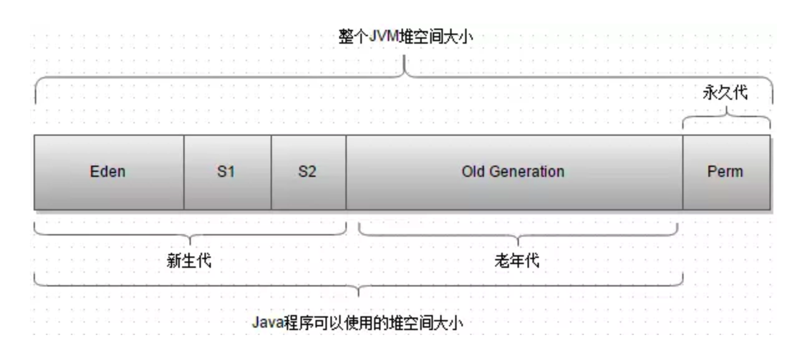
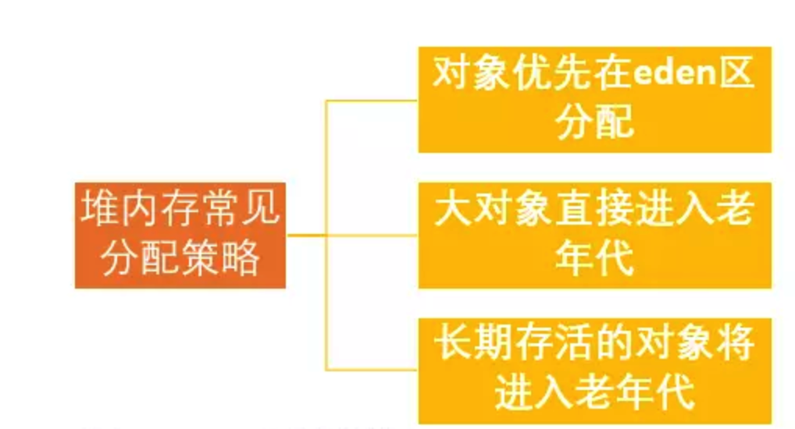
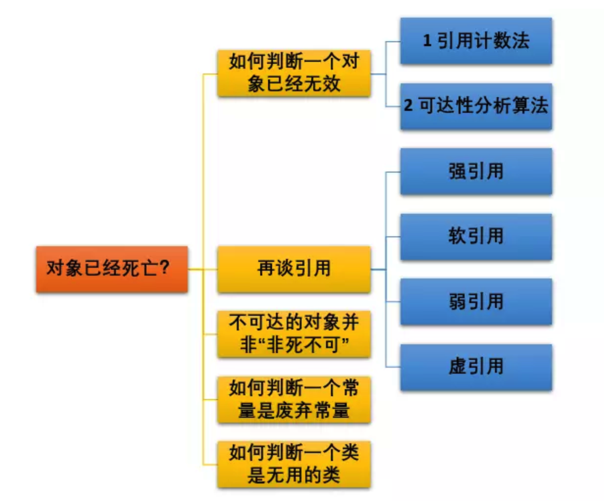
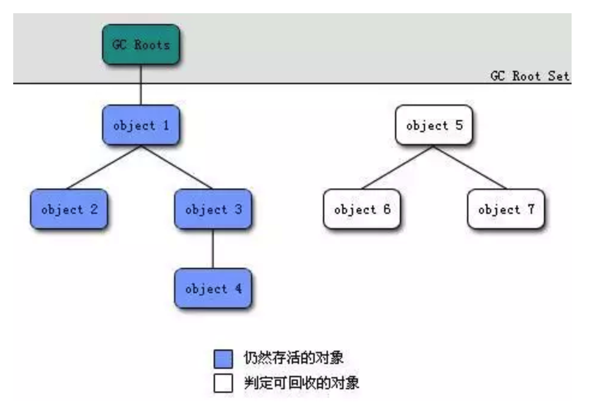
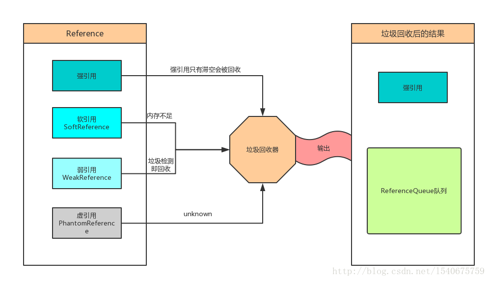
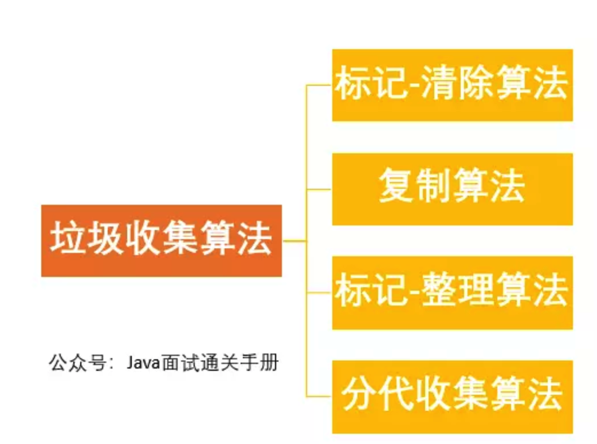
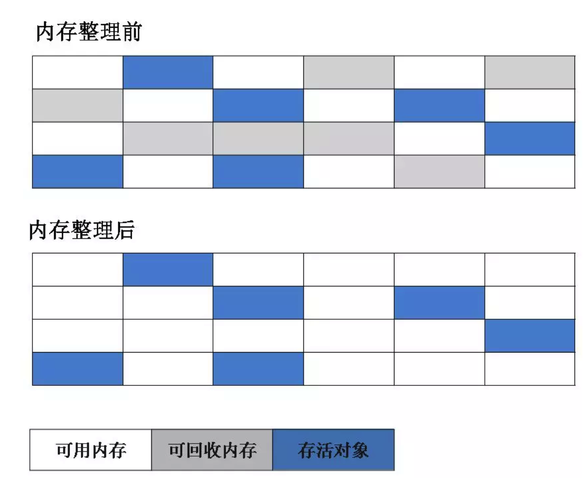
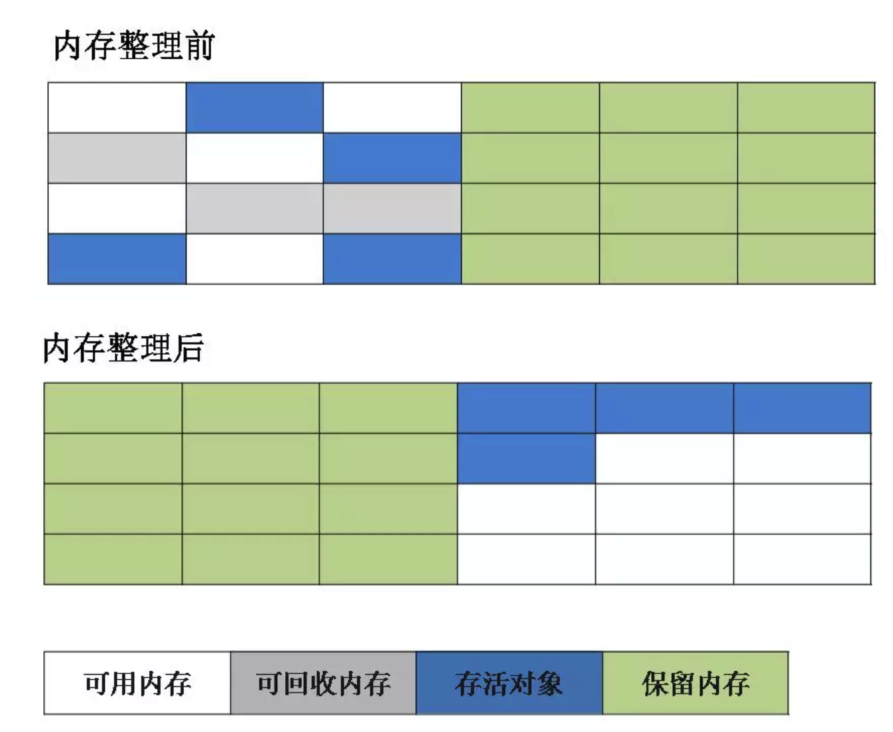
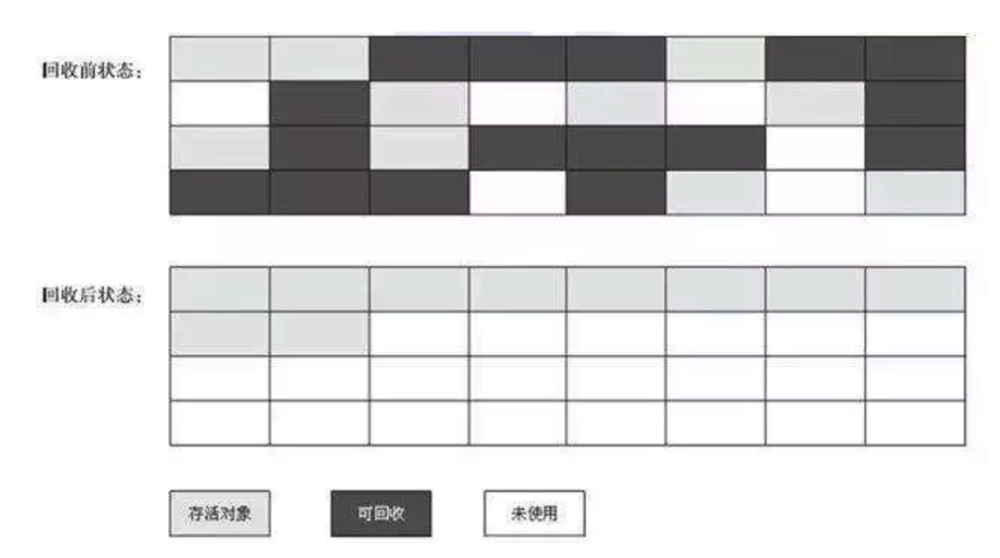

## 1. JVM内存分配与回收

Java运行时区域的各个部分，其中`程序计数器、虚拟机栈、本地方法栈`区域随着线程而生、随线程而灭。而`Java堆和方法区`则不一样，一个接口中的多个实现类需要的内存可能不一样，一个方法中的多个分支需要的内存也可能不一样。只有在程序运行期间才知道会创建哪些对象。这部分内存的分配和回收都是动态的，垃圾收集器所关注的是这部分内存。

### JDK1.8之前的堆内存示意图：



从上述堆内存分为`新生代、老年代和永久代`。新生代有分为：`Eden区+Survior1区+Survior2区`。

在 JDK 1.8中移除整个永久代，取而代之的是一个叫`元空间`（Metaspace）的区域（永久代使用的是JVM的堆内存空间，而元空间使用的是物理内存，直接受到本机的物理内存限制）。

### 1.1 堆内存常见分配策略



1. 对象优先在`eden`区分配

   将内存分为一块较大的Eden空间和两块较小的Survivor空间，每次使用Eden和其中一块Survivor。当回收的时候，将Eden和Survivor中还存活的对象一次性地复制到另外一块Survivor空间上，最后清理掉Eden和刚才用过的Survivor空间。当Survivor空间不够用时，需要依赖其他内存（老年代）进行分配担保(Handle Promotion)

2. 分配担保：如果另一块Survivor空间没有足够的空间存放上一次新生代收集下来的存活对象时，这些对象将直接通过分配担保机制进入老年代。

3. 大对象直接进入老年代

   大对象就是需要大量连续内存空间的对象，如字符串、数组。为了避免为大对象分配内存时由于分配担保机制带来的复制而降低效率。

4. 长期存活的对象将进入老年代

   虚拟机采用了分代收集的思想管理内存，需要内存回收时必须能识别哪些对象应该放在新生代中，哪些放在老年代中，所以虚拟机需要为每个对象一个对象年龄计数器。

   如果对象在Eden出生并经过一次MinorGC后任能够存活，并且能被Survivor容纳的话，将被移动到Survivor空间中，并将对象年龄设为1。对象在Survivor中每熬过一次MinorGC，年龄就增加1岁。当年增加到一定程度(默认15岁)，会被晋升到老年代中。对象晋升到老年代的年龄阈值可以通过参数`-XX:MaxTenuringThreshold`来设置。

5. 动态对象年龄判定

   为了更好的适应不同程序的内存情况，虚拟机不是永远要求对象年龄必须达到了某个值才能进入老年代，如果 Survivor 空间中相同年龄所有对象大小的总和大于 Survivor 空间的一半，年龄大于或等于该年龄的对象就可以直接进入老年代，无需达到要求的年龄。

## 2. 如何判断对象死亡

堆中存放着所欲对象的实例，对堆垃圾回收第一步就是判断哪些对象已经死亡。



### 2.1 引用计数法

给对象中添加一个引用计数器，每当有一个地方引用它，计数器就加1；当引用失效，计数器就减1；任何时候计数器为0的对象就是不可能再被使用的。

**这个方法实现简单，效率高，但是目前主流的虚拟机中并没有选择这个算法来管理内存，其最主要的原因是它很难解决对象之间相互循环引用的问题。**所谓对象之间的相互引用问题，如下面代码所示：除了对象objA 和 objB 相互引用着对方之外，这两个对象之间再无任何引用。但是他们因为互相引用对方，导致它们的引用计数器都不为0，于是引用计数算法无法通知 GC 回收器回收他们。

```java
public class ReferenceCountingGc {
    Object instance = null;
	public static void main(String[] args) {
		ReferenceCountingGc objA = new ReferenceCountingGc();
		ReferenceCountingGc objB = new ReferenceCountingGc();
		objA.instance = objB;
		objB.instance = objA;
		objA = null;
		objB = null;

	}
}
```

### 2.2 可达性分析算法

这个算法的基本思想就是通过一系列的称为 **“GC Roots”** 的对象作为起点，从这些节点开始向下搜索，节点所走过的路径称为引用链，当一个对象到 GC Roots 没有任何引用链相连的话，则证明此对象是不可用的。



在Java中GCRoot中的对象包含以下几类：

- 虚拟机栈中引用的对象
- 方法区中类静态属性引用的对象
- 方法区中常量引用的对象
- 本地方法栈中引用的对象

### 2.3 再谈引用

无论是通过引用计数法判断对象引用数量，还是通过可达性分析法判断对象的引用链是否可达，判定对象的存活都与“引用”有关。

JDK1.2之前，Java中引用的定义很传统：如果reference类型的数据存储的数值代表的是另一块内存的起始地址，就称这块内存代表一个引用。

JDK1.2以后，Java对引用的概念进行了扩充，将引用分为强引用、软引用、弱引用、虚引用四种（引用强度逐渐减弱）

1. 强引用

   在程序中普遍存在的类似`Object object = new Object()`类似的，当内存空 间不足，Java虚拟机宁愿抛出OutOfMemoryError错误，使程序异常终止，也不会靠随意回收具有强引用的对象来解决内存不足问题。

2. 软引用

   如果一个对象只具有软引用，那么它的性质属于可有可无的那种。**如果此时内存空间足够，垃圾回收器就不会回收它，如果内存空间不足了，就会回收这些对象的内存。**只要垃圾回收器没有回收它，该对象就可以被程序使用。

3. 弱引用

   如果一个对象具有弱引用，那其的性质也是可有可无的状态。

   而弱引用和软引用的区别在于：弱引用的对象拥有更短的生命周期，只要垃圾回收器扫描到它，不管内存空间充足与否，都会回收它的内存。

4. 虚引用

   虚引用和前面的软引用、弱引用不同，它并不影响对象的生命周期。如果一个对象与虚引用关联，则跟没有引用与之关联一样，在任何时候都可能被垃圾回收器回收。

**总结**：

- 对于强引用，平时在编写代码时会经常使用。
- 而其他三种类型的引用，使用得最多就是软引用和弱引用，这两种既有相似之处又有区别，他们都来描述非必须对象。
- 被软引用关联的对象只有在内存不足时才会被回收，而被弱引用关联的对象在JVM进行垃圾回收时总会被回收。



### 2.4 不可达的对象并非“非死不可”

即使在可达性分析法中不可达的对象，也并非是“非死不可”的，这时候它们暂时处于“缓刑阶段”，要真正宣告一个对象死亡，至少要经历两次标记过程；可达性分析法中不可达的对象被第一次标记并且进行一次筛选，筛选的条件是此对象是否有必要执行 finalize 方法。当对象没有覆盖 finalize 方法，或 finalize 方法已经被虚拟机调用过时，虚拟机将这两种情况视为没有必要执行。

如果对象被判定为有必要执行finalize方法，则会被放置在一个F-Queen队列中，稍后有一个由虚拟机创建的低优先级的`finalizer`线程执行它。执行就是虚拟机会触发这个函数。`finalize()`方法是对象逃脱死亡的最后一次机会，稍后GC将对F-Queen中的对象进行第二次小规模的标记，如果对象要在finalize()方法中成功拯救自己--只要重新与引用链上的任何一个对象建立关联即可，那么第二次标记时它将会被移出即将回收的集合。下面所示：

```java
public class FinalizeEscapeGC {

    public static FinalizeEscapeGC SAVE_HOOK = null;

    public void isAlive(){
        System.out.println("yes, i an still alive");
    }

    @Override
    protected void finalize() throws Throwable {
        super.finalize();
        System.out.println("finalize method executed");
        FinalizeEscapeGC.SAVE_HOOK = this;
    }


    public static void main(String[] args) throws InterruptedException {
        SAVE_HOOK = new FinalizeEscapeGC();

        SAVE_HOOK = null;
        System.gc();
        Thread.sleep(500);
        if(SAVE_HOOK != null){
            SAVE_HOOK.isAlive();
        }else{
            System.out.println("no, i am dead :(");
        }

        SAVE_HOOK = null;
        System.gc();
        Thread.sleep(500);
        if(SAVE_HOOK != null){
            SAVE_HOOK.isAlive();
        }else{
            System.out.println("no, i am dead :(");
        }

    }
}
```

## 3. 回收方法区

永久代的垃圾回收主要回收两部分：废弃常量和无用的类

回收废弃常量和回收Java堆中的对象类似。假如在常量池中存在字符串 "abc"，如果当前没有任何String对象引用该字符串常量的话，就说明常量 "abc" 就是废弃常量，如果这时发生内存回收的话而且有必要的话，"abc" 就会被系统清理出常量池。

同时满足一下三个条件的才能算是无用的类：

- 该类的所有实例都被回收，
- 加载类的ClassLoader已经被回收
- 该类对应的java.lang.Class对象没有在任何地方被引用，无法在任何地方通过反射访问该类的方法。

虚拟机可以对满足上述3个条件的无用类进行回收，但是仅仅是可以回收，不是不适用了一定会回收。是否回收可以通过参数来控制。

在大量使用反射、动态代理、CGLib等框架、动态生成JSP和OSGi这列频繁定义ClassLoader的场景都需要虚拟机具备类卸载的能力，以保证永久代不会溢出。

**注意**：JDK1.7及之后版本的 JVM 已经将运行时常量池从方法区中移了出来，在 Java 堆（Heap）中开辟了一块区域存放运行时常量池。

## 4. 垃圾回收算法



### 4.1 标记-清除算法

算法分为“标记”和“清除”阶段：首先标记出所有需要回收的对象，在标记完成后统一回收所有被标记的对象。它是最基础的收集算法，效率也很高，但是会带来两个明显的问题：

1. **效率问题**
2. **空间问题（标记清除后会产生大量不连续的碎片**



### 4.2 复制算法

为了解决效率问题，“复制”收集算法出现了。它可以将内存分为大小相同的两块，每次使用其中的一块。当这一块的内存使用完后，就将还存活的对象复制到另一块去，然后再把使用的空间一次清理掉。这样就使每次的内存回收都是对内存区间的一半进行回收。



### 4.3 标记-整理算法

根据老年代的特点特出的一种标记算法，标记过程仍然与“标记-清除”算法一样，但后续步骤不是直接对可回收对象回收，而是让所有存活的对象向一段移动，然后直接清理掉端边界以外的内存。



### 4.4 分代收集算法

当前虚拟机的垃圾手机都采用分代收集算法，这种算法没有什么新的思想，只是根据对象存活周期的不同将内存分为几块。一般将java堆分为新生代和老年代，这样我们就可以根据各个年代的特点选择合适的垃圾收集算法。

**比如在新生代中，每次收集都会有大量对象死去，所以可以选择复制算法，只需要付出少量对象的复制成本就可以完成每次垃圾收集。而老年代的对象存活几率是比较高的，而且没有额外的空间对它进行分配担保，所以我们必须选择“标记-清楚”或“标记-整理”算法进行垃圾收集。**


