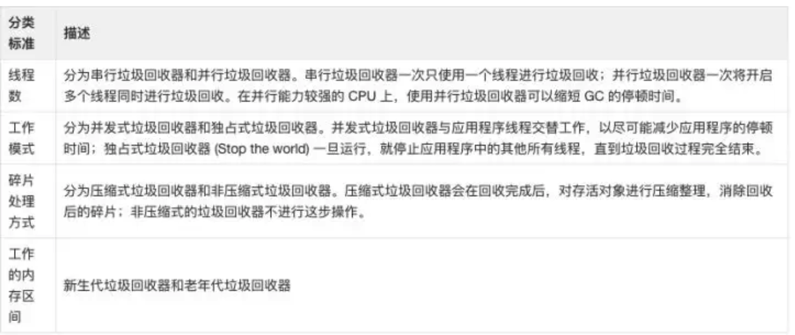
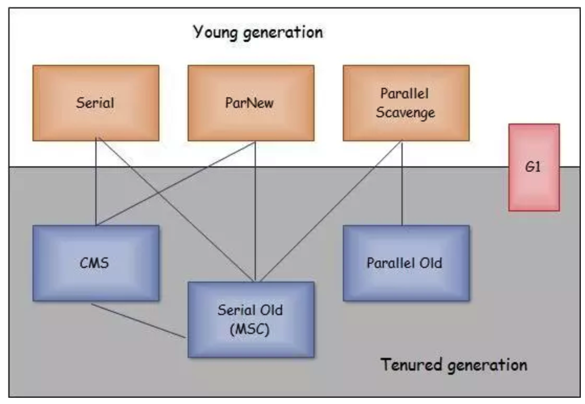
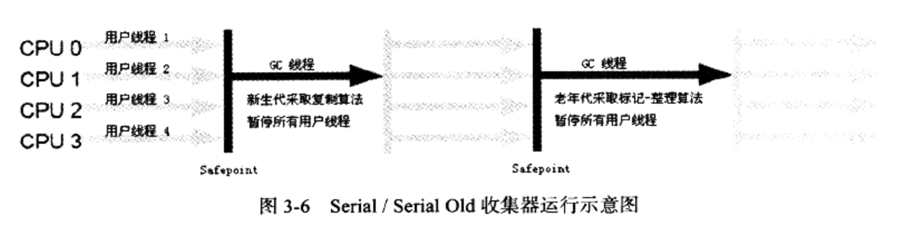
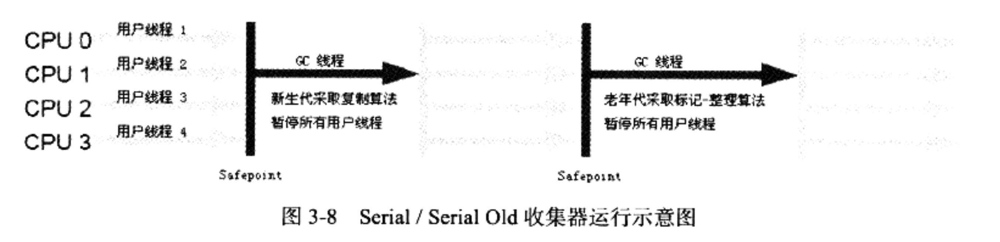
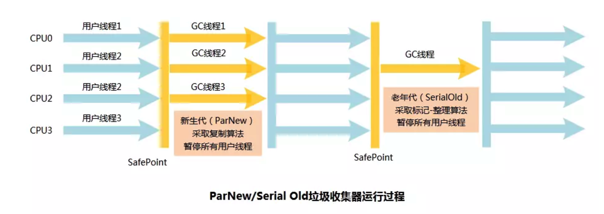
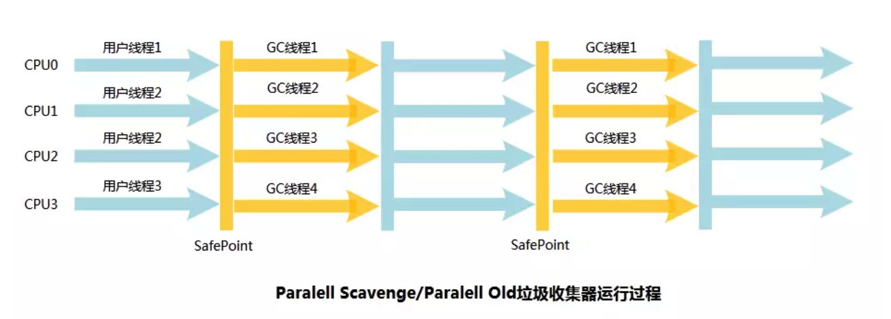
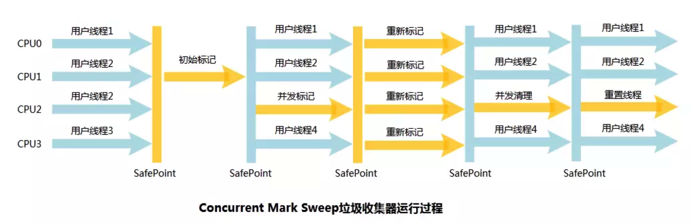

## 1. 垃圾回收算法实现

### 1.1 枚举根节点

可达性分析中，需要从GC Roots节点找引用链，但是GC Roots的节点主要在全局性引用(常量或者静态属性)和执行上下文(如栈帧中的本地变量表)中，有些引用方法区大小就有数百兆，逐个检查的话会非常浪费时间。

同时可达性分析执行时间的敏感还体现在GC停顿上。因为这项分析工作必须在一个能确保一致性的快照中，不可以出现分析过程中对象的引用关系还在不断变化的情况。所以GC进行时必须停顿所有Java执行线程(Stop The World)。

目前主流的Java虚拟机使用的是准确式GC，当执行系统停下来的时候，虚拟机应该有办法直接指导哪些地方存放着对象引用。使用一组`OopMap`的数据结构来达到这个目的。

一个线程意味着一个栈，一个栈由多个栈帧组成，一个栈帧对应着一个方法，一个方法里面可能有多个安全点。 gc 发生时，程序首先运行到最近的一个安全点停下来，然后更新自己的 OopMap ，记下栈上哪些位置代表着引用。枚举根节点时，递归遍历每个栈帧的 OopMap ，通过栈中记录的被引用对象的内存地址，即可找到这些对象（ GC Roots ）

**用空间换时间**

### 1.2 安全点

导致引用关系变化、或者说OopMap内容变化的指令非常多。为每个指令生成对应的OopMap需要大量的额外空间。虚拟机只是在“特定的位置”记录了这些信息，这些位置称为`安全点`。程序执行的时候不是在所有的地方都能够停下来，只是在到达安全点才能停下来。安全点选取的标准是：`是否具有让程序长时间执行的特征`。长时间执行的最明显的特征是指令序列复用。如`方法复用、循环跳转、异常跳转等`。具有这些功能的指令才会产生`Safepoint`。

如何在GC发生时让所有线程都跑到最近的安全点上停下来？

- 抢先式中断：先把所有线程中断，恢复不在安全点上的线程，让它跑到安全点上。没有虚拟机使用
- 主动式中断：GC需要中断的时候，不直接操作线程，设置一个标志，让各个线程执行到安全点的位置的时候轮询这个标志，如果发现中断标志为真就自己中断挂起。

### 1.3 安全区域

使用Safepoint不能完美解决问题。如果一个线程进入了Sleep或者Blocked状态，这个时候线程无法响应JVM的中断请求，JVM也没法等待线程重新被分配CPU时间，这时候需要使用安全区`Safe Region`来解决。

>安全区域是一段代码片段中，引用关系不会发生变化。在这个区域任何地方开始GC都是安全的。可看做扩展的SafePoint

线程执行到`SafeRegion`中的代码中时，标识自己进入了Safe Region中，在这段时间JVM要发起GC，不用管这些线程。线程离开SafeRegion时，检查系统是否已经完成了根节点枚举(整个GC过程)。完成了就继续执行，否则就得到直到收到可以安全离开SafeRegion的信号为止。

## 2. 垃圾收集器

### 2.1 相关名词

1. 吞吐量。**吞吐量 = 运行用户代码时间/（运行用户代码时间 + 垃圾回收时间）**`CPU` 用于运行用户代码的时间与 `CPU` 总消耗时间的比值。比如说虚拟机总运行了 `100` 分钟，**用户代码** 时间 `99` 分钟，**垃圾回收** 时间 `1` 分钟，那么吞吐量就是 `99%`。
2. 停顿时间。**停顿时间**指垃圾回收器正在运行时，**应用程序**的 **暂停时间**。对于 **独占回收器**而言，停顿时间可能会比较长。使用 **并发回收器**时，由于垃圾回收器和应用程序 **交替运行**，程序的 **停顿时间**会变短，但是，由于其 **效率**很可能不如独占垃圾回收器，故系统的 **吞吐量**可能会较低。
3. GC的名词
   - 新生代GC(Minor GC):指发生在 **新生代** 的垃圾回收动作，因为 `Java` 对象大多都具备 **朝生夕死** 的特性，所以 `Minor GC` 通常 **非常频繁**，一般回收速度也比较快。
   - 老年代GC(Major GC)：指发生在 **老年代** 的垃圾回收动作，出现了 `Major GC`，经常会伴随至少一次的 `Minor GC`（发生这种情况，那么 **整个堆** 都 `GC` 一遍，通常称为 `Full GC`）。`Major GC` 的速度一般会比 `Minor GC` 慢 `10` 倍以上。
4. 并发与并行
   1. 串行(Parallel):单线程进行垃圾回收，但此时用户线程处于等待状态。
   2. 并发(Concurrent)：指用户线程与垃圾回收线程交替执行
   3. 并行(Parallel):用户线程和多条垃圾回收线程在不同CPU上同时工作。

### 2.2 垃圾回收器分类标准

在JVM中，具体实现的有`Serival、ParNew、Parallel Scavenge、 CMS、Serial Old(MSC)、Parallel Old、G1`等。下图中有连线的表示可以配套使用。

### 2.3 Serial 收集器

单线程收集器，最基本历史最悠久。在进行垃圾收集的时候必须暂停其他所有的工作线程，直达收集结束。由于垃圾清理时，`Serial` **回收器** 不存在 **线程间的切换**，因此，特别是在单 `CPU` 的环境下，它的 **垃圾清除效率** 比较高。对于 `Client` 运行模式的程序，选择 `Serial` 回收器是一个不错的选择。

### 2.4 Serial Old

`Serial Old`回收器是 `Serial`回收器的 **老生代版本**，属于 **单线程回收器**，它使用 **标记-整理**算法。对于 `Server`模式下的虚拟机，在 `JDK1.5`及其以前，它常与 `Parallel Scavenge`回收器配合使用，达到较好的 **吞吐量**，另外它也是 `CMS`回收器在 `Concurrent Mode Failure`时的 **后备方案**。

### 2.5 ParNew收集器

ParNew收集器是Serial收集器的多线程版本，其余完全一样。同样运行在 **新生代区域**。在实现上，两者共用很多代码。在不同运行环境下，根据 `CPU`核数，开启 **不同的线程数**，从而达到 **最优**的垃圾回收效果。对于那些 `Server`模式的应用程序，如果考虑采用 `CMS`作为 **老生代回收器**时，`ParNew`回收器是一个不错的选择。

> `ParNew` **新生代回收器** 采用的是 **复制算法**。

### 2.6 Parallel Scavenge

和 `ParNew`回收一样，`Parallel Scavenge`回收器也是运行在 **新生代区域**，属于 **多线程**的回收器。但不同的是，`ParNew`回收器是通过控制 **垃圾回收**的 **线程数**来进行参数调整，而 `Parallel Scavenge`回收器更关心的是 **程序运行的吞吐量**。即一段时间内，**用户代码**运行时间占 **总运行时间**的百分比。

**停顿时间越短越适合需要与用户交互的程序，良好的响应速度能提升用户体验，而高吞吐量可以高效率利用CPU时间，尽快完成程序的运算任务，主要适合在后台运算而不需要太多交互的任务。**

> `Parallel Scavenge` **新生代回收器** 采用的是 **复制算法**。

### 2.7 Parallel Old

`Parallel Old`回收器是 `Parallel Scavenge`回收器的 **老生代版本**，属于 **多线程回收器**，采用 **标记-整理算法**。`Parallel Old`回收器和 `Parallel Scavenge`回收器同样考虑了 **吞吐量优先**这一指标，非常适合那些 **注重吞吐量**和 `CPU`**资源敏感**的场合。

> `Parallel Old` **老年代回收器** 采用的是 **标记 - 整理算法**。

### 2.8 CMS

`CMS（Concurrent Mark Sweep）` 回收器是在 **最短回收停顿时间** 为前提的回收器，属于 **多线程回收器**，采用 **标记-清除算法**。

CMS工作流程分为以下四个步骤：

- 初始标记(initial mark)

  **初始标记** 仅仅是标记 `GC Roots` 内 **直接关联** 的对象。这个阶段 **速度很快**，需要 `Stop the World`。

- 并发标记(concurrent mark)

  **并发标记** 进行的是 `GC Tracing`，从 `GC Roots` 开始对堆进行 **可达性分析**，找出 **存活对象**。

- 重新标记(remark)

  **重新标记** 阶段为了 **修正** 并发期间由于 **用户进行运作** 导致的 **标记变动** 的那一部分对象的 **标记记录**。这个阶段的 **停顿时间** 一般会比 **初始标记阶段** 稍长一些，但远比 **并发标记** 的时间短，也需要 `Stop The World`。

- 并发清除(concurrent sweep)

  **并发清除** 阶段会清除垃圾对象。

> **初始标记**（`CMS initial mark`）和 **重新标记**（`CMS remark`）会导致 **用户线程** 卡顿，`Stop the World` 现象发生。

在整个过程中，`CMS` 回收器的 **内存回收** 基本上和 **用户线程** 并发执行。由于 `CMS` 回收器 **并发收集**、**停顿低**，因此有些地方成为 **并发低停顿回收器**（`Concurrent Low Pause Sweep Collector`）。

CMS回收器的缺点：

1. **CMS回收器对CPU资源非常依赖**

   `CMS` 回收器过分依赖于 **多线程环境**，默认情况下，开启的 **线程数** 为`（CPU 的数量 + 3）/ 4`，当 `CPU` 数量少于 `4` 个时，`CMS` 对 **用户查询** 的影响将会很大，因为他们要分出一半的运算能力去 **执行回收器线程**；

2. **CMS回收器无法清除浮动垃圾**

   由于 `CMS`回收器 **清除已标记的垃圾**（处于最后一个阶段）时，**用户线程**还在运行，因此会有新的垃圾产生。但是这部分垃圾 **未被标记**，在下一次 `GC`才能清除，因此被成为 **浮动垃圾**。

   由于 **内存回收**和 **用户线程**是同时进行的，内存在被 **回收**的同时，也在被 **分配**。当 **老生代**中的内存使用超过一定的比例时，系统将会进行 **垃圾回收**；当 **剩余内存**不能满足程序运行要求时，系统将会出现 `Concurrent Mode Failure`，临时采用 `Serial Old`算法进行 **清除**，此时的 **性能**将会降低。

3. **垃圾收集结束后残余大量空间碎片**

   `CMS` 回收器采用的 **标记清除算法**，本身存在垃圾收集结束后残余 **大量空间碎片** 的缺点。`CMS` 配合适当的 **内存整理策略**，在一定程度上可以解决这个问题。

### 2.9 G1

`G1` 是 `JDK 1.7` 中正式投入使用的用于取代 `CMS` 的 **压缩回收器**。它虽然没有在物理上隔断 **新生代** 与 **老生代**，但是仍然属于 **分代垃圾回收器**。`G1` 仍然会区分 **年轻代** 与 **老年代**，年轻代依然分有 `Eden` 区与 `Survivor` 区。

在G1之前其他收集器进行收集的范围都是整个新生代或者老年代，但是G1不再是这样。它先将Jaca堆划分为多个大小相等的独立区域(Region)。虽然还保留有新生代和老年代的概念，但是他们不是物理隔离的，都是一部分Region(不需要连续)的集合。

G1跟踪各个Region里面的垃圾堆积的价值大小，在后台维护一个优先列表。每次根据允许回收的时间优先回收价值最大的Region，保证在有限的时间获得尽可能高的收集效率。

但是不同的Region不是孤立的，一个对象分配在某个Region中，并非只能被本Region中的其他对象引用，而是可以和整个队任意对象发生引用关系。在判断对象是够存活的时候，难道需要扫描整个堆么？在其他收集器也面临同样的问题。新生代的对象可能被老生代所引用，在进行Minor GC的时候需要对整个堆进行扫描么？

在G1收集器中，Region之间的对象引用以及其他收集器中的新生代和老生代之间的对象引用，是使用`Remembered Set`来避免全堆扫描的。G1中每个Region有一个与之对应的`Remembered Set`,虚拟机发现程序在对Reference类型的数据进行写操作的时候，会检查Reference引用对象是否处于不同的Region之中。如果是，则将相关引用信息记录到被引用对象所属的Region的`Remembered Set`中。在进行内存回收的时候，GC根节点的枚举范围加入`Remembered Set`可保证不对全堆扫描。

G1收集器运作大致分为以下几个步骤：

- 初始标记
- 并发标记
- 最终标记
- 筛选回收

前三个和CMS是一样的，最后的筛选回收首先对各个 `Region` 的 **回收价值** 和 **成本** 进行排序，根据用户所期望的 `GC` **停顿时间** 来制定回收计划。这个阶段可以与用户程序一起 **并发执行**，但是因为只回收一部分 `Region`，时间是用户可控制的，而且停顿 **用户线程** 将大幅提高回收效率。

与其他GC相比，G1具有的特点如下：

- 并行与并发

  使用多个 `CPU` 来缩短 `Stop-the-World` 的 **停顿时间**，部分其他回收器需要停顿 `Java` 线程执行的 `GC` 动作，`G1` 回收器仍然可以通过 **并发的方式** 让 `Java` 程序继续执行。

- **分代回收**

  与其他回收器一样，**分代概念**在 `G1`中依然得以保留。虽然 `G1`可以不需要 **其他回收器配合**就能独立管理 **整个GC堆**，但它能够采用 **不同的策略**去处理 **新创建的对象**和 **已经存活**一段时间、**熬过多次**`GC`的旧对象，以获取更好的回收效果。**新生代**和 **老年代**不再是 **物理隔离**，是多个 **大小相等**的独立 `Region`。

- **空间整合**

  与 `CMS`的 **标记—清理**算法不同，`G1`从 **整体**来看是基于 **标记—整理**算法实现的回收器。从 **局部**（两个 `Region`之间）上来看是基于 **复制算法**实现的。

  但无论如何，这 **两种算法**都意味着 `G1`运作期间 **不会产生内存空间碎片**，回收后能提供规整的可用内存。这种特性有利于程序长时间运行，**分配大对象**时不会因为无法找到 **连续内存空间**而提前触发 **下一次**`GC`。

- **可预测的停顿**

  这是 `G1`相对于 `CMS`的另一大优势，**降低停顿时间**是 `G1`和 `CMS`共同的关注点。`G1`除了追求 **低停顿**外，还能建立 **可预测**的 **停顿时间模型**，能让使用者明确指定在一个 **长度**为 `M`毫秒的 **时间片段**内，消耗在 **垃圾回收**上的时间不得超过 `N`毫秒。（后台维护的 **优先列表**，优先回收 **价值大**的 `Region`）。

