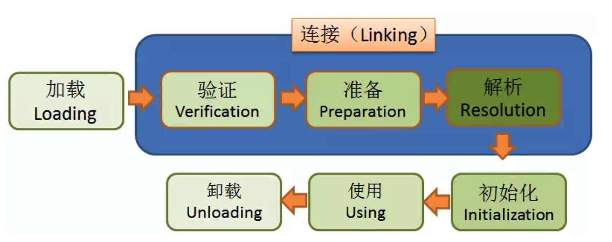
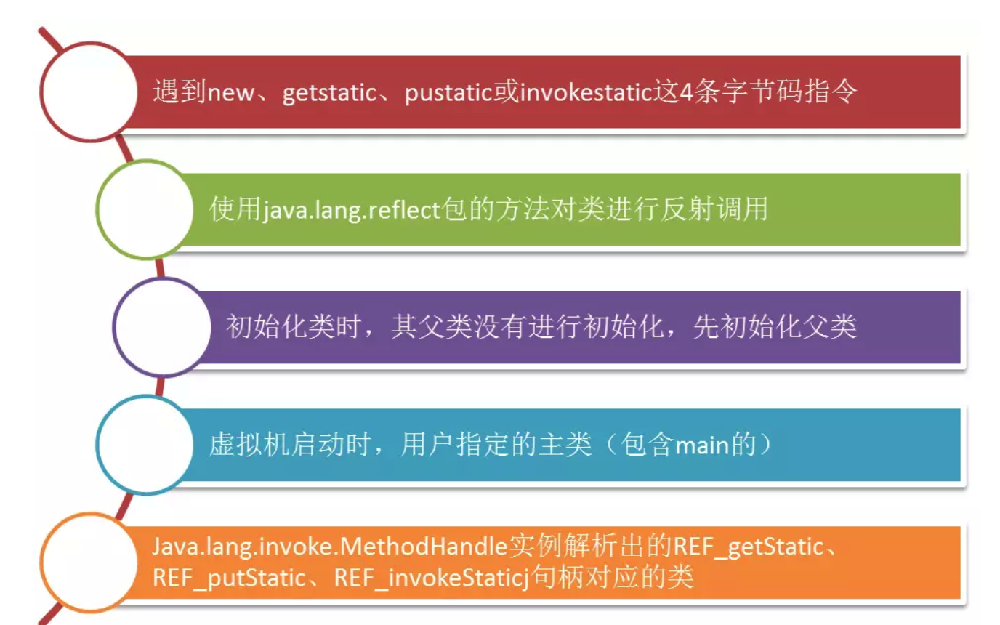
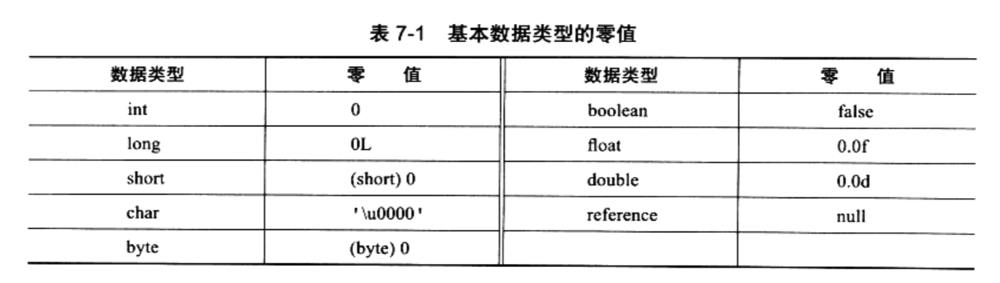
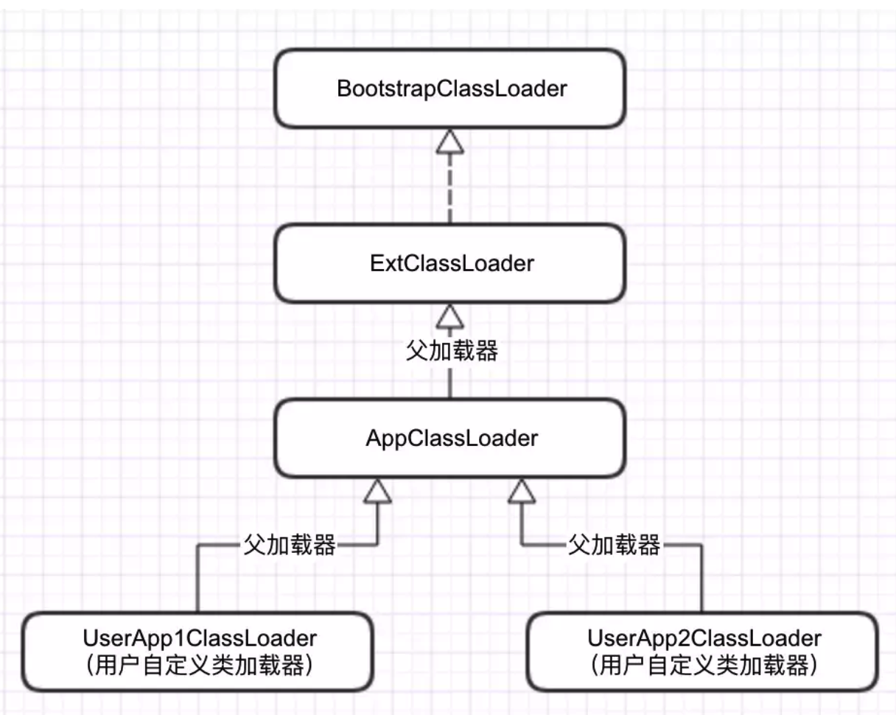
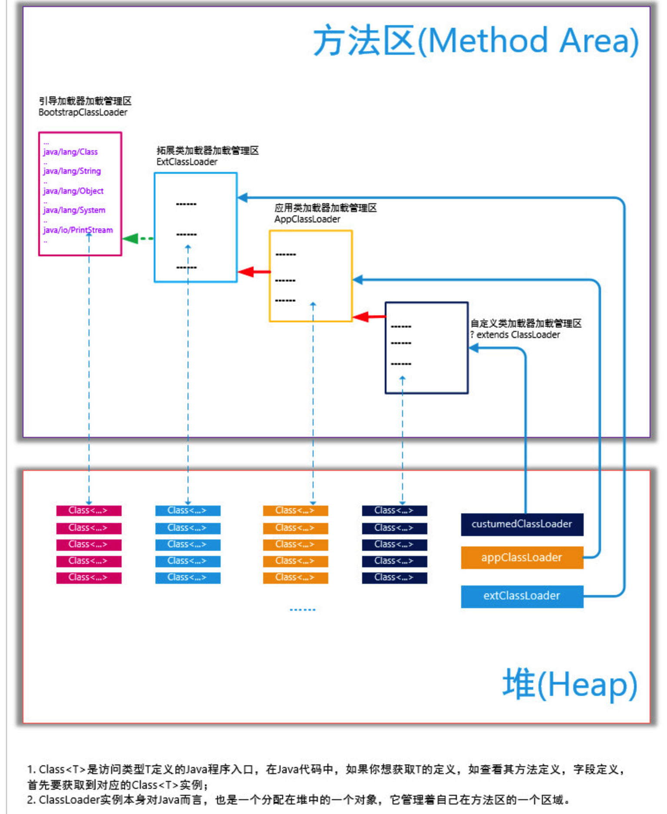

## JVM类加载机制

不同于需要在编辑时进行链接的语言，Java语言中，类的加载、连接和初始化过程是在程序运行期间完成的。这种方法会令类加载时稍微增加一些性能开销，但是为Java应用程序提供了高度的灵活性，Java动态扩展的语言特性就是依赖运行期动态加载和动态链接这个特点实现的。用户可以编写一个面向对象的接口引用程序，等到运行时再指定其实际的实现类。

### 1. 类加载的时机

类从被加载到虚拟机内存到卸载出内存为止，整个证明周期包括以下七个阶段：


这些步骤总体上是按照图中顺序进行的，但是Java语言本身支持运行时绑定，所以**解析阶段也可以是在初始化之后进行的**。以上顺序都只是说开始的顺序，实际过程中是交叉进行的，加载过程中可能就已经开始验证了。

什么时候类需要被加载，Java虚拟机规范并没有约束这一点，但是却规定了类必须进行**初始化**的5种情况



### 2. 类加载的过程

#### 2.1 加载

**加载**是整个类加载过程的第一步，如果需要创建类或者接口，就需要现在Java虚拟机方法区创建于虚拟机实现规定相匹配的内部表示。一般来说类的创建是由另一个类或者接口触发的，它通过自己的运行时常量池引用到了需要创建的类，也可能是由于调用了Java核心类库中的某些方法，譬如反射等。

加载需要完成以下三件事情：

1. 通过一个类的全限定名获取此类的二进制字节流
2. 将这个字节流所代表的静态存储结构转化为方法区的运行时数据结构
3. 在内存中生成一个代表这个类的java.lang.Class对象，作为方法区这个类的各种数据的**访问入口**

创建名字为C的类，如果C不是数组类型，那么它就可以通过类加载器加载C的二进制表示（即Class文件）。**如果是数组，则是通过Java虚拟机创建**，虚拟机递归地采用上面提到的加载过程不断加载数组的组件。

Java虚拟机支持两种类加载器：

- **引导类加载器(Bootstrap ClassLoader)**
- **用户自定义类加载器(User-Defined Class Loader)**

用户自定义的类加载器应该是抽象类**ClassLoader**的某个子类的实例。应用程序使用用户自定义的类加载器是为了扩展Java虚拟机的功能，支持动态加载并创建类。比如，在加载的第一个步骤中，获取二进制字节流，通过自定义类加载器，我们可以从网络下载、动态产生或者从一个加密文件中提取类的信息。

**加载阶段和链接阶段的部分内容是交叉进行的。加载阶段尚未完成，链接阶段可能已经开始，这两个阶段的开始时间仍然保持着固定的先后顺序**

#### 2.2 验证

> 验证主要的目的是确保Class文件的字节流中包含的信息符合当前虚拟机的要求，并且不会危害虚拟机自身的安全。

验证阶段大致完成下面四个检验动作：

- 文件格式验证
- 元数据验证
- 字节码验证
- 符号引用验证

1. 文件格式验证

- 是否以魔数`0xCAFEBABE`开头

- 主次版本号是否在当前虚拟机处理范围之内

- 常量池的常量是否有不被支持的类型 (检查常量tag标志)

- 指向常量的各种索引值中是否有指向不存在的常量或不符合类型的常量

- CONSTANT_Utf8_info型的常量中是否有不符合UTF8编码的数据

- Class文件中各个部分及文件本身是否有被删除的或者附加的其他信息

......

**经过这个阶段的验证，字节流会进入方法去进行存储，后面的三个验证是基于方法区的存储结构进行的。**

2. 元数据验证

   主要对字节码描述的信息进行语义分析，以保证其提供的信息符合Java语言规范的要求。

   该类是否有父类（只有Object对象没有父类，其余都有）

   该类是否继承了不允许被继承的类（被final修饰的类）

   如果这个类不是抽象类，是否实现了其父类或接口之中要求实现的所有方法

   类中的字段、方法是否与父类产生矛盾（例如覆盖了父类的final字段，出现不符合规则的方法重载，例如方法参数都一致，但是返回值类型却不同）
   ...

3. 字节码验证

   主要是通过数据流和控制流分析，确定程序语义是合法的、符合逻辑的。在第二阶段对元数据信息中的数据类型做完校验后，字节码验证将对类的方法体进行校验分析，保证被校验类的方法在运行时不会做出危害虚拟机安全的事件。

   - 保证任意时刻操作数栈的数据类型与指令代码序列都能配合工作，例如不会出现类似的情况：操作数栈里的一个int数据，但是使用时却当做long类型加载到本地变量中

   - 保证跳转不会跳到方法体以外的字节码指令上

   - 保证方法体内的类型转换是合法的。例如子类赋值给父类是合法的，但是父类赋值给子类或者其它毫无继承关系的类型，则是不合法的。

4. 符号引用验证

   最后一个阶段的校验发生在虚拟机将符号引用转化为直接引用的时候，这个转化动作将在连接的第三阶段解析阶段发生。符号引用是对类自身以外（常量池中的各种符号引用）的信息进行匹配校验。如：

   - 符号引用中通过字符串描述的全限定名是否找到对应的类
   - 在指定类中是否存在符合方法的字段描述符以及简单名称所描述的方法和字段
   - 符号引用中的类、方法、字段的访问性（private,public,protected、default）是否可被当前类访问

   符号引用验证的目的是确保解析动作能够正常执行，如果无法通过符号引用验证，那么将会抛出一个java.lang.IncompatibleClassChangeError异常的子类，如java.lang.IllegalAccessError、java.lang.NoSuchFieldError、java.lang.NoSuchMethodError等。

   

#### 2.3 准备

> 准备阶段是正式为类变量分配内存并设置类变量初始值的阶段。这些变量所使用的内存是在方法区中分配的。这个阶段不会执行任何的虚拟机字节码指令，在初始化阶段才会显示的初始化这些字段，所以准备阶段不会做这些事情。

假设有：

```java
public static int value = 123;
```

value在准备阶段的初始值为0而不是123，因为这时候尚未开始执行任何Java方法，而把`value`赋值为123的`putstatic`指令是程序被编译之后，存放于类构造器`<clinit>()`方法之中，所以把value赋值为123的动作将在初始化阶段才会执行。

下面是一些基本数据类型的零值：



如果字段属性表存在`ConstantValue`属性，则准备阶段变量value就会被初始化为执行的值，如下：

```java
public static final int value = 123;
```

编译时Java将为value生成ConstantValue属性，准备阶段虚拟机就根据ConstantValue的设置将value赋值为123.

>常量的话，相当于在常量池就已经建立了相关链接，不需要进行初始化。

#### 2.4 解析

解析阶段是把常量池内的符号引用替换成直接引用的过程，符号引用就是Class文件中的**CONSTANT_Class_info**、**CONSTANT_Fieldref_info**、**CONSTANT_Methodref_info**等类型的常量。下面我们看符号引用和直接引用的定义。

- **符号引用（Symbolic References）**：符号引用以一组符号来描述所引用的目标，符号可以是任何形式的字面量，只要可以唯一定位到目标即可。符号引用于内存布局无关，所以所引用的对象不一定需要已经加载到内存中。各种虚拟机实现的内存布局可以不同，但是接受的符号引用必须是一致的，因为符号引用的字面量形式已经明确定义在Class文件格式中。

- **直接引用（Direct References）**：直接引用时直接指向目标的指针、相对偏移量或是一个能间接定位到目标的句柄。直接引用和虚拟机实现的内存布局相关，同一个符号引用在不同虚拟机上翻译出来的直接引用一般不会相同。如果有了直接引用，那么它一定已经存在于内存中了。

对同一个符号进行多次解析请求是很常见的，除了invokedynamic指令以外，虚拟机基本都会对第一次解析的结果进行缓存，后面再遇到时，直接引用，从而避免解析动作重复。

下面是几种基本的解析：

1. 类与接口的解析

   - 如果C不是数组类型，D的定义类加载器被用来创建类N或者接口C。加载过程中出现任何异常，可以被认为是类和接口解析失败。

   - 如果C是数组类型，并且它的元素类型是引用类型。那么表示元素类型的类或接口的符号引用会通过递归调用来解析。

   - 检查C的访问权限，如果D对C没有访问权限，则会抛出`java.lang.IllegalAccessError`异常。

2. 字段解析

   要解析一个未被解析过的字段符号引用，首先会对字段表内class_index项中索引的`CONSTANT_Class_info`符号引用进行解析，如果在解析这个类或接口符号引用的过程中出现了任何异常，都会导致字段解析失败。如果解析完成，那将**这个字段所属的类或者接口**用C表示，虚拟机规范要求按照如下步骤对Ｃ进行后续字段的搜索。

   1 . 如果C本身包含了简单名称和字段描述符都与目标相匹配的字段，则直接返回这个字段的直接引用，查找结束。
   2 . 否则，如果在C中实现了接口，将会按照继承关系从下往上递归搜索各个接口和它的父接口，如果接口中包含了简单名称和字段描述符都与目标相匹配的字段，则返回这个字段的直接引用，查找结束。
   3 . 再不然，如果C不是`java.lang.Object`的话，将会按照继承关系从下往上递归搜索其父类，如果在类中包含
   了简单名称和字段描述符都与目标相匹配的字段，则返回这个字段的直接引用，查找结束。
   4 . 如果都没有，查找失败退出，抛出`java.lang.NoSuchFieldError`异常。如果返回了引用，还需要检查访问权限，如果没有访问权限，则会抛出`java.lang.IllegalAccessError`异常。

3. 类方法解析

   类方法解析也是先对类方法表中的class_index项中索引的方法所属的类或接口的符号引用进行解析。我们依然用C来代表解析出来的类，接下来虚拟机将按照下面步骤对C进行后续的类方法搜索。

   1 . 首先检查方法引用的C是否为类或接口，如果是接口，那么方法引用就会抛出`IncompatibleClassChangeError`异常
   2 . 方法引用过程中会检查C和它的父类中是否包含此方法，如果C中确实有一个方法与方法引用的指定名称相同，并且声明是签名多态方法（Signature Polymorphic Method）,那么方法的查找过程就被认为是成功的，所有方法描述符所提到的类也需要解析。对于C来说，没有必要使用方法引用指定的描述符来声明方法。
   3 . 否则，如果C声明的方法与方法引用拥有同样的名称与描述符，那么方法查找也是成功。
   4 . 如果C有父类的话，那么按照第2步的方法递归查找C的直接父类。
   5 . 否则，在类C实现的接口列表及它们的父接口之中递归查找是否有简单名称和描述符都与目标相匹配的方法，如果存在相匹配的方法，说明类C时一个抽象类，查找结束，并且抛出`java.lang.AbstractMethodError`异常。

   6.否则，宣告方法失败，并且抛出`java.lang.NoSuchMethodError`。
   最后的最后，如果查找过程成功返回了直接引用，将会对这个方法进行权限验证，如果发现不具备对此方法的访问权限，那么会抛出 `java.lang.IllegalAccessError`异常。

4. 接口方法解析

   接口方法也需要解析出接口方法表的class_index项中索引的方法所属的类或接口的符号引用，如果解析成功，依然用C表示这个接口，接下来虚拟机将会按照如下步骤进行后续的接口方法搜索

   1 . 与类方法解析不同，如果在接口方法表中发现class_index对应的索引C是类而不是接口，直接抛出`java.lang.IncompatibleClassChangeError`异常。
   2 . 否则，在接口C中查找是否有简单名称和描述符都与目标匹配的方法，如果有则直接返回这个方法的直接引用，查找结束。
   3 . 否则，在接口C的父接口中递归查找，直到`java.lang.Object`类为止，看是否有简单名称和描述符都与目标相匹配的方法，如果有则返回这个方法的直接引用，查找结束。
   4 . 否则，宣告方法失败，抛出`java.lang.NoSuchMethodError`异常。

   由于接口的方法默认都是public的，所以不存在访问权限问题，也就基本不会抛出`java.lang.IllegalAccessError`异常。

#### 2.5 初始化

初始化是类加载的最后一步，在前面的阶段里，除了加载阶段可以通过用户自定义的类加载器加载，其余部分基本都是由虚拟机主导的。但是到了初始化阶段，才开始真正执行用户编写的java代码了。

在准备阶段，变量都被赋予了初始值，但是到了初始化阶段，所有变量还要按照用户编写的代码重新初始化。换一个角度，初始化阶段是执行类构造器`<clinit>()`方法的过程。

- `<clinit>()`方法是由编译器自动收集类中的所有类变量的赋值动作和静态语句块(static语句块)中的语句合并生成的，**编译器收集的顺序是由语句在源文件中出现的顺序决定的，静态语句块中只能访问到定义在静态语句块之前的变量，定义在它之后的变量，在前面的静态语句块中可以赋值，但是不能访问**。

- `<clinit>()`方法与类的构造函数`<init>()`方法不同，它不需要显示地调用父类构造器，虚拟机会宝成在子类的`<clinit>()`方法执行之前，父类的`<clinit>()`已经执行完毕，因此在虚拟机中第一个被执行的`<clinit>()`一定是`java.lang.Object`的。

- 也是由于`<clinit>()`执行的顺序，所以父类中的静态语句块优于子类的变量赋值操作

- `<clinit>()`方法对于类来说不是必须的，如果一个类中既没有静态语句块也没有静态变量赋值动作，那么编译器都不会为类生成`<clinit>()`方法。

- 接口中不能使用静态语句块，但是允许有变量初始化的赋值操作，因此接口与类一样都会生成`<clinit>()`方法，但是接口中的`<clinit>()`不需要先执行父类的，只有当父类中定义的变量使用时，父接口才会初始化。除此之外，**接口的实现类在初始化时也不会执行接口的<clinit>()方法**。

- 虚拟机会保证一个类的`<clinit>()`方法在多线程环境中能被正确的枷锁、同步。如果多个线程初始化一个类，那么只有一个线程会去执行`<clinit>()`方法，其它线程都需要等待。

### 3. 类加载器

> 对于任意一个类，需要由他的加载器和这个类本身一同确立其在Java虚拟机中的唯一性，每一个类加载器，都拥有一个独立的类名称空间。
>
> 判断两个类是否相等，只有在这两个类是有同一个类加载器加载的前提下才有意义，否则就算是同一个Class文件，但是加载的类加载器不同，这两个类也不相等。

系统提供三种类加载器：

1. 启动类加载器(BootStrap ClassLoader)，由C++编写，加载$JAVA_HOME/jre/lib下的文件。
2. 扩展类加载器(Extension ClassLoader)：Java编写，加载JAVA_HOME/jre/lib/ext目录中的文件
3. 应用程序类加载器(Application ClassLoader)：Java实现，负责加载用户类路径(ClassPath)上的指定的类库，开发者可直接使用这个类加载器。如果应用程序中没有自定义过自己的类加载器，则这个就是程序中默认的类加载器。

#### 3.1 双亲委派模型



> 这种层次关系为类加载器的双亲委派模型。要求除了顶层的父类加载器，其余的类加载器都应当有自己的父类加载器。**这里的类加载器的父子关系不会以继承来实现，而是使用组合的关系来复用福类加载器的代码。**

**双亲委派模型的原理是**：当一个类加载器接收到类加载请求时，首先会请求其父类加载器加载，每一层都是如此，当父类加载器无法找到这个类时（根据类的全限定名称），子类加载器才会尝试自己去加载。下面是代码实现：

```java
//提供class类的二进制名称表示，加载对应class，加载成功，则返回表示该类对应的Class<T> instance 实例
    public Class<?> loadClass(String name) throws ClassNotFoundException {
        return loadClass(name, false);
    }
 
    
    protected Class<?> loadClass(String name, boolean resolve)
        throws ClassNotFoundException
    {
        synchronized (getClassLoadingLock(name)) {
            // 首先，检查是否已经被当前的类加载器记载过了，如果已经被加载，直接返回对应的Class<T>实例
            Class<?> c = findLoadedClass(name);
                //初次加载
                if (c == null) {
                long t0 = System.nanoTime();
                try {
                    if (parent != null) {
                        //如果有父类加载器，则先让父类加载器加载
                        c = parent.loadClass(name, false);
                    } else {
                        // 没有父加载器，则查看是否已经被引导类加载器加载，有则直接返回
                        c = findBootstrapClassOrNull(name);
                    }
                } catch (ClassNotFoundException e) {
                    // ClassNotFoundException thrown if class not found
                    // from the non-null parent class loader
                }
                // 父加载器加载失败，并且没有被引导类加载器加载，则尝试该类加载器自己尝试加载
                if (c == null) {
                    // If still not found, then invoke findClass in order
                    // to find the class.
                    long t1 = System.nanoTime();
                    // 自己尝试加载
                    c = findClass(name);
 
                    // this is the defining class loader; record the stats
                    sun.misc.PerfCounter.getParentDelegationTime().addTime(t1 - t0);
                    sun.misc.PerfCounter.getFindClassTime().addElapsedTimeFrom(t1);
                    sun.misc.PerfCounter.getFindClasses().increment();
                }
            }
            //是否解析类 
            if (resolve) {
                resolveClass(c);
            }
            return c;
        }
    }
```

s


