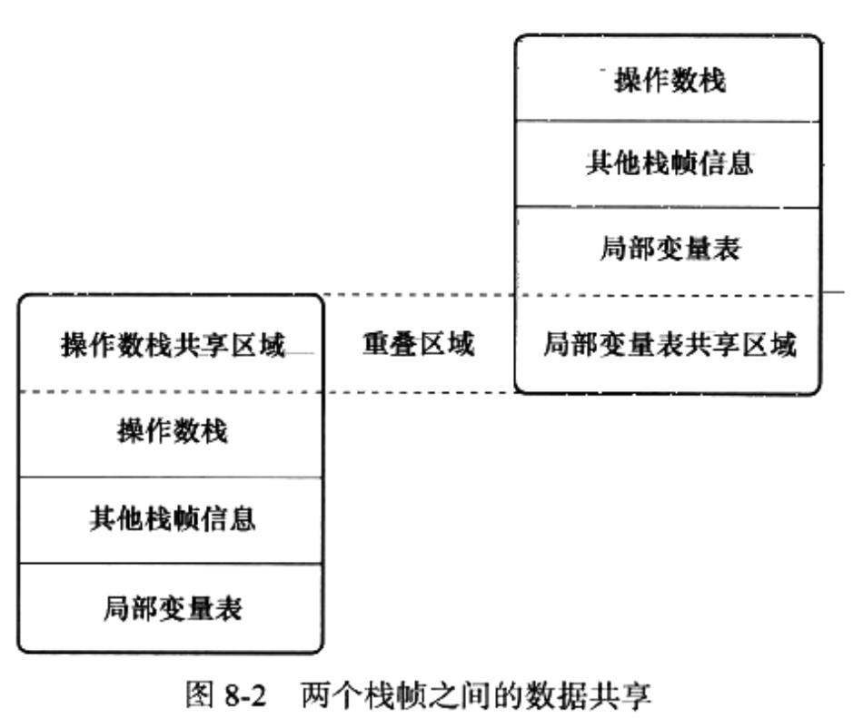
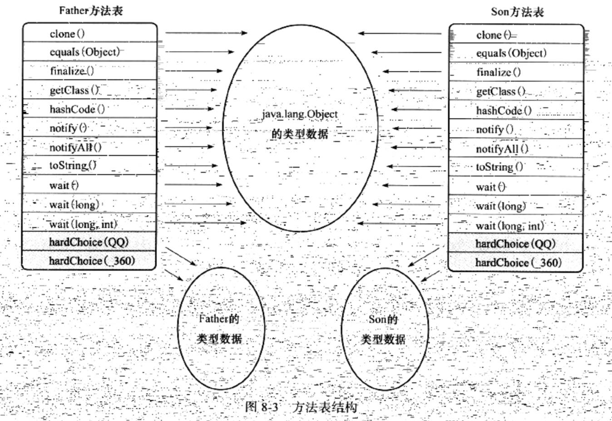
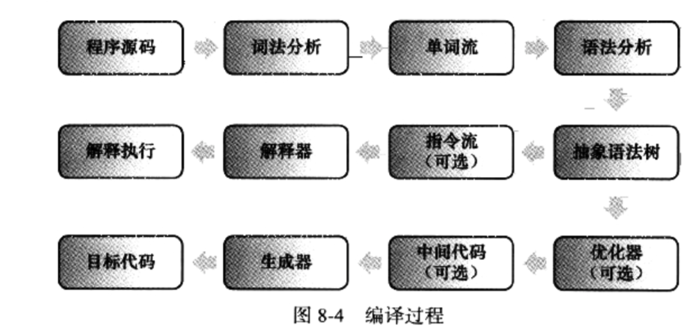
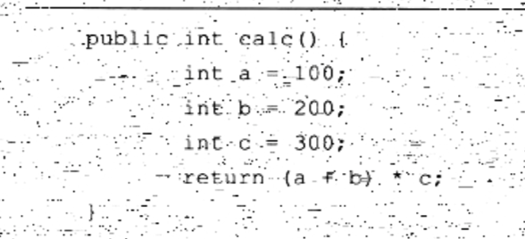
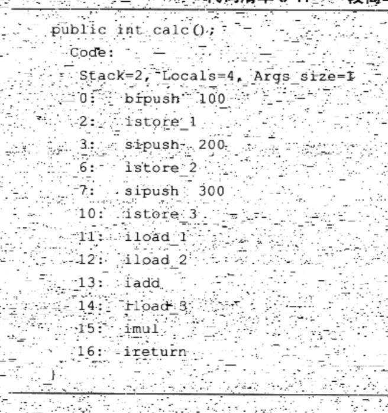
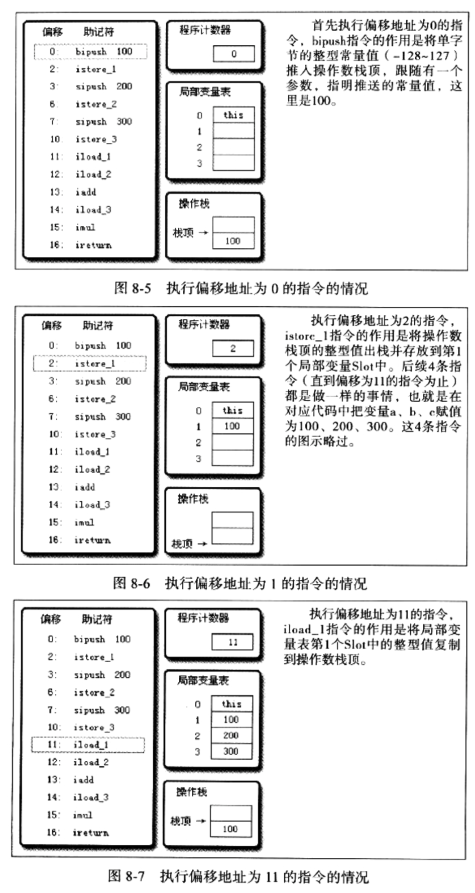
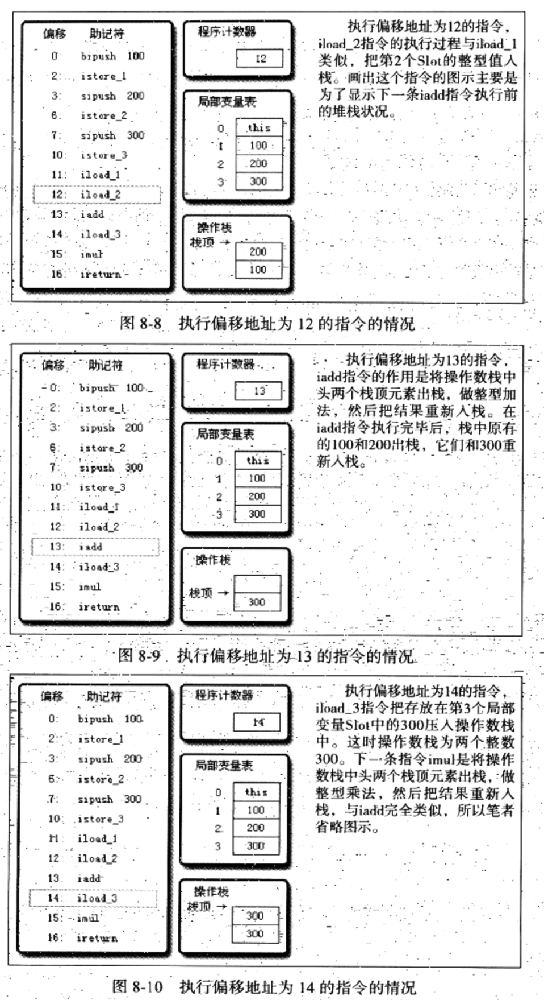
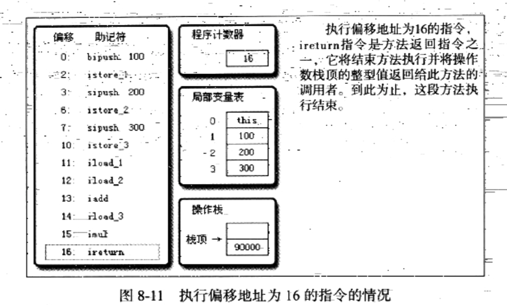

## 字节码执行引擎

> 虚拟机和物理机都具有代码执行能力，但是物理机的执行引擎是直接建立在处理器、硬件、指令集合操作系统层面上的，而虚拟机的执行引擎是由自己实现的。所以虚拟机可以自行指定指令集和执行引擎的结构体系，而且能够执行那些不被硬件直接支持的指令集格式。

> 所有的Java虚拟机的执行引擎从外观看起来是一致的：输入字节码文件，处理过程是字节码解析的等效过程，输出的是执行结果。执行引擎在执行Java代码的时候可能会有**解释执行(通过解释器来执行)**和**编译执行(通过即时编译器产生本地代码执行)**两种选择，也可能同时兼备。

### 1. 运行时栈帧结构

栈帧(Stack Frame)是用于支持虚拟机进行方法调用和方法执行的数据结构，是虚拟机运行时数据区中的虚拟机栈的栈元素。每一个方法从调用开始到执行完成的过程，都对应着一个栈帧在虚拟机栈里面从入栈到出栈的过程。

每一个栈帧包含以下元素：

- 局部变量表
- 操作数栈
- 动态链接
- 方法返回地址
- 额外的附加信息


#### 1.1 局部变量表

变量值的存储空间，由**方法参数和方法内部定义的局部变量**组成，其容量用Slot1作为最小单位。在编译期间，就在方法的Code属性的max_locals数据项中确定了该方法所需要分配的局部变量表的最大容量。由于局部变量表是建立在线程的栈上，是线程的私有数据，因此不存在数据安全问题。在方法执行时，虚拟机通过使用局部变量表完成参数值到参数变量列表的传递过程。**如果是实例方法，那局部变量表第0位索引的Slot存储的是方法所属对象实例的引用，因此在方法内可以通过关键字this来访问到这个隐含的参数**。其余的参数按照参数表顺序排列，参数表分配完毕之后，再根据方法体内定义的变量的顺序和作用域分配。

#### 1.2 操作数栈

后入先出栈，由字节码指令往栈中存数据和取数据，栈中的任何一个元素都是可以任意的Java数据类型。和局部变量类似，操作数栈的最大深度也在编译的时候写入到Code属性的max_stacks数据项中。当一个方法刚开始执行的时候，这个方法的操作数栈是空的，在方法的执行过程中，会有各种字节码指令往操作数中写入和提取内容，也就是出栈/入栈操作。操作数栈中元素的数据类型必须与字节码指令的序列严格匹配2，这由编译器在编译器期间进行验证，同时在类加载过程中的类检验阶段的数据流分析阶段要再次验证。另外我们说Java虚拟机的解释引擎是基于栈的执行引擎，其中的栈指的就是操作数栈
在概念模型中，两个栈帧作为虚拟机栈的元素是完全独立的。但是在大多数虚拟机的实现都会做一些优化处理，令两个栈帧出现一部分重叠。让下面栈帧的部分局部变量表重叠在一起，这样在进行方法调用时就可以功用一部分数据，无需进行额外的参数复制传递。



#### 1.3 动态链接

每个栈帧都包含一个指向运行时常量池中该栈帧所属方法的引用，持有该引用是为了支持方法调用过程中的动态连接。Class文件的常量池中存有大量的符号引用，字节码中的方法调用指令就以常量池中指向方法的符号引用作为参数。这些符号引用一部分会在类加载阶段或者第一次使用的时候转化为直接引用，这种称为**静态解析**。另外一部分将在每一次运行期间转化为直接引用，这部分称为**动态链接**。

#### 1.4 方法返回地址

存放调用调用该方法的pc计数器的值。当一个方法开始之后，只有两种方式可以退出这个方法：1、执行引擎遇到任意一个方法返回的字节码指令，也就是所谓的正常完成出口。2、在方法执行的过程中遇到了异常，并且这个异常没有在方法内进行处理，也就是只要在本方法的异常表中没有搜索到匹配的异常处理器，就会导致方法退出，这种方式成为异常完成出口。正常完成出口和异常完成出口的区别在于：通过异常完成出口退出的不会给他的上层调用者产生任何的返回值。 
无论通过哪种方式退出，在方法退出后都返回到该方法被调用的位置，方法正常退出时，调用者的pc计数器的值作为返回地址，而通过异常退出的，返回地址是要通过异常处理器表来确定，栈帧中一般不会保存这部分信息。本质上，方法的退出就是当前栈帧出栈的过程。

### 2. 方法调用

> 方法调用不等于方法执行。方法调用阶段的唯一任务就是确定被调用方法的版本，不涉及方法的具体运行过程。Java方法调用过程需要在类加载期间，甚至到运行期间才能确定目标方法的直接引用。

#### 2.1 解析

> 在Class文件中，所有方法调用中的目标方法都是常量池中的符号引用，在类加载的解析阶段，会将一部分符号引用转为直接引用。这种解析可以进行的前提是：方法在程序真正运行之前就有一个可确定的调用版本，且这个方法的调用版本在运行期间是不可改变的。调用目标在程序代码写好、编译器进行编译时就必须确定下来，这类方法的调用称为解析。

符合上述特征的有两大类：

- 静态方法：与类型直接关联
- 私有方法：在外部不可访问

主要是以下五条方法调用字节码指令：

- invokestatic：调用静态方法，解析阶段确定唯一方法版本
- invokespecial：调用<init>方法、私有及父类方法，解析阶段确定唯一方法版本
- invokevirtual：调用所有虚方法
- invokeinterface：调用接口方法
- invokedynamic：动态解析出需要调用的方法，然后执行

只要能被`invokestatic`和`invokespecial`指令调用的方法，都可以在解析阶段确定唯一的调用版本。符号这个条件的有：

- 静态方法
- 私有方法
- 实例构造器
- 父类方法

这类方法称为非虚方法。其他方法称为虚方法(除去final方法)。虽然final方法是使用`invokevirtual`指令来调用的，但是它无法被覆盖，也无需对方法接受者进行多态选择，所以是一种非虚方法。

解析调用一定是一个静态过程，在编译期间就完全确定，在类装载的解析阶段就会把涉及的符号引用全部转变为可确定的直接引用，不会延迟到运行期再去完成。但是`分派调用`可能是静态的也可能是动态的。

#### 2.2 分派

这一部分解释了`重载和重写`在Java虚拟机之中是如何实现的。

1. 静态分派：依赖静态类型来定位方法执行版本，发生在编译阶段，典型的为`重载`
2. 动态分配：在运行期间根据实际类型来确定方法执行版本，典型的为`重写`
3. 单分派：根据一个总量对目标方法进行选择
4. 多分派：根据多个总量对目标方法进行选择。

```java
Human man = new Man();
// Human 为变量的静态类型
// Man 为变量的实际类型
// 方法的接受者与方法的参数统称为方法得到宗量
```

##### 2.2.1 静态分派

分析下面一段代码：

```java
public class Test2 {

    abstract  static class Human{}

    static class Man extends Human{}

    static class Woman extends Human{}

    public  void sayHello(Human guy){
        System.out.println("hello, guy!");
    }

    public void sayHello(Man guy){
        System.out.println("Hello, Man");
    }

    public  void sayHello(Woman guy){
        System.out.println("Hello Woman");
    }

    public static void main(String[] args) {

        Human man = new Man();

        Human woman = new Woman();

        Test2 t = new Test2();

        t.sayHello(man);

        t.sayHello(woman);

    }
}
// 运行结果是：
// hello, guy!
// hello, guy!
```

编译器在重载时是通过参数的静态类型而不是实际类型作为判断依据的，且静态类型是编译器已知的。所以在编译阶段，Javac编译器会根据参数的静态类型来决定使用哪个重载版本。

>依赖静态类型来定位方法执行版本的分派动作称为静态分配。静态分配典型应用是方法重载。静态分配发生在编译阶段，因此确定静态分配的动作不是由虚拟机来执行的。

##### 2.2.2 动态分配

动态分配和`重写`有着密切的关联。

如下段代码：

```java
public class Test3 {

    static abstract class Human{
        protected abstract void sayHello();
    }

    static class Man extends Human{

        protected void sayHello() {
            System.out.println("man, say hello.");
        }
    }

    static class Woman extends Human{
        protected void sayHello() {
            System.out.println("women say hello!");
        }
    }

    public static void main(String[] args) {

        Human man  = new Man();
        Woman woman = new Woman();

        man.sayHello();
        woman.sayHello();
        man = new Woman();
        man.sayHello();

    }
}

// 运行结果
//man, say hello.
//women say hello!
//women say hello!
```

通过查看字节码，知道是使用`invokevirtual`指令来调用方法的。`invokevirtual`指令运行时解析过程大致分为以下几个步骤:

- 找到栈顶的第一个元素所指向的对象的实际类型，记为C
- 如果在类型C中找到与和常量中的描述符和简单名称都相符的方法，则进行访问权限校验，通过则返回这个方法的直接引用，查找过程结束；如果不通过，返回异常
- 否则，按照继承关系从下往上一次对C的各个父类进行查找
- 最终没有找到，则抛出异常。

> `invokevirtual`指令第一步是对运行期确定接收者的实际类型，所以可以将符号引用解析到不同的直接引用上。这就是Java方法重写的本质，这种在运行期根据实际类型确定方法执行版本的分派过程称为动态分配。

##### 2.2.3 单分派与多分派

方法的接受者和方法的参数统称为该方法的宗量。根据分派基于多少种宗量可以将分派划分为单分派和多分派两种。

```java
public class Test4 {

    static class QQ{}

    static class _360{}

    public static class Father{

        public void hardChoice(QQ arg){
            System.out.println("father choose qq");
        }

        public void hardChoice(_360 arg){
            System.out.println("father choose 360");
        }

    }


    public static class Son extends Father{
        @Override
        public void hardChoice(QQ arg) {

            System.out.println("son choose qq");
        }

        @Override
        public void hardChoice(_360 arg) {
            System.out.println("son choose 360");
        }
    }

    public static void main(String[] args) {

        Father father = new Father();
        Father son = new Son();
        father.hardChoice(new _360());
        son.hardChoice(new QQ());

    }
}
// 运行结果
// father choose 360
// son choose qq
```

首先看编译阶段编译器的选择过程，静态分配过程。这是选择目标方法的依据有两点:

- 静态类型是Father还是Son
- 方法参数是QQ还是360

最终产物是两条`invokevirtual`指令，参数分别是常量池中指向`Father.hardChoice(360)和Father.hardChoice(QQ)`方法的符号引用。根据两个总量进行选择，所以静态分配为多分派类型。

然后是运行时虚拟机的选择，就是动态分配的过程。执行`invokevirtual`指令时，由于编译期间已经确定目标方法的签名了，所以虚拟机不会关心传递过来的参数，唯一可以影响虚拟机选择的因素只有此方法的接受者的实际类型是Father还是Son，只有一个宗量作为选择，所以动态分配属于单分派类型。

> **总结**：Java是一门静态多分派，动态单分派的语言。

##### 2.2.4 动态分派的实现

动态分派是非常频繁的工作，所以实现都不会真正进行频繁的搜索。可以为类在方法区中建立一个虚方法表，虚方法表存放着各个方法的实际入口地址。如果没有被重写，则和父类相同方法的地址入口相同。若重写则指向子类实现版本的入口。



为了程序实现方便，具有相同签名的方法，在父类和子类的虚方法表中都应该有一样的索引序号，这样当类型变换时，只需要查找方法表，就可以按索引转换出所需的入口地址。

方法表一般在类加载的连接阶段进行初始化，准备了类的变量初始值候，虚拟机会把类的方法表也初始化完毕。

### 3. 基于栈的字节码解释执行引擎



上图是编译的过程。Java语言中，Javac编译器完成了程序代码经过语法分析、语法分析到抽象语法树，再遍历语法树生成线性的字节码指令流的过程。这一部分是在JVM之外进行的，解释器在JVM内部，Java程序的编译时半独立的实现。

#### 3.1 基于栈的指令集与基于寄存器的指令集

Java编译器输出的指令流是一种基于栈的指令集架构，大部分是零地址指令，他们依赖操作数栈进行工作。相对的另外一套常用的指令集架构是基于寄存器的指令集，最典型的是X86的二地址指令集。这些指令依赖寄存器进行工作。

基于栈的指令集主要优点是可移植。寄存器由硬件提供，程序直接依赖硬件寄存器不可避免受到硬件的约束。如8086和ARM体系的CPU。主要缺点是执行速度相对会慢一些。主流的物理机指令集都是寄存器架构。

#### 3.2 执行案例

源代码：



字节码：



执行情况：







