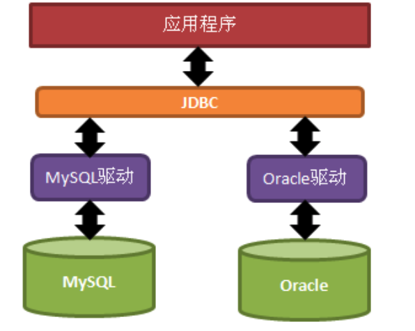
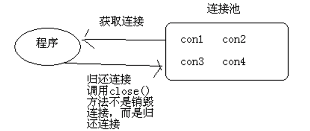

## 1. JDBC

JDBC(Java DataBase connectivity)是用于执行SQL语句的Java API。可以为多种关系数据库提供统一访问。使用Java编写的类和接口，是Java访问数据库的标准和规范。JBDC是借口，驱动是对接口的实现。



## 2. 运行的流程

一般直接使用的流程为：

1. 注册驱动(加载不同类型数据库的驱动类)
2. 获得连接(连接到数据库)
3. 获取语句执行平台
4. 执行sql语句
5. 处理结果
6. 释放资源

如下所示：

```java
public void test1() throws ClassNotFoundException, SQLException {

  Class.forName("com.mysql.jdbc.Driver");
  Connection connection = DriverManager.getConnection(url, username, password);
  Statement statement = connection.createStatement();
  statement.execute("SQL");
  statement.close();
  connection.close();
}
```

但是上面的代码在每次连接数据库的时候都需要写，是非常麻烦的。而且获取数据库连接是比较耗费资源的。于是有连接池技术的产生。

## 3. 数据库连接池

创建连接、释放连接都是非常消耗资源的操作。所以可以添加一个缓冲的机制，利用一个连接池。用户从连接池中获取和归还连接。在连接池初始化的时候可以和数据库创建一些连接，然后在用户关闭连接的时候，并不是真正的关闭，而是归还给连接池。相当于让连接池统一管理连接。



### 3.1 规范

Java为数据库连接池提供了一个统一的接口`javax.sql.DataSource`。不同连接池需要实现这个接口。其中比较常用的两个`DBCP`和`C3P0`

在`DataSource`接口中定义了一个方法`getConnction`。

## 4. C3P0

使用C3P0需要使用MySQL的驱动以及c3p0的jar包

其中c3p0需要一个配置文件进行配置。直接在类路径在创建文件`c3p0-config.xml`，然后按照下面的实例配置即可。

```xml
<?xml version="1.0" encoding="UTF-8"?>
<c3p0-config>  
    <!-- This is default config! 默认配置文件，在创建数据源没有指定的时候使用的配置-->    
    <default-config>  
        <property name="driverClass">com.mysql.jdbc.Driver</property>
        <property name="jdbcUrl">jdbc:mysql://localhost:3306/contacts?characterEncoding=utf8</property>
        <property name="user">root</property>
        <property name="password">123456</property>
        
        <property name="acquireIncrement">5</property>
        <property name="initialPoolSize">10</property>
        <property name="minPoolSize">5</property>
        <property name="maxPoolSize">20</property> 

        <property name="maxStatements">0</property>
        <property name="maxStatementsPerConnection">5</property> 
    </default-config>  
  
    <!-- This is my config for mysql  自定义的配置，在创建数据源的时候通过指定名称来使用该配置-->   
    <named-config name="mysql">  
        <property name="driverClass">com.mysql.jdbc.Driver</property>  
        <property name="jdbcUrl">jdbc:mysql://localhost:3306/test</property>  
        <property name="user">root</property>  
        <property name="password">123456</property>  
        <property name="initialPoolSize">10</property>  
        <property name="maxIdleTime">30</property>  
        <property name="maxPoolSize">100</property>  
        <property name="minPoolSize">10</property>  
        <property name="maxStatements">200</property>  
    </named-config>
</c3p0-config>
```

创建完上述配置文件之后，可以通过数据源获取连接，然后运行SQL语句。

```java
public class C3p0 {

    private static ComboPooledDataSource comboPooledDataSource = null;

    private static final String INSERT_SQL = "INSERT INTO test1(name, age, score) VALUES(?, ?, ?)";

    static {
        comboPooledDataSource = new ComboPooledDataSource();
      	// comboPooledDataSource = new ComboPooledDataSource("mysql");
      // 有选择的使用不同的配置
    }

    @Test
    public void test1() throws SQLException {

        Connection connection = comboPooledDataSource.getConnection();
        PreparedStatement preparedStatement = connection.prepareStatement(INSERT_SQL);
        preparedStatement.setString(1, "wangdaoqi");
        preparedStatement.setInt(2, 23);
        preparedStatement.setInt(3, 99);
        preparedStatement.execute();
        preparedStatement.close();
        connection.close();
    }

    @Test
    public void test2() throws SQLException {

        comboPooledDataSource.setUser("wangdh");
        Connection connection = comboPooledDataSource.getConnection();
        PreparedStatement preparedStatement = connection.prepareStatement(INSERT_SQL);
        preparedStatement.setString(1, "wangyou");
        preparedStatement.setInt(2, 47);
        preparedStatement.setInt(3, 60);
        preparedStatement.execute();
        preparedStatement.close();
        connection.close();
    }
}
```

其中如果不使用配置文件的情况下，可以通过使用连接池的`set`方法来设置各个参数。


