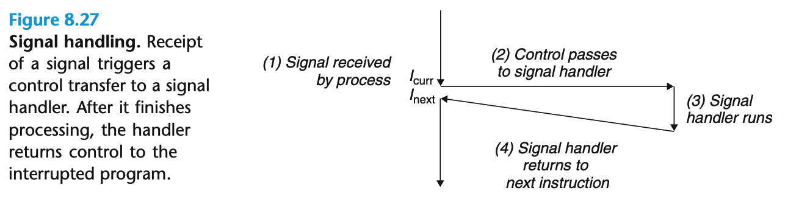

### 1.信号

> Linux信号是一种高层的软件形式的异常，允许进程和内核中断其他进程。
>
> 一个信号就是一条小消息，它通知进程系统中发生了一个某种类型的事件。

底层的硬件异常是由内核异常处理程序处理的，正常情况下对用户而言是不可见的。信号提供一种机制来通知用户进程发生了这些异常。

- 进程除0，内核发送一个`SIGFPE`信号
- 进程执行非法指令，内核发送一个`SIGILL`信号
- 进程非法内存引用，内核发送一个`SIGSEGV`信号
- 进程在前台运行，按下`Ctrl + C`，则内核发送一个`SIGINT`信号给前台进程组中的每个进程
- 子进程终止时，内核发送一个`SIGCHLD`信号给父进程
- 一个进程可以通过`kill`指令向其他进程发送信号

传送信号的过程：

1. 发送信号。**内核**通过更新目的进程上下文中的某个状态，发送一个信号给目的进程。
   - 内核检测到一个事件，如除零错误、子进程终止
   - 一个进程调用了kill函数，显示要求内核发送一个信号给目的进程
2. 接受信号。目的进程**被内核强迫**以某种方式对信号的发送做出反应时，就接受了信号。进程可以忽略信号、终止或执行一个称为**信号处理程序**的**用户层函数**捕获这个信号。




发出但是没有被接受的信号是待处理信号。一个待处理信号最多只被接收一次，**内核**为每个进程在`pending`位向量中维护着待处理信号集合，在`blocker`位向量中维护着被阻塞的信号集合。传送一个类型为`k`的信号，北河置为`pending`中的第`k`位，接受了一个类型为`k`的信号，内核清楚第`k`位。如果一个进程已经有了一个类型为`k`的待处理信号，那么其他发送的类型为`k`的信号不会排队等待，而是被简单的丢弃。

### 2 发送信号

1. 使用`kill`命令
2. 使用键盘。`Ctrl+C/Ctrl+Z`
3. 使用`kill`函数，`alarm`函数等

### 3. 接受信号

当内核把进程`p`**从内核模式切换到用户模式时**(系统调用返回或完成一次上下文切换)，内核会检查进程`p`的未被阻塞的待处理信号集合，`pending & ~blocked`如果为空，则将控制传递到`p`的逻辑控制流的下一条指令。如果非空，则选择集合中的某个信号`k`（通常是最小的），强制`p`接受`k`。完成了接收行为，控制传递回`p`的逻辑控制流中的下一条指令。每个信号都有一个默认的行为：

1. 进程终止
2. 进程终止并转储内存
3. 进程停止(挂起)直到被`SIGCONT`信号重启
4. 进程忽略该信号

进程可以使用`signal`函数修改和信号相关联的默认行为，但是`SIGSTOP`和`SIGKILL`这两个信号的默认行为不可被修改。

信号处理程序会被其他信号处理程序中断。如图。


```c
#include <signal.h>
#include "snooze.c"

void handler(int sig) { // 信号处理函数
    printf("receive SIGINT");
    return ;
}

int main(int argc, char *argv[]) {

   if (signal(SIGINT, handler) == SIG_ERR) // 注册
       printf("signal error\n");
   sleep(10);
   return 0;
}
```

每个进程可以调用函数来阻塞和解除阻塞信号。


#### 参考文献

[信号机制分析](https://blog.csdn.net/u012199908/article/details/79274946)

[文献2](https://www.cnblogs.com/hoys/archive/2012/08/19/2646377.html)

[文献3](https://www.jianshu.com/p/f445bfeea40a)

[进程间通信1](https://www.jianshu.com/p/5788fb2345ce)

[进程间通信2](https://www.jianshu.com/p/c1015f5ffa74)

