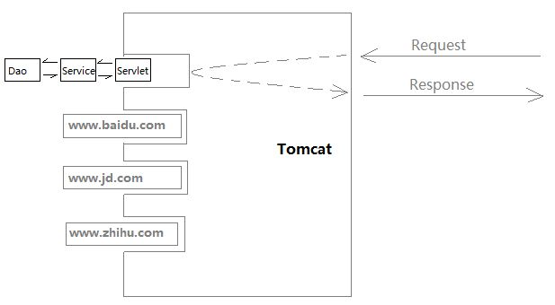
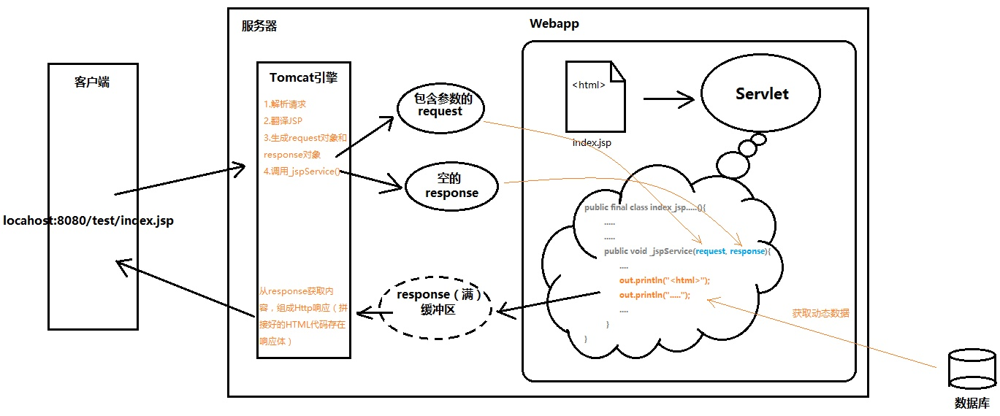

## 1. Servlet

Servlet(Server Applet)就是就是一个接口，`Interface`，实现了这个接口中的方法可以看做服务器端的小程序。定义了服务器端小程序需要实现的五个方法。但是光有一个类，服务器并不知道怎么去访问它，所以还需要将这个类放到容器中，如`tomcat`。然后给每个`servlet`类配置一个访问路径，这个时候通过路径，tomcat就能够加载相对应的类，然后调用其中的相关方法。



其中一共包含如下的几个方法：

- init(ServletConfig):void 在创建实例的时候运行初始化方法
- getServletCOnfig():ServletConfig 
- service(ServletRequest, ServletResponse) 在接收到请求之后的逻辑处理
- getServletInfo():String 
- destroy():void  在实例被销毁之后的处理

**说明：**

在一个项目中，一个`Servlet`小程序只会有一个实例，也就是`init`方法只会调用一次。

Servlet内部的代码都是业务逻辑，不包含底层的链接解析，屏蔽了大量底层的细节。只需要实现其中的抽象方法即可。

Tomca为Servlet传入了三个参数`ServletConfig/ServletRequest/ServletResponse`

### 1.1 ServletConfig

对象封装了Servlet的配置信息，内部需要的时候可以通过其获取

### 1.2 ServletRequest

封装了请求的相关信息，可以通过一些方法直接获取。

### 1.3 ServletResponse

Tomcat创建一个空的ServletResponse对象，传递给`service`方法，在方法内部可以调用方法来向其内部的缓冲区写内容，Tomcat在Servlet写完之后，将其中的内容作为响应发送给请求端。



## 2. GenericServlet

Servlet中的`service`方法是一个控方法，直接继承的话，需要自己判断请求类型，然后做出不同的操作。写起来还是比较麻烦的。GenericServlet是一个继承Servlet的类，是一个抽象类，对Servlet中的方法进行了进一步封装。

下面是部分的修改地方：

```Java
public void init(ServletConfig config) throws ServletException {
        this.config = config;
        this.init();
    }

public void init() throws ServletException {
    }
/*
1. 提升了config的作用域，便于其他方法使用
2. 子类可以重写空的init方法，实现自己的初始化，同时被上一个初始化对象调用
*/
```

但是`service`方法没有被实现，所以还是需要自己实现复杂的逻辑。

## 3. HttpServlet

HttpServlet是一个继承GenericServlet的类。GenericServlet是一个抽象方法，但是HttpServlet不是一个抽象方法，其已经实现了`service`方法，如下所示：

```java
protected void service(HttpServletRequest req, HttpServletResponse resp) throws ServletException, IOException {
        String method = req.getMethod();
        long lastModified;
        if (method.equals("GET")) {
            lastModified = this.getLastModified(req);
            if (lastModified == -1L) {
                this.doGet(req, resp);
            } else {
                long ifModifiedSince;
                try {
                    ifModifiedSince = req.getDateHeader("If-Modified-Since");
                } catch (IllegalArgumentException var9) {
                    ifModifiedSince = -1L;
                }

                if (ifModifiedSince < lastModified / 1000L * 1000L) {
                    this.maybeSetLastModified(resp, lastModified);
                    this.doGet(req, resp);
                } else {
                    resp.setStatus(304);
                }
            }
        } else if (method.equals("HEAD")) {
            lastModified = this.getLastModified(req);
            this.maybeSetLastModified(resp, lastModified);
            this.doHead(req, resp);
        } else if (method.equals("POST")) {
            this.doPost(req, resp);
        } else if (method.equals("PUT")) {
            this.doPut(req, resp);
        } else if (method.equals("DELETE")) {
            this.doDelete(req, resp);
        } else if (method.equals("OPTIONS")) {
            this.doOptions(req, resp);
        } else if (method.equals("TRACE")) {
            this.doTrace(req, resp);
        } else {
            String errMsg = lStrings.getString("http.method_not_implemented");
            Object[] errArgs = new Object[]{method};
            errMsg = MessageFormat.format(errMsg, errArgs);
            resp.sendError(501, errMsg);
        }
    }
```

可以看到`service`方法内部对各种请求方式进行了判断并转发，所以要想实现相对应的功能，不需要自己写`service`方法，只需要实现`doXXX`方法即可。相当于起到一个`controller`的作用。

在各种`doXXX`方法内部，HttpServlet也进行了实现，下面是一个例子：

```java
protected void doGet(HttpServletRequest req, HttpServletResponse resp) throws ServletException, IOException {
        String protocol = req.getProtocol();
        String msg = lStrings.getString("http.method_get_not_supported");
        if (protocol.endsWith("1.1")) {
            resp.sendError(405, msg);
        } else {
            resp.sendError(400, msg);
        }
    }
```

可以看到默认的上述方法是直接报错，如果自己的了继承了HttpServlet，没有重写上述的方法，调用的话就会直接报错。

有了serivce方法，所以只需要重写对应的`doXXX`方法即可。

## 4. 总结

要想开发一个Servlet小程序，只需要继承`HttpServlet`，然后重写对应的`doXXX`方法即可。

上述模式利用了`模板的设计模式`：父类把能写的逻辑都写完，把不确定的业务代码抽成一个方法，调用它。当子类重写该方法，整个业务代码就活了。
