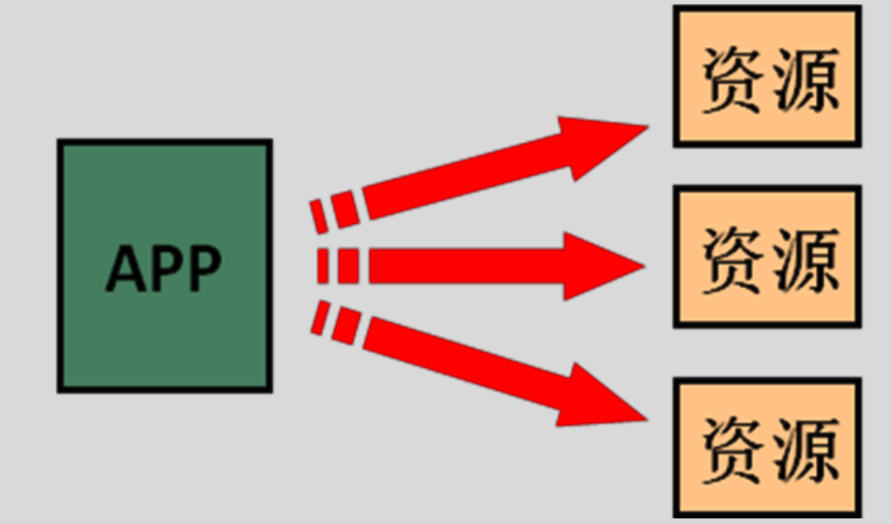
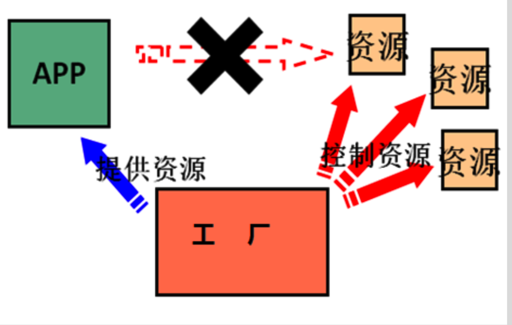
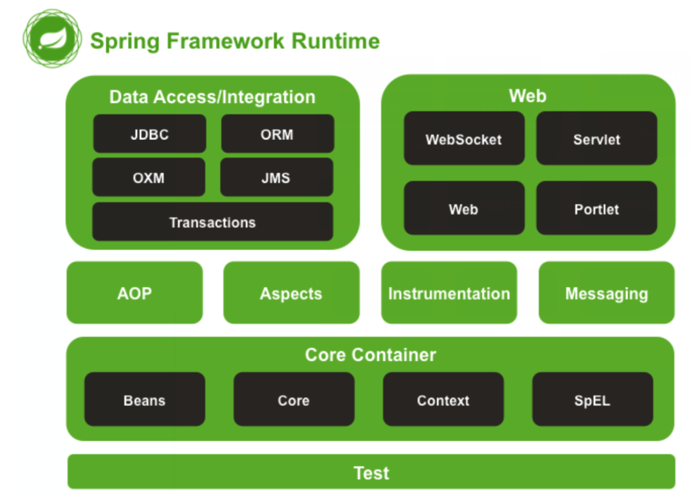

## 1. 程序间的依赖关系

```java
public class JdbcDemo1 {
    public static void main(String[] args) throws  Exception{
        //1.注册驱动
//        DriverManager.registerDriver(new com.mysql.jdbc.Driver());
        Class.forName("com.mysql.jdbc.Driver");

        //2.获取连接
        Connection conn = DriverManager.getConnection("jdbc:mysql://localhost:3306/eesy","root","1234");
        //3.获取操作数据库的预处理对象
        PreparedStatement pstm = conn.prepareStatement("select * from account");
        //4.执行SQL，得到结果集
        ResultSet rs = pstm.executeQuery();
        //5.遍历结果集
        while(rs.next()){
            System.out.println(rs.getString("name"));
        }
        //6.释放资源
        rs.close();
        pstm.close();
        conn.close();
    }
}
```

上述是进行数据库操作的一段代码。可见当前类中的`main`函数中直接使用new来创建对象，这种方式就代表着类之间的耦合。如果需要替换为其他实现的类的话，需要对源码进行大量的修改。虽然可以通过接口保证实现类具有相同的方法，但是这种直接在程序之间的耦合还是非常严重的。

### 1.1 程序间的耦合

耦合指程序间的依赖关系，包括：

- 类之间的依赖
- 方法间的依赖

解耦是指降低程序之间的依赖关系，不可能解除依赖关系。

在实际开发中，应该做到**编译期间不依赖，运行时才依赖**。

解耦的思路：

1. 通过发射来创建对象，避免使用`new`关键字创建
2. 通过读取配置文件来获取要创的对象全限定类名

如上述代码中的`Class.forName("com.mysql.jdbc.Driver")`;

## 2.  工厂方法

在一般的开发中，为了便于合作开发，会进行分层设计。如`service, dao`等分层设计。一般是上层的类有下层的类作为其成员对象，然后调用其提供的方法。或者在上层类中的方法中`new`一个下层的类。



这种方法的弊端主要在于：

1. 没有实现程序之间的解耦，程序之间的耦合是非常严重的。
2. 如果定义了多个上层的类，那么每一个上层的类中都会定义一套下层的类。这是`多例模式`。但是有时候只需要`单例模式`,比如只需要使用其中提供的方法等。
3. 应用能够直接访问到资源，不利于维护。

为了解决上面的问题，可以使用`工厂模式`来进行设计。具体如下图所示：



具体实现代码如下：

```java
import java.io.InputStream;
import java.util.Enumeration;
import java.util.HashMap;
import java.util.Map;
import java.util.Properties;

/**
 * 一个创建Bean对象的工厂
 *
 * Bean：在计算机英语中，有可重用组件的含义。
 * JavaBean：用java语言编写的可重用组件。
 *      javabean >  实体类
 *
 *   它就是创建我们的service和dao对象的。
 *
 *   第一个：需要一个配置文件来配置我们的service和dao
 *           配置的内容：唯一标识=全限定类名（key=value)
 *   第二个：通过读取配置文件中配置的内容，反射创建对象
 *
 *   我的配置文件可以是xml也可以是properties
 */
public class BeanFactory {
    //定义一个Properties对象
    private static Properties props;

    //定义一个Map,用于存放我们要创建的对象。我们把它称之为容器
    private static Map<String,Object> beans;

    //使用静态代码块为Properties对象赋值
    static {
        try {
            //实例化对象
            props = new Properties();
            //获取properties文件的流对象
            InputStream in = BeanFactory.class.getClassLoader().getResourceAsStream("bean.properties");
            props.load(in);
            //实例化容器
            beans = new HashMap<String,Object>();
            //取出配置文件中所有的Key
            Enumeration keys = props.keys();
            //遍历枚举
            while (keys.hasMoreElements()){
                //取出每个Key
                String key = keys.nextElement().toString();
                //根据key获取value
                String beanPath = props.getProperty(key);
                //反射创建对象
                Object value = Class.forName(beanPath).newInstance();
                //把key和value存入容器中
                beans.put(key,value);
            }
        }catch(Exception e){
            throw new ExceptionInInitializerError("初始化properties失败！");
        }
    }

    /**
     * 根据bean的名称获取对象
     * @param beanName
     * @return
     */
    public static Object getBean(String beanName){
        return beans.get(beanName);
    }
}
```

在程序的其他部分，只需要调用`BeanFactory`类的静态方法`getBean()`，传入类的key就可以得到一个类的实例。

上述工厂类在加载的过程中就通过发射的机制将配置文件中的类都创建了一个实例，并存放到了一个`Map`中，我们称之为容器。然后在开放一个接口，其他代码需要创建类不能够之间`new`，而是向工厂申请。这样即解决了依赖关系，而且方便管理，是单例模式，避免内存开销。如果需要修改类的实现，则不需要修改源代码，只需要修改配置文件，将对应的类路径替换为新的，保证这两个类实现了同一个接口即可，非常方便后续维护。

**这种被动接收的方式获取对象的思想就是控制反转(Inversion of Control)，它是 spring 框架的核心之一。**

## 3. Spring 

Spring 是分层的 Java SE/EE 应用 full-stack 轻量级开源框架，以 IoC(Inverse Of Control:反转控制)和 AOP(Aspect Oriented Programming:面向切面编程)为内核。

其体系结构如下：



