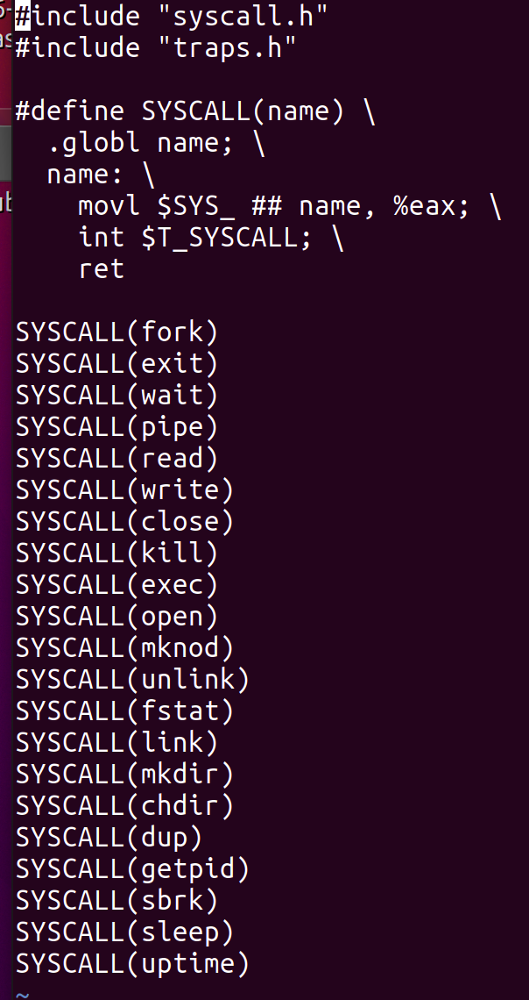
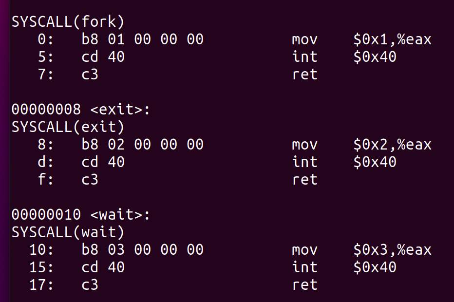
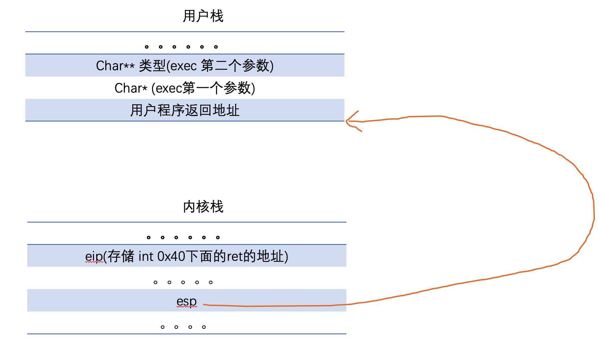
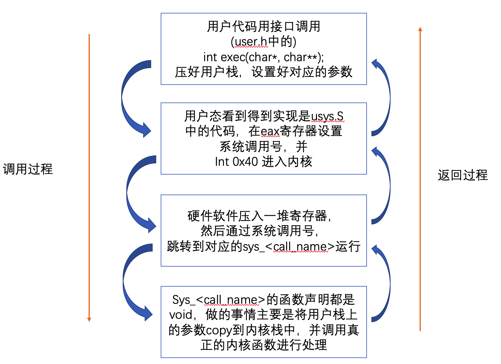

### xv6系统调用全貌

[上一篇文章](https://wangdh15.github.io/2020/12/22/xv6%E6%BA%90%E7%A0%81%E5%89%96%E6%9E%90%E4%B9%8B%E8%BF%9B%E7%A8%8B%E3%80%81%E7%B3%BB%E7%BB%9F%E8%B0%83%E7%94%A8/#more)总结了在发生系统调用之后，从用户态到内核态切换的过程中，内核栈是如何保存上下文以及记录用户栈地址的。这篇文章将范文放的更宽一些，对于一个完整的系统调用，操作的整个流程是如何的。

首先在文件[user.h](https://github.com/mit-pdos/xv6-public/blob/master/user.h)中存储了提供的系统调用，以及一些库函数，我们以`exec`这个系统调用为例，考察在用户态执行的整个流程。

翻遍了整个文件，发现并没有对这个函数的C定义，而且这里只是给出了函数签名，相当于是给出了函数调用栈的协议，你调用我需要把栈设置成什么样子，我处理完了之后返回值会给你什么而已。所以这个函数的具体实现，有可能是汇编等其它形式。

最终，可以在文件[usys.pl](https://github.com/mit-pdos/xv6-riscv/blob/riscv/user/usys.pl)中发现如下内容。

```c
#!/usr/bin/perl -w

# Generate usys.S, the stubs for syscalls.

print "# generated by usys.pl - do not edit\n";

print "#include \"kernel/syscall.h\"\n";

sub entry {
    my $name = shift;
    print ".global $name\n";
    print "${name}:\n";
    print " li a7, SYS_${name}\n";
    print " ecall\n";
    print " ret\n";
}
	
entry("fork");
entry("exit");
entry("wait");
entry("pipe");
entry("read");
entry("write");
entry("close");
entry("kill");
entry("exec");
entry("open");
entry("mknod");
entry("unlink");
entry("fstat");
entry("link");
entry("mkdir");
entry("chdir");
entry("dup");
entry("getpid");
entry("sbrk");
entry("sleep");
entry("uptime");
```

这个文件会生成`usys.S`文件，`make`之后，查看`usys.S`文件，其中的内容如下：



可以看到，这个文件就是定义了一个宏，以及对于每个系统调用，都展开一段代码。

这段代码不难看出，对于每个用户的系统调用，生成了几段汇编，比如对于`fork`生成的就是

```assembly
.globl fork;
fork:
	movl $SYS_fork, %eax;
	int $T_SYSCALL;
	ret
```

上面的`SYS_fork`和`T_SYSCALL`也是两个宏定义，位于[syscall.h](https://github.com/mit-pdos/xv6-public/blob/master/syscall.h)和[traps.h](https://github.com/mit-pdos/xv6-public/blob/master/traps.h)，分别代表系统调用号以及中断号。其中系统调用为`64`,对应的16进制为`0x40`。所以上面的代码就可以写成如下形式：

```assembly
.globl fork;
fork:
	movl $1, %eax;
	int 0x40;
	ret
```

通过对`usys.o`查看反汇编，可以发现确实是对于每个系统调用，都生成了如下的代码。



这些就相当于用户态中对于各个系统调用的定义，它就做了两个操作，将系统调用号放入`eax`寄存器中，然后执行`int 0x40`陷入内核。

执行完`int 0x40`之后，就到了[上篇文章](https://wangdh15.github.io/2020/12/22/xv6%E6%BA%90%E7%A0%81%E5%89%96%E6%9E%90%E4%B9%8B%E8%BF%9B%E7%A8%8B%E3%80%81%E7%B3%BB%E7%BB%9F%E8%B0%83%E7%94%A8/#more)分析的，CPU将一些寄存器内核栈之后，开始从`vector64`的地方开始执行。这里就不再赘述。所以这个时候，用户栈应该是下面的样子（**int 0x40下面一条ret指令的地址被压入了了内核栈中**）：



接下来就是[上篇文章](https://wangdh15.github.io/2020/12/22/xv6%E6%BA%90%E7%A0%81%E5%89%96%E6%9E%90%E4%B9%8B%E8%BF%9B%E7%A8%8B%E3%80%81%E7%B3%BB%E7%BB%9F%E8%B0%83%E7%94%A8/#more)写的一顿跳转操作，最终会执行`sys_<syscall name>`这个函数。对于`exec`而言，也即是`sys_exec`这个函数。在文件[sysfile.c](https://github.com/mit-pdos/xv6-public/blob/master/sysfile.c)中定义了`sys_exec`。如下所示。(其它的实现的大致过程也类似)

```c
int
sys_exec(void)
{
  char *path, *argv[MAXARG];
  int i;
  uint uargv, uarg;

  if(argstr(0, &path) < 0 || argint(1, (int*)&uargv) < 0){
    return -1;
  }
  memset(argv, 0, sizeof(argv));
  for(i=0;; i++){  
    if(i >= NELEM(argv))
      return -1;
    if(fetchint(uargv+4*i, (int*)&uarg) < 0)
      return -1;
    if(uarg == 0){
      argv[i] = 0;
      break;
    }
    if(fetchstr(uarg, &argv[i]) < 0)
      return -1;
  }
  return exec(path, argv);
}
```

可以看到，由于所有诸如`sys_<syscall>`这种函数参数都是`void`类型的，但是内核的真正的处理代码却是需要参数的，比如`exec`需要可执行文件的路径以及参数。这些内容根据上面的分析，是存在用户栈上的。所以`sys_exec`的功能主要就是将用户栈上的参数，拉取到内核栈中，放好参数之后，再调用内核具体的实现函数！

可以看到函数中定义了`path`和`argv`两个变量。首先调用`argstr`和`argint`来获取一些信息放到`path`和`uargv`中。在文件[syscall.c](https://github.com/mit-pdos/xv6-public/blob/master/syscall.c)文件中可以看到这两个函数的定义。

```c
// Fetch the nth 32-bit system call argument.
int
argint(int n, int *ip)
{
  return fetchint((myproc()->tf->esp) + 4 + 4*n, ip);  // 刚好对应用户栈顶的第n个参数的地方。
}

// Fetch the nth word-sized system call argument as a string pointer.
// Check that the pointer is valid and the string is nul-terminated.
// (There is no shared writable memory, so the string can't change
// between this check and being used by the kernel.)
int
argstr(int n, char **pp)
{
  int addr;
  if(argint(n, &addr) < 0)
    return -1;
  return fetchstr(addr, pp);
}

// Fetch the nul-terminated string at addr from the current process.
// Doesn't actually copy the string - just sets *pp to point at it.
// Returns length of string, not including nul.
int
fetchstr(uint addr, char **pp)
{
  char *s, *ep;
  struct proc *curproc = myproc();

  if(addr >= curproc->sz)
    return -1;
  *pp = (char*)addr;
  ep = (char*)curproc->sz;
  for(s = *pp; s < ep; s++){
    if(*s == 0)
      return s - *pp;
  }
  return -1;
}

// User code makes a system call with INT T_SYSCALL.
// System call number in %eax.
// Arguments on the stack, from the user call to the C
// library system call function. The saved user %esp points
// to a saved program counter, and then the first argument.

// Fetch the int at addr from the current process.
int
fetchint(uint addr, int *ip)
{
  struct proc *curproc = myproc();

  if(addr >= curproc->sz || addr+4 > curproc->sz)
    return -1;
  *ip = *(int*)(addr);
  return 0;
}
```

可以看到，`argstr`首先获取用户栈0号参数，并存放到`path`里面，也就是`path`指向了第一个参数的字符串。

然后`argv`数组中每个元素指向了可执行程序的每个参数。(字符串不变，就是把各个指针给拷贝到了内核态中)。

然后调用了真正的`exec`函数。内核中真正开始干事的是文件`exec.c`中的`exec`函数，跑在内核栈上。

#### 总结整个流程

下面是调用`exec`的整个流程。



至此，系统调用的整个流程就都走通了。