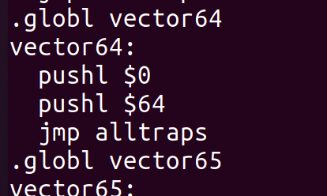
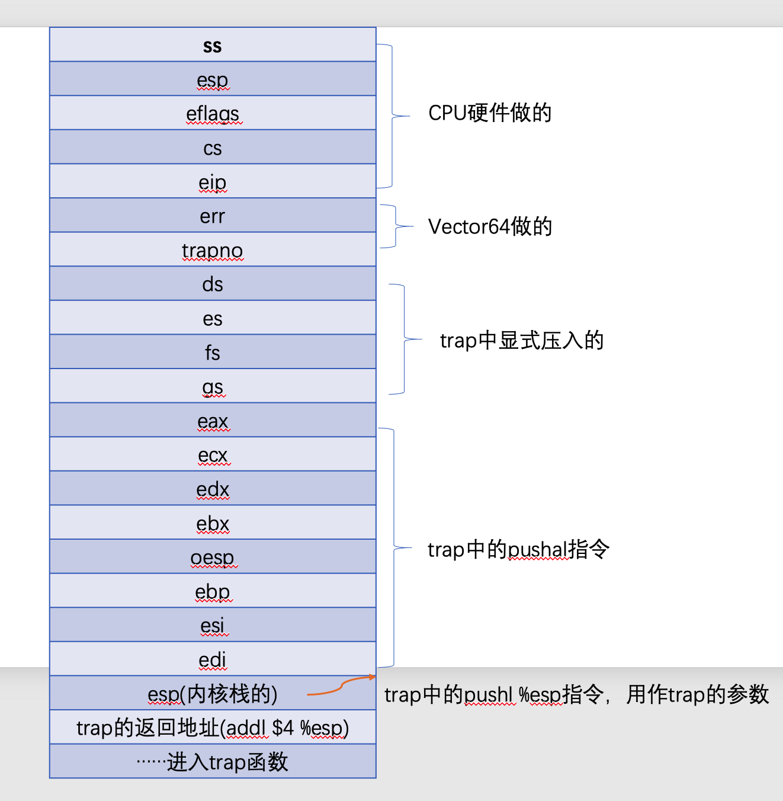

## XV6系统调用的过程

首先第一个文件是`xv6`为用户提供了那些系统调用，通过阅读手册和源码，可以在文件[user.h](https://github.com/mit-pdos/xv6-public/blob/master/user.h)中发现提供了以下系统调用。

```c
// system calls
int fork(void);
int exit(void) __attribute__((noreturn));
int wait(void);
int pipe(int*);
int write(int, const void*, int);
int read(int, void*, int);
int close(int);
int kill(int);
int exec(char*, char**);
int open(const char*, int);
int mknod(const char*, short, short);
int unlink(const char*);
int fstat(int fd, struct stat*);
int link(const char*, const char*);
int mkdir(const char*);
int chdir(const char*);
int dup(int);
int getpid(void);
char* sbrk(int);
int sleep(int);
int uptime(void);
```

同时在文件[traps.h](https://github.com/mit-pdos/xv6-public/blob/master/traps.h)中可以看到，为了标记每种中断或者陷入的入口，对各种类型进行了编号：

```c++
// Processor-defined:
#define T_DIVIDE         0      // divide error
#define T_DEBUG          1      // debug exception
#define T_NMI            2      // non-maskable interrupt
#define T_BRKPT          3      // breakpoint
#define T_OFLOW          4      // overflow
#define T_BOUND          5      // bounds check
#define T_ILLOP          6      // illegal opcode
#define T_DEVICE         7      // device not available
#define T_DBLFLT         8      // double fault
// #define T_COPROC      9      // reserved (not used since 486)
#define T_TSS           10      // invalid task switch segment
#define T_SEGNP         11      // segment not present
#define T_STACK         12      // stack exception
#define T_GPFLT         13      // general protection fault
#define T_PGFLT         14      // page fault
// #define T_RES        15      // reserved
#define T_FPERR         16      // floating point error
#define T_ALIGN         17      // aligment check
#define T_MCHK          18      // machine check
#define T_SIMDERR       19      // SIMD floating point error

// These are arbitrarily chosen, but with care not to overlap
// processor defined exceptions or interrupt vectors.
#define T_SYSCALL       64      // system call
#define T_DEFAULT      500      // catchall

#define T_IRQ0          32      // IRQ 0 corresponds to int T_IRQ

#define IRQ_TIMER        0
#define IRQ_KBD          1
#define IRQ_COM1         4
#define IRQ_IDE         14
#define IRQ_ERROR       19
#define IRQ_SPURIOUS    31
```

在其中有一些是处理器规定的，在系统调用这个地方，我们可以看到为其分配的编号为64。所以可以推断，在调用`int 0x40`这个指令之前，用户程序会将`%eax`寄存器置为64。

然后观察从用户态到内核态的这个过程。当发生中断的时候，根据X86手册，CPU会根据`TSS`拿到当前运行的进程的内核栈基址，并将一部分寄存器压入栈中。根据[x86.h](https://github.com/mit-pdos/xv6-public/blob/master/x86.h)这个文件的关于trap之后，内核栈的结构，可以得到

```c
//PAGEBREAK: 36
// Layout of the trap frame built on the stack by the
// hardware and by trapasm.S, and passed to trap().
struct trapframe {
  // registers as pushed by pusha
  uint edi;
  uint esi;
  uint ebp;
  uint oesp;      // useless & ignored
  uint ebx;
  uint edx;
  uint ecx;
  uint eax;

  // rest of trap frame
  ushort gs;
  ushort padding1;
  ushort fs;
  ushort padding2;
  ushort es;
  ushort padding3;
  ushort ds;
  ushort padding4;
  uint trapno;

  // below here defined by x86 hardware
  uint err;
  uint eip;
  ushort cs;
  ushort padding5;
  uint eflags;

  // below here only when crossing rings, such as from user to kernel
  uint esp;
  ushort ss;
  ushort padding6;
};
```

首先CPU会将如下的寄存器按序压入内核栈中：

```txt
ss
esp
eflags
cs
eip
```

这三个寄存器被压入栈中之后，会跳转到`vector64`这个指令。通过对源码`make`之后，在得到的`vectors.S`中可以找到对应的汇编代码：



可以看到首先将`0`压入栈中，这对应上面的错误号errorno，然后将64压入栈中，对应`trapno`。然后跳转到`alltraps`进行执行。下面是[trapasm.S](https://github.com/mit-pdos/xv6-public/blob/master/trapasm.S)的代码。

```c
  # vectors.S sends all traps here.
.globl alltraps
alltraps:
  # Build trap frame.
  pushl %ds
  pushl %es
  pushl %fs
  pushl %gs
  pushal
  
  # Set up data segments.
  movw $(SEG_KDATA<<3), %ax
  movw %ax, %ds
  movw %ax, %es

  # Call trap(tf), where tf=%esp
  pushl %esp
  call trap
  addl $4, %esp

  # Return falls through to trapret...
.globl trapret
trapret:
  popal
  popl %gs
  popl %fs
  popl %es
  popl %ds
  addl $0x8, %esp  # trapno and errcode
  iret
```

可以看到首先会将ds, es, fs, gs压入栈中，调用`pushal`这个指令，这个指令会将`  edi esi ebp oesp ebx edx ecx eax`压入栈中， 然后将当前的栈顶指针压入栈中，并调用`trap`这个函数，所有栈顶指针是`trap`函数的参数。下面是[trap.c](https://github.com/mit-pdos/xv6-public/blob/master/trap.c)的代码

```c
//PAGEBREAK: 41
void
trap(struct trapframe *tf)
{
  if(tf->trapno == T_SYSCALL){
    if(myproc()->killed)
      exit();
    myproc()->tf = tf;
    syscall();
    if(myproc()->killed)
      exit();
    return;
  }

  switch(tf->trapno){
  case T_IRQ0 + IRQ_TIMER:
    if(cpuid() == 0){
      acquire(&tickslock);
      ticks++;
      wakeup(&ticks);
      release(&tickslock);
    }
    lapiceoi();
    break;
  case T_IRQ0 + IRQ_IDE:
    ideintr();
    lapiceoi();
    break;
  case T_IRQ0 + IRQ_IDE+1:
    // Bochs generates spurious IDE1 interrupts.
    break;
  case T_IRQ0 + IRQ_KBD:
    kbdintr();
    lapiceoi();
    break;
  case T_IRQ0 + IRQ_COM1:
    uartintr();
    lapiceoi();
    break;
  case T_IRQ0 + 7:
  case T_IRQ0 + IRQ_SPURIOUS:
    cprintf("cpu%d: spurious interrupt at %x:%x\n",
            cpuid(), tf->cs, tf->eip);
    lapiceoi();
    break;

  //PAGEBREAK: 13
  default:
    if(myproc() == 0 || (tf->cs&3) == 0){
      // In kernel, it must be our mistake.
      cprintf("unexpected trap %d from cpu %d eip %x (cr2=0x%x)\n",
              tf->trapno, cpuid(), tf->eip, rcr2());
      panic("trap");
    }
    // In user space, assume process misbehaved.
    cprintf("pid %d %s: trap %d err %d on cpu %d "
            "eip 0x%x addr 0x%x--kill proc\n",
            myproc()->pid, myproc()->name, tf->trapno,
            tf->err, cpuid(), tf->eip, rcr2());
    myproc()->killed = 1;
  }

  // Force process exit if it has been killed and is in user space.
  // (If it is still executing in the kernel, let it keep running
  // until it gets to the regular system call return.)
  if(myproc() && myproc()->killed && (tf->cs&3) == DPL_USER)
    exit();

  // Force process to give up CPU on clock tick.
  // If interrupts were on while locks held, would need to check nlock.
  if(myproc() && myproc()->state == RUNNING &&
     tf->trapno == T_IRQ0+IRQ_TIMER)
    yield();

  // Check if the process has been killed since we yielded
  if(myproc() && myproc()->killed && (tf->cs&3) == DPL_USER)
    exit();
}
```

可以看到这个函数确实接受当前进程内核栈指针作为参数。然后通过这个指针以及`trapframe`这个结构体就可以访问对应的寄存器的值。所以推断这个结构体维护了内核栈的结构，也就和前面的那个`trapframe`的内容吻合了。然后再`trap`函数中，通过判断`trapno`来调用不同的函数。对于系统调用而言，其会在第一个if判断中，调用syscall()这个函数。下面是[syscall.c](https://github.com/mit-pdos/xv6-public/blob/master/syscall.c)中的定义。

```c
extern int sys_chdir(void);
extern int sys_close(void);
extern int sys_dup(void);
extern int sys_exec(void);
extern int sys_exit(void);
extern int sys_fork(void);
extern int sys_fstat(void);
extern int sys_getpid(void);
extern int sys_kill(void);
extern int sys_link(void);
extern int sys_mkdir(void);
extern int sys_mknod(void);
extern int sys_open(void);
extern int sys_pipe(void);
extern int sys_read(void);
extern int sys_sbrk(void);
extern int sys_sleep(void);
extern int sys_unlink(void);
extern int sys_wait(void);
extern int sys_write(void);
extern int sys_uptime(void);

static int (*syscalls[])(void) = {
[SYS_fork]    sys_fork,
[SYS_exit]    sys_exit,
[SYS_wait]    sys_wait,
[SYS_pipe]    sys_pipe,
[SYS_read]    sys_read,
[SYS_kill]    sys_kill,
[SYS_exec]    sys_exec,
[SYS_fstat]   sys_fstat,
[SYS_chdir]   sys_chdir,
[SYS_dup]     sys_dup,
[SYS_getpid]  sys_getpid,
[SYS_sbrk]    sys_sbrk,
[SYS_sleep]   sys_sleep,
[SYS_uptime]  sys_uptime,
[SYS_open]    sys_open,
[SYS_write]   sys_write,
[SYS_mknod]   sys_mknod,
[SYS_unlink]  sys_unlink,
[SYS_link]    sys_link,
[SYS_mkdir]   sys_mkdir,
[SYS_close]   sys_close,
};

void
syscall(void)
{
  int num;
  struct proc *curproc = myproc();

  num = curproc->tf->eax;
  if(num > 0 && num < NELEM(syscalls) && syscalls[num]) {
    curproc->tf->eax = syscalls[num]();
  } else {
    cprintf("%d %s: unknown sys call %d\n",
            curproc->pid, curproc->name, num);
    curproc->tf->eax = -1;
  }
}
```

可以看出，函数会首先拿到`eax`寄存器中的系统调用号，然后利用上面的表直接查对应的函数的入口地址，并执行，执行完的结果就放到内核栈中的`eax`寄存器存放的地方。然后再之后从系统调用返回的时候，通过将内核栈上的内容弹出到寄存器，就实现了从内核到用户的返回值。

从内核态返回之后，就会调用[trapasm.S](https://github.com/mit-pdos/xv6-public/blob/master/trapasm.S)的`trapret`，相当于将压栈的过程逆过来，逐个弹出，恢复运行现场。

**在进入系统调用之后，不会发生页表的切换，因为内核的代码也映射到了用户态的虚拟地址空间**。

下面是系统调用从用户态到内核态，到开始执行内核态的代码中，内核栈的样子。



至此，整个系统调用从用户态到内核态就切换完成了，之后内核态运行的函数调用都会在内核栈上进行。至于内核栈在哪里，何时得到的，就需要分析进程创建，也就是`fork`系统调用的过程了。见下一个博客。

#### 参考文献

[xv6文档](https://pdos.csail.mit.edu/6.828/2016/xv6/book-rev9.pdf)

[南京大学操作系统](https://www.bilibili.com/video/BV1N741177F5?p=13)

[大佬博客](http://linbo.github.io/2018/04/14/xv6-first_process_1)

