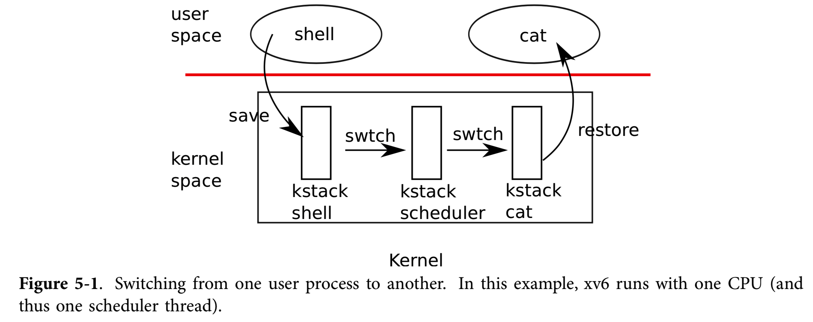

### 进程切换

这一部分探索xv6内核在进行进程调度的时候的整个流程是如何的。为了方便追踪整个流程，从时钟中断的入口开始进行跟踪。

通过之前的分析，我们知道当发生中断、陷入的时候，操作系统会经过`trap`的统一的操作，将用户现场保存在当前正在执行的进程的内核栈中。然后跳转到`trap.c`中的`trap`函数进行执行。

```c++
  // Force process to give up CPU on clock tick.
  // If interrupts were on while locks held, would need to check nlock.
  if(myproc() && myproc()->state == RUNNING &&
     tf->trapno == T_IRQ0+IRQ_TIMER)
    yield();
```

其中记录了如果当前的`trapno`是时钟中断，那么就会调用`yield`函数，让出CPU。

下面是[proc.c](https://github.com/mit-pdos/xv6-public/blob/master/proc.c)文件中`yield`函数的内容。

```c++
// Give up the CPU for one scheduling round.
void
yield(void)
{
  acquire(&ptable.lock);  //DOC: yieldlock
  myproc()->state = RUNNABLE;
  sched();
  release(&ptable.lock);
}
```

可以看到，这个函数主要是调用了`sched`这个函数。下面是这个函数的内容。

```c++
// Enter scheduler.  Must hold only ptable.lock
// and have changed proc->state. Saves and restores
// intena because intena is a property of this
// kernel thread, not this CPU. It should
// be proc->intena and proc->ncli, but that would
// break in the few places where a lock is held but
// there's no process.
void
sched(void)
{
  int intena;
  struct proc *p = myproc();

  if(!holding(&ptable.lock))
    panic("sched ptable.lock");
  if(mycpu()->ncli != 1)
    panic("sched locks");
  if(p->state == RUNNING)
    panic("sched running");
  if(readeflags()&FL_IF)
    panic("sched interruptible");
  intena = mycpu()->intena;
  swtch(&p->context, mycpu()->scheduler);
  mycpu()->intena = intena;
}
```

根据注释，说这个函数的功能是进入`scheduler`。主要是进行一些判断，然后调用`swtch`这个函数。

下面是`swtch`函数的内容。

```c++
# Context switch
#
#   void swtch(struct context **old, struct context *new);
# 
# Save the current registers on the stack, creating
# a struct context, and save its address in *old.
# Switch stacks to new and pop previously-saved registers.

.globl swtch
swtch:
  movl 4(%esp), %eax
  movl 8(%esp), %edx

  # Save old callee-saved registers
  pushl %ebp
  pushl %ebx
  pushl %esi
  pushl %edi

  # Switch stacks
  movl %esp, (%eax)
  movl %edx, %esp

  # Load new callee-saved registers
  popl %edi
  popl %esi
  popl %ebx
  popl %ebp
  ret
```

这个函数是利用汇编实现的，可以看到他实现的操作比较简单。首先将传入的参数分别放到`eax`和`ebx`寄存器中，

然后将调用者的寄存器现场压入到调用者的栈中，然后将压入之后的栈指针存入传入的第一个参数。通过上面调用的接口，也就是将当前正在运行的进程压入寄存器现场之后的堆栈的栈指针放到这个进程的`context`这个变量中。然后取出传入的当前`cpu -> scheduler`的地址放到`esp`中，相当于是完成了两个进程之间的栈的切换。

然后就是将新的进程的寄存器现场从栈顶恢复出来，`ret`指令就会回到新的进程执行，这就实现了两个进程之间的切换！

不过这里是将旧进程切换到了`cpu`的`scheduler`上进行执行，我们来看一下`scheduler`进行了那些操作。

下面是`proc.c`中的`scheduler`的定义

```c++
//PAGEBREAK: 42
// Per-CPU process scheduler.
// Each CPU calls scheduler() after setting itself up.
// Scheduler never returns.  It loops, doing:
//  - choose a process to run
//  - swtch to start running that process
//  - eventually that process transfers control
//      via swtch back to the scheduler.
void
scheduler(void)
{
  struct proc *p;
  struct cpu *c = mycpu();
  c->proc = 0;
  
  for(;;){
    // Enable interrupts on this processor.
    sti();

    // Loop over process table looking for process to run.
    acquire(&ptable.lock);
    for(p = ptable.proc; p < &ptable.proc[NPROC]; p++){
      if(p->state != RUNNABLE)
        continue;

      // Switch to chosen process.  It is the process's job
      // to release ptable.lock and then reacquire it
      // before jumping back to us.
      c->proc = p;
      switchuvm(p);
      p->state = RUNNING;

      swtch(&(c->scheduler), p->context);
      switchkvm();

      // Process is done running for now.
      // It should have changed its p->state before coming back.
      c->proc = 0;
    }
    release(&ptable.lock);

  }
}
```

可以看到，这个进程在被切换进来之后，是处于`switchkvm`这一行的，（具体原因后面分析完了就清楚了）。首先建立好内核的虚拟内存页表`kvm`，然后在死循环里面执行。循环里面会暴力地枚举记录所有进程的数据结构`ptable`，找到一个进程的状态是`RUNABLE`之后，又调用了`swtch`这个函数。通过上面的分析，我们就知道这个时候将新的进程上下文恢复了出来，并开始执行新的上下文了。而这个时候`scheduler`的下一个指令就是`switchkvm`，恢复好页表，也即是，下面整个过程就走通了。



也就是整个过程会涉及到三个内核栈的切换：

1. 旧进程 -> `scheduler`线程
2. `scheduler`线程 -> 新进程

进程切换，说简单点就是把当前进程的内核栈进行了切换，内核上保存了用户态的寄存器现场以及内核态的寄存器现场。(有些寄存器是被调用这保护的，这部分内核的寄存器`context`不需要保护)。切栈其实也就是把`esp`寄存器的值换一下而已，然后通过`esp`再把`eip`等寄存器从栈中弹出来，就恢复出现场了。至此，进程切换的整个过程就清楚了。不过这里各种锁的获取与释放并没有进行讨论，细节也是很有考究。


