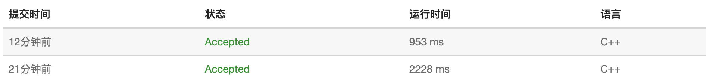

### 概述

前缀操作和差分操作是两个互逆操作。求数据区间和能够转化为前缀和的单点操作。对数据区间增减可以转化为

对差分的单点操作，从而提高效率。

**但是这种数据结构不支持对一个数据单点操作，并高效地支持区间和操作**。要想同时拥有对数据的单点操作和区间和操作，

需要使用**树状数组**的数据结构。

### 1. 一维前缀和

前缀和的数据结构能够快速求某个区间的和。方法是在读入数据的时候创建一个数组将`0-i`的全部数据的和

存储下来。在访问`l-r`的所有元素的和的时候，只需要返回`a[r] - a[l -1]`即可。为了方便边界处理，

一般令`a[0] = 0`。从1开始存数据。

```c++
#include <iostream>

using namespace std;

typedef long long LL;

const int N = 100010;
LL sum[N];
int n, m;
int l, r;

int main(){
    cin >> n >> m;
    LL temp = 0;
    LL in_temp = 0;
    for (int i = 1; i < n + 1; i++) {
        cin >> in_temp;
        temp += in_temp;
        sum[i] = temp;
    }
    for (int i = 1; i < m + 1; i++) {
        cin >> l >> r;
        cout << sum[r] - sum[l - 1] << endl;
    }
    return 0;
}
```


### 2. 二维前缀和

二维前缀和能够和一维前缀和类似，定义为`0, 0` 到`m, n`的矩形内的所有的元素和。

在计算的时候可以直接利用下面的公式来计算

`a[i][j] = a[i - 1][j] + a[i][j-1] - a[i-1][j-1]`

在访问`x1, y1` 到`x2, y2`中所有数据的和的时候只需要返回

`a[x2][y2] - a[x2][y1 - 1] - a[x1-1][y1] + a[x1-1][y1-1]`即可。

```c++
#include <iostream>

using namespace std;

typedef long long LL;
const int N = 1010;

int num[N][N];

LL sum[N][N];


int main(){
    
    int n, m, q;
    int x1, y1, x2, y2;
    int t;
    cin >> n >> m >> q;
    for(int i = 1; i <= n; i ++)
        for(int j = 1; j <= m; j ++){
            cin >> t;
            num[i][j] = t;
        }
    for(int i = 1; i <= n; i++)
        for(int j = 1; j <= m; j++){
            sum[i][j] = num[i][j] + sum[i-1][j] + sum[i][j-1] - sum[i-1][j-1];
        }
    for(int i = 0; i < q; i ++){
        cin >> x1 >> y1 >> x2 >> y2;
        cout << sum[x2][y2] - sum[x1-1][y2] - sum[x2][y1-1] + sum[x1-1][y1-1] << endl;
    }
    return 0;
}
```

### 3. 一维差分

差分操作可以看做是对前缀和操作的逆操作。可以看做对输入数据，看其是哪个数据的前缀和。

对数据进行差分处理可以将对原始数据的区间加减转化为对差分数据的单点操作。这样可以降低复杂度。

二维同样也可以定义差分，满足对一片元素的操作。

```c++
#include <iostream>
using namespace std;

typedef long long LL;
const int N = 100010;


int n, m;
int q[N];
LL tmp[N];
int l, r, c;

int main(){
    cin >> n >> m;
    for (int i = 1; i <= n; i ++){
        cin >> q[i];
        tmp[i] = q[i] - q[i-1];
    }
    for (int i = 0; i < m; i ++ ){
        cin >> l >> r >> c;
        tmp[l] += c;
        tmp[r + 1] -= c;
    }
    LL out_temp = 0;
    for (int i = 1; i <= n; i ++){
        out_temp += tmp[i];
        cout << out_temp << " ";
    }
    return 0;
}
```

### 4. 二维差分

```c++
#include <iostream>

typedef long long LL;

using namespace std;

const int N = 1010;
int n,m,q;
LL d[N][N];
LL b[N][N];

void add(int x1, int y1, int x2, int y2, int c){  // 区间增加的差分操作，将区间操作变为单点操作
    b[x1][y1] += c;
    b[x1][y2 + 1] -= c;
    b[x2+1][y1] -= c;
    b[x2 + 1][y2 + 1] += c;
}


int main(){
    
    int tmp;
    int x1, y1, x2, y2, c;
    scanf("%d%d%d", &n, &m, &q);
    for(int i = 1; i <= n; i++)
        for(int j = 1; j <= m; j ++){
            scanf("%d", &tmp);
            add(i, j, i, j, tmp);
        }
    for(int i = 0; i < q; i++){   // 构造差分数据，相当于逐个添加元素
        scanf("%d%d%d%d%d", &x1, &y1, &x2, &y2, &c);
        add(x1, y1, x2, y2, c);
    }
    for(int i = 1; i <= n; i ++){
        for(int j = 1; j <= m; j ++){   // 利用差分数据求最终数据
            d[i][j] = b[i][j] + d[i-1][j] + d[i][j-1] - d[i-1][j-1];
            printf("%lld ", d[i][j]);
        }
        printf("\n");
    }
    return 0;
}
```

### 和为K的子数组

[原题链接](https://leetcode-cn.com/problems/subarray-sum-equals-k/)

使用哈希表存储截止到当前位置，前缀和出现的情况个个数。计算得到当前位置的前缀和之后，查看之前前缀和为$s[i] - k$的个数，就是以i为结尾的和为k的子数组的个数。然后求和即可。

时间复杂度$O(N)$， N为数组大小。

```c++
#include<unordered_map>

class Solution {
public:
    unordered_map<long long , long long> m;
    int subarraySum(vector<int>& nums, int k) {
        m[0] = 1;
        long long res = 0;
        long long s = 0;
        for(int i = 0; i < nums.size(); i ++){
            s += nums[i];
            res += m[s - k];
            m[s] ++;
        }
        return res;
    }
};
```

### 均值为K的子数组

和前一题比较类似，不过是子数组的均值为K。这个时候可以知道，如果一个子数组的均值为k，那么这个子数组的和就是k*w

,w为子数组的元素个数，那么将每个元素减k，也就是子数组的和为0。所以先将数组中的每个数减k，然后就相当于求前缀和为0的

连续子数组的个数。然后利用上题的前缀和加哈希表就可以解决。

**将连续数组的平均值转为连续数组和的问题**

时间复杂度$O(N)$。

样例：

```txt
[2, 1, 3]  2  -> 3   ||  [2] [1, 3] [2, 1, 3]
[0, 4, 3, -1] -> 2   ||  [0, 4]  [4, 3, 1]
[2, 1, 4]     -> 0   
```

```c++
#include <iostream>
#include <unordered_map>
using namespace std;

unordered_map<long long, int> m;

int main(){
    int n, k;
    cin >> n >> k;
    long long s = 0;
    m[0] ++;
    long long res = 0;
    while(n--){
        int x;
        cin >> x;
        s += x - k;
        res += m[s];
        m[s] ++;
    }
    cout << res;
    return 0;
}
```

### 子数组的最大平均值

[原题链接](https://www.lintcode.com/problem/maximum-average-subarray-ii/description)

直接求最大值不好求，可以换一种思路，给定一个数，我们能否高效地判断数组中是不是存在着子数组，使得其均值大于等于这个数呢？利用上题的思路，当给定的数为`a`时，**我们将数组中的所有的数都减a，问题就转化为了求这个数组中是否存在长度不小于k的子数组其和大于等于零！**

然后使用前缀和，同时维护当前`i`的`i-k`之前的所有前缀和的最小值。如果`i`的前缀和减去最小值大于等于零，那么找打了。

然后对`a`进行二分搜索，最终达到了精度就可以了。

**求某个实数的问题，当给定这个数，比较容易判断其是否满足的时候，可以转为二分查找这个解的问题。同时需要满足单调性**

**求。。的最大，求。。的最小等等这类的题。**

**类似的题还有：给定一些木棒，问将这些模板锯成k端相等长度的木棒，为木棒的长度最大是多少。可以用二分来搜索。**

```c++
// https://www.lintcode.com/problem/maximum-average-subarray-ii/description
class Solution {
public:
    /**
     * @param nums: an array with positive and negative numbers
     * @param k: an integer
     * @return: the maximum average
     */
    double maxAverage(vector<int> &nums, int k) {
        // write your code here
        double l, r;
        l = r = nums[0];
        for(int i = 0; i < nums.size(); i ++){  // 首先找到所有数据中的最大值和最小值，用作二分的起点
            l = min(double(nums[i]), l);
            r = max(double(nums[i]), r);
        }
        // cout << l << " " << r << endl;
        while(r  - l > 1e-6){  // 二分查找
            cout << l << " " << r << endl;
            double mid = (l + r) / 2;
            double s[1000010] = {0};
            
            for(int i = 1; i < k; i ++){   // 先求出前k - 1个元素的前缀和
                s[i] = s[i - 1] + nums[i - 1] - mid;
            }
            double m_l = 0;
            bool flag = false;
            for(int i = k ; i <= nums.size(); i ++){  // 维护前面的最小值，求出当前的前缀和，并判断是否满足条件
                s[i] = s[i - 1] + nums[i - 1] - mid;
                m_l = min(m_l, s[i - k]);
                if(s[i] - m_l >= 0){
                    flag = true;
                    break;
                }
            }
            if(flag) l = mid;
            else r = mid;
        }
        return (l + r) / 2;
    }
};
```

### 形成两个异或相等数组的三元组数目

[原题链接](https://leetcode-cn.com/problems/count-triplets-that-can-form-two-arrays-of-equal-xor/)

#### 解题思路

- 方法1： 先用数据记录前缀异或和，然后暴力枚举三个区间

- 方法2：题目中两端异或和相等，其实就是整个区间的异或和为零。所以只需要找到数组中异或和为零的区间。然后这个区间可拆分为任意两个，这两个的异或和都相等。

所以某个长度`k`的异或的为零的区间，对应着`k-1`种分法。

所以可以使用哈希表存储前面每个值的前缀异或和出现的各个位置，然后直接求解。

#### C++代码

```c++
#include<unordered_map>
class Solution {
public:
    int sum[310];
    unordered_map<int, vector<int>> ma;
    int countTriplets(vector<int>& arr) {
        int t = 0;
        ma[t].push_back(0);
        int ans = 0;
        for(int i = 1; i <= arr.size(); i ++){
            t ^= arr[i-1];
            for(auto x:ma[t]){
                ans += (i - x - 1);
            }
            ma[t].push_back(i);
        }
        return ans;
    }
};
```

### 环形子数组的最大和

[原题链接](https://leetcode-cn.com/problems/maximum-sum-circular-subarray/)

#### 解题思路

- 方法1：**破链成环，将数组复制一份，**得到长度为`2n`的数组，问题等价于在这个数组中找到长度不大于`n`的最大连续子数组的和的问题。

处理好前缀和之后，相当于对于每一个位置`i`, 需要在其前面`n`个长度的窗口**内找到一个最小的前缀和即可**。 滑动区间最小值，使用单调队列即可实现。

- 方法2：多次dp。将问题分为两类。一类是跨过边界的区间，一类是不跨过边界的区间。不跨过边界的区间的最大和直接使用dp就可以做。

**跨过边界的区间可以思考反面问题。**也就是其补集是在不跨边界的。所以直接dp求最小子区间和，然后用所有元素减去他，即可得到结果。

如果数组中的元素全部都是负的，那么求最小子区间和的时候有可能将所有的元素都取到，这个时候是不合法的。如果发现最小子区间和

和所有的元素和相等的话，那么就将数组中的最大的数返回即可。

时间复杂度`O(n)`，第一种方法空间复杂度为`O(n)`，第二个方法的空间复杂度为`O(1)`

#### C++代码

```c++
// 复制链表、破环成链
#include<deque>
typedef pair<int,int> PII;
class Solution {
public:
    int maxSubarraySumCircular(vector<int>& A) {
        deque<PII> q;
        q.push_back({0, -1});
        int ans = -50000;
        int l_a = A.size();
        for(int i = 0; i < l_a; i ++){  // 破环成链
            A.push_back(A[i]);
        }
        for(int i = 1; i < A.size(); i ++){
            A[i] += A[i-1];
        }
        for(int i = 0; i < A.size(); i ++){
            while(q.size() && q.front().second + l_a < i) q.pop_front();
            if(q.size() == 0) ans = max(ans, A[i] - A[i-1]);
            else{
                ans = max(ans, A[i] - q.front().first);
            }
            while(q.size() && q.back().first > A[i]) q.pop_back();
            q.push_back({A[i], i});
        }
        return ans;
    }
};

// 两次DP
class Solution {
public:
    int maxSubarraySumCircular(vector<int>& A) {
        int m1 = -50000, m2 = 50000;
        int s = 0;
        int t = 0;
        for(auto x:A){
            t = max(t + x, x);
            m1 = max(m1, t);
            s += x;
        }
        t = 0;
        for(auto x:A){
            t = min(t + x, x);
            m2 = min(m2, t);
        }
        if(m1 >= s - m2) return m1;
        else if(s == m2){
            t = -50000;
            for(auto x: A) t = max(t, x);
            return t;
        }else{
            return s - m2;
        }
    }
};
```

### 元素和小于等于阈值的正方形的最大边长

[原题链接](https://leetcode-cn.com/problems/maximum-side-length-of-a-square-with-sum-less-than-or-equal-to-threshold/)

#### 解题思路

前缀和加枚举加二分。

因为矩阵中的元素都是非负的，所以在求`i, j` 点向左上最大的正方形的时候，可以使用二分法来求解。

时间复杂度：

- 处理二维前缀和，`nm`

- 枚举所有右下角位置，并求最大正方形`n m log(min(n, m))`

所以时间复杂度为`O(nmlog(max(n, m)))`

空间复杂度`O(nm)`

### C++代码

```c++
class Solution {
public:
    
    int maxSideLength(vector<vector<int>>& mat, int threshold) {
        int n = mat.size(), m = mat[0].size();
        vector<vector<unsigned long long>> s(n + 1, vector<unsigned long long>(m + 1));
        for(int i = 0; i < n; i ++){
            for(int j = 0; j < m; j ++){
                s[i + 1][j + 1] = s[i + 1][j] + s[i][j + 1] - s[i][j] + mat[i][j];
            }
        }
        int ans = 0;
        for(int i  =1; i <= n; i ++){
            for(int j = 1; j <= m; j ++){
                int l = 0, r = min(i, j);
                while(l < r){
                    int mid = l + r + 1 >> 1;
                    int x = i  - mid  + 1, y = j - mid +1;
                    if(s[i][j] - s[x-1][j] - s[i][y-1] + s[x-1][y-1] > threshold) r = mid - 1;
                    else l = mid;
                }
                ans = max(ans, l);
            }
        }
        return ans;
    }
};
```

### 和可被K整除的子数组

[原题链接](https://leetcode-cn.com/problems/subarray-sums-divisible-by-k/)

#### 解题思路

前缀和，同时记录各个余数出现的次数即可。

时间复杂度`O(N)`

#### C++代码

```c++
#include<unordered_map>
class Solution {
public:
    int subarraysDivByK(vector<int>& A, int K) {
        unordered_map<int, int> mp;
        mp[0] ++;
        int t = 0;
        int ans = 0;
        for(auto x:A){
            t += x;
            if(t < 0){
                t = ((t % K) + K) % K;
            }else{
                t = t % K;
            }
            ans += mp[t];
            mp[t] ++;
        }
        // cout << -5 % 5;
        return ans;
    }
};
```

### 统计优美子数组

[原题链接](https://leetcode-cn.com/problems/count-number-of-nice-subarrays/)

#### 解题思路

前缀和加哈希表。和上一题的思路相同。

#### C++代码

```c++
#include<unordered_map>
class Solution {
public:
    int numberOfSubarrays(vector<int>& nums, int k) {
        unordered_map<int, int> mp;
        mp[0] = 1;
        int n = 0;
        int ans = 0;
        for(auto x:nums){
            if(x & 1){
                n += 1;
            }
            ans += mp[n - k];
            mp[n] ++;
        }
        return ans;
    }
};
```

### 最少交换次数来组合所有的1

[原题链接](https://leetcode-cn.com/problems/minimum-swaps-to-group-all-1s-together/)

#### 解题思路

前缀和+枚举。 首先扫描整个数组，得到1的个数。然后最终的所有1肯定是被放到一个长度为**`n1`**的区间内部。

然后枚举所有长度为**`n1`**的区间，统计区间内的1的个数。然后用**`n1`**减去即可

时间复杂度**`O(n)`**

#### C++代码

```c++
class Solution {
public:
    int minSwaps(vector<int>& data) {
        int num1 = 0;
        for(auto x: data) num1 += x;
        int cnt = 0;
        int ans = 1e9;
        for(int i = 0; i < num1; i ++){
            cnt += data[i];
        }
        ans = num1 - cnt;
        for(int i = num1; i < data.size(); i ++){
            cnt += data[i];
            cnt -= data[i - num1];
            ans = min(ans, num1 - cnt);
        }
        return ans;
    }
};
```

### 后记

在实验中，发现使用`scanf/printf`比`cin/cout`速度快非常多。。

