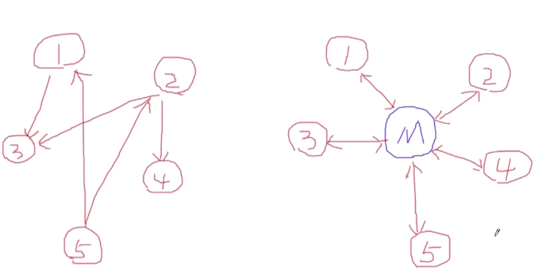
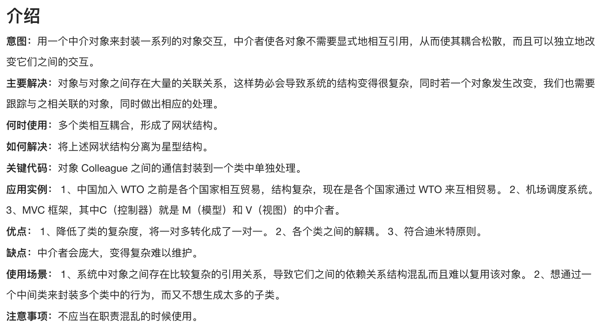
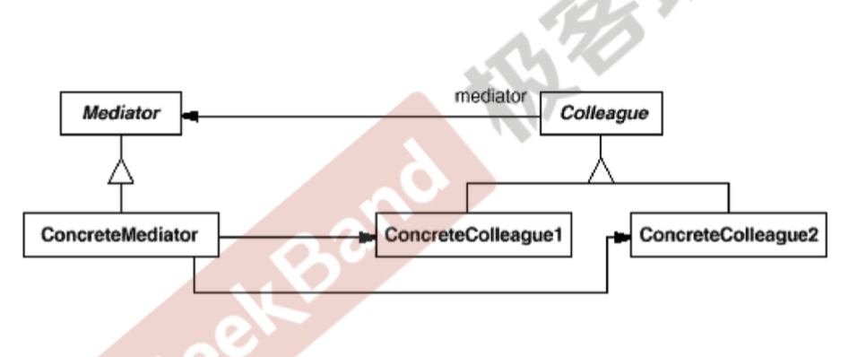

## 中介者模式

在软件构建过程中，通常会有多个对象相互关联交错的情况，对象之间尝尝维护一种复杂的引用关系。遇到一些需求的更改，这些直接的引用关系将面临不断的变化。这里的相互关联交错是指系统内部的组件之间，系统内和系统外可以通过门面模式来处理。

> 用一个中介者来封装(封装变化),一系列的对象的交互，中介者使得各个对象不需要显式的相互引用(编译时依赖->运行时依赖)，从而使其耦合松散(管理变化)，而且可以独立地改变他们之间的交互。

### UML图

见各个`Colleague`之间的依赖转为各个`Colleague`和`Mediator`的依赖。

### 总结

1. 将多个对象间复杂的关联关系解耦，将多个对象间的控制逻辑进行集中管理，变多个对象相互关联为多个对象和一个中介者关联。
2. 但是对着控制逻辑的复杂化，中介者具体对象的实现可能非常复杂，可以对中介者进行分解处理。
3. 门面模式解决的是系统间(单向)的对象关联关系，中介者模式是解耦系统内各个对象之间的(双向)的关联关系。

