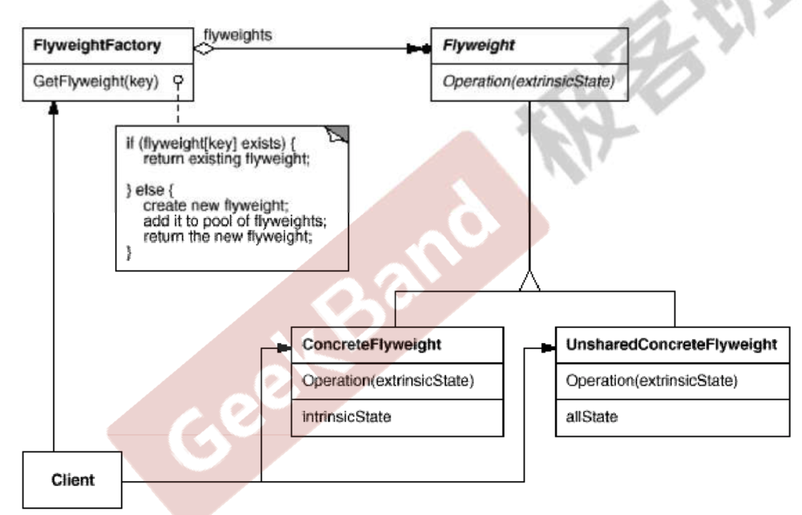

## 享元模式

### 1 问题

软件系统采用纯粹面向对象的时候，有大量细颗粒度的对象会很快充斥在系统中，从而带来很高的运行时代码，只要是内存方面的代码。比如字符串，整数这种在程序中大量存在的对象。

如何能够避免大量细颗粒度对象问题的同时，让外部客户端程序仍然能够透明地使用面向对象的方式来进行操作。

> 享元模式通过共享技术有效地支持大量细粒度的对象。

### 2 代码实例

考虑字体类，可能每个字符都会有一个字体，每种字体有自己的内部状态。外部状态改变也不会影响到字体的内部状态。但是每个字符都绑定一个字体对象开销过大。可以使用下面的方式起来进行处理。

```c++
#include <string>
#include <map>

// 字体类
class Font{
private:
    std::string key;

public:
    Font(const std::string &_key): key(_key) {}
    ~Font() = default;
};

// 字体工厂类
class FontFactory {
private:
    std::map<std::string, Font*> fontPool;  //进行缓存

public:
    FontFactory(){}
    ~FontFactory() {clear();}
    Font* getFont(std::string key) { // 通过key找到对象，不存在则创建
        std::map<std::string, Font*>::iterator item = fontPool.find(key);
        if (item == fontPool.end()) fontPool[key] = new Font(key);
        return fontPool[key];
    }

    void clear() {
        for (auto x : fontPool) delete x.second;
    }
};

int main() {
    FontFactory fontFactory;
    Font* a = fontFactory.getFont("a");
    Font* b = fontFactory.getFont("b");
    Font* a1 = fontFactory.getFont("a");
    std::cout << a << " " << b << " " << a1 << std::endl;
    return 0;
}
```

### 3. 总结



1. 享元模式主要解决面向对象的代价问题，一般不触及面向对象的抽象性问题。
2. 享元采用对象共享的方法来降低系统中对象的个数，从而降低细颗粒对象给系统带来的内存压力。在具体实现方面，注意对象状态的处理，最好状态是只读的，不然一个地方改变状态，其它共享的地方也会受影响。
3. 对象的数量太大导致对象内存开销较大，这个数量的度需要衡量。
4. 在Java中，字符串常量在编译的时候就会放到常量池中进行共享，同时小整数也会共享。