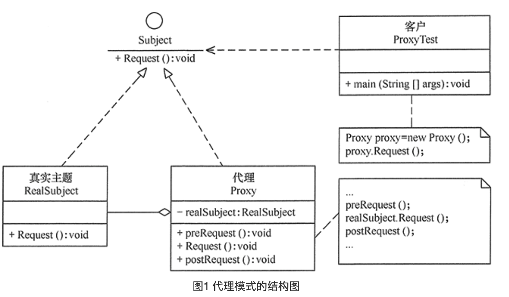

## 代理模式

### 问题

在某些情况下，一个客户**不能**或者**不想**直接访问另一个对象，有可能是这个对象在远程服务器，远程对象比较大，或者有一些安全原因需要屏蔽客户端直接访问真实对象，如某单位的内部数据库等。

某与某些原因，需要给某个对象提供一个代理以控制对该对象的访问，访问对象不适合或者并不能直接引用目标对象，这个时候可以使用代理对象作为访问对象和目标对象之间的中介。

代理模式的应用场景可能有如下几种：

1. 远程代理，通常是为了隐藏目标对象存在于不同地址空间的事实，方便客户端访问。比如用户申请某些网盘空间时，会在用户的文件系统中创建一个虚拟的硬盘，用户访问虚拟硬盘时实际访问的就是网盘空间。
2. 虚拟代理，通常用于要创建的目标对象开销比较大时，如下载一副很大的图像需要很长的时间，可以先用小比例的虚拟代理替换真实的对象，消除用户对服务器慢的感觉。
3. 安全代理，通常用于控制不同中类客户对真实对象的访问权限。
4. 智能指引，调用目标对象时，代理附加一些额外的处理功能，如增加计算真实对象的引用次数，当该对象没有被引用时，就自动释放它。C++中的智能指针？
5. 延迟加载，提高系统的性能，延迟对目标的加载。

### 代码实例

```c++
#include <iostream>

class ISubject {
public:
    virtual void doSomething() {}
};

class Subject : public ISubject {
public:
    void doSomething() {std::cout << "real subject do something" << std::endl;}
};

class Proxy : public ISubject {
private:
    Subject* subject;

public:
    void doSomething() { // 这一部分有可能实现会非常复杂。
        std::cout << "Proxy pre do something" << std::endl;
        subject = new Subject();
        subject->doSomething();
        std::cout << "Proxy done something" << std::endl;
    }
};

int main() {

    Proxy proxy;
    proxy.doSomething();
    return 0;
}
```

### UML



### 总结

1. 代理模式的实现方法、实现粒度都相差较大，有些可能对单个对象做细粒度的控制，如`copy-on-write`技术。有些可能对组件模块提供抽象代理层，在架构层次对对象做proxy。
2. 代理并不一定要求保持接口完整的一致性，只要能够实现简介控制，有时候损失一些透明性是可以接受的。