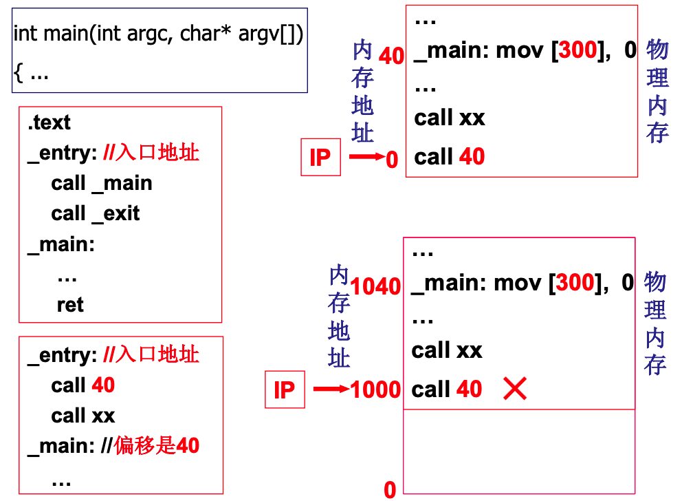
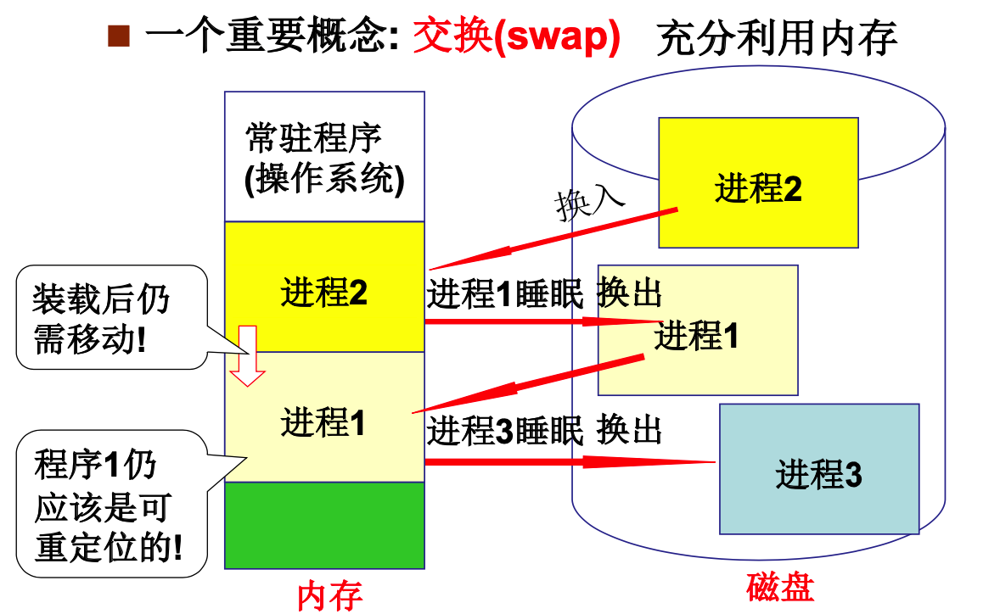
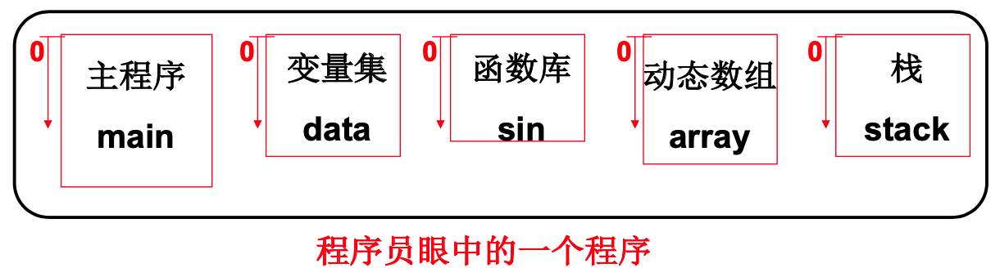
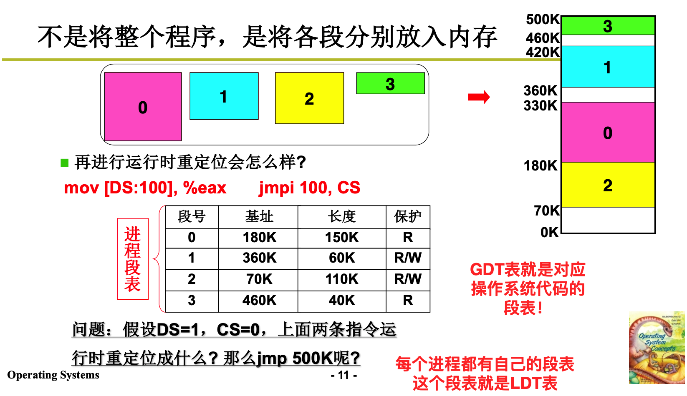
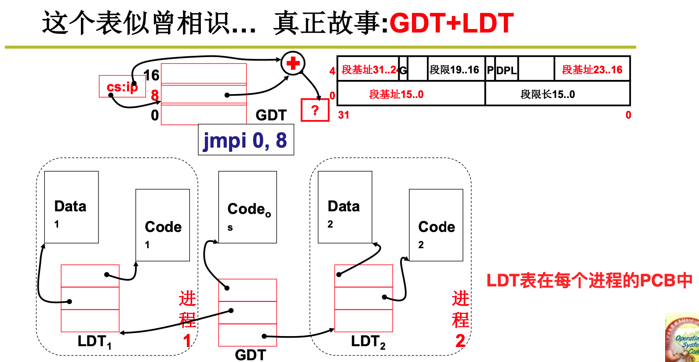
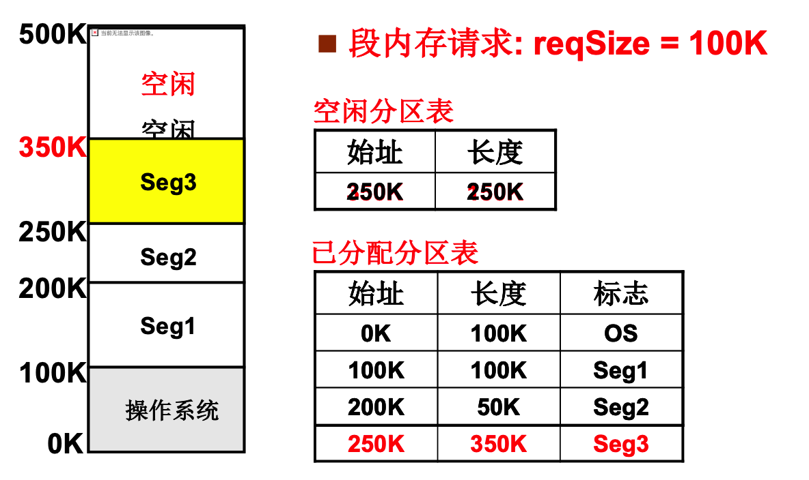
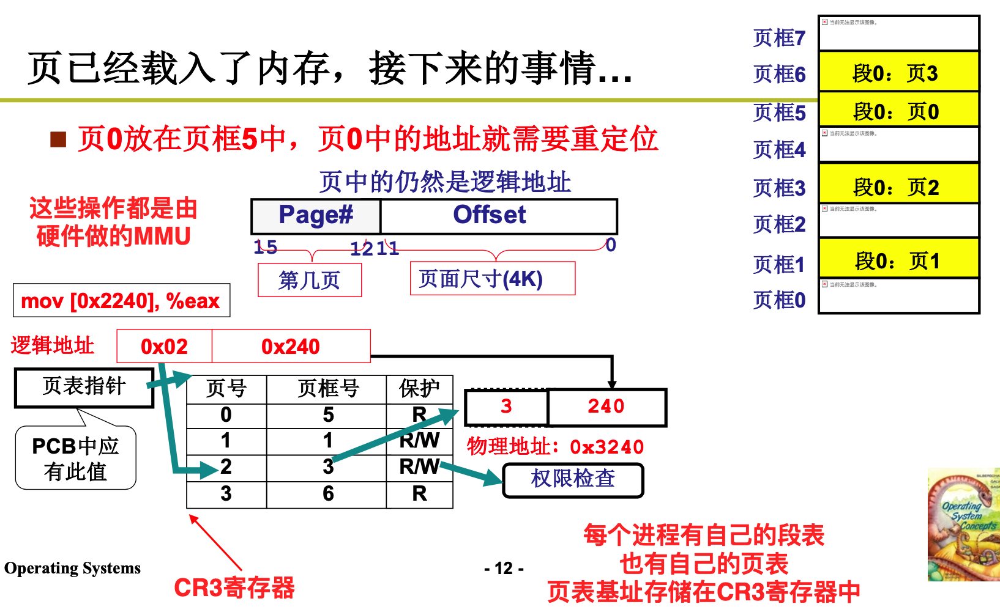

## 内存管理01

如何使用内存？

程序要想运行，首先需要将其加载到内存中，放在内存中的某个位置，然后将PC指针指向其第一条指令，这样就可以运行程序。

程序中具有一些地址信息。如果直接将程序加载到内存中，这样会导致跳转的地址并不正确。如下如所示的`call 40`指令。如果直接放到内存中，那么运行到这条指令的时候，跳转到四十，这显然是不对的。

可行的思路：重定位。修改程序中的地址(将相对地址换成绝对地址)

什么时候完成重定位操作：

1. 编译时。如果编译时确定了绝对地址，那么运行的时候就只能放大固定的位置上。
2. 载入时。操作系统加载程序的时候进行替换。这样一旦载入内存之后就不能挪动了。

但是程序在内存中的地址并不是一成不变的。内存需要换入换出。

所以最合适的是在真正运行的时候进行重定位。

在`PCB`中存储进程被放置的内存的基址，然后执行指令的时候，先从`PCB`中取出这个基址，然后和逻辑地址相加，得到真正的物理地址。这个基址可以放到一个寄存器中，通过硬件来高效地完成地址的转换。

所以下面是整个的执行过程：

每个进程的PCB中有自己被放入内存中的基址，在切换的时候，将自己的基址存储到对应的一个寄存器中，然后执行的时候，取出逻辑地址，和基址进行相加，得到物理地址，然后进行访存。每条指令都要进行转换工作，所以需要很高的效率，引入硬件支持。(MMU)

### 分段

程序由若干不同的段组成。每个段有各自的特点和用途。

- 代码段  （只读, 大小不变）
- 数据段    （可读可写，大小不变）
- 栈     (大小可变)
- 堆
- 函数库

不同的段各自都是从零开始。如何定位具体的指令(数据)？ `<段号， 段偏移>   mov [es:bx],ax`

所以并不是将整个程序一块放入内存，而是将各段分别放入内存中。那么在`PCB`中就不能只存一个基址，而是需要存储每个段的机制。这就形成了一个表，称为`进程段表`。`GDT`表就是操作系统代码的段表。每个进程都有自己的段表，这个称为`LDT`表。

### 分页

程序的分段是在编译的时期完成的。在程序运行的过程中，`LDTR`寄存器中存储着`LDT`表的起始地址。表中记录着每个段的起始地址。`CS`寄存器存储的是一个`LDT`表的索引。通过索引找到对应的表项，找到段的起始地址，将其和偏移相加，就得到了物理地址。

程序运行分以下几步：

- 编译时期，将程序分成多个段
- 在内存中划分出空闲区域
- 磁盘读写，将程序加载入内存
- 设定PCB表，关联

如何分割内存？

#### 可变分区的管理

来一个就分配一个，并用适当的数据结构来维护空闲内存。

如果多空闲分区，选哪一个？

1. 首先适配
2. 最佳适配：导致较多的小碎片
3. 最差适配：碎片比较均匀

#### 引入分页，解决内存分区导致的内存效率问题

可变分区会导致内存中存在大量的小碎片，这样如果申请一段比较大的连续内存，会无法提供。

如果将内存进行紧缩，那么需要花费大量的时间。

考虑切分面包。如果每个人来了切一块，那么剩下的碎末没人要。所以提前将面包分好片，要买就买一片。

对应的，将内存分成页。针对每个段的请求，系统一页一页地分配给这个段。这样就算存在碎片，也只会在页内部存在，最大也就`4K`。

在拿到逻辑地址之后，找到其属于的页好，此时还需要存储每个也对应的物理内存的页框号是哪一个。这个记录页号和物理页框号的表称为`页表`。其中`CR3`寄存器存储当前进程中的页表指针。通过页表可以找到物理页框号，然后和偏移就可以得到真正的物理地址