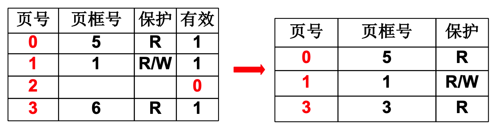
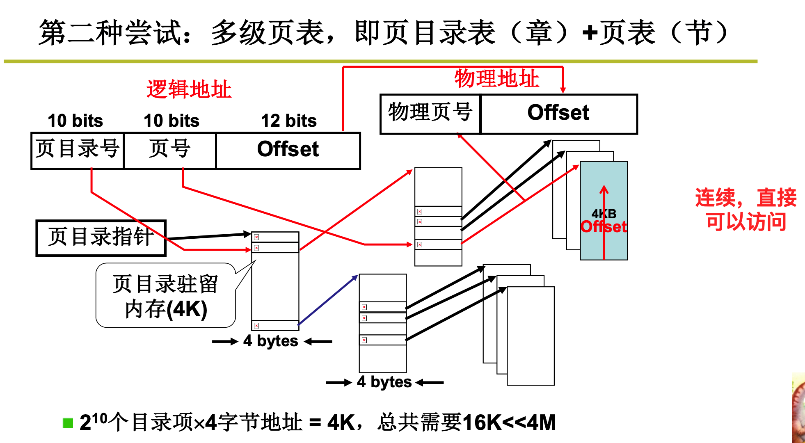
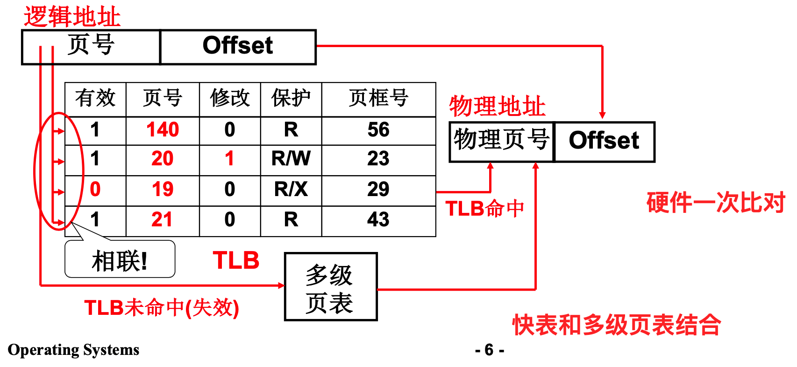

## 内存管理02

### 多级页表与快表

对内存进行分页，然后存储虚拟地址的页表好，从而找到其对一个的物理页框号。

页下，则空间利用率高，但是如果页下，那么项数就会多，页表就会很大。如何放置页表？

页面尺寸4k, 地址32位，则一共有`2^20`个页面。每个表项4个字节，则需要4M内存。每个进程需要存储一个这样的映射关系，如果10个进程并发，那么就需要40M内存。

实际上大部分的逻辑地址不会用到。一个程序也不会大到4G。

所以也已只存放用到的页。

这样也存在问题。如果存放的页号是连续的，那么可以在`O(1)`的时间内找到对一个的页框号。如果不连续，则只能通过折半查找，那么每次都需要20次访存。无法容忍。

32位地址空间 + 4K页面 + 也好连续  => `2^20`个页表项 => 大页表占用内存，浪费。

考虑书的目录，章目录和节目录的关系。

不再是将所有的页表都存放进内存，而是分章一样，再来一级。

页表的级数越多，那么访存的次数也就会增加。多一级就会增加一次访存。为了解决这个问题，引入了快表`TLB`。

> `TLB`是一组相联快速存储，寄存器。

拿到逻辑地址先和块表比对，比如上就直接得到了物理地址，比对失败，则访存，将多级页表的内从加载到快表中。

TLB越大越好，但是TLB非常昂贵，一般只有`[64, 1024]`

`TLB`为什么能够发挥作用？

程序的地址访问存在局部性。空间局部性。在设计计算机系统时应该充分利用这种局部性。

### 段页结合的实际内存管理

用户可见的是代码分段，并且有`4G`空间可以使用。这是一个虚拟的内存，并不是真实存在的。程序中的地址都是逻辑地址。在拿到逻辑地址之后，操作系统通过分页机制，将其映射为物理地址。

首先将逻辑地址经过段基址转为虚拟地址，然后再将虚拟地址经过页表，转为物理地址。