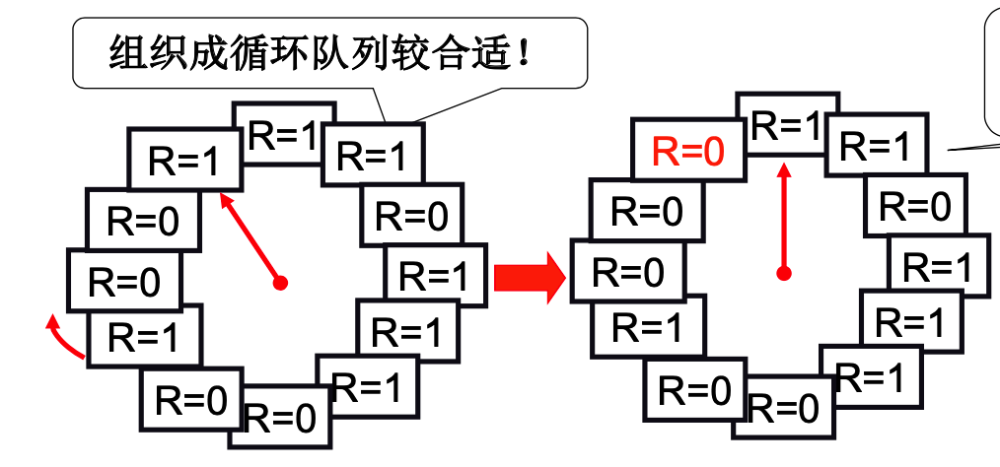
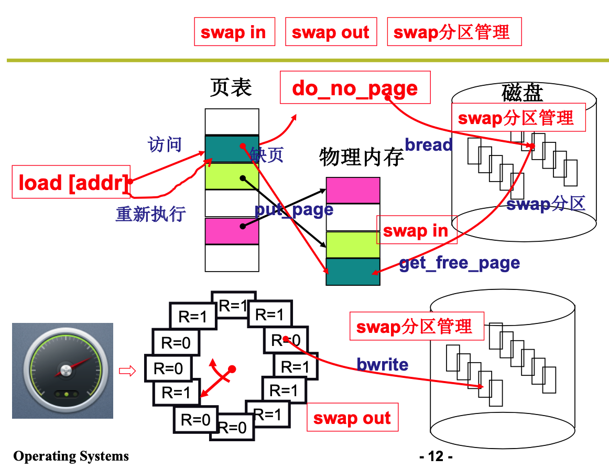

## 内存管理3

### 内存换入

在用户眼中，其具有`4G`大且规整的内存可以供用户使用。用户可以随意只用这些内存。但是真实的物理内存可能并没有这么大。那么如何能够虚拟出这么大的内存呢？

这就是需要换入换出操作。程序当前使用哪一部分，就将这一部分换入内存。

可以把虚拟内存看做是仓库，物理内存看做是店面。需要什么，没有的话就从仓库调出来。

整个流程的总结：

1. 通过虚拟地址发现对应的页没有被加载到内存中。然后出发缺页中断
2. 页错误处理程序将对应的内容从磁盘读入内存中，并维护页表

### 内存换出

当内存满了，但任然希望将页面调入的时候，该选择哪一页替换到磁盘呢？

FIFO，但是如果刚换入的页马上又要换出怎么办

最优的方法 ：MIN，选择最远将使用的页淘汰，是最优的方案。可是知道未来的事是很困难的。

LRU:用过去的历史预测未来。选最长一段时间没有使用的页淘汰。

如何实现LRU?

每次访存将页打上一个时间戳，然后选择时间戳最小的页。但是需要维护一个全局的时钟，需要找到最小值，实现代码比较大。

维护一个栈。每次访问之后将页码放入栈顶，然后最后去除栈低元素。这样每次地址访问都需要修改栈，指针操作，实现代码也比较大。LRU准确实现用的少。

近似实现：

每个页加入一个引用位，每次访问一页时，硬件制动设置改位。

选择淘汰业：扫描该位，是1时清零，并就行扫描，是0时淘汰。

上述方法在却也很少的情况下，会退化为FIFO。当缺页很少的时候，每次淘汰所有的页标志位都是1.这样就会导致转了一圈，然后最后把一开始指向的位置替换出去。

原因是：记录了太长的历史信息，所以可以定时来清除R位。再使用一个扫描指针。

这个扫描指针用来清除R位，定期清除，相当于考虑一段时间清零，在换出的时候只考虑当前时刻前一段时间的信息。这个时间段可以自己来设置。

快指针来清除R位，，满指针来选择淘汰页。所以就想一个Clock一样。

### 为进程分配多少个页框

分配多，则请求调页导致内存的高效利用没有了。

分配太少，可能会导致频繁换入换出，发生颠簸现象。

### 整个内存管理的框图

