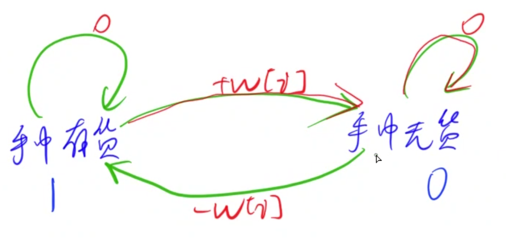
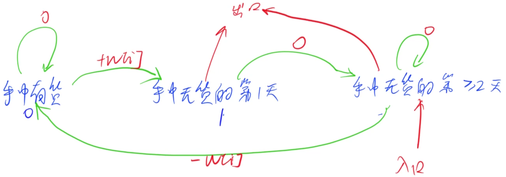

## 状态机模型

### 大盗阿福

[原题链接](https://www.acwing.com/problem/content/1051/)

#### 解题思路

在考虑每个物品的时候，由于其选不选对于后面的决策是有影响的，所以需要一个多余的状态来记录其是否被选。

`dp[i][0]`表示第`i`个物品不选的最大价值，`dp[i][1]`表示选了第`i`个物品的最大价值。

则有如下状态转移方程：

$$dp[i][0] = max(dp[i-1][0], dp[i-1][1])$$

$$dp[i][1] = dp[i-1][0] + nums[i]$$

时间复杂度`O(n)`

空间复杂度，可用滚动数组优化为`O(1)`

#### C++代码

```c++
#include<iostream>
using namespace std;


int main(){
    
    int t;
    cin >> t;
    while(t--){
        int n;
        cin >> n;
        int a = 0, b = 0;
        while(n--){
            int t;
            cin >> t;
            int c = max(a, b);
            int d = a + t;
            a = c;
            b = d;
        }
        cout << max(a, b) << endl;
    }
    return 0;
}
```

###  股票买卖IV

[原题链接](https://www.acwing.com/problem/content/description/1059/)

#### 解题思路

定义`dp[i][j][0]`为第`i`天，买过`j`次股票，且手中没有股票的最高钱数。

`dp[i][j][1]`为第`i`天，买过`j`次股票，且手中还有股票的最高钱数。

状态机模型如下：



将非法状态初始化为负无穷。然后`dp[i][0][0]`置为0.一次都没买。所以价格为零。

#### C++代码

```c++
#include<iostream>
#include<cstring>
using namespace std;

const int N = 100010, K = 110;
int dp[N][K][2];

int main(){
    
    int n,k;
    cin >> n >> k;
    memset(dp, -0x3f, sizeof dp);
    for(int i = 0;  i <= n; i ++) dp[i][0][0] = 0;
    for(int i = 1; i <= n; i ++){
        int t;
        cin >> t;
        for(int j = 1; j <= k; j ++){
            dp[i][j][0] = max(dp[i-1][j][1] + t, dp[i-1][j][0]);
            dp[i][j][1] = max(dp[i-1][j][1], dp[i-1][j-1][0] - t);
        }
    }
    int ans = 0;
    for(int i = 0; i <= k; i ++) ans = max(dp[n][i][0],  ans);
    cout << ans;
    return 0;
}
```

### 股票买卖V

[原题链接](https://www.acwing.com/problem/content/1060/)

#### 解题思路



定义`dp[i][0]`为第`i`天结束后，处于手中有货的状态。

定义`dp[i][1]`为第`i`天结束后，处于冷冻期。

定义`dp[i][2]`为第`i`天结束之后，处于手中无货的`>=`2天。

状态机的入口就是`dp[0][2]`，出口为`dp[n][1]、 dp[n][2]`

将初始非法状态设置为`dp[0][0]、dp[0][1]` 为负无穷，`dp[0][2]`为0。

状态转移方程为

$$dp[i][0] = max(dp[i-1][0], dp[i-1][2] - w[i])$$

$$dp[i][1] = dp[i-1][0] + t$$

$$dp[i][2] = max(dp[i-1][2], dp[i-1][1])$$

#### C++代码

```c++
#include<iostream>
#include<cstring>
using namespace std;

const int N = 100010;

int dp[N][3];

int main(){
    
    int n;
    cin >> n;
    memset(dp, -0x3f, sizeof dp);
    dp[0][2] = 0;
    for(int i = 1; i <= n; i ++){
        int t;
        cin >> t;
        dp[i][0] = max(dp[i-1][0], dp[i-1][2] - t);
        dp[i][1] = dp[i-1][0] + t;
        dp[i][2] = max(dp[i-1][2], dp[i-1][1]);
    }
    cout << max(dp[n][1], dp[n][2]);
    return 0;
    
}
```

### 设计密码

[原题链接](https://www.acwing.com/problem/content/1054/)

#### 解题思路

自动机模型+KMP算法

目标串一共有`|T|`个字符，可以使用状态机来记录当前已经匹配了多少个字符，所以状态机一共有`|T| + 1`个状态。

定义状态`dp[i][j]`表示将第`i`位填充了之后，匹配了`j`个字符的方法数。

那么在第`i`步的时候，可以通过枚举加入的字符，从而知道每个状态加了当前字符之后能够转移到那个状态。

每个状态加入了一个字符能够到达那个状态其实也可以预处理好。这样时间复杂度会再降一下。

最终输出所有落在不是最终匹配上的状态的方案数，即可。在中间转移的时候也不能将最后匹配的状态考虑进去，因为如果考虑进去了说明中间出现了匹配的情况，不符合题意。

> KMP其实也相当于是一个优先状态自动机，求next数组相当于预处理这个自动机的过程。

#### C++代码

```c++
#include<iostream>
using namespace std;

const int N = 55, mod = 1e9+7;
int ne[N];

int dp[N][N];

int main(){
    
    int n;
    string p;
    cin >> n >> p;
    int m = p.size();
    p = " " + p;
    ne[1] = 0;
    int j = 0;
    dp[0][0] = 1;
    for(int i = 2; i < p.size(); i ++){
        while(j && p[j + 1] != p[i]) j = ne[j];
        if(p[j + 1] == p[i]) j ++;
        ne[i] = j;
    }
    
    for(int i = 1; i <= n; i ++){
        for(int j = 0; j < m; j ++){
            for(char c = 'a'; c <= 'z'; c ++){
                int u = j;
                while(u && c != p[u + 1]) u = ne[u];
                if(p[u + 1] == c) u ++;
                dp[i][u] += dp[i-1][j];
                dp[i][u] %= mod;
            }
        }
    } 
    int ans = 0;
    for(int i = 0; i < m; i ++) ans += dp[n][i], ans %= mod;
    cout << ans;
    return 0;
    
}
```

### 修复DNA

(太难了。。。先鸽一鸽吧。。。)

