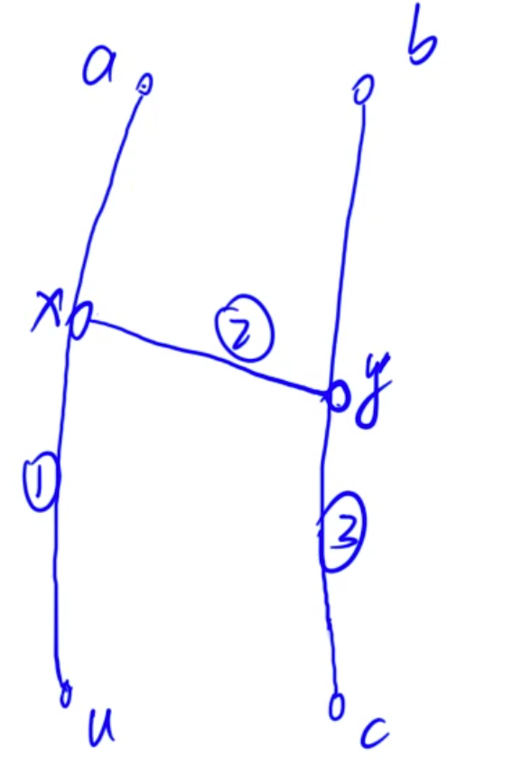
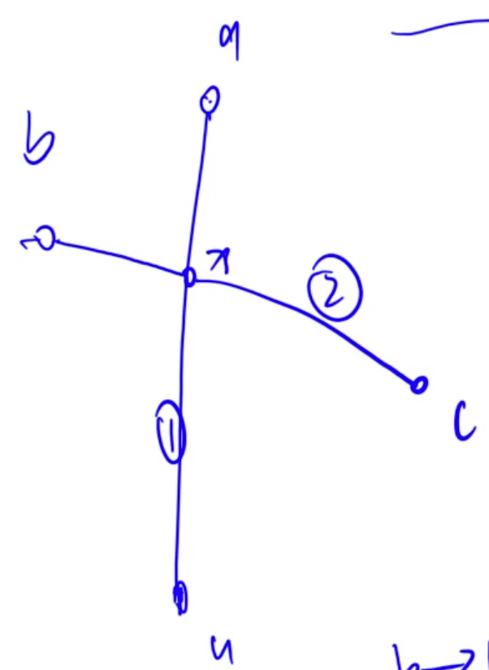

## 树形DP

### 树的最长路径

[原题链接](https://www.acwing.com/problem/content/1074/)

#### 解题思路

首先将一个无权树的最长直径的求法：

1. 从任意一点`a`出发，找到距离该点最远的一个点`u`，那么这个点一定是直径的一个端点
2. 从`u`出发，找到距离`u`最远的点`v`那么`u`与`v`之间的距离就是直径。

下面使用反证法证明。

假设从`u`不是一个直径的端点。那么设直径为`b`到`c`

那么这两条路径有两种可能的关系：

- 两条路径之间没有公共点
- 两条路径之间有公共点

第一种情况：



因为数的连通性，不放假设`x`和`y`之间有一条路径。那么可知，` 1>= 2 + 3 => 1 > 3 => 1 + 2 > 3`

那么从`b`到`u`比到`c`更远，所以`u`是直径上的一个端点。

第二种情况：



如果有交点，那么假设交点为x，那么有`1 >= 2`，同样也可以得到相同的结论。

上面是无权树的做法，如果是有权树(权重可以为负)，那么可以使用树形DP。

可以这样分析，随便选择一个根，那么最长的路径无非两种情况：

1. 这个路径没有经过根节点，那么就在其某棵子树中。
2. 这个路径经过了根节点，那么这个路径肯定是从一个子树穿过根再到另一颗子树。

所以可以递归实现，买个子树返回其根节点到树中其他节点的最大长度。然后汇总到根节点之后，选择子树中的最大的两个进行拼接，并维护最大值。在根处返回根接待延伸到所有子树中的路径的最大值即可。

#### C++代码

```c++
#include<iostream>
#include<algorithm>
using namespace std;

typedef pair<int, int> PII;

const int N = 10010;
vector<vector<PII>> e(N);
int ans = 0;
bool st[N];


int dfs(int a, int father){   // 传入父节点、避免死循环
    int d1 = 0, d2 = 0;  // 只维护前两个最大值
    for (auto x:e[a]){
        if(x.first != father){
            int t = dfs(x.first, a) + x.second;
            if(t >= d1){ 
                d2 = d1;
                d1 = t;
            }else if(t > d2){
                d2 = t;
            }
        }
    }
    ans = max(ans, max(d1, d1 + d2));  // 维护答案
    return d1;  // 返回结果
}


int main(){
    
    int n;
    cin >> n;
    for(int i = 0; i < n - 1; i ++){
        int a, b, c;
        cin >> a >> b >> c;
        e[a].push_back({b, c});
        e[b].push_back({a, c});
    }
    
    dfs(1, 0);
    cout << ans;
    return 0;
}
```

### 树的中心

[原题链接](https://www.acwing.com/problem/content/1075/)

#### 解题思路

两次树形DP。

第一次**用孩子节点的信息更新父节点的信息**，找到父节点到子树中的最大值和次大值。

第二次**用父节点的信息更新孩子节点的信息**。找到孩子节点向上的最大路径的值。


任意选择一个节点作为根，将整个树挂起来。然后每一个节点连的有几条边，那么就有几条最长的路径。

对于任意一个节点而言，比如2号节点。可以先求出其到子节点的最长路径和次长路径。(为什么要维护两个后面解释。)

这样就转化为了求孩子节点到其孩子节点的最长距离。这就是`down`的`dfs`。

接下来还需要求2号节点向上方向的最长距离。那么就可以转为求1号到其他节点的最长距离，但是这个距离不能经过2.这就是为什么要维护最长和次长的原因。如果只维护了最长，那么1最长又经过了2，这样就没法得到从2到1再到其他节点的最长距离了！

所以需要维护每个节点到其他节点的最长距离和次长距离，已经这个路径的下一个定点！

#### C++代码

```c++
#include<iostream>
#include<vector>
using namespace std;
typedef pair<int, int> PII;

const int N = 10010;

int d1[N], n1[N], d2[N], n2[N];
vector<vector<PII>> e(N);
int ans = 2e9;
 
void dfs_up(int a, int father, int w){  // 处理向上的路径
    
    if(father){
        int t;
        if(n1[father] != a){   // 如果父节点最远的路径的下一个节点经过自己，则选择第二场的路径
            t = w + d1[father];
        }else{
            t = w + d2[father];
        }
        if(t >= d1[a]){   // 跟新当前节点最远的两条路径
            d2[a] = d1[a];
            n2[a] = n1[a];
            d1[a] = t;
            n1[a] = father;
        }else if(t > d2[a]){
            d2[a] = t;
            n2[a] = father;
        }
    }
    
    ans = min(ans, d1[a]);  // 维护答案
    
    for(auto x:e[a]){   // 递归处理自己的所有孩子节点
        if(x.first != father){
            dfs_up(x.first, a, x.second);
        }
    }
    
}


int dfs_down(int a, int father){  // 处理向下的路径
    
    for(auto x : e[a]){    
        if(x.first != father){   // 找到下面的路径中最长的两个
            int t = dfs_down(x.first, a) + x.second;
            if (t >= d1[a]){
                d2[a] = d1[a];
                n2[a] = n1[a];
                d1[a] = t;
                n1[a] = x.first;
            }else if(t > d2[a]){
                d2[a] = t;
                n2[a] = x.first;
            }
        }
    }
    return d1[a];
}

int main(){
    
    int n;
    cin >> n;
    for(int i = 0; i < n - 1; i++){
        int a, b, c;
        cin >> a >> b >> c;
        e[a].push_back({b, c});
        e[b].push_back({a, c});    
    }

    dfs_down(1, 0);
    // for(int i = 1;  i <= n; i ++) cout << d1[i] << " " << n1[i] << " " << d2[i] << " " << n2[i] << endl;
    dfs_up(1, 0, 0);
    
    cout << ans;
    return 0;
    
}
```

### 数字转换

[原题链接](https://www.acwing.com/problem/content/1077/)

#### 解题思路

构图+最长直径。首先一个数的所有约数之和是一个定值，所以在这两个树之间有一条边。将约数之和看做自己的父节点，那么每个节点只有一个父节点，这样就构成了一颗树。当然可能在1到n中构成了多棵树，也就是森林。

在树构成之后，可以直接求每棵树中的最长直径即可。

#### C++代码

```c++
#include<iostream>
#include<vector>
using namespace std;

const int N = 50010;
int s[N];
vector<vector<int>> e(N);
bool st[N] = {false};   // 标记每个节点是否被访问过，适用于多棵树的情况
int ans;

int dfs(int a, int father){   // 树形DP方法求一棵树的最长直径问题
    
    st[a] = true;
    int d1 = 0, d2 = 0;
    for(auto x: e[a]){
        if(x != father){
            int t = dfs(x, a) + 1;
            if(t >= d1) d2 = d1, d1 = t;
            else if(t > d2) d2 = t;
        }
    }
    ans = max(d1 + d2, ans);
    return d1;
}

int main(){
    
    int n;
    cin >> n;
    
    for(int i = 1;  i <= n; i ++){   // 构建森林， 埃式筛法求每个数的全部约数和
        if(i != 1 && s[i] < i){
            e[i].push_back(s[i]);
            e[s[i]].push_back(i);
        }
        for(int j = i * 2; j <= n; j += i){
            s[j] += i;
        }
    }
    
    
    
    for(int i = 1; i <= n; i ++){   // 枚举所有点，有一个没有访问的话，那么就对这棵树查找。
        if(!st[i]){
            dfs(i, -1);
        }
    }
    cout << ans;
    return 0;
    
}
```

### 二叉苹果树

[原题链接](https://www.acwing.com/problem/content/1076/)

#### 解题思路

有依赖的背包问题简化版。决定问题的答案有两个维度，一个是树根，一个是保留的树支的个数。

定义`dp[i][j]`为以`i`为根的树，保留`j`个树支，最大的苹果数量。

将问题看做是分组背包问题。

左子树看做一个组，有子树看做一个组。每个组只能选择一个物品。体积是树枝的个数，重量就是这棵子树在这个体积下，能够得到的最大的苹果数量。然后利用分组背包问题求解即可。

注意到如果选择一颗子树，那么体积需要减1，因为根到树枝占了一个。

#### C++代码

```c++
#include<iostream>
#include<vector>
using namespace std;
typedef pair<int,int> PII;
const int N = 110;
vector<vector<PII>> e(N);
int dp[N][N];
int n, q;

void dfs(int a, int father){
    
    for(auto x:e[a]){  // 枚举物品组
        int node = x.first, w = x.second;  // 得到孩子和树枝的苹果数
        if(node == father) continue;
        dfs(node, a);  // 处理好这个孩子
        for(int j = q; j >= 0; j --){   // 枚举体积
            for(int k = 0; k + 1 <= j; k ++){   // 枚举决策(放哪一个)，同时体积要减一
                dp[a][j] = max(dp[a][j], dp[a][j - k - 1] + w + dp[node][k]);   // 转移的时候需要加上树枝的苹果数
            }
        }
    }
    
}

int main(){
    
    cin >> n >> q;
    for(int i = 0; i < n - 1; i ++){
        int a, b, c;
        cin >> a >> b >> c;
        e[a].push_back({b, c});
        e[b].push_back({a, c});
    }
    
    dfs(1, 0);
    
    // for(int i = 1; i <= n; i ++){
    //     for(int j = 0; j <= q; j ++){
    //         cout << dp[i][j] << " ";
    //     }
    //     cout << endl;
    // }
    cout << dp[1][q];  // 输出最终的结果
    return 0;  
    
}
```

### 战略游戏

[原题链接](https://www.acwing.com/problem/content/325/)

#### 解题思路

没有上司的舞会：没条边最多选择一个点，求最大权值

战略游戏：每条边最小选一个点，求最小权值

由于一个节点的结果会受其孩子状态的影响，可以使用状态机模型来对每个节点的表示进行扩展。

定义状态`dp[i][j]j = 0 | 1`表示：所有在以i为根的子树中选，且点`i`的状态是`j`的所有选法的最小值。

当第`i`个点不选的话，那么这个顶点的每个孩子都必须要选，因为这些子树之间相互独立。所以每一部分分别最小,`dp[a][1]`

当第`i`个点选的话，那么其孩子可选可不选，在选择和不选之间找各个最小即可,`min(dp[a][0], dp[a][1])`。

#### C++代码

```c++
#include<iostream>
#include<vector>
using namespace std;

const int N = 1510;
int dp[N][2];

void dfs(vector<vector<int>> &e, int a, int father){
    
    dp[a][0] = 0;
    dp[a][1] = 1;
    for(auto x:e[a]){   // 枚举所有的孩子节点
        if(x  != father){
            dfs(e, x, a);   // 递归处理孩子节点 
            dp[a][0] += dp[x][1];   // 状态转移方程
            dp[a][1] += min(dp[x][0], dp[x][1]);
        }
    }
}

int main(){
    
    int t;
    while(cin >> t){
        vector<vector<int>> e(t);
        for(int i = 0; i < t; i ++){
            int aa, n;
            scanf("%d:(%d)", &aa, &n);  // 格式化输入
            while(n--){
                int tt;
                cin >> tt;
                e[aa].push_back(tt);
                e[tt].push_back(aa);
            }
        }
        dfs(e, 0, -1);
        cout << min(dp[0][0], dp[0][1]) << endl;  
    }
    return  0;
}
```

### 皇宫看守

[原题链接](https://www.acwing.com/problem/content/1079/)

#### 解题思路

这个问题和上一个问题的区别在于，每个点都要被看到。那么每个点被谁看守就是一个维度。

- `dp[i][0]` 表示第`i`个节点不放元素，被父节点看到的最小花费
- `dp[i][1]` 表示第`i`个节点不放元素，被某个孩子节点看到的最小花费
- `dp[i][2]` 表示第`i`个节点上放置了元素的最小化费

那么状态转移如下：

- `dp[i][0]`的话，被父节点看到，那么去所有孩子中的`dp[k][i], dp[k][2]`，相加即可。
- `dp[i][1]`的话，不放元素，被某个孩子看到，那么就枚举所有的孩子，并令这个孩子状态为`2`，其他的孩子从`1,2`中取最小相加即可。由于在求`0`的时候已经得到了所有的`1, 2`最小之和，所以可以直接利用。
- `dp[i][2]`的话，放置元素，那么就直接枚举所有孩子的三种状态最小值之和即可。

最后输出`1`顶点的`1, 2`最小值，因为没有父节点。

为什么不能够只用两个状态来描述某个节点是否放置元素呢？

这是因为当我们枚举其父节点的时候，并不能说其孩子节点没放置元素的话，我就一定要放置元素。我也可以不放元素。

可以有一条边，其两个顶点都没有放置。所以只说一个顶点放不放置元素并不能将问题描述清楚。

#### C++代码

```c++

#include<iostream>
#include<vector>
using namespace std;

const int N = 1510;
int p[N];
vector<vector<int>> e(N);
int dp[N][3];

/*
dp[i][0] 表示第i个节点不放元素，被父节点看到的最小花费
dp[i][1] 表示第i个节点不放元素，被某个孩子节点看到的最小花费
dp[i][2] 表示第i个节点上放置了元素的最小化费

dp[i][0] = \sum_{k} min(dp[k][1], dp[k][2])
dp[i][1] = 从孩子中选择一个要去必须放孩子，然后其他的从1 和 2中取最小即可
dp[i][2] = \sum_{k} min(dp[k][0], dp[k][1], dp[k][2])


*/
void dfs(int a, int father){
    dp[a][2] = p[a];
    dp[a][1] = 0x3f3f3f3f;
    for(auto x:e[a]){
        if(x != father){
            dfs(x, a);
            dp[a][0] += min(dp[x][1], dp[x][2]);
            dp[a][2] += min( min(dp[x][0], dp[x][1]), dp[x][2]);
        }
    }
    for(auto x:e[a]){
        if(x != father){
            dp[a][1] = min(dp[a][1], dp[a][0] - min(dp[x][1], dp[x][2]) + dp[x][2]);
        }
    }
}

int main(){
    
    int n;
    cin >> n;
    for(int i = 1; i <= n; i ++){
        int a;
        cin >> a;
        cin >> p[a];
        int t;
        cin >> t;
        for(int j = 0; j < t; j ++){
            int b;
            cin >> b;
            e[a].push_back(b);
            e[b].push_back(a);
        }
    }
    
    dfs(1, 0);
    cout << min(dp[1][1], dp[1][2]);
    return 0;
    
}
```