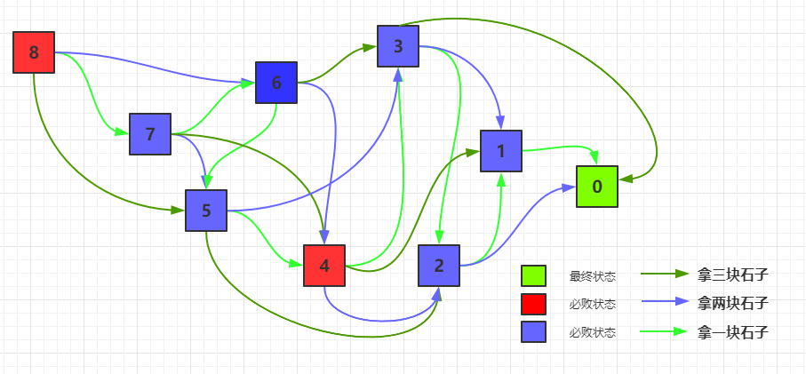
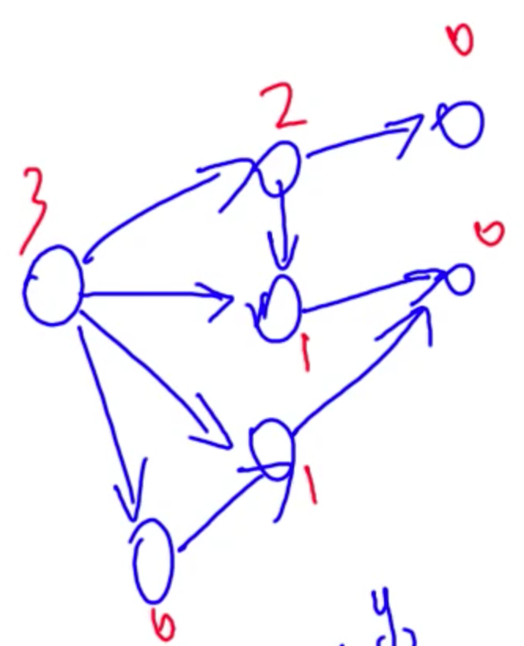

### 博弈论

先手必胜状态：从当前状态有一种方式可以到达一个先手必败状态

先手必败状态：从当前状态走不到一个先手必败状态

### NIM游戏1

[原题链接](https://leetcode-cn.com/problems/nim-game/)

#### 解题思路

首先根据当前桌子上的石子的个数可以得到先手对应的状态。

由于一个人可以拿`1-3`个石子，所以他可以将当前状态转到3个状态。

- 如果这3个状态全部都是先手必胜状态，那么当前状态就是先手必败状态。
- 如果这三个状态存在你着先手必败状态，那么当前状态就是先手必胜状态。

下面是整个**状态的转移图。**



通过写，发现有如下的规律：

```txt
dp[0] = False, dp[1 - 3] = True dp[4] = False, dp[5-7] = True
```

所以如果是四的倍数，则是必败状态，否则是必胜状态。

```python
class Solution:
    def canWinNim(self, n: int) -> bool:
        
        n %= 4
        if n == 0:
            return False
        return True
```

### NIM游戏2

[原题链接](https://www.acwing.com/problem/content/893/)

给定N堆物品，第i堆物品有Ai个。两名玩家轮流行动，每次可以任选一堆，取走任意多个物品，可把一堆取光，但不能不取。取走最后一件物品者获胜。两人都采取最优策略，问先手是否必胜。

我们把这种游戏称为NIM博弈。**把游戏过程中面临的状态称为局面**。整局游戏第一个行动的称为先手，第二个行动的称为后手。若在某一局面下无论采取何种行动，都会输掉游戏，则称该局面必败。
所谓采取最优策略是指，若在某一局面下存在某种行动，使得行动后对面面临必败局面，则优先采取该行动。同时，这样的局面被称为必胜。我们讨论的博弈问题一般都只考虑理想情况，即**两人均无失误，都采取最优策略行动时游戏的结果。**
**NIM博弈不存在平局，只有先手必胜和先手必败两种情况。**

定理： NIM博弈先手必胜，当且仅当 `A1 ^ A2 ^ … ^ An != 0`

#### 思路分析

现在的游戏的状态需要使用`n`个数表示，每个数表示这一堆的石子数。

- 最终状态：所有的石子都是零，这是一个必败状态
- 假设当前局面的状态是$x_1, x_2, ..., x_n$，如果`A1 ^ A2 ^ ... ^ An = 0`，则这个状态是必败状态
- 如果当前局面的状态满足`A1 ^ A2 ^ ..., ^ An != 0`,则这个状态是必胜状态。

可以证明具有如下的性质：

- 如果任意一个异或等于零的状态，不管采取什么操作，最终到达的状态都是一个异或不等于零的状态。
- 任意一个异或不等于零的状态，都可以采取一个操作使到达的状态是一个异或等于零的状态。

首先证明第二点：

假设当前的各个堆的元素异或的结果是`A1 ^ A2 ^ ..., ^ An = x`，假设`x`的二进制表示的最高位为第`k`位，

那么在`A1, A2, ..., An`中必定存在着一个数，其第`k`位是1。如果所有的数的第`k`位都是零的话，那么异或结果是0，矛盾了。

那么假设`Ai`的第`k`位是1，那么就有`Ai ^ x < Ai`。因为`Ai ^ x`，`Ai`的在第k为之前的数不会变，第`k`位会变成零，

所以`Ai ^ x < Ai`恒成立。这个时候就可以从`Ai`中拿出`Ai - (Ai ^ x)`个石子，那么`Ai`，就变成了`Ai ^ x`。

那么就有`A1 ^ A2 ^ ... ^ Ai ^ x ^ ... ^ An = x ^ x = 0`

下面证明第一点。也就是若`A1 ^ A2 ^ ... ^ An = 0`，则`A1 ^ A2 ^ ..., ^ Ai' ^ ... ^ An`不可能等于零

使用反证法，假设还是零，那么将上述两个异或起来，那么就有`Ai ^ Ai' = 0`，也就是`Ai = Ai'`，所以矛盾。

所以上述如果先手异或为零，那么他能够一直是异或为零的状态。每次都拿石子，问题最终会变成全零的状态，所以必败

如果先手异或不为零，那么他可以让后手的人面对的状态都是异或为零的状态，那么他就可以必胜！

#### C++代码

```c++
#include<iostream>
using namespace std;

int main(){
    
    int n;
    cin >> n;
    int res = 0;
    while(n--){
        int x; cin >> x; res ^= x;
    }
    if(res) cout << "Yes";
    else cout << "No";
    return 0;
}
```

### 台阶NIM游戏

[原题链接](https://www.acwing.com/problem/content/894/)

#### 解题思路

考虑奇数台阶上的石子，如果当前奇数台阶上的石子异或和不是零，那么按照前面的理论，可以采取策略是其异或和变成零。

因为最后所有都是零，也就是奇数台阶上的石子异或和是零是最终失败的状态。

- 如果当前奇数台阶上的石子的异或和是零的话，那么对手只可能将石子从偶数台阶搬到奇数台阶或者将石子从偶数台阶搬到奇数台阶。那么如果他将偶数搬到了奇数，那就可以将其再搬到下一个偶数，使得奇数台阶上的异或和还是零。如果其将石子从奇数搬到了偶数，那么可以按照经典的NIM游戏，可以将某个奇数台阶上的石子搬到下一个偶数台阶使奇数台阶上的石子的异或值变为零。

所以只需要奇数台阶上的石子异或和是零，那么就是先手必胜态，否则是先手必败态。

```c++
#include<iostream>
using namespace std;

int main(){
    
    int n; cin >> n;
    int res = 0;
    for(int i = 1; i <= n; i ++){
        int x; cin >> x;
        if( i & 1) res ^= x;
    }
    if(res) cout << "Yes";
    else cout << "No";
    return 0;
}
```

### SG函数

#### 有向图游戏

给定一个有向无环图，图中有一个唯一的起点，在起点上放有一枚棋子。两名玩家交替把这枚棋子沿有向边进行移动，每次可以移动一步，无法移动者判负。该游戏称为有向图游戏。

**任何一个公平组合游戏都可以转化为有向图游戏。具体方法是，把每个局面看成图中的恶一个节点，并且从每个局面沿着合法行动能够到达的下一个局面连有向边。**

#### Mex运算

设`S`表示一个非负整数集合，定义`mex(S)`为求出不属于集合`S`的最小非负整数的运算，即`mex(S) = min(x)`，`x`属于自然数，且`x`不属于`S`。比如`mex({2, 3, 4}) = 0`

在一个游戏中，当前局面可以通过不同的操作到达很多不同的局面，每种局面是一种状态。

定义`SG(终点) = 0`，则`SG(x)`， 定义为从状态`x`可以到的状态$y_1, y_2, ..., y_k$的`SG`的值的`mex`函数，即

$$SG(x) = mex\{ SG(y_1), SG(y_2), ..., SG(y_k)\}$$



对于一个图的状态而言，可以发现如果一个状态的`SG`函数值为零，则其是先手必败状态。如果其`SG`函数值非零，则其是先手必胜状态。

- 如果为零，说明其可到的状态都是非零状态，所以先手必败
- 如果非零，说明其可以到一个零状态，所以先手必胜

特别得，整个有向图游戏G的SG函数值被定义为有向图游戏起点`s`的SG函数值，即`SG(G) = SG(s)`.

**有向图游戏的和：**

设`G1, G2, ..., Gm`是`m`个有向图游戏。定义有向图游戏`G`，他的行动规则是任选某个有向图游戏`Gi`，并在`Gi`上行动一步`G`称为有向图游戏`G1, G2, ... ,Gm`的和。

有向图游戏的和的`SG`函数值等于它包含的各个子游戏`SG`函数值的异或和，即：

`SG(G) = SG(G1) ^ SG(G2) ^... ^ SG(Gm)`

现在有多张图，每个玩家每一次可以选择一张图使其状态变为下一个状态。当任何一个图都无法操作的时候，当前玩家输。

如果所有图起点的`SG`函数异或起来值是零的话，则必败，否则必胜。

证明：

1. 整个游戏的终止状态的`SG`值异或和为零。
2. 如果当前异或不为零，则可以找到某一个局面`SG(x_i) ^ x < SG(x_i)`，利用`SG`函数的定义，$x_i$可以走到`0-SG(x_i) -1` 的任意一个状态，所以可以使`SG(x_i)`变为`SG(x_i)^x`状态，这个时候整个游戏的`SG`又变为了0.
3. 同理，可以用反证法证明，如果当期整个游戏的`SG`为零，则不管怎么走，之后的`SG`函数一定不为零。(和NIM游戏的证明过程相同)。

证毕！

#### 定理：

1. 有向图游戏的某个局面必胜，当前仅当该局面对应节点的SG函数值大于零。
2. 有向图游戏的某个局面必败，当且仅当该局面对应节点的SG函数值等于零。

### 集合NIM游戏

[原题链接](https://www.acwing.com/problem/content/895/)

```c++
// https://www.acwing.com/problem/content/description/895/
#include<iostream>
#include<cstring>
#include<unordered_set>
using namespace std;
const int K = 110, M = 10010;
int s[K], h[M];
int f[M];
int n, k;

int sg(int a){  // 求sg函数可以使用记忆化搜索，而不是自底向上地递推
    if(f[a] != -1) return f[a];  
    unordered_set<int> se;
    for(int i = 0; i < k; i ++){
        if(a >= s[i]) se.insert(sg(a - s[i]));
    }
    for(int i = 0; ; i ++){
        if(!se.count(i)){
            f[a] = i;
            return i;
        }
    }
}

int main(){
    
    memset(f, -1, sizeof f);
    cin >> k;
    for(int i = 0; i < k; i ++) cin >> s[i];
    cin >> n;
    for(int i = 0; i < n; i ++) cin >> h[i];
    int res = 0;
    for(int i = 0; i < n; i ++) res ^= sg(h[i]);  // 判断所有堆石子的异或和是否为零
    if(res) cout << "Yes";
    else cout << "No";
    return 0;
}
```

### 拆分NIM游戏

[原题链接](https://www.acwing.com/problem/content/896/)

计算每个起始点的SG函数值。每个点可能到达的状态为`(i, j)` 对，而且划分为两堆之后，其对应的状态变成了为`SG(i) ^ SG(j)`。

所以找到对应的所有可能的状态，然后找到对应的`mex`值，就可以求出当前状态对应的`SG`值。

```c++
#include<iostream>
#include<cstring>
#include<unordered_set>
using namespace std;

const int N = 110;

int f[N];

int cg(int a){
    if(f[a] != -1) return f[a];
    unordered_set<int> se;
    for(int i = 0; i < a; i ++){
        for(int j = 0; j <= i; j ++){
            se.insert(cg(i) ^ cg(j));
        }
    }
    for(int i = 0; ; i ++){
        if(!se.count(i))
            return f[a] = i;
    }
}


int main(){
    
    memset(f, -1, sizeof f);
    int n;
    cin >> n;
    int res = 0;
    while(n--){
        int x;
        cin >> x;
        res ^= cg(x);
    }
    if(res) cout << "Yes";
    else cout << "No";
    return 0;
}
```

### 总结

其实回头看，最开始的NIM游戏只是`SG`函数的一个特例。因为每个人可以选任何一个图拿走任意多的石子，所以任意一个状态能够走到$0 \sim (x_i - 1)$的任何一个状态，所以每个状态的`SG`函数值就是自己本身。所以只需要对所有堆石子做异或和就可以了。

在解决类似的问题需要找到当前局面可能到达的所有可能的局面的SG函数，然后对这个集合求`mex`函数。在求出所有石堆的`SG`函数，求异或，就可以得到是否先手必胜还是先手必败。

#### 公平组合游戏ICG

若一个游戏满足：

1. 由两名玩家交替行动；
2. 在游戏进程的任意时刻，可以执行的合法行动与轮到哪名玩家无关；
3. 不能行动的玩家判负；

则称该游戏为一个公平组合游戏。

NIM游戏术语公平组合游戏，但城建的棋类游戏，比如围棋，就不是公平组合游戏。因为围棋交战双方分别只能落黑子和百子，胜负判定也比较复杂，不满足条件2和条件3。

