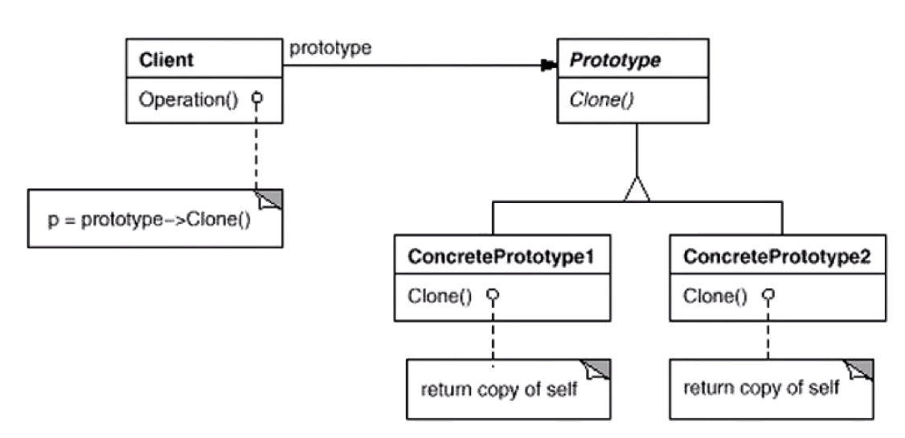

## 原型模式

有些对象在创建的时候可能**需要花费较高的代价**，比如类初始化的时候需要消耗非常多的资源，加载硬盘，访问数据库等。而且把一个对象要提供给其它对象访问的时候，各个调用者可能都需要修改其值或者状态。这个时候可以保存一个对象的原型，然后再每次请求的时候通过在这个原型上克隆出一个新的对象返回。

在实际的项目中，原型模式很少单独出现，一般是和工厂方法一起出现，通过Clone的方法创建一个对象，然后又工厂方法提供给调用者。也就是在工厂方法中不用new，而是使用clone。但是在C++中要正确实现深拷贝，才能保证正确性。

```c++
//抽象类，提供稳定的抽象抽象
class ISplitter{
public:
    virtual void split()=0;
    virtual ISplitter* clone()=0; //通过克隆自己来创建对象
    
    virtual ~ISplitter(){}

};


class MainForm : public Form
{
    ISplitter*  prototype;//原型对象

public:
    
    MainForm(ISplitter*  prototype){
        this->prototype=prototype;
    }
    
	void Button1_Click(){

		ISplitter * splitter=
            prototype->clone(); //克隆原型
        
        splitter->split();
	}
};


//具体类
class BinarySplitter : public ISplitter{
public:
    virtual ISplitter* clone(){
        return new BinarySplitter(*this);  // 使用拷贝构造方法提供自己的克隆
    }
};


class TxtSplitter: public ISplitter{
public:
    virtual ISplitter* clone(){
        return new TxtSplitter(*this);
    }
};


class PictureSplitter: public ISplitter{
public:
    virtual ISplitter* clone(){
        return new PictureSplitter(*this);
    }
};


class VideoSplitter: public ISplitter{
public:
    virtual ISplitter* clone(){
        return new VideoSplitter(*this);
    }
};
```

### UML图



### 总结

1. 原型模式同样用于隔离对象的使用者和具体类型(易变类)之间的耦合关系，它同样要求这些**“易变类”**拥有**“稳定的接口”**，也**就相当于有稳定的函数指针个数以及类型**。
2. 原型模式对于如何创建易变类的实例对象使用了原型克隆的方法，使得我们可以非常灵活的动态创建有用某些稳定接口的新对象。所需工作仅仅是注册一个新类的对象(原型)，然后再任何需要的地方Clone。
3. 原型模式中的Clone方法可以利用某些框架中的序列化来实现深拷贝，在C++中就直接使用正确实现的拷贝构造函数即可。

