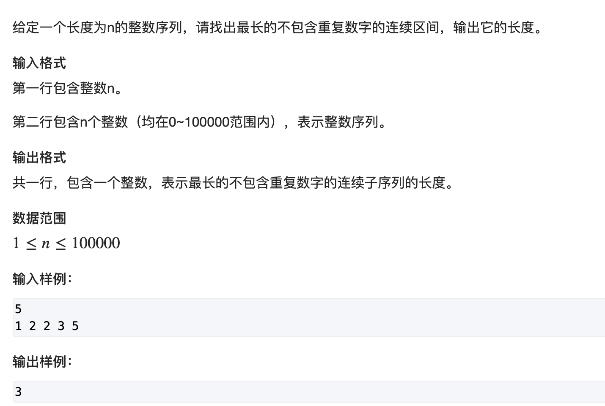

### 1. 双指针算法

双指针算法一般是将暴力遍历的算法通过观察一些规律，从而将复杂度从降为线性复杂度的方法。

维护两个指针，指针内部的区间满足某些性质或者两个指针指向的数据满足某些性质(有序数组两数和的问题)。

### 2. 最长不重复子序列




维护一个数组，记录当前区间各个数字出现的次数，移动右边指针的时候判断移入的数在不在区间内，如果在，右移左指针，直到

区间没有重复的数字。

```c++
#include <iostream>
#include <set>

using namespace std;

const int N = 100010;
int n;
int q[N];
int s[N];  // 存放当前区间每个元素出现个数，也可以使用hash表


int main(){
    cin >> n;
    int res = 1;
    for(int i = 0; i < n; i++)
        cin >> q[i];
    for(int i=0, j=0; j < n; j++){
        while(s[q[j]]) s[q[i ++]] --;
        res = max(res, j - i + 1);
        s[q[j]] ++;
    }
    cout << res ;
    return 0;
}
```


### 3. 数组元素的目标和


这种有序数据目标和的问题，一般都可以转换为双指针问题。一个指针指向最大，一个指向最小。然后利用大小关系挪动指针。

如果是无序数组，可以先对其排序再处理。如果是多个数，可以先对最小数进行遍历，然后从剩下的区间来利用双指针方法。

```c++
#include <iostream>

using namespace std;
typedef long long LL;
const int N = 100010;

int A[N], B[N];
int n, m, x;

int main(){
    cin >> n >> m >> x;
    for(int i = 0; i < n; i++)
        cin >> A[i];
    for (int i = 0; i < m; i ++)
        cin >> B[i];
    for(int i = 0, j = m - 1; ;){
        if(A[i] + B[j] == x){
            cout << i << " " << j;
            return 0;
        }else if(A[i] + B[j] < x){
            i ++;
        }else {
            j --;
        }
    }
    return 0;
}
```

### 最小覆盖子串

[原题链接](https://leetcode-cn.com/problems/minimum-window-substring/)

#### 解题思路

双指针，同时用哈希表存储两个指针之间的各个字符串出现的次数，并和目标串进行比较。右指针移动到包含目标串的时候，就竟可能移动左指针，使其不包含目标串。

#### C++代码

```c++
#include<unordered_map>
class Solution {
public:
    
    unordered_map<char, int> smp, tmp;
    
    bool check(){  // 检查i-j区间是否满足情况
        for(auto x:tmp){
            if(smp[x.first] < x.second) return false;
        }
        return true;
    }
    
    string minWindow(string s, string t) {
        for(auto x:t) tmp[x] ++;
        int l = -1e9, r = 1e9;
        int i = 0, j = 0;
        while(j < s.size()){
            smp[s[j]] ++;
            while(check() && i <= j){  // 当区间满足时，不断移动左指针
                if(j - i < r - l){
                    l = i;
                    r = j;
                }
                smp[s[i]] --;
                i ++;
            }
            j ++;  // 移动右指针
        }
        if(l == -1e9) return "";
        string ans = "";
        for(int i = l; i <= r; i ++) ans += s[i];
        return ans;
    }
};
```

