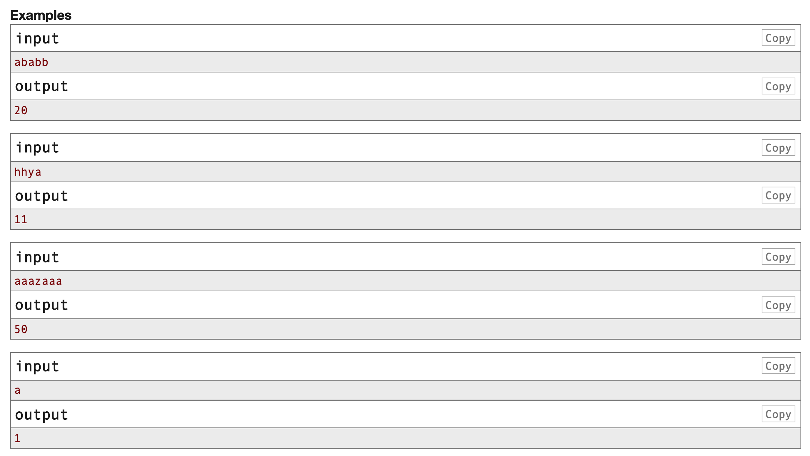

## 后缀数组题目汇总

### 01[字符串边界](https://codeforces.com/edu/course/2/lesson/2/5/practice/contest/269656/problem/D)

这个题目是找到一个字符串的所有子串的所有边界。一个字符串的边界的含义是，它既是前缀也是后缀。




#### 1.1 解题思路

先跑一遍SA算法，然后对于任意两个后缀$i, j$，如果他们的最长公共前缀的长度是$lcp(i, j)$，那么我们可以从$i, j$两个点开始逐步向后进行扩展，假设扩展了的长度为$k$，则子串$[i, j + k - 1]$就能够贡献一个边界。

同样的道理，所有子串的所有边界，都可以分为上面两个维度的表示：

1. 边界的起始点
2. 边界的长度。

所以现在的问题就转化为了，求所有的后缀字符串对，他们的最长公共前缀的和。

$$\sum_{i=1}^{n}\sum_{j=i + 1}^{n} lcp(i, j)$$

在得到`height`数组之后，我们可以在它上面建ST表，这样就可以在$O(1)$的时间内直接返回$lcp(i, j)$。但是枚举所有的对还是会超时。

下面是一个非常trick的技巧。我们不再单独考虑每两个对，而是从大到小枚举最长公共前缀的长度$l$，然后看有多少对$cnt$的最长公共前缀的长度是$l$，那么对答案的贡献就是$l * cnt$。

在统计有多少对的长度是$l$的时候，我们使用并查集来进行维护。在`height`数组上建立并查集，然后从大到小枚举`l`，对于给定的`l`，我们找到`height[i] == l`的所有`i`，然后依次将他们所在的上下两个连通块连接起来，由于这两个连通块直接都要跨越$l$这个接线，所有对于任意第一个连通块中的点，第二个联通块中点和他的最长公共前缀都是$l$!所以对答案的贡献就是$sz[a] * sz[b]$。

最终再将这两个联通快合并即可。

#### 1.2 时空复杂度

SA数组的时间复杂度为$O(n\log n)$,枚举所有的`lcp`的长度，然后再进行并查集合并的时间复杂度为$O(n)$，所以整体的时间复杂度为$n \log n$

空间复杂度是$O(n)$

#### C++代码

```c++
#include <iostream>
#include <cstring>
#include <vector>
using namespace std;

typedef long long LL;

const int N = 4e5 + 5;
int sa[N], rk[N], x[N], y[N], cnt[N];
int height[N];
int st[N][20];
vector<int> hs[N];
int fa[N], sz[N];

int n, m;
string s;

LL ans;

void get_sa() {
    m = 'z';

    for (int i = 1; i <= n; i ++) cnt[x[i] = s[i]] ++;
    for (int i = 2; i <= m; i++) cnt[i] += cnt[i - 1];
    for (int i = n; i; i --) sa[cnt[x[i]] --] = i;

    for (int k = 1; k < n; k <<= 1) {
        int num = 0;
        for (int i = n - k + 1; i <= n; i ++) y[++ num] = i;
        for (int i = 1; i <= n; i ++) {
            if (sa[i] > k) {
                y[++ num] = sa[i] - k;
            }
        }
        for (int i = 1; i <= m; i ++) cnt[i] = 0;
        for (int i = 1; i <= n; i ++) cnt[x[i]] ++;
        for (int i = 2; i <= m; i ++) cnt[i] += cnt[i-1];
        for (int i = n; i; i --) sa[cnt[x[y[i]]] --] = y[i], y[i] = 0;
        swap(x, y);
        x[sa[1]] = 1, num = 1;
        for (int i = 2; i <= n; i ++) {
            x[sa[i]] = (y[sa[i]] == y[sa[i - 1]] && y[sa[i] + k] == y[sa[i - 1] + k]) ? num : ++ num;
        }
        if (num == n) break;
        m = num;
    }

}

void get_height() {

    for (int i = 1; i <= n; i ++) rk[sa[i]] = i;
    for (int i = 1, k = 0; i <= n; i ++) {
        if (rk[i] == 1) continue;
        if (k) k --;
        int j = sa[rk[i] - 1];
        while (i + k <= n && j + k <= n && s[i + k] == s[j + k]) k ++;
        height[rk[i]] = k;
    }
}


int find(int a) {
    return a == fa[a] ? a : fa[a] = find(fa[a]);
}

void calc(int r) {
    for (auto x : hs[r]) {
        int a = find(x - 1), b = find(x);  
        ans += (LL) r * sz[a] * sz[b]; // 将上下两个连通块合并，并更新答案。
        fa[a] = b;
        sz[b] += sz[a];
    }
}

int main() {

    ios::sync_with_stdio(false);
    cin.tie(nullptr);
    cout.tie(nullptr);

    cin >> s;
    n = s.size();
    s = " " + s;
    get_sa();
    get_height();
    for (int i = 1; i <= n; i ++) fa[i] = i, sz[i] = 1;
    for (int i = 2; i <= n; i ++) hs[height[i]].push_back(i);  // 记录每个height[i]的位置
    for (int i = n - 1; i >= 1; i --) calc(i); // 从大到小枚举lcp的大小
    ans += (LL)(n + 1) * n / 2;  // 对于每个子字符串都会贡献一个空字符串
    cout << ans;
    return 0;
}
```

### 02. [Refrain](https://codeforces.com/edu/course/2/lesson/2/5/practice/contest/269656/problem/E)

题目大意：

给定一个字符串，求一个子串出现的次数和它长度乘积的最大值。


#### 2.1 解题思路

和上一题类似，对于给定最长公共前缀的长度，我们找到有多少后缀的最长公共前缀长度是它，那么也就统计出了这个子串出现的次数。因为任何一个子串都是一个后缀的前缀。

这样就和上一次变成了一个问题，从大到小枚举最长公共前缀的大小，然后使用并查集来求出这个长度的子串次数的最大值，维护答案即可。

边界条件是，出现次数为1，那么答案就是整个字符串的长度。

#### 2.2 时空复杂度

时间复杂度为$O(n \log n)$，空间复杂度为$O(n)$

#### 2.3 C++代码

```c++
#include <iostream>
#include <cstring>
#include <vector>
using namespace std;

typedef long long LL;

const int N = 4e5 + 5;
int sa[N], rk[N], x[N], y[N], cnt[N];
int height[N];
int st[N][20];
vector<int> hs[N];
int fa[N], sz[N];

int n, m;
string s;

LL ans = 1;
int len = 1, beg = 1;

void get_sa() {
    m = 'z';

    for (int i = 1; i <= n; i ++) cnt[x[i] = s[i]] ++;
    for (int i = 2; i <= m; i++) cnt[i] += cnt[i - 1];
    for (int i = n; i; i --) sa[cnt[x[i]] --] = i;

    for (int k = 1; k < n; k <<= 1) {
        int num = 0;
        for (int i = n - k + 1; i <= n; i ++) y[++ num] = i;
        for (int i = 1; i <= n; i ++) {
            if (sa[i] > k) {
                y[++ num] = sa[i] - k;
            }
        }
        for (int i = 1; i <= m; i ++) cnt[i] = 0;
        for (int i = 1; i <= n; i ++) cnt[x[i]] ++;
        for (int i = 2; i <= m; i ++) cnt[i] += cnt[i-1];
        for (int i = n; i; i --) sa[cnt[x[y[i]]] --] = y[i], y[i] = 0;
        swap(x, y);
        x[sa[1]] = 1, num = 1;
        for (int i = 2; i <= n; i ++) {
            x[sa[i]] = (y[sa[i]] == y[sa[i - 1]] && y[sa[i] + k] == y[sa[i - 1] + k]) ? num : ++ num;
        }
        if (num == n) break;
        m = num;
    }

}

void get_height() {

    for (int i = 1; i <= n; i ++) rk[sa[i]] = i;
    for (int i = 1, k = 0; i <= n; i ++) {
        if (rk[i] == 1) continue;
        if (k) k --;
        int j = sa[rk[i] - 1];
        while (i + k <= n && j + k <= n && s[i + k] == s[j + k]) k ++;
        height[rk[i]] = k;
    }
}


int find(int a) {
    return a == fa[a] ? a : fa[a] = find(fa[a]);
}

void calc(int r) {
    for (auto x : hs[r]) {
        int a = find(x - 1), b = find(x);
        if ((LL) r * (sz[a] + sz[b]) > ans) {
        	ans = (LL) r * (sz[a] + sz[b]);
        	len = r;
        	beg = sa[b];
        }
        fa[a] = b;
        sz[b] += sz[a];
    }
}

int main() {

    ios::sync_with_stdio(false);
    cin.tie(nullptr);
    cout.tie(nullptr);
	cin >> n >> m;
	s = " ";
    for (int i = 1; i <= n; i ++) {
    	int x;
    	cin >> x;
    	char a = 'a' + x;
    	s += a;
    }
    m = 'z';
    get_sa();
    get_height();
    for (int i = 1; i <= n; i ++) fa[i] = i, sz[i] = 1;
    for (int i = 2; i <= n; i ++) hs[height[i]].push_back(i);
    for (int i = n - 1; i >= 1; i --) calc(i);
    if (ans < n) {
    	ans = n;
    	beg = 1;
    	len = n;
    }
    cout << ans << '\n';
    cout << len << '\n';
	for (int i = 0; i < len; i ++) cout << s[beg + i] - 'a' << ' ';
    return 0;
}
```

### 03. [Periodic Substring](https://codeforces.com/edu/course/2/lesson/2/5/practice/contest/269656/problem/F)

题目大意：

给定一个字符串，求出其所有子串的最大循环周期。也就是某个子串是由$k$个字符串拼接而成，求这个$k$的最大值。


#### 3.1 解题思路

这道题是CF EDU SA的最后一题，难度也是非常的大。这个系列的线段树的最后两道题都是IOI的题目。

在解决这道题之前，我先是看了博客学习了[HDU 6661](https://vjudge.net/problem/HDU-6661)这道问题的解法，这两道题几乎一模一样，甚至我觉得后者更难一些。

具体到这道题而言，我们首先枚举循环节的长度$l$.

对于每一个$l$，枚举起点$1, 1 + l, 1 + 2l, 1 + 3l ...$，然后我们判断相邻两个后缀的最公共前缀的长度是否大于$l$，如果大于$l$的话，就说明可以拼成一个循环节。这样从一个起点一直向后扩展，直到扩展到一个不满足条件的为止。假设起点是$L$，终点是$R$,然后我们再求一遍$R + 1$和$L$的最长公共前缀的长度$extR$以及$1 - (L - 1)$和$1 - R$的最长公共后缀的长度$extL$。然后区间$(L - extL) - (R + extR)$这里面，我们任取长度为$l$的整数倍的字符串，其都是循环周期为$l$的循环串，所以这里面的$k$的最大值就是字符串长度除以k向下取整。然后一个一个向后找即可。

为什么这样就是对的呢？我们可以想一下，如果原串中有一个循环了$m$次，循环节长度为$l$的子串，那么不管我们怎么选择起点，都可以找到至少$m - 1$个点，他们的最长公共前缀的长度不小于$l$。但是我们不能保证选择的点都刚好是边界，所以我们需要上面的两次向左和向右的扩展的操作。

上面的求两个前缀的最大公共后缀可以将原串翻转一下，在反串上跑一边SA即可。

#### 3.2 时空复杂度

SA算法是$n \log n$，建ST表为$n \log n$，枚举循环节长度的时间复杂度为

$$\sum_{i=1}^{n} \frac{n}{i} = n \sum_{i=1}^{n}\frac{1}{n} = O(n \log n)$$

所以整体时间复杂度为$O(n \log n)$

#### 3.3 C++代码

代码实现的时候需要注意，如果最后扩展到了大于`n`的地方，那么需要将右边界设为`n`。

```c++
#include <iostream>
#include <cstdio>
#include <cmath>
#include <algorithm>
#include <cstring>
using namespace std;

typedef long long LL;
const int N = 4e5 + 5;

int sa1[N], rk1[N], x[N], y[N], cnt[N];
int sa2[N], rk2[N];
int height1[N], height2[N];
int rec[N];  // 记录log2的值
int n, m;
string s;
int k;
int st1[N][20], st2[N][20];
int ans;


void get_sa(int sa[]) {

    m = 'z';
    for (int i = 1; i <= m; i ++) cnt[i] = 0;
    for (int i = 1; i <= n; i ++) cnt[x[i] = s[i]] ++;
    for (int i = 2; i <= m; i ++) cnt[i] += cnt[i - 1];
    for (int i = n; i; i --) sa[cnt[x[i]] --] = i;

    for (int k = 1; k < n; k <<= 1) {
        int num = 0;
        for (int i = n - k + 1; i <= n; i ++) y[ ++num] = i;
        for (int i = 1; i <= n; i ++) {
            if (sa[i] > k) {
                y[++num] = sa[i] - k;
            }
        }
        for (int i = 1; i <= m; i ++) cnt[i] = 0;
        for (int i = 1; i <= n; i ++) cnt[x[i]] ++;
        for (int i = 2; i <= m; i ++) cnt[i] += cnt[i - 1];
        for (int i = n; i; i --) sa[cnt[x[y[i]]] --] = y[i], y[i] = 0;
        swap(x, y);
        x[sa[1]] = 1, num = 1;
        for (int i = 2; i <= n; i ++) {
            x[sa[i]] = (y[sa[i]] == y[sa[i - 1]] && y[sa[i] + k] == y[sa[i - 1] + k]) ? num : ++ num;
        }
        if (num == n) break;
        m = num;
    }
}

void get_height(int sa[], int rk[], int height[]) {
    for (int i = 1; i <= n; i ++) rk[sa[i]] = i;
    for (int i = 1, k = 0; i <= n; i ++) {
        if (rk[i] == 1) continue;
        if (k) k --;
        int j = sa[rk[i] - 1];
        while (i + k <= n && j + k <= n && s[i + k] == s[j + k]) k ++;
        height[rk[i]] = k;
    }
}

void build_st(int st[][20], int height[]) {

    for (int i = 1; i <= n; i ++) st[i][0] = height[i];
    for (int i = 1; (1 << i) <= n; i ++) {
        for (int j = 1; j + (1 << i) - 1 <= n; j ++) {
            st[j][i] = min(st[j][i - 1], st[j + (1 << (i - 1))][i - 1]);
        }
    }
}

int query(int l, int r, int st[][20]) {
    if (l > r) swap(l, r);
    l ++;
    int t = log(r - l + 1) / log(2);
    return min(st[l][t], st[r - (1 << t) + 1][t]);
}

int work(int i, int j, int len) {
    int all_len = j - i + query(rk1[i], rk1[j], st1) + query(rk2[n - i + 2], rk2[n - j + 2], st2);
    return all_len / len;
}


int main() {

	ios::sync_with_stdio(false);
	cin.tie(nullptr);
	cout.tie(nullptr);
	cin >> s;
    n = s.size();
    s = " " + s;
    get_sa(sa1);
    get_height(sa1, rk1, height1);
    build_st(st1, height1);
    reverse(s.begin() + 1, s.end());
    get_sa(sa2);
    get_height(sa2, rk2, height2);
    build_st(st2, height2);
    ans = 0;
    for (int len = 1; len <= n; len ++) {
        int last = 1;
        int i;
        for (i = len + 1; i <= n; i += len) {
            if (query(rk1[last], rk1[i], st1) >= len) continue;
            ans = max(ans, work(last, i, len));
            if (i + len - 1 <= n) last = i;  // 注意细节
            else last = 0; 
        }
        if (last) ans = max(ans, work(last, n + 1, len));
    }
    printf("%d\n", ans);
    return 0;
}
```

#### 04. [HDU 6661](https://vjudge.net/problem/HDU-6661)


#### 4.1 解题思路

其实和上一题类似，枚举循环节长度，只不过这里是要找到固定的$k$的个数。

利用上一题的方法得到区间$[L, R]$之后，在这个区间内部的任意长度为$l * k$的子串都是满足条件的。所以对答案的贡献为$R - L + 1 - (l * k ) + 1$

#### 4.2 时空复杂度

同上

#### 4.3 C++代码

```c++
#include <bits/stdc++.h>

using namespace std;
const int maxn = 1e6 + 10;
typedef long long ll;

struct SA
{
    char s[maxn];
    int sa[maxn], t[maxn], t2[maxn], c[maxn], n;

    void build_sa(int n, int m)
    {
        int *x = t, *y = t2;
        for(int i = 0; i < m; i++) c[i] = 0;
        for(int i = 0; i < n; i++) c[x[i] = s[i]]++;
        for(int i = 1; i < m; i++) c[i] += c[i - 1];
        for(int i = n - 1; i >= 0; i--) sa[--c[x[i]]] = i;
        for(int k = 1; k <= n; k <<= 1)
        {
            int p = 0;
            for(int i = n - k; i < n; i++) y[p++] = i;
            for(int i = 0; i < n; i++) if(sa[i] >= k) y[p++] = sa[i] - k;
            for(int i = 0; i < m; i++) c[i] = 0;
            for(int i = 0; i < n; i++) c[x[y[i]]]++;
            for(int i = 0; i < m; i++) c[i] += c[i - 1];
            for(int i = n - 1; i >= 0; i--) sa[--c[x[y[i]]]] = y[i];
            swap(x, y);
            p = 1; x[sa[0]] = 0;
            for(int i = 1; i < n; i++)
                x[sa[i]] = y[sa[i - 1]] == y[sa[i]] && y[sa[i - 1] + k] == y[sa[i] + k] ? p - 1 : p++;
            if(p >= n) break;
            m = p;
        }
    }

    int rk[maxn], height[maxn];

    void getHeight()
    {
        for(int i = 1; i <= n; i++) rk[sa[i]] = i;
        for(int i = 0, k = 0; i < n; i++)
        {
            if(k) k--;
            int j = sa[rk[i] - 1];
            while(s[i + k] == s[j + k]) k++;
            height[rk[i]] = k;
        }
        for(int i = n; i > 0; i --) rk[i] = rk[i - 1];
    }

    int dp[maxn][21];

    void RMQ()
    {
        for(int i = 1; i <= n; i ++) dp[i][0] = height[i];
        for(int j = 1; (1 << j) < maxn; j ++)
            for(int i = 1; i + (1 << j) - 1 <= n; i ++)
                dp[i][j] = min(dp[i][j - 1], dp[i + (1 << (j - 1))][j - 1]);
    }

    int query(int l, int r)
    {
        int k = 0;
        while((1 << (k + 1)) <= r - l + 1) k ++;
        return min(dp[l][k], dp[r - (1 << k) + 1][k]);
    }

    int lcp(int x, int y)
    {
        x = rk[x], y = rk[y];
        if(x > y) swap(x, y);
        return query(x + 1, y);
    }
}A, B;

int n, k;

int work(int l, int r, int p)
{
    int exR = A.lcp(l, r + 1), exL = B.lcp(n + 1 - r, n + 1 - l + 1);
    l -= exL, r += exR;
    return max(0, r - l + 1 - p * k + 1);
}

int main()
{
    int _;
    scanf("%d", &_);
    while(_ --)
    {
        scanf("%d%s", &k, A.s);
        n = strlen(A.s);
        if(k == 1)
        {
            printf("%lld\n", 1ll * n * (n + 1) / 2);
            continue;
        }
        reverse_copy(A.s, A.s + n, B.s); A.n = B.n = n;
        A.build_sa(n + 1, 130), B.build_sa(n + 1, 130);
        A.getHeight(), B.getHeight();
        A.RMQ(), B.RMQ();
        ll ans = 0;
        for(int i = 1; i <= n / 2; i ++)
        {
            int last = 1;
            for(int j = i + 1; j <= n; j += i)
            {
                if(A.lcp(last, j) >= i) continue;
                ans += work(last, j - 1, i);
                if(j + i - 1 <= n) last = j;
                else last = 0;
            }
            if(last) ans += work(last, n, i);
        }
        printf("%lld\n", ans);
    }
    return 0;
}
```

### 05. [品酒大会](https://www.luogu.com.cn/problem/P2178)


#### 5.1 解题思路

和第一题使用并查集维护类似，只不过现在并查集还需要维护当前集合中的最大值和最小值。

#### 5.2 时空复杂度

$O(n \log n)$

#### 5.3 C++代码

```c++
#include <iostream>
#include <vector>
using namespace std;

typedef long long LL;

const int N = 3e5 + 5, INF = 2e9;
int sa[N], rk[N], x[N], y[N], cnt[N];
int height[N];
int w[N];
string s;
int n, m;
vector<int> hs[N];
int fa[N], sz[N], max1[N], max2[N], min1[N], min2[N];
LL ans1[N], ans2[N];
LL cnt_cur, maxv = -2e18;


int find(int a) {
    return a == fa[a] ? a : fa[a] = find(fa[a]);
}


void get_sa() {
    m = 'z';

    for (int i = 1; i <= n; i ++) cnt[x[i] = s[i]] ++;
    for (int i = 2; i <= m; i ++) cnt[i] += cnt[i - 1];
    for (int i = n; i; i --) sa[cnt[x[i]] --] = i;


    for (int k = 1; k < n; k <<= 1) {
        int num = 0;
        for (int i = n - k + 1; i <= n; i ++) y[++num] = i;
        for (int i = 1; i <= n; i ++)
            if (sa[i] > k)
                y[++ num] = sa[i] - k;

        for (int i = 1; i <= m; i ++) cnt[i] = 0;
        for (int i = 1; i <= n; i ++) cnt[x[i]] ++;
        for (int i = 2; i <= m; i ++) cnt[i] += cnt[i - 1];
        for (int i = n; i; i --) sa[cnt[x[y[i]]] --] = y[i], y[i] = 0;

        swap(x, y);
        x[sa[1]] = 1, num = 1;
        for (int i = 2; i <= n; i ++) {
            x[sa[i]] = (y[sa[i]] == y[sa[i - 1]] && y[sa[i] + k] == y[sa[i - 1] + k]) ? num : ++num;
        }
        if (num == n) break;
        m = num;
    }
}

void get_height() {
    for (int i = 1; i <= n; i ++) rk[sa[i]] = i;
    for (int i = 1, k = 0; i <= n; i ++) {
        if (rk[i] == 1) continue;
        if (k) k --;
        int j = sa[rk[i] - 1];
        while (i + k <= n && j + k <= n && s[i + k] == s[j + k]) k ++;
        height[rk[i]] = k;

    }
}

void calc(int r) {

    
    for (auto x : hs[r]) {
        int a = find(x - 1), b = find(x);

        cnt_cur += (LL)sz[a] * sz[b];
        fa[a] = b;
        sz[b] += sz[a];
        if (max1[a] >= max1[b]) {
            max2[b] = max(max2[a], max1[b]);
            max1[b] = max1[a];
        } else {
            max2[b] = max(max2[b], max1[a]);
        }

        if (min1[a] <= min1[b]) {
            min2[b] = min(min2[a], min1[b]);
            min1[b] = min1[a];
        } else {
            min2[b] = min(min2[b], min1[a]);
        }
        maxv = max(maxv, max((LL)max1[b] * max2[b], (LL)min1[b] * min2[b]));
    }

    ans1[r] = cnt_cur;
    if (maxv == -2e18) ans2[r] = 0;
    else ans2[r] = maxv;
}


int main() {

    ios::sync_with_stdio(false);
    cin.tie(nullptr);
    cout.tie(nullptr);

    cin >> n;
    cin >> s;
    s = " " + s;
    for (int i = 1; i <= n; i ++) cin >> w[i];
    get_sa();
    get_height();
    for (int i = 2; i <= n; i ++) hs[height[i]].push_back(i);
    for (int i = 1; i <= n; i ++) {
        fa[i] = i;
        sz[i] = 1;
        max1[i] = min1[i] = w[sa[i]];
        max2[i] = -INF, min2[i] = INF;
    }
    for (int r = n - 1; r >= 0; r --) calc(r);
    for (int i = 0; i < n; i ++) cout << ans1[i] << ' ' << ans2[i] << '\n';
    return 0;
}
```

### 0X 总结

后缀数组是一个处理字符串问题非常强大的工具，在得到所有有序后缀和`height`数组之后，很多问题都可以转为在这两个数组上操作的问题。任意一个子串都是某个后缀的前缀。

解决问题的难点在于，如何将问题转为后缀的前缀上面，上面的循环节的问题也是一个非常好的思路。这类问题应该都可以使用枚举循环节的长度来解决。

