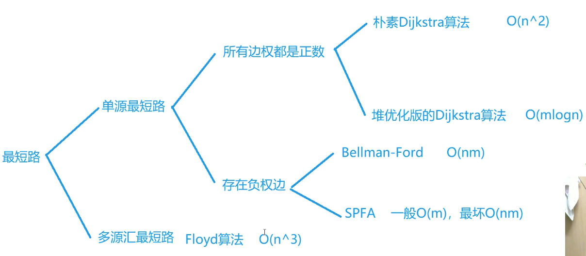
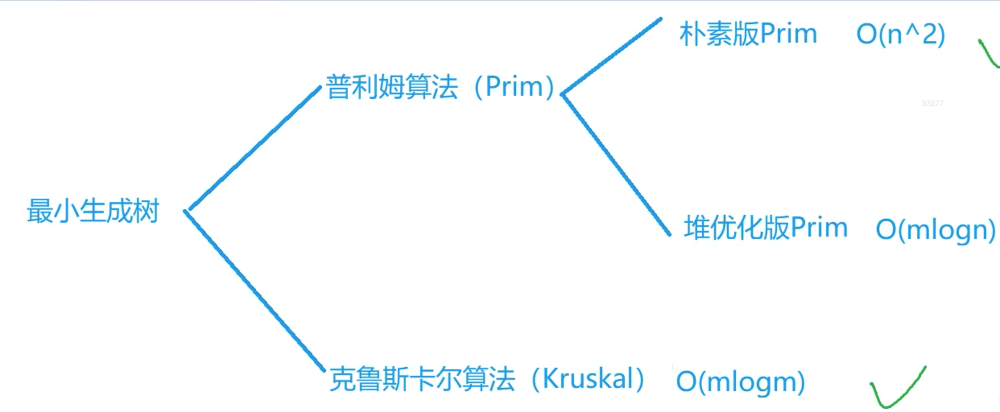

图论题目的**难点主要是构图**，如何将一个问题抽象成一个图论的问题。

然后各种图论的算法是基本功，没有基本功也白搭。

### 拓扑排序

[原题链接](https://www.acwing.com/problem/content/850/)

####  解题思路

判断一个有向图是否存在拓扑排序。最核心的一点是，**维护每个节点的入度**。将入度为零的节点加入队列。

**弹出节点则将这个节点的所有孩子节点的入度减1**。如果入度为零，则加入队列中。同时在弹出的时候维护一个

数组将弹出结果村下来，最终输出即可。

#### 时间复杂度 O(e+v)

#### c++代码

```c++
#include<iostream>
#include<vector>
#include<queue>

using namespace std;

const int N = 1e5 + 10;
vector<int> e[N];
int n, m;
bool vis[N];
vector<int> res;
int d[N];


int main(){

    cin >> n >> m;
    while(m--){
        int a, b;
        cin >> a >> b;
        if(a == b) {cout << -1; return 0;}
        else{
            e[a].push_back(b);
            d[b] ++;
        }
    }

    queue<int> q;

    for(int i = 1; i <= n; i ++){
        if(d[i] == 0) {
            q.push(i);
        }
    }

    while(!q.empty()){
        int item = q.front();q.pop();
        res.push_back(item);
        for(auto x : e[item]){
            d[x] --;
            if(d[x] > 0) continue;
            else{
                q.push(x);
            }
        }
    }
    if(res.size() != n) {
        cout << -1;
        return 0;
    }
    for(auto x: res) cout << x << " ";
    return 0;
}
```

### 最短路算法



**n表示点数，m表示边数**

- 稀疏图，正权可以使用堆优化版Dijkstra

- 稠密图，正权使用朴素Dijsktra

- 存在负边一般使用SPFA
- 同一张图多次求，使用Floyd算法。

**难点在于如何建图。如何将问题抽象出求图两点之间的最短路问题。**

#### 朴素Dijsktra

贪心的思想。每次将当前到源节点最近的那个点加入到结果中，并更新所有点到源节点的距离。这样可以保证最终每个点到源节点的距离是最近的。正确性可以使用反证法来证明。

c++代码

```c++
#include<iostream>
#include<cstring>

using namespace std;

const int N = 510;
int e[N][N];   // 存储图的邻接矩阵
int dis[N];  // 存储每个节点到源节点的距离
int n,m;
bool vis[N];  // 存储结果集

int dijsktra(){
    
    dis[1] = 0;
    for(int i = 0; i < n; i ++){
        int m_i = -1;
        int m_d = 0x3f3f3f3f;
        for(int j = 1; j <= n; j ++){    // 找到当前距离源节点最近且没有访问过的点
            if(!vis[j] && dis[j] < m_d) {
                m_i = j; m_d = dis[j];
            }
        }
        if( m_i == n) return dis[n];  // 找到n就提前返回
        if( m_i == -1) return -1;  // n节点和1节点处于两个连通分量中的情况
        vis[m_i] = true;  // 将当前节点加入到结果集中
        for(int j = 1; j <= n; j ++){    // 更新没有被访问过的点到源节点的距离。只可能通过刚加入的点才可能带来变化
            if(!vis[j] && dis[j] > dis[m_i] + e[m_i][j]) dis[j] = dis[m_i] + e[m_i][j];
        }
    }
}

int main(){
    
    cin >> n >> m;
    memset(e, 0x3f, sizeof(e));
    memset(dis, 0x3f, sizeof(dis));
    while(m --){
        int a, b, c;
        cin >> a >> b >> c;
        e[a][b] = min(e[a][b], c);
    }
    
    cout << dijsktra();
    
    return 0;
}
```

#### 堆优化Dijkstra

在上面用当前点更新其他节点到源节点的距离之后，每次找距离最小的点都需要将所有点遍历一遍，这样有点冗余。

可以动态维护其剩余可达点到源节点的距离的队列，然后更新之后就向队列中添加元素。（更小的会把之前添加的覆盖掉，所以不用将之前的删除）。然后就可以在`log n`的复杂度的情况下，找到距离最小的点。但是这样队列的元素最可能有`m`（边数）个，所以整体复杂度是`O(m log n)`。

c++代码如下

```c++
// Dijsktra算法有点广度优先搜索的意思，不过这里边的权重不是一，所以也是每次都
// 将距离自己最小的点加入到队列中
#include<iostream>
#include<vector>
#include<queue>
#include<cstring>

using namespace std;
typedef pair<int, int> PII;
const int N = 150010;

bool vis[N];
vector<PII> e[N];
int dis[N];
int n,m;

int djs(){

    priority_queue<PII, vector<PII>, greater<PII>> q;  // 小顶堆定义
    q.push({0, 1});
    dis[1] = 0;
    while(q.size()){
        PII item = q.top(); q.pop();
        int d = item.first, no = item.second;
        if(no == n) return dis[n];
        if(vis[no]) continue;
        else{
            vis[no] = true;
            for(auto x: e[no]){
                if(!vis[x.first] && dis[x.first] > x.second + dis[no]){  // 维护加入的节点直接相连的节点
                    dis[x.first] = x.second + dis[no];
                    q.push({dis[x.first], x.first});
                }
            }
        }
    }
    if(dis[n] == 0x3f3f3f3f) return -1;
    else return dis[n];
}

int main(){

    cin >> n >> m;
    memset(dis, 0x3f, sizeof(dis));
    while(m--){
        int a, b, c;
        cin >> a >>b >> c;
        e[a].push_back({b, c});   // 使用邻接表存储稀疏图
    }
    cout << djs();
    return 0;
}
```

#### Bellman-Ford

有多少节点就迭代多少次。每次遍历所有的边，然后更新边的终点到节点1的距离。所以**其可以用来计算最多经过k条边的情况下的最短距离。**

当将节点迭代了`k`次，那么当前每个节点到起点的距离是`经过最多k条边的最短距离`。因为相当于每次迭代都向外扩张了一条边，并维护了最短路径。

**注意**：在更新的时候，需要将距离备份一下，不然可能出现串联现象，就是用这一论迭代的结果更新了后面的节点。

可以使用这个算法来判断图中是否有负环回路。在一个节点个数为`n`的图中，起点到任何一点的最短路径长度不会超过`n-1`，

所以如果第`n`次迭代发现有节点更新了自己的距离，那么就说明当前图中存在负环回路。但是算法复杂度过高，一般使用优化版的SPFA算法。

时间复杂度$O(nm)$， n为节点个数，m为边的条数。

空间复杂度$O(m)$,存储边

```c++
// https://www.acwing.com/problem/content/855/
#include<iostream>
#include<cstring>

using namespace std;

const int N = 510;
const int M = 10010;

int e[M][3];
int dis[N];
int dis_back[N];

int main(){
    
    memset(dis, 0x3f, sizeof dis);
    dis[1] = 0;
    int n, m, k;
    cin >> n >> m >> k;  // 不超过k条边的情况下的最短路径长度
    for(int i = 0; i < m; i ++){
        int x, y, z;
        cin >> x >> y >> z;
        e[i][0] = x;
        e[i][1] = y;
        e[i][2] = z;
    }
    for(int i = 0; i < k; i ++){
        memcpy(dis_back, dis, sizeof dis);  // 需要将之前的dis备份一下，不然那可能会串联更新
        for(int j = 0; j < m; j ++){
            int b = e[j][0];
            int t = e[j][1];
            int w = e[j][2];
            dis[t] = min(dis[t], dis_back[b] + w);
        }
    }
    
    if(dis[n] > 0x3f3f3f3f - 5000000 - 100) cout << "impossible";  // 判断连通性不能直接判等，因为如果有负边，那么也会减小
    else cout << dis[n]; 
    return 0;
}
```

#### SPFA

SPFA算法是对Beelman-Ford算法的一种优化。在上面的算法中可以看到，每次跌倒都是遍历所有的边，但是只有之前更新了距离的点，其后面的节点才可能被更新。所以可以记录那些点在迭代的时候其距离被更新了，然后利用这个节点的距离去更新其后继的距离，而不是遍历所有点。

**维护一个队列，队列中存储的是距离更新更小的点。每次都队列中拿出一个点，然后用其距离更新其后继，如果后继被更新了，且后继不再队列中，为了能够更新后继的孩子们，所以需要将其加入到队列中。如果其已经在队列中，那么就不用再加入到队列中，因为重复加入是没有意义的。**

```c++
#include<iostream>
#include<queue>
#include<cstring>
#include<vector>
#include<algorithm>
#include<cstdio>

using namespace std;

typedef pair<int, int> PII;
const int N = 1e5+10;
int dis[N];  // 每个节点到1节点的最短距离

vector<PII> e[N];  // 邻接表存储图
bool vis[N] = {false};  // 记录每个节点是不是在队列中，避免重复加入

int main(){
    
    int n,m;
    cin >> n >> m;
    for(int i = 0; i < m; i ++){
        int x, y, z;
        cin >> x >> y >> z;
        e[x].push_back({y, z});
    }
    queue<int> q;
    memset(dis, 0x3f, sizeof dis);  // 初始化为无穷
    dis[1] = 0;
    q.push(1);  // 从1开始迭代
    while(q.size()){
        int v = q.front();q.pop();  // 从更新过的点中取出一个点
        for(auto x:e[v]){
            int node = x.first;
            int w = x.second;
            if(dis[node] > dis[v] + w){  // 如果这个点的后继可以更新，则更新权重
                dis[node] = dis[v] + w;
                if(!vis[node]){  // 如果节点不再队列中，则加入队列。在队列中不需要加入，因为边权已经更新了。
                    q.push(node);
                    vis[node] = true;
                }
            }
        }
        vis[v] = false;  // 弹出的点标记不再队列中了
    }
    if(dis[n] == 0x3f3f3f3f) cout << "impossible";
    else cout << dis[n];
    return 0;
}
```

```c++
// SPFA判断图中是否存在负环
// 可以看做初始情况下，所有的点到某一个无穷远的节点的距离都是相同的一个非常大的数
// 需要将所有的节点加入到队列中
// 需要将所有的节点的距离矩阵置为0
// 只有存在负边的时候才可能更新，
// 如果有负环的话，负环上的点会不断地加入到队列中，且这个环上的点的边数会不断的增加。
// 如果某个点的边数大于等于点数的时候，说明路径上必定存在环，且为负。就输出yes
#include<iostream>
#include<vector>
#include<queue>
using namespace std;
typedef pair<int,int> PII;

const int N = 2020;

int dis[N],en[N];  // dis[i]表示图中其他所有节点到节点i的路径的最小值，e[i]存储对应的变得条数
bool vis[N];
vector<PII> e[N];
// 初始化的状态是，所有节点到自己的节点是最短的，变数为0
int main(){
    
    int n,m;
    cin>>n>>m;
    for(int i=0;i<m;i++){
        int x,y,z;
        cin>>x>>y>>z;
        e[x].push_back({y,z});
    }
    queue<int> q;
    for(int i=1;i<=n;i++){
        q.push(i);vis[i]=true;
    }
    while(q.size()){
        int it = q.front();q.pop();
        vis[it]=false; // 某个节点可能有指向自己的负环，所以需要一开始就将自己的状态置为false，而不能在最后再置
        for(auto x:e[it]){
            int node = x.first;
            int w=  x.second;
            if(dis[node]>dis[it]+w){
                dis[node]=dis[it]+w;
                en[node]=en[it]+1;
                if(en[node]>=n){
                    cout <<"Yes";return 0;
                }
                if(!vis[node]){
                    vis[node]=true;
                    q.push(node);
                }
            }
        }
    }
    cout<<"No";return 0;
}
```

#### Floyd

使用的是动态规划的算法

`dp[k][i][j]`表示，`i`, `j`只经过节点`1-k`的最短路径。

只经过`1-k`的最短路径，可以划分为两类：

- 一类是没有经过点k，这个时候就有`dp[k][i][j] = dp[k-1][i][j]`
- 一类是没有经过点k，如果经过了点k，那么就有`dp[k][i][j] = dp[k-1][i][k] + dp[k-1][k][j]`.

所以只需要对上述两种情况求较小值即可。

状态转移方程是`dp[k][i][j] = min(dp[k-1][i][j], dp[k-1][i][k] + dp[k-1][k][j])`

因为第一位状态是只依赖于前一个，所以可以优化掉，直接使用滚动数组记录即可。

#### c++代码

```c++
#include<iostream>
#include<cstring>

using namespace std;

const int  N = 210;
int n, m, k;

int dp[N][N];


void floyd(){
    
    for(int k = 1; k <= n; k ++){
        for(int i = 1; i <= n; i ++){
            for(int j = 1; j <= n; j ++){
                dp[i][j] = min(dp[i][j], dp[i][k] + dp[k][j]);
            }
        }
    }
}

int main(){
    
    
    memset(dp, 0x3f, sizeof dp);

    cin >> n >> m >> k;
    for(int i = 1; i <= n; i ++) dp[i][i] = 0; 
    while(m --){
        int x, y, z;
        cin >> x >> y >> z;
        dp[x][y] = min(dp[x][y], z);
    }
    
    floyd();
    
    while(k--){
        int x, y;
        cin >> x >> y;
        if(dp[x][y]  >  0x3f3f3f3f >> 1) cout << "impossible" << endl;
        else cout << dp[x][y] << endl;
    }
    
    return 0;
    
}
```

### 最小生成树算法



#### Prim

主要的算法思想是，维护一个集合，这个集合表示当前加入了最短生成树的节点。然后每次迭代从不在这个集合中的点中选择

到这个集合距离最近的点，加入到这个集合中，并维护剩下点到这个集合的距离的最小值。最终就能够得到最小生成树。

**每次迭代都是新加入一个点。**

**时间复杂度$O(n^2)$**,可以使用队列优化。**适用于稠密图**。

```c++
#include<iostream>
#include<cstring>

using namespace std;

const int N = 510;

int e[N][N];

bool vis[N] = {false};
int dis[N];


int main(){

    int n, m;
    memset(e, 0x3f, sizeof e);
    memset(dis, 0x3f, sizeof dis);
    cin >> n >> m;
    while(m--){
        int x, y, z;
        cin >> x >> y >> z;
        if(x == y) continue;
        e[y][x] = e[x][y] = min(e[x][y], z);
    }
    int res = 0;

    dis[1] = 0;
    vis[1] = true;
    for(int i = 2; i <= n; i ++){
        dis[i] = min(dis[i], e[1][i]);
    }  // 将1号点加入，作为初始化
    for(int i = 0; i < n-1; i ++){

        int m = 0x3f3f3f3f;
        int mi = -1;
        for(int j = 1; j <= n; j ++){
            if(!vis[j] && dis[j] < m) {  // 找到到集合距离最短的点
                m = dis[j];
                mi = j;
            }
        }

        if( m == 0x3f3f3f3f) {
            cout << "impossible";
            return 0;
        }

        vis[mi] = true;
        res += dis[mi];

        for(int i = 1; i <= n; i ++){  // 利用刚加入的点更新其他不在集合中的点到集合的距离
            if(!vis[i] && dis[i] > e[mi][i]) dis[i] = e[mi][i];
        }
    }

    cout << res ;

    return 0;
}
```

#### Kruskal

kruskal算法的思想是不断地加边。将所有的边进行排序，然后从小到大枚举边，如果边的两个节点处于不同连通分量就将这个边加入，并合并两个连通分量。判断两个点是不是属于一个连通分量需要使用并查集数据结构。

```c++
// https://www.acwing.com/problem/content/description/861/
#include<iostream>
#include<vector>
#include<algorithm>

using namespace std;

const int N = 1e5 + 10;
const int M = 2e5 + 10;
typedef pair<int, pair<int, int>> PIII;


PIII e[M];
int pa[N];

int find(int a){  // 并查集的查找过程，并维护树的高度为1
    if(a != pa[a]) pa[a] = find(pa[a]);
    return pa[a];
}

int main(){
    
    int n, m;
    cin >> n >> m;
    for(int i = 0; i < m; i ++){
        int x, y, z;
        cin >> x >> y >> z;
        e[i] = {z, {x, y}};
    }
    for(int i = 1; i <= n; i++) pa[i] = i; // 初始化并查集
    sort(e, e + m);  // 对所有的边进行排序
    int cnt = 0, res = 0;
    for(int i = 0; i < m; i ++){  //枚举所有边
        int fa = find(e[i].second.first), fb = find(e[i].second.second);
        if(fa != fb){
            cnt += 1;
            res += e[i].first;
            if(cnt == n -1) {  // 提前终止
                cout << res;return 0;
            }
            pa[fa] = fb;
        }
    }
    cout << "impossible";return 0;
    
}
```


### 染色法判断二分图

**如果一个图是二分图，当且仅当图中不存在奇数环。**可以对图进行BFS或者DFS遍历，对整个图进行染色，如果遇到冲突，则返回false，否则就可以二分。

```c++
#include<iostream>
#include<vector>
#include<queue>
using namespace std;

const int N = 1e5+10;

vector<int> e[N];
int col[N];
int  n,m;

bool bfs(int i){   // 从节点i开始对其所在的连通分量进行染色
    
    queue<int> q;
    q.push(i);
    col[i] = 1;
    while(q.size()){
        int it = q.front();
        q.pop();
        for(auto x: e[it]){
            if(!col[x]) {    // 没有染色，那么就将其染成不同的颜色
                col[x] = 3 - col[it];
                q.push(x);
            }
            else{
            if(col[x] == col[it]) return false;   // 遇到了冲突
        }
        }
    }
    return true;
    
}

int main(){
    
    cin >> n >> m;
    while(m--){
        int x, y;
        cin >> x >> y;
        if(x != y){
            e[x].push_back(y);
            e[y].push_back(x);
        }
    }
    
    bool res = true;
    for(int i = 1; i <= n; i ++){    // 需要将所有的节点都要遍历一遍，因为可能图中不止一个连通分量
        if(!col[i]){
            if(!bfs(i)){
                res = false;
                break;
            }
        }
    }
    if(res) cout << "Yes";
    else cout << "No";
    return 0;
}
```

### 匈牙利算法

匈牙利算法是用于求二分图的最大匹配。

贪心的思想。每次遍历a所有的邻居，

- 如果这个人b没有匹配，那么就能够匹配上。

- 如果这个人b匹配了，那么就看看这个人毁约能够成功，也就是之前和这个人匹配的那个人c能不能找到一个新的伴侣。

  这个时候就转化了为另一个相同的问题。不过在这个问题中，这个人不能够再考虑b了，所以需要使用一个标记来记录右边的人在当前轮中是不是被访问过。不然会陷入死循环。

- 最终递归到最后一个人，有每次st都会新增一个true，所以最终这个人要不就能够找到一个新的没有匹配的伴侣，要不就返回false。如果找到了，那么前面路径上的人都会更新自己的伴侣。匹配数加1.如果没有找到，那么就不能扩增。前面的也都不变。

```c++
// https://www.acwing.com/problem/content/863/
#include<iostream>
#include<cstring>
#include<vector>
using namespace std;

const int N = 510, M = 10010;

vector<int> e[N];
bool st[N];
int match[N];
int n1, n2, m;

bool find(int i){    // 看看这个节点能不能找到匹配
    
    for(auto x: e[i]){
        if(!st[x]){
            st[x] = true;  // 记录右边节点被访问的状态，避免多次重复访问，陷入死循环
            if(!match[x] || find(match[x])){   // 如果这个女孩子没有对象，那么就和自己匹配 。如果这个女孩有对象了，就尝试让这个女孩毁约，也就是看看这个女孩之前匹配的男孩子能不能找到一个新的对象。(这个过程可能会一直递归下去，只到最后一个人)。前面有st数组存储每个女孩是不是被访问过也是为了避免死循环。
                match[x]  =i;  // 如果当前女孩可以毁约，那么就让这个女孩和自己配对，
                return true; // 向上层返回true
            }
        }
    }
    return false;  // 否则的话返回false
}

int main(){
    
    cin >> n1 >> n2 >> m;
    while(m--){
        int x,y;cin >> x >> y;
        e[x].push_back(y);
    }
    int res = 0;
    for(int i = 1; i <= n1; i ++){
        memset(st, false, sizeof st);   // 每次考虑一个新的男孩子的时候，需要将st状态重新置为false。因为可能上一次某个女孩毁约成功了，下次也可以成功。但是在一次循环中，是不行的。
        if(find(i)) res += 1;
        
    }
    
    cout << res; return 0;
    
}
```

