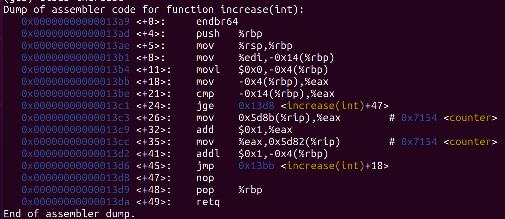
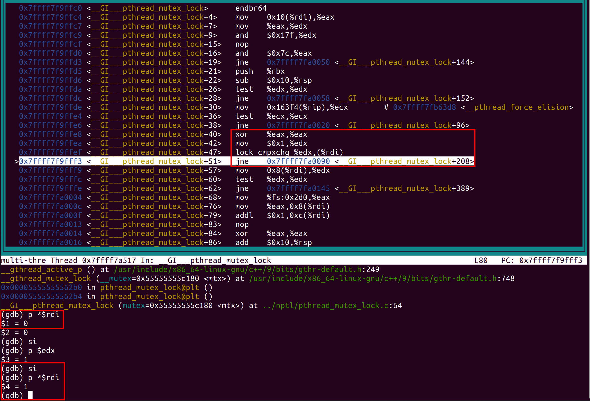

## 多线程编程

多个线程在执行的过程中，各个线程之间共享内存，同时每个线程有自己的堆栈以及寄存器组。

同时在线代处理上，一般的指令可以看做如下三类：

1. `load`类指令，将某个值从内存加载到本地寄存器。
2. `store`类指令，将本地寄存器中的某个值存储到某个内存中。
3. 执行本地寄存器计算的指令。

### 01 线程间互斥概述

在多线程的情况下，对于共享资源的访问，需要进行一些互斥的操作。在代码上，就体现在某一块代码只能有不超过一个线程进入，如果其他线程先进入的话，必须等到进入到临界区的线程退出之后才行。

下面是一个小例子：

```c++
#include <iostream>
#include <thread>
#include <vector>

using namespace std;

int counter = 0;

void increase(int cnt) {
	for (int i = 0; i < cnt; i ++) counter ++;  // 每个线程不断地执行增1操作
}

int main(int argc, char* argv[]) {
	vector<thread> threads;
	if (argc <= 1) {
		cout << "please input thread number" << endl;
		return 0;
	}	
	int num = atoi(argv[1]);
	int cnt = 100000;
	for (int i = 0; i < num; i ++) {
		threads.push_back(thread(increase, cnt));  // 创建若干线程，每个线程对全局变量进行增加操作
	}
	for (auto &x : threads) x.join();  // 等待所有线程执行完毕
	cout << "total num is " << counter << endl;  // 输出共享的全局变量最终的结果
	return 0;
}
```



对上面的`increase`函数进行反汇编，可以看到增1这个操作被分为了三步：

```txt
+ 26 行的 move 指令，将counter的值load到eax寄存器中
+ 32 行的 add 指令，将eax寄存器的值增1
+ 35 行的 move 指令，将eax寄存器的值放回counter的内存地址中
```

如果多个线程同时对`Counter`进行访问的话，很可能得到如下的情况：

```txt
		T1			T2
   load		 
 						move
 	 add
 	 store		
 	 					add
 	 					store
```

这样的话，相当于只对counter进行了一次操作。

有可能说我们可以通过下面的代码来实现互斥锁：

```c++
class mutex {
  public:
  	void lock() {
      while (locked) ;   // 关键行1
      	locked = 1;      // 关键行2
    }
  	
 		void unlock() {
      
      locked = 0;
      
    }
  
  private:
   int locked = 0;
}
```

但是这样是存在问题的，如果一个线程在关键行1返回了，但是这个时候发生了中断，另一个线程开始执行了。这个时候线程1看到锁打开了，但是在把锁锁上之前，另一个线程也看到锁打开了。这样他们两个人都能够执行关键行2，认为自己拥有了这把锁，这样就同时进入了临界区。而且现代处理器可能对指令进行乱序执行。

这个解决方法的根本问题是，我们不能边看着锁，边给它上锁。看到锁的状态和修改锁的状态这两个操作是分开的，而且是有可能被打断的。为了解决这个问题，硬件提供了一种指令，可以同时在看到锁的状态的同时修改锁的撞他。就是`lock cmpxchg`.

为了将上面三个操作变成一个原子操作，也就是上面三个操作就是一个临界区，在每个时刻只有一个线程可以访问这个临界区。下面是加锁之后实现正确功能的代码。

```c++
#include <iostream>
#include <thread>
#include <vector>
#include <mutex>

using namespace std;

int counter = 0;
mutex mtx;  // 全局大家都可见的锁

void increase(int cnt) {
	for (int i = 0; i < cnt; i ++) {
    mtx.lock();  // 尝试加锁
    counter ++;  // 每个线程不断地执行增1操作
    mtx.unlock();  // 释放锁
  } 
}

int main(int argc, char* argv[]) {
	vector<thread> threads;
	if (argc <= 1) {
		cout << "please input thread number" << endl;
		return 0;
	}	
	int num = atoi(argv[1]);
	int cnt = 100000;
	for (int i = 0; i < num; i ++) {
		threads.push_back(thread(increase, cnt));  // 创建若干线程，每个线程对全局变量进行增加操作
	}
	for (auto &x : threads) x.join();  // 等待所有线程执行完毕
	cout << "total num is " << counter << endl;  // 输出共享的全局变量最终的结果
	return 0;
}
```

为了搞清楚加锁的具体实现细节，采用GDB进行单步调试，并只有一个线程，进到`lock`函数内部的反汇编，发现了下面的几行指令。其中有一个`lock cmpxchg`指令，这个指令也被称为`CAS(compare and swap)`指令，可以保证`看`和`写`两个操作是原子的。而且加了一个`lock`前缀，确保锁总线，达到原子性([参考文献](https://stackoverflow.com/questions/8891067/what-does-the-lock-instruction-mean-in-x86-assembly))。具体该指令的作用可以查阅手册或一些文档([参考文档](https://baike.baidu.com/item/CMPXCHG%E6%8C%87%E4%BB%A4/11054211))。



通过答应`rdi`寄存器保存的地址的值，发现实现了获得锁的操作。

所以硬件通过提供了一些`既可以睁眼看世界，也可以动手操作的指令`，这样对于软件来说就可以非常方便地实现互斥锁！

这些原子操作的本质都是类似的：

1. `load x`
2. 设置寄存器本地的状态
3. `store x`

#### 数据竞争

> 两个不同的线程的两个操作同时访问一段内存，且这两个操作中至少有一个是store，其中没有原子操作间隔。两个内存访问在“赛跑”，跑赢的先执行(不确定性)。

并发编程简单准则：

1. 数据竞争 ==  undefined behavior

2. 编程时应该彻底避免数据竞争

   充分条件： 使**所有线程间共享的变量**都被**同一把互斥锁**保护(要不都拿到，要不都拿不到，确保只有一个线程可以拿到所有的贡献资源，避免死锁发生)

### 02 自旋锁、互斥锁

自旋锁的实现就是，当想拿到一把锁的时候，如果发现锁已经被占了，那么就会不断地申请这把锁。

下面是一种这样的实现：

```c++
class lock_t {
  private:
  	int flag;
  public:
  	lock_t() {
      flag = 0;
    }
  	void lock() {
      while (TestAndSet(flag, 1) == 1); // 不停地自旋，TestAndSet就是将1和flag的值原子的交换，硬件指令
    }
  	
    void unlock() {flag = 0;}
}
```

这个时候必然会造成一些问题：如果系统中同时希望申请这把锁的线程非常多的话，拥有这把锁的线程在释放之前被中断调度了，其它线程也只能浪费完自己的时间片，但是没有任何进展，直到拥有锁的那个线程重新被调度了。

假设N个线程，那么可能N-1个线程的时间片都会被浪费。

一种改进的策略是，在操作系统内核中，可以在获得锁和释放锁之间将中断关闭，这样的话，就可以避免当前拿到锁的线程被中断调度了。不过自旋锁也只适合临界区较小的代码，如果长时间关中断的话，对发生中断丢失的现象。自旋锁避免了进程上下文的调度开销，因此对于线程只会阻塞很短时间的场合是有效的。因此操作系统的实现在很多地方往往用自旋锁。

除了关中断，在用户态实现自旋锁的话，是不可能关中断的。所以可以采用一种拿不到锁就让出CPU的策略。如下所示。但是这样的策略也不能达到满意的效果。可能一个拿到资源的线程被调度了，其它的线程都要执行一遍`yield`才可能让有锁的线程执行，同时有可能一个线程疯狂饥饿，一直在`while`中循环。

```c++
class lock_t {
  private:
  	int flag;
  public:
  	lock_t() {
      flag = 0;
    }
  	void lock() {
      while (TestAndSet(flag, 1) == 1) yield(); // give up the CPU.
      // yield是一个系统调用，将当前线程从运行状态切换到就绪态。
    }
  	
    void unlock() {flag = 0;}
}
```

为了解决自旋锁的上述问题，我们可以引入队列，也就是下面的互斥锁。当某个进程发现当前锁被占了之后，可以将自己阻塞，放入等待队列中。拥有锁的线程退出临界区的时候检查当前是否有线程等待，如果等待的话，就将这个线程唤醒(状态置为就绪)，让他进入临界区。下面是一个`mutex`的实现。

```c++
class mutex {
private:
  int flag;   // 标记当前是否有人占有这把锁
  int guard;  // 用一个自旋锁来实现mutex
  queue *q;
  
public:
  mutex() : flag(0), guard(0) {}
  ~mutex();
  void lock() {
    while (TestAndSet(guard) == 1);  // 用一个guard来实现自旋锁，保护共享的资源。
    if (flag == 0) {  // 表明当前没有线程占有这把锁，自己就标记一下自己占了这把锁，并进入临界区
      flag = 1;
      guard = 0;  
    } else {
      queue -> push_back(gettid());  // 否则的话，将自己放到等待队列里面
      // 新增的代码
      setpark(); 
      // 
      guard = 0;  // 释放自旋锁
      park();  // 将自己挂起
    }
  }
  
  void unlock() {
    while (TestAndSet(guard, 1) == 1);  // 首先获得自旋锁
    if (queue -> empty()) flag = 0; // 如果没有其他线程等待，则直接将flag置为0；
    else {  // 这里并没有把锁释放，让其他线程去抢，而是有锁的人从队列中选一个唤醒
      auto thread = queue -> front(); // 否则的话，去除等待队列中的一个线程，然后将其唤醒
      queue -> pop();
      unpark(thread);  
    }
    guard = 0;  // 释放自旋锁
  }
  
};
```

在实现的过程中，首先使用一个自旋锁来保护`flag`和`queue`这些共享变量，然后用一个队列来记录等待这把锁的所有线程。上述代码还有一个问题就是在`lock`代码中的`guard = 0` 和`park`之间。这两个首先不能调换，因为`park`之后就不能执行指令了，但是不调换的话，这两个之间可能拥有锁的线程调用了`unlock`，然后想要锁的接下来才把自己`park`，就导致这个线程永远不会被唤醒。

一种解决方法是，增加一个新的系统调用`setpark`。表明自己将要`park`。如果上面的情况发生的话，也就是`unpark`在`park()`之前被调用了的话，这个`park`会立刻返回，而不是进入睡眠状态。

### 04 读写锁

见下面的用互斥锁和条件变量实现的读者写者部分。

条件有三个：

1. 多个读者可以同时读。
2. 读者和写者，写者和写者需要互斥。
3. 同时有读者和写者请求的话，写者优先或者读者优先。

### 05 悲观锁

悲观锁就是在多个线程都希望进入临界区的时候，锁不管他们是否可能会更改内容，都默认他们会发生更改内容的行为，所以就让他们依次进入临界区。互斥锁、自旋锁等都属于悲观锁这一类。

### 06 乐观锁

和悲观锁不同，乐观锁假设多个线程不会发生冲突，在最终回收的时候，再进行检查。比如共享文档的修改、git分支的合并等，都是乐观锁的思想。

###07 线程同步

同步和互斥是两个不相同的概念。互斥表示共享资源的排他性，只能有一个访问的性质。而同步表示我们希望在某个时间点，线程达到某种一致的状态。比如有两个线程代表着两个接力赛的选手。只有某个线程到达了某种状态之后，另一个线程才可以开始执行等等。还比如和导师约讨论课题，导师说等他出差回来就讨论，那么当前线程就需要停止执行，直到导师回来这个条件满足才可以继续执行。再比如，等室友一起去吃饭，室友说等我把这个bug调完就去，于是当前线程就需要等待，等到室友调完Bug之后，才可以继续执行。

总的来说就是：在未来某个约定的时刻，两个线程的执行点相互可知，然后先到的线程需要等待。如果依赖某个条件的线程在执行到某个节点的时候发现条件已经满足了，那就可以继续执行了。

**线程需要某个条件满足才可以继续执行**，在线程的API中`join`就是这种要求。主线程创建了若干个线程之后，调用`join`函数就可以使得当所有子线程结束之后才执行下面的代码。

### 08 条件变量

条件变量是解决线程间同步的一个非常强大的方法，而且是非常直观的方法：

> 同步的本质，当某个条件满足时，线程执行，否则等待。

用一个对象来表示条件的满足/不满足

1. 条件不满足，则随时可以在这个对象上等待。
2. 另一个线程发现条件满足，则唤醒一个(或所有)正在等待的线程

条件变量的API:

```c++
wait(cv);  // 进入睡眠状态，等待cv上的事情发生
signal/notify(cv); // 报告条件变量上的事情发生，如果有线程正在等待cv，则唤醒其中一个线程，唤醒之后的线程会首先尝试获得锁
broadcase/notifyAll(cv); // 报告条件变量上的事情，唤醒全部正在等待cv的线程
```

条件变量一般都和一个互斥锁联合使用，如下所示：

```c++
mutex_lock(&mutex);

// some code

wait(&cv, &mutex);  // wait会立刻释放锁并等待

// some code

mutex_unlock(&mutex);  // 被signal后恢复执行，会首先试图获得mutex
```

对于生产者消费者问题，可以将所有线程分为两类：

1. 生产者，它能够执行的条件是，当前缓冲区没有满
2. 消费者，它能够执行的条件是，当前缓冲区非空

所以我们可以使用两个条件变量来表示这两个条件，然后用一个变量记录当前缓冲区的元素的个数，然后给对应的cv发signal即可。

下面是一个代码。可以将缓冲区大小调整为0，从而观察到pc逐个执行的情况。

```c++
#include <iostream>
#include <thread>
#include <mutex>
#include <condition_variable>
#include <vector>

using namespace std;

constexpr int MAX_SIZE = 1;

mutex mtx;
condition_variable full;
condition_variable empty;
int cur_num = 0;

int data[MAX_SIZE];

void producer(int id) {

    unique_lock<mutex> lock(mtx);
    while (cur_num == MAX_SIZE) empty.wait(lock);

    // 获得锁，并用while判断休眠的条件，标准操作！


    cout << "produces " << id << " produce!" << endl;
    cur_num ++;
    full.notify_one();
    lock.unlock(); // 先释放锁，再发信号，反过来可能在这两个之间调度了，但是那个线程又立刻睡眠了。
    

}

void consumer(int id) {
    unique_lock<mutex> lock(mtx);
    while (cur_num == 0) full.wait(lock);

    // 获得锁，并用while判断休眠的条件，标准操作！

    cout << "consumer " << id << " consume!" << endl;
    cur_num --;
    empty.notify_one();
    lock.unlock();  // 先释放锁，再发信号，反过来可能在这两个之间调度了，但是那个线程又立刻睡眠了。
    
}

int main() {

    vector<thread> prods, cons;
    for (int i = 0; i < 10; i ++) {
        prods.emplace_back(producer, i);
    }
    for (int i = 0; i < 10; i ++) {
        cons.emplace_back(consumer, i);
    }
    for (auto &x : prods) x.join();
    for (auto &x : cons) x.join();
    cout << "all done!" << endl;
    return 0;
}
```

条件变量 = 万能的同步算法

一个条件变量代表一个条件

- wait等待条件发生
- 条件发生后使用signal唤醒等待的线程
- 和互斥锁联合使用

耍赖操作：条件变量不满足时wait spin + 一旦条件满足就唤醒所有等待的人。

也就是下面的代码

```c++
mutex_lock(&big_lock);
while (!(cond)) wait(&cv, &big_lock);  // while
assert(cond);
cv.notify_all();   // all
mutex_unlock(&big_lock); // 最后再释放锁，不然可能在唤醒的时候一些条件(外部物理世界会发生变化)
```

下面是里用互斥锁和信号量实现的读者写者问题(写者优先)。当然读者优先更加简单一些。

```c++
#include <iostream>
#include <thread>
#include <mutex>
#include <condition_variable>
#include <vector>
#include <unistd.h>
#include <cstdio>
#include <ctime>

using namespace std;

mutex mtx;
condition_variable cv_writer; // 写者等待的信号量
condition_variable cv_reader; // 读者等待的信号量

int cnt_reader; // 表示正在读的读者的个数
int cnt_wait_write;  // 表示正在等待写的写者的个数
bool cnt_writting;  // 表示是否正在有写者在写

time_t base;  // 整个程序开始的时间
time_t cur_time;  // 存储当前时间


/**
 * 读者的过程
 * @param id 线程ID
 * @param begin_time 开始执行时间
 * @param run_time 持续时间
 */
void reader(int id, double begin_time, double run_time) {

    sleep(begin_time);
    printf("reader %d want read! | time %ld \n", id, time(&cur_time) - base);
    flush(cout);
    unique_lock<mutex> lock(mtx);
    while (cnt_wait_write != 0 || cnt_writting) cv_reader.wait(lock);
    assert(cnt_wait_write == 0 && cnt_writting == 0);
    cnt_reader ++;
    lock.unlock();

    printf("reader %d begin read! | time %ld  \n", id, time(&cur_time) - base);
    flush(cout);

    sleep(run_time);

    lock.lock();
    cnt_reader --;
    printf("reader %d exit! | | time %ld \n", id, time(&cur_time) - base);
    if (cnt_wait_write != 0 && cnt_reader == 0) {
        cv_writer.notify_one();
    } else {
        cv_reader.notify_all();
    }
    lock.unlock();

}

/**
 * 写者的过程
 * @param id 线程id
 * @param begin_time 开始执行时间
 * @param run_time 持续时间
 */
void writer(int id, double begin_time, double run_time) {

    sleep(begin_time);
    printf("writer %d want write! | time %ld  \n", id, time(&cur_time) - base);
    flush(cout);

    unique_lock<mutex> lock(mtx);
    cnt_wait_write ++; // 标记有写者来了。
    while (cnt_reader != 0 || cnt_writting) cv_writer.wait(lock);
    assert(cnt_reader == 0 && !cnt_writting);
    cnt_writting = true;
    cnt_wait_write --;
    lock.unlock();

    printf("writer %d begin write! | time %ld \n", id, time(&cur_time) - base);
    flush(cout);
    sleep(run_time);

    lock.lock();
    cnt_writting = false;
    printf("writer %d exit! | | time %ld \n", id, time(&cur_time) - base);

    if (cnt_wait_write != 0) {
        cv_writer.notify_one();  // 只有一个写者可以写，所以只唤醒一个写者
    } else{
        cv_reader.notify_all();  // 因为所有的读者可以同时读，所以将所有的读者都唤醒
    }
    lock.unlock();
}


int main() {

    freopen("../input.txt","r",stdin);  // 标准输入重定向到文件

    time(&base);  // 获取整个进程开始的时间

    vector<thread> all_threads;
    int n;
    cin >> n;
    while (n --) {
        int id;
        char type;
        double begin_time;
        double run_time;
        cin >> id >> type >> begin_time >> run_time;
        if (type == 'R') {
            all_threads.emplace_back(reader, id, begin_time, run_time);
        } else {
            all_threads.emplace_back(writer, id, begin_time, run_time);
        }
    }
    for (auto &x : all_threads) x.join();

    cout << "all done!" << endl;
    return 0;
}
```

输入文件内容是：

```c++
5
1 R 3 5
2 W 4 5
3 R 5 2
4 R 6 5
5 W 5.1 3
```

运行结果如下：

```c++
reader 1 want read! | time 3 
reader 1 begin read! | time 3  
writer 2 want write! | time 4  
reader 3 want read! | time 5 
writer 5 want write! | time 5  
reader 4 want read! | time 6 
reader 1 exit! | | time 8 
writer 2 begin write! | time 8 
writer 2 exit! | | time 13 
writer 5 begin write! | time 13 
writer 5 exit! | | time 16 
reader 3 begin read! | time 16  
reader 4 begin read! | time 16  
reader 3 exit! | | time 18 
reader 4 exit! | | time 21 
all done!
```

对上面的代码进行封装，可以得到如下的读者写者锁(写者优先)。

```c++
#include <iostream>
#include <thread>
#include <mutex>
#include <condition_variable>
#include <vector>
#include <unistd.h>
#include <cstdio>
#include <ctime>

using namespace std;

/**
 * 读写锁，写者优先
 */
class WriteReadLock {
public:
    WriteReadLock() : cnt_reader(0),
                      cnt_wait_write(0),
                      cnt_writting(false) {}

    ~WriteReadLock() = default;

    void reader_lock() {
        unique_lock<mutex> lock(mtx);
        while (cnt_wait_write != 0 || cnt_writting) cv_reader.wait(lock);
        assert(cnt_wait_write == 0 && cnt_writting == 0);
        cnt_reader ++;
        lock.unlock();
    }

    void reader_unlock() {
        unique_lock<mutex> lock(mtx);
        cnt_reader --;
        if (cnt_wait_write != 0 && cnt_reader == 0) {
            cv_writer.notify_one();
        } else {
            cv_reader.notify_all();
        }
        lock.unlock();
    }

    void writer_lock() {
        unique_lock<mutex> lock(mtx);
        cnt_wait_write ++; // 标记有写者来了。
        while (cnt_reader != 0 || cnt_writting) cv_writer.wait(lock);
        assert(cnt_reader == 0 && !cnt_writting);
        cnt_writting = true;
        cnt_wait_write --;
        lock.unlock();
    }

    void writer_unlock() {
        unique_lock<mutex> lock(mtx);
        cnt_writting = false;

        if (cnt_wait_write != 0) {
            cv_writer.notify_one();  // 只有一个写者可以写，所以只唤醒一个写者
        } else{
            cv_reader.notify_all();  // 因为所有的读者可以同时读，所以将所有的读者都唤醒
        }
        lock.unlock();
    }

private:
    int cnt_reader; // 表示正在读的读者的个数
    int cnt_wait_write;  // 表示正在等待写的写者的个数
    bool cnt_writting;  // 表示是否正在有写者在写
    mutex mtx;    // 保护资源的互斥锁，相当于管理员，所有人都要和管理员打交道，听从管理员调度
    condition_variable cv_writer;  // 用于写者休眠的条件变量
    condition_variable cv_reader;  // 用于读者休眠的条件变量

};

time_t base;  // 整个程序开始的时间
time_t cur_time;  // 存储当前时间
WriteReadLock writeReadLock;


/**
 * 读者的过程
 * @param id 线程ID
 * @param begin_time 开始执行时间
 * @param run_time 持续时间
 */
void reader(int id, double begin_time, double run_time) {

    sleep(begin_time);
    printf("reader %d want read! | time %ld \n", id, time(&cur_time) - base);
    flush(cout);

    writeReadLock.reader_lock();

    printf("reader %d begin read! | time %ld  \n", id, time(&cur_time) - base);
    flush(cout);

    sleep(run_time);

    printf("reader %d exit! | | time %ld \n", id, time(&cur_time) - base);
    writeReadLock.reader_unlock();

}

/**
 * 写者的过程
 * @param id 线程id
 * @param begin_time 开始执行时间
 * @param run_time 持续时间
 */
void writer(int id, double begin_time, double run_time) {

    sleep(begin_time);
    printf("writer %d want write! | time %ld  \n", id, time(&cur_time) - base);
    flush(cout);

    writeReadLock.writer_lock();

    printf("writer %d begin write! | time %ld \n", id, time(&cur_time) - base);
    flush(cout);
    sleep(run_time);

    printf("writer %d exit! | | time %ld \n", id, time(&cur_time) - base);

    writeReadLock.writer_unlock();
}


int main() {

    freopen("../input.txt","r",stdin);  // 标准输入重定向到文件

    time(&base);  // 获取整个进程开始的时间

    vector<thread> all_threads;
    int n;
    cin >> n;
    while (n --) {
        int id;
        char type;
        double begin_time;
        double run_time;
        cin >> id >> type >> begin_time >> run_time;
        if (type == 'R') {
            all_threads.emplace_back(reader, id, begin_time, run_time);
        } else {
            all_threads.emplace_back(writer, id, begin_time, run_time);
        }
    }
    for (auto &x : all_threads) x.join();

    cout << "all done!" << endl;
    return 0;
}
```

#### 使用互斥锁+信号量解决哲学家就餐问题

[原题链接](https://leetcode-cn.com/problems/the-dining-philosophers/)

核心的思想是，所有的调度都交个管理员(mutex)来做，然后为每个哲学家搞一个条件变量让其休眠。

```c++
class DiningPhilosophers {
public:

    static constexpr int N = 5;
    bool used[N];  // 标记没把锁的状态
    mutex mtx;  // 互斥锁， 管理员
    condition_variable cvs[N]; // 每个哲学家有一个休眠的条件变量

    DiningPhilosophers() {
    }

    void wantsToEat(int id,
                    function<void()> pickLeftFork,
                    function<void()> pickRightFork,
                    function<void()> eat,
                    function<void()> putLeftFork,
                    function<void()> putRightFork) {
        
        unique_lock<mutex> lock(mtx);
        while (used[id] || used[(id + 1) % N]) cvs[id].wait(lock);
        assert(!used[id] && !used[(id + 1) % N]);
        used[id] = true;
        used[(id + 1) % N] = true;
        lock.unlock();
        pickLeftFork();
        pickRightFork();
        eat();
        putLeftFork();
        putRightFork();
        lock.lock();
        used[id] = false;
        used[(id + 1) % N] = false;
        int i = (id + N - 1) % N;
        if (!used[i] && !used[(i + 1) % N]) cvs[i].notify_one();  // 当某个人可以被唤醒的话，就将他唤醒
        i = (id + 1) % N;
        if (!used[i] && !used[(i + 1) % N]) cvs[i].notify_one();
        lock.unlock();
    }
};
```

#### 条件变量总结

每个条件变量相当于一个队列，当某些线程需要这个条件变量的条件满足才能执行，但是这个条件又没有满足时，就将这个线程放入到这个条件变量的队列中。然后整个的调度逻辑由`mutex`锁定全部的资源之后再处理。所以相当于每个线程想要申请资源或者释放资源的时候，都需要首先获得这个`mutex`，然后`while`循环检查自己执行的条件是否满足，不满足就休息，满足就执行，并设置好对应的记录变量。当释放资源的时候，也是先获得大锁`mutex`，然后释放了之后，管理员根据当前的资源状态，检查哪些条件满足了，就将等待那个条件的线程唤醒。(notify_one / notify_all)都可以，在每个线程拿到锁之后都需要通过`while`来检查自己继续运行的条件是否满足。

###09 信号量

通过上面的对条件变量的使用，发现其总是和一个锁一起。信号量向外提供了三个操作：

1. 初始化信号量的值。
2. P操作将值减1，如果减完为负，则将当前线程阻塞。
3. V操作将信号量值加1，如果加完为负，则唤醒阻塞队列中的一个线程。

信号量可以通过互斥锁和条件变量来实现。下面是一个示例：(参考ostep)

```c++
class MySam {

private:
    int cnt;
    mutex mtx;
    condition_variable cv;

public:

    MySam(int n=1) : cnt(n) {}

    void P() {
        unique_lock<mutex> lock(mtx);
        while (cnt <= 0) cv.wait(lock);
        assert(cnt > 0);
        cnt --;
        mtx.unlock();
    }

    void V() {
        unique_lock<mutex> lock(mtx);
        cnt ++;
        cv.notify_one();
        lock.unlock();
    }
};
```

这个实现经过了如下题目的测试：

[哲学家进餐问题](https://leetcode-cn.com/problems/the-dining-philosophers/)

```c++
class MySam {

private:
    int cnt;
    mutex mtx;
    condition_variable cv;

public:

    MySam(int n=1) : cnt(n) {}

    void P() {
        unique_lock<mutex> lock(mtx);
        while (cnt <= 0) cv.wait(lock);
        assert(cnt > 0);
        cnt --;
        mtx.unlock();
    }

    void V() {
        unique_lock<mutex> lock(mtx);
        cnt ++;
        cv.notify_one();
        lock.unlock();
    }
};

class DiningPhilosophers {
public:
    
    MySam f[5];
    
    DiningPhilosophers() {
        // for(int i = 0; i < 5; i ++){
        //     f[i] = MySam(1);
        // }
    }

    void wantsToEat(int philosopher,
                    function<void()> pickLeftFork,
                    function<void()> pickRightFork,
                    function<void()> eat,
                    function<void()> putLeftFork,
                    function<void()> putRightFork) {
	    if(philosopher != 4){
            // sem_wait(f + philosopher);
            f[philosopher].P();
            pickLeftFork();
            // sem_wait(f + philosopher + 1);
            f[philosopher + 1].P();
            pickRightFork();
            eat();
            putRightFork();
            f[philosopher + 1].V();
            putLeftFork();
            f[philosopher].V();
        }else{
            // sem_wait(f + 0);
            f[0].P();
            pickRightFork();
            // sem_wait(f + philosopher);
            f[philosopher].P();
            pickLeftFork();
            eat();
            putLeftFork();
            // sem_post(f + philosopher);
            f[philosopher].V();
            putRightFork();
            // sem_post(f);
            f[0].V();
        }
    }
};
```

[交替打印FooBar](https://leetcode-cn.com/problems/print-foobar-alternately/)

```c++
class MySam {

private:
    int cnt;
    mutex mtx;
    condition_variable cv;

public:

    MySam(int n) : cnt(n) {}

    void P() {
        unique_lock<mutex> lock(mtx);
        while (cnt <= 0) cv.wait(lock);
        assert(cnt > 0);
        cnt --;
        mtx.unlock();
    }

    void V() {
        unique_lock<mutex> lock(mtx);
        cnt ++;
        cv.notify_one();
        lock.unlock();
    }
};


class FooBar {
private:
    int n;

    MySam sam_foo, sam_bar;

public:
    FooBar(int n) : sam_foo(1), sam_bar(0) {
        this->n = n;
    }
    void foo(function<void()> printFoo) {
        
        for (int i = 0; i < n; i++) {
            sam_foo.P();
        	// printFoo() outputs "foo". Do not change or remove this line.
        	printFoo();
            sam_bar.V();
        }
    }

    void bar(function<void()> printBar) {
        
        for (int i = 0; i < n; i++) {
            sam_bar.P();
        	// printBar() outputs "bar". Do not change or remove this line.
        	printBar();
            sam_foo.V();
        }
    }
};
```

当信号量初始化为`1`的时候，就相当于一个互斥锁。

当信号量初始化为`n`的时候，可以看做有`n`个资源。

当信号量初始化小于等于`0`的时候，一个线程P它相当于等待某个条件，这个条件可以由其他线程对这个信号量进行`V`操作来得到。

但是用信号量写出正确的并发程序是比较困难的，没有锁+条件变量直观。所以为了保证准确地话，推荐使用锁+条件变量实现。

### 10 小结

可以总结为了实现正确的互斥与同步，经历了那些过程。

1. 首先，硬件提供了原子指令，使得我们可以`睁着眼睛看世界`
2. 其次，有了硬件指令，我们可以实现性能不是很高的自旋锁。
3. 自旋锁加队列以及线程的状态，我们就实现了互斥锁。
4. 条件变量加互斥锁是正确实现并发的万能算法，每个线程能够运行可以抽象为一个条件，每个条件分配一个等待队列。互斥锁可以看成一个大的调度中心，通过维护某些信息来对满足条件的线程进行调度。
5. 信号量可以看做是一个带计数器的条件变量，非常强大，可以利用互斥锁和条件变量来实现信号量。但是利用信号量实现正确的并发算法是比较困难的，互斥锁+条件变量较为直观。

#### 参考文献

[乐观锁与悲观锁](https://www.zhihu.com/question/29420056)

[南京大学操作系统](https://www.bilibili.com/video/BV1N741177F5?p=9)

[ostep](http://pages.cs.wisc.edu/~remzi/OSTEP/)

