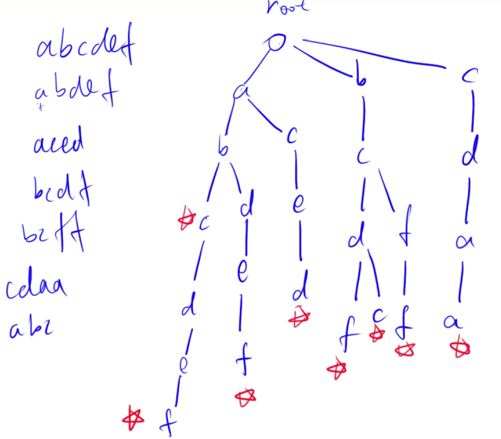

### Trie树

Trie树是高效存储和查询字符串集合的数据结构，能够压缩相同字符的公共前缀。将字符串集合存储成树形结构，并在字符串结尾处进行标记。在查询的时候直接从根节点向下搜索即可。



### Trie字符串统计

[原题链接](https://www.acwing.com/problem/content/837/)

#### 解题思路

模板题，使用数组模拟链表

#### C++代码

```c++
#include <iostream>
using namespace std;

const int N = 1e5+10;

// son记录第i个节点各个孩子的下标，
// cnt记录各个节点代表的字符串的个数，
// idx用于表示当前用到了第几个节点
// 下标为0的点，即是根节点，也是空节点
int son[N][26], cnt[N], idx;  

// 插入节点
void insert(string &a) {
    
    int p = 0;
    for (auto x : a) {
        int u = x - 'a';
        if (!son[p][u]) son[p][u] = ++idx;  // 没有路径，则创建一个路径
        p = son[p][u];
    }
    cnt[p] ++; // 在最后一个字符的位置将cnt++
    
}

// 查询字符串
int query(string &a) {
    
    int p = 0;
    for (auto x : a) {
        int u = x - 'a';
        if (!son[p][u]) return 0;  // 中间断掉，则之间返回零
        p = son[p][u];
    }
    return cnt[p];  // 走到了最后一个节点，则返回其cnt值
}


int main() {
    
    int n;
    cin >> n;
    while (n--){
        char op;
        string a;
        cin >> op >> a;
        if (op == 'I') insert(a);
        else cout << query(a) << endl;
    }
    return 0;
}
```

### 前缀统计

[原题链接](https://www.acwing.com/problem/content/144/)

#### 解题思路

在查询的过程中，只需要统计路径上每一个节点的cnt的值即可。

#### C++代码

```c++
#include <iostream>
using namespace std;

const int N = 1e6+10;

int son[N][26], cnt[N], idx;

void insert(string &a) {
    
    int p = 0;
    for (auto x : a) {
        int u = x - 'a';
        if (!son[p][u]) son[p][u] = ++idx;
        p = son[p][u];
    }
    cnt[p] ++;
}

int query(string &a) {
    int ans = 0;
    int p = 0;
    ans += cnt[p];
    for (auto x : a) {
        int u = x - 'a';
        if (!son[p][u]) return ans;
        p = son[p][u];
        ans += cnt[p];
    }
    return ans;
}

int main() {
    
    int n, m;
    cin >> n >> m;
    while (n --) {
        string a;
        cin >> a;
        insert(a);
    }
    while (m --) {
        string a;
        cin >> a;
        cout << query(a) << endl;
    }
    return 0;
    
}
```

### 最大异或对

[原题链接](https://www.acwing.com/problem/content/description/145/)

#### 解题思路

对于给定的一个数，如何快速从之前的数中找到和当前数异或值最大的数呢。可以从最高位开始枚举，如果存在和当前数最高位不同的，则直接走那一个分支即可。如果不存在不同的，则只能走相同的分支。如此下去直到最后一位即可。

#### C++代码

```c++
#include <iostream>
using namespace std;

const int N = 100010;
int son[31 * N][2], idx;

void insert(int a) {
    int p = 0;
    for (int i = 30; i >= 0; i --) {
        int u = (a >> i) & 1;
        if (!son[p][u]) son[p][u] = ++idx;
        p = son[p][u];
    }
}

int query(int a) {
    
    int p = 0;
    int ans = 0;
  // 从最高位开始试探
    for (int i = 30; i >= 0; i --) {
        int u = (a >> i) & 1;
        if (son[p][1-u]) {  // 存在不同的分支，则走过去
            p = son[p][1-u];
            ans |= (1 << i);  // 结果的第i位置1
        } else {
            p = son[p][u];  // 不存在的话，则走相同的分支
        }
    }
    return ans;
}

int main() {
    
    int n;
    cin >> n;
    int a;
    cin >> a;
    insert(a);
    int ans = 0;
    while (-- n) {
        cin >> a;
        ans = max(ans, query(a));
        insert(a);
    }
    cout << ans;
    return 0;
}
```

