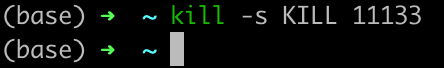

### 1. 进程

系统中的每个程序都运行在某个进程的上下文中，上下文是由程序正确运行所需的状态组成。状态包括：

1. 存放在内存中的程序的代码和数据
2. 栈、通用目的寄存器的内容
3. 程序计数器
4. 环境变量
5. 打开文件描述符集合等。

进程给应用程序提供的抽象：

1. 独占地使用处理器
2. 独占地使用内存系统

下图是一个典型的进程的地址空间。


1. 地址空间的底部是保留给用户程序的，包括通常的代码、数据、堆和栈。
2. 代码段都是从`0x400000`开始，地址空间顶部留给内核，内核部分对用户是不可访问的。

应用程序代码的进程初始时刻处于用户模式，从用户模式变为内核模式的为方法就是通过注入中断、故障或者陷入系统调用这样的异常。异常发生时，控制传递到异常处理程序，处理器模式转为内核模式。当返回到应用程序代码时，处理器改会用户模式。

Linux提供`/proc`文件系统，允许用户模式进程访问内核数据结构的内容。`/proc`问价系统将许多内核数据结构的内容输出为一个用户程序可读的文本文件的层次结构，可以通过这些文件了解一般系统的属性。

### 2. 进程控制

#### 获取进程ID

每个进程有一个唯一整数进程ID，

```c
#include <sys/types.h>
#include <unistd.h>

pid_t getpid(void);  // 获取当前进程id
pid_t getppid(void); // 获取父进程id
// pid_t 为 int 类型
```

#### 创建、终止进程

可以认为进程处于以下三种状态。

1. 运行：在CPU上执行或者等待被执行且最终会被内核调度。
2. 停止：被挂起，且不会被调度。如收到某些信号`SIGSTOP`等，直到收到`SIGCONT`才会继续运行
3. 终止：永远停止了。
   1. 收到一个信号，信号的默认行为是终止进程
   2. 从主程序返回
   3. 调用了`exit`函数

```c
#include <stdlib.h>

void exit(int status);
// 以status退出状态来终止进程，这个状态可以最后被父进程获取。(return的状态也可以被父进程获取)。
```

父进程通过调用`fork`函数创建一个子进程。

```c
#include <unistd.h>

pid_t fork(void);

```

新创建的子进程几乎和父进程完全相同。虚拟地址空间是和父进程相同的一个副本，包括代码、数据段、堆、共享库和用户栈。

子进程还和父进程打开文件描述符相同的副本。所以子进程可以读写父进程中打开的任何文件。最大的区别就是具有不同的PID。

`fork`函数调用一次，但是返回两次。

1. 在父进程中，返回值是子进程的PID。
2. 在子进程中，返回值是0.

根据`fork`的返回值可以判断程序是在父进程中执行还是在子进程中执行。

```c
#include <unistd.h>
#include <stdio.h>

int main() {

    pid_t pid;
    pid = fork();
    if (pid < 0) {  // fork出错
        printf("fork error\n");
        exit(0);
    } else if (pid == 0) {  // 子进程的程序
        printf("child process : %d, parent process : %d\n", getpid(), getppid());
    } else {  // 父进程的程序
        wait(NULL);  // 等待子进程结束
        printf("parent process %d\n", getpid());
    }
    return 0;

}
```

两个进程的输出都显示在屏幕上，因为子进程继承了父进程所有的打开文件。父进程调用`fork`时，`stdout`文件是打开的，且指向屏幕，子进程继承了这个文件，所以它的输出也是指向屏幕。

### 3. 回收子进程

一个进程终止时，内核并不是立刻将其从系统中清除，**而是被保持在一种终止的状态(占用系统资源)**，直到被他的父进程回收。当父进程回收已终止的子进程时(调用wait和waitpid函数)，内核将子进程的退出状态传递给父进程，然后抛弃已终止的进程，这样进程就不存在了。

> 一个终止但是还没有未被回收的进程称为僵尸进程。
>
> 当一个父进程退出而他的子进程还在运行，此时这些子进程就成为了孤儿进程。内核会排`init`进程称为孤儿进程的养父，进而有`init`进程对他们完成状态收集工作。`init`的PID为1，是在系统启动时由内核创建的，不会终止，是所有进程的祖先。`init`进程会循环地`wait`已经退出的子进程。
>
> 但是对于长时间运行的程序，如`shell`或服务器，应该总回收他们的僵死子进程。不然的话，这些进程即不会变成孤儿进程被`init`回收，也不会被父进程回收，会一直消耗着内存资源。

```c
// 查看父进程变为1
#include <stdio.h>
#include <unistd.h>
#include <stdlib.h>

int main() {

    pid_t pid;
    pid = fork();
    if (pid < 0) {
        printf("fork error\n");
        exit(0);
    } else if (pid == 0) {
        printf("children process : %d, father process : %d\n", getpid(), getppid());  // 显示父进程id
        sleep(3);  // 子进程休眠时间长。
        printf("children process : %d, father process : %d\n", getpid(), getppid());  // 显示父进程为1
    } else {
        sleep(1); // 为了等待子进程输出第一行指令，比子进程先结束。
        printf("parent pid : %d, grandparent pid : %d\n", getpid(), getppid());
    }
    return 0;
}
```

子进程完成执行后会发送一个`exit`信号，然后死掉。这个`exit`型号需要被父进程读取。父进程调用`wait`命令来读取进程的退出状态，然后将子进程从进程表中移除。如果一个进程结束，父进程没有使用`wait`或`waitpid`系统调用来等待子进程结束，又没有显示忽略`SIGCHILD`信号，那么子进程会变成一个僵尸进程并一直存在。僵尸进程虽然死亡，但是在进程表中任占据着一个位置，子进程残留资源`PCB`存放在内核中变成了僵尸进程。

子进程的父进程先结束，那么子进程不会变成僵尸进程，其会被`init`收养。出现僵尸进程就是子进程死亡之后，父进程不帮子进程收尸，而且父进程还在运行。


使用下面的命令可以查找僵尸进程

```shell
ps aux | grep Z
```

UNIX提供了一种机制让父进程获取子进程结束时的状态信息，这种机制就是在每个子进程退出的时候，内核会释放该进程所有的资源，包括打开的文件、占用的内存等。但内核仍然会保留一定的信息，如进程号、退出状态、运行时间等信息。直到父进程通过`wait`或`waitpid`系统调用来获取时才完全释放。

这样就导致了一个问题，如果进程不调用 `wait`或`waitpid`，那么保留在内核中的残留信息将不会主动被释放，进程号会一直被占用。由于系统所能使用的进程号是有限的，如果大量产生僵尸进程的话，系统将没有可用的进程号，从而导致系统不能产生新的进程。

僵尸进程并非罪魁祸首，问题的根源在于产生大量僵尸进程的那个父进程。可以使用`kill`命令发送信号`SIGTERM`或`SIGKILL`信号枪毙元凶进程。枪毙完成后，僵尸进程将会变成了孤儿进程，这些孤儿进程会被`ini`进程接管。`init`进程会`wait`这些孤儿进程，释放他们占用的系统资源。

僵尸进程的产生是因为父进程没有`wait`子进程，当系统中出现了僵尸进程，是无法通过`kill`命令来清除的，但可以杀死僵尸进程的父进程，让其变成孤儿进程，系统会统一管理和清理孤儿进程。

下面的代码可以产生僵尸进程。

```c
#include <stdio.h>
#include <unistd.h>
#include <stdlib.h>
int main() {

    pid_t pid;
    pid = fork();
    if (pid < 0) {
        printf("error\n");
        exit(0);
    } else if (pid == 0) {
        printf("child process %d, father process %d\n", getpid(), getppid());
        printf("child process exit:\n");
        exit(0);  // 子进程直接退出
    } else {
        while (1) {
            sleep(1);  // 父进程一直循环，但是不调用wait或者waitpid回收子进程
            printf("father process %d\n", getpid());
        }
    }
    return 0;
}
```


在父进程死循环的过程中，可以查看到其孩子进程确实成了僵尸进程。

#### wait函数

父进程调用`wait`系统调用可以回收子进程的终止信息，然后彻底清除掉这个进程。`wait`的三个功能：

1. 阻塞等待子进程退出
2. 回收子进程残留的信息
3. 获取子进程结束状态与退出原因

```c
#incldue <sys/wait.h>

pid_t wait(int *status); 
```

当进程终止时，操作系统的隐式回收机制是

1. 关闭所有文件描述符
2. 释放用户空间分配的内存

但是内核的PCB任然存在，保存着进程的退出状态。

- 正常终止时(return, exit)，记录退出值。
- 异常终止时，如一个未被捕获的信号而终止，则记录导致子进程种种的信号的编号。

`wait`函数的返回值：

1. `-1`表示没有子进程，失败
2. 成功则返回清理掉的子进程的PID

```c
#include <stdio.h>
#include <unistd.h>
#include <stdlib.h>
#include <sys/wait.h>

int main() {

    pid_t pid, wpid;

    pid = fork();
    if (pid < 0) {
        printf("fork error\n");
        exit(0);
    } else if (pid == 0) {
        printf("child process : %d\n", getpid());
        sleep(1);
        printf("child process exit\n");
        exit(1);
    } else {
        wpid = wait(NULL);
        if (wpid == -1) {
           printf("wait error\n");
           exit(1);
        } else {
            printf("wait success, wpid is %d\n", wpid);
        }
        while (1) {
            printf("parent : %d, child % d\n",getpid(), pid);
            sleep(1);
        }
    }
    return 0;
}
```


#### 获取子进程退出状态

在使用`wait`函数并传入参数之后，可以获取到退出状态，然后再利用宏函数来判断具体的原因。

宏分为以下三种：

1. 正常退出
   - `WIFEXITED(status)`表示是否正常退出，非零为正常退出。
   - `WEXITSTATUS(status)`,正常退出时，可以使用这个来得到进程退出的状态，就是`exit`或者`return`的参数。[exit和return的区别](https://www.zhihu.com/question/26591968)。

```c
#include <stdio.h>
#include <stdlib.h>
#include <unistd.h>
#include <sys/wait.h>

int main() {

    pid_t pid, wpid;
    int status;
    pid = fork();
    if (pid < 0) {
        printf("fork error\n");
        exit(0);
    } else if (pid == 0) {
        printf("child process % d\n", getpid());
        sleep(3);
        printf("child process exit %d\n", 76);
        return(76);
    } else {

        wpid = wait(&status);
        if (wpid == -1) {
            printf("wait error\n");
            exit(1);
        }
        printf("child %d : wait if exised with %d\n", pid, WIFEXITED(status));
        while (1) {
            printf("parent % d is running, child %d wait exit status with  %d\n", getpid(), pid, WEXITSTATUS(status));
            sleep(1);
        }
    }
    return 0;
}
```


2. 异常退出

   - `WIFSIGNALED(status)`,非零表示进程异常终止
   - `WTERMSIG(status)`，上述为真时，返回使进程终止的那个信号的编号

   ```c
   #include <stdio.h>
   #include <stdlib.h>
   #include <unistd.h>
   #include <sys/wait.h>
   
   int main() {
   
       pid_t pid, wpid;
       int status;
       pid = fork();
       if (pid < 0) {
           printf("fork error\n");
           exit(0);
       } else if (pid == 0) {
           printf("child process %d\n", getpid());
           sleep(60);
           printf("child process %d dead\n", getpid());
           exit(86);
       } else {
   
           wpid = wait(&status);
           if (wpid == -1) {
               printf("wait error\n");
               exit(1);
           }
           printf("child %d wait if existed with %d\n", pid, WIFEXITED(status));
           if (WIFEXITED(status) != 0) {
               printf("child %d wait exit status with %d\n", pid, WEXITSTATUS(status));
           }
   
           printf("child %d wait if signaled with %d\n", pid, WIFSIGNALED(status));
           if (WIFSIGNALED(status)) {
   
               printf("child %d wait term signal with %d\n", pid, WTERMSIG(status));
           }
   
           while (1) {
               printf("parent % d child %d\n", getpid(), pid);
               sleep(1);
           }
       }
       return 0;
   }
   ```

   将程序运行起来，然后在另一个终端向子进程发送一个`SIGKILL`信号。然后可以看到父进程得到了信号编号9,正是`SIGKILL`的编号。

   

   

   3. 暂停状态
      - `WIFSTOPPED(status)`：非零表示暂停状态
      - `WSTOPSIG(status)`：上述为真时，获取使进程暂停的信号的编号
      - `WIFCONTINUED(status)`：为真表示进程暂停后已经继续运行

### waitpid函数

`waitpid`函数的作用和`wait`相同，但是可以指定等待的范围，且可以不阻塞。

```c
#include <sys/wait.h>

pid_t waitpid(pid_t pid, int *statusp, int options);
```

成功则返回清理掉的进程ID，失败则返回-1表示无子进程。

`wait`函数与`waitpid`的区别在于一次`wait`调用只能回收一个子进程，而`waitpid`可以指定进程ID进行回收更加灵活。

`waitpid`参数`pid`返回情况(回收的范围)：

- 若`pid`小于-1表示回收指定进程组中的任意子进程

- 若`pid`等于0表示回收和当前调用`waitpid`一个组的所有子进程

- 若`pid`等于-1表示回收任意子进程，作用相当于`wait`函数。

- 若`pid`大于0表示回收指定进程ID的子进程

`waitpid`参数`options`可以设置是否阻塞，设置非阻塞可使用`WNOHANG`宏，设置非阻塞后需要使用轮询的方式定时查看子进程是否回收成功。

```c
#include <sys/wait.h>
#include <sys/types.h>
#include <stdio.h>
#include <errno.h>

int main() {

    int status;

    pid_t pid;

    for (int i = 0; i < 3; i ++) {
        if ((pid = fork()) == 0) {
            exit(i + 10);
        }
    }

    while ((pid = waitpid(-1, &status, 0)) > 0) {

        if (WIFEXITED(status)) {
            printf("child %d terminated normally with exit status %d\n", pid, WEXITSTATUS(status));
        } else {
            printf("child %d terminated abnormally\n", pid);
        }

    }
    if (errno != ECHILD)
        printf("waitpid error\n");

    return 0;
}
```


可以看到不同时候，回收的结果不同。可以通过指定回收的进程号，来按照顺序回收。

```c
#include <sys/wait.h>
#include <sys/types.h>
#include <stdio.h>
#include <errno.h>

const int N = 20;

int main() {

    int status;

    pid_t pid;
    pid_t t[N];
    for (int i = 0; i < N; i ++) {
        if ((t[i] = fork()) == 0) {
            exit(i + 10);
        }
    }
    int i = 0;
    while ((pid = waitpid(t[i++], &status, 0)) > 0) {

        if (WIFEXITED(status)) {
            printf("child %d terminated normally with exit status %d\n", pid, WEXITSTATUS(status));
        } else {
            printf("child %d terminated abnormally\n", pid);
        }

    }
    if (errno != ECHILD)
        printf("waitpid error\n");

    return 0;
}
```


可以看到按照顺序正确回收了所有的子进程。


