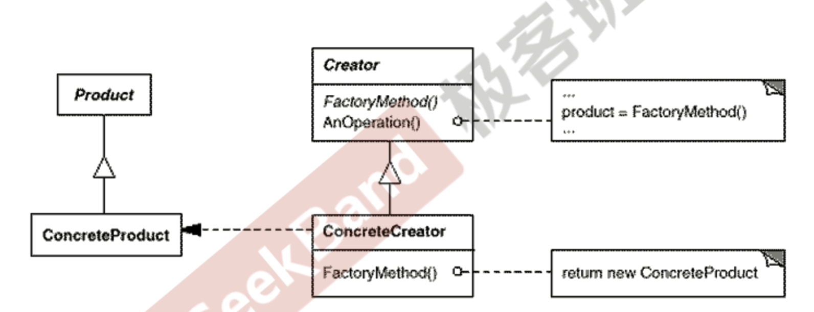

### 工厂方法


现在有一个UI界面，上面有一个按钮，点击按钮会读取文本框中的信息，然后调用文件分割器对文件进行分割。

下面是一个能够正确实现功能的代码。

```c++
#include <iostream>
#include <string>

// 文件分割器
class FileSplitter {
public:
    void do_split(std::string fileName, int number) {
        std::cout << "File Splitter, split file:" << fileName << "to " << number << " pieces" << std::endl;
    }
};

// 主界面
class MainForm{
public:

    void clickButton() {
        std::string fileName = "file1";
        int number = 4;
        FileSplitter fileSplitter; // 强依赖，对扩展封闭
        fileSplitter.do_split(fileName, number);
    }
};

// 测试
int main() {
    MainForm mainForm;
    mainForm.clickButton();
}
```

在进行重构的时候，我们需要找到变化点，然后将变化点进行抽象封装。而且需要动态地看代码。

现在我们可以看到，在`MainForm`类中，我们将`FileSpliiter`写死了类型，如果我们之后希望这里是一个二进制文件分割器，或者文本文件封隔器，图片分割器，就需要频繁的进行修改。

学习了前面的一些设计原则，我们可以想到如下的修改方法。

1. 顶层依赖抽象，不依赖具体类。所以在`MainForm`类中，我们不能够直接让其依赖具体的`FileSplitter`，而是依赖这些文件分割器的抽象。然后不同文件分割器继承基类，在运行时进行装配。

```c++
#include <iostream>
#include <string>

class ISplitter{
public:
    virtual void do_split(std::string fileName, int number) = 0;
    virtual ~ISplitter() = default;
};


class BinarySplitter : public ISplitter {
public:
    virtual void do_split(std::string fileName, int number) {
        std::cout << "Binary Splitter, split file:" << fileName << "to " << number << " pieces" << std::endl;
    }
};

class TxtSplitter : public ISplitter {
public:
    virtual void do_split(std::string fileName, int number) {
        std::cout << "Txt Splitter, split file:" << fileName << "to " << number << " pieces" << std::endl;
    }
};

class PictureSplitter : public ISplitter {
public:
    virtual void do_split(std::string fileName, int number) {
        std::cout << "Picture Splitter, split file:" << fileName << "to " << number << " pieces" << std::endl;
    }
};


class MainForm{
    ISplitter *iSplitter;  // 依赖抽象
public:
    MainForm(ISplitter *_iSplitter) : iSplitter(_iSplitter){}
    ~MainForm() {
        delete iSplitter;
    }
    void clickButton() {
        std::string fileName = "file1";
        int number = 4;
        iSplitter->do_split(fileName, number);
    }
};


int main() {
    ISplitter *iSplitter = new BinarySplitter();
    MainForm mainForm(iSplitter);
    mainForm.clickButton();
}
```

上面的代码看似实现了目的，但是仔细想一想，这个地方的设计还有一些问题：

1. 一个表单类里面有一个`iSpliter`，一般表单只有一些界面的元素，让他直接有一个文件分割器有点不太合适。而且这个文件封隔器只是在这一个函数中有使用，所以这个对象最好就只是在这个函数中进行创建和销毁。

不能直接使用`new`，避免导致强依赖，也不能直接在堆上创建一个对象，我们可以使用一个函数返回一个对象的方式来进行处理。

下面是一个简单版本的工厂方法。

```c++
#include <iostream>
#include <string>

class ISplitter{
public:
    virtual void do_split(std::string fileName, int number) = 0;
    virtual ~ISplitter() = default;
};

class BinarySplitter : public ISplitter {
public:
    virtual void do_split(std::string fileName, int number) {
        std::cout << "Binary Splitter, split file:" << fileName << "to " << number << " pieces" << std::endl;
    }
};

class TxtSplitter : public ISplitter {
public:
    virtual void do_split(std::string fileName, int number) {
        std::cout << "Txt Splitter, split file:" << fileName << "to " << number << " pieces" << std::endl;
    }
};

class PictureSplitter : public ISplitter {
public:
    virtual void do_split(std::string fileName, int number) {
        std::cout << "Picture Splitter, split file:" << fileName << "to " << number << " pieces" << std::endl;
    }
};

class SplitterFactory {
public:
    SplitterFactory() = default;
    ~SplitterFactory() = default;
    ISplitter* createSplitter() {
        return new BinarySplitter();  // 工厂类又依赖具体的文件分割器
    }
};

class MainForm{

public:
    MainForm() {}
    void clickButton() {
        std::string fileName = "file1";
        int number = 4;
        SplitterFactory splitterFactory;  // 编译时依赖具体的工厂类
        ISplitter* iSplitter = splitterFactory.createSplitter();
        iSplitter->do_split(fileName, number);
    }
};

int main() {

    MainForm mainForm;
    mainForm.clickButton();

}
```

对上面的代码进行分析，发现我们并没有接触这些类之间的编译时依赖。还是之前的套路，引入抽象，使用依赖抽象的方式来解决这些问题。

```c++
#include <iostream>
#include <string>


class ISplitter{
public:
    virtual void do_split(std::string fileName, int number) = 0;
    virtual ~ISplitter() = default;
};


class BinarySplitter : public ISplitter {
public:
    virtual void do_split(std::string fileName, int number) {
        std::cout << "Binary Splitter, split file:" << fileName << "to " << number << " pieces" << std::endl;
    }
};

class TxtSplitter : public ISplitter {
public:
    virtual void do_split(std::string fileName, int number) {
        std::cout << "Txt Splitter, split file:" << fileName << "to " << number << " pieces" << std::endl;
    }
};

class PictureSplitter : public ISplitter {
public:
    virtual void do_split(std::string fileName, int number) {
        std::cout << "Picture Splitter, split file:" << fileName << "to " << number << " pieces" << std::endl;
    }
};


// 所有工厂方法的基类
class ISplitterFactory {
public:
    virtual ISplitter* createSplitter() = 0;
    virtual ~ISplitterFactory() = default;
};

// 每个类各自的工厂类的子类
class BinarySplitterFactory: public ISplitterFactory {
    virtual ISplitter* createSplitter()  {
        return new BinarySplitter();
    }
};

class TxtSplitterFactory: public ISplitterFactory {
    virtual ISplitter* createSplitter()  {
        return new TxtSplitter();
    }
};

class PictureSplitterFactory : public ISplitterFactory {
    virtual ISplitter* createSplitter() {
        return new PictureSplitter();
    }
};

class MainForm{

    ISplitterFactory* splitterFactory;  // 存储一个工厂，具体传入的是哪个工厂依赖具体的子类

public:
    MainForm(ISplitterFactory* splitterFactory) :splitterFactory(splitterFactory) {}
    void clickButton() {
        std::string fileName = "file1";
        int number = 4;
        ISplitter* splitter = splitterFactory->createSplitter();  // 通过调用工厂类的方法来获取对象,多态的new
        splitter->do_split(fileName, number);
    }
};

int main() {

    ISplitterFactory* splitterFactory = new BinarySplitterFactory();
    MainForm mainForm(splitterFactory);
    mainForm.clickButton();

}
```

为被依赖的底层类实现工厂类的子类，然后顶层类依赖工厂类的基类。

就实现了利用抽象来降低耦合的目的。

### UML图



> 定义一个用于创建对象的接口，让子类决定实例化哪一个类。FactoryMethod使得一个类的实例化延迟(目的：解耦，手段：虚函数)到子类。

通过对象创建模式，绕开直接的`new`这种强耦合，因为只要`new`就要求有编译的依赖，从而支持对象创建的稳定。在软件系统中，经常面临着创建对象，但是由于需要的变化，需要创建的对象的具体类型也经常发生变化。工厂方法提供了一种绕开`new`的创建对象机制，且对扩展开放。

### 总结

1. Factory Method用于隔离对象的使用者和具体类型之间的耦合关系，面对一个经常变化的具体类型，紧耦合关系会导致软件的脆弱。
2. 工厂方法通过面向对象的方法，将要创建的具体对象工作延迟到子类，从而实现一种扩展(而非更改的策略)，较好地解决了这种紧耦合的关系。
3. 工厂方法解决单个对象的需求变化，但是要求所有对象的创建方法和参数相同。