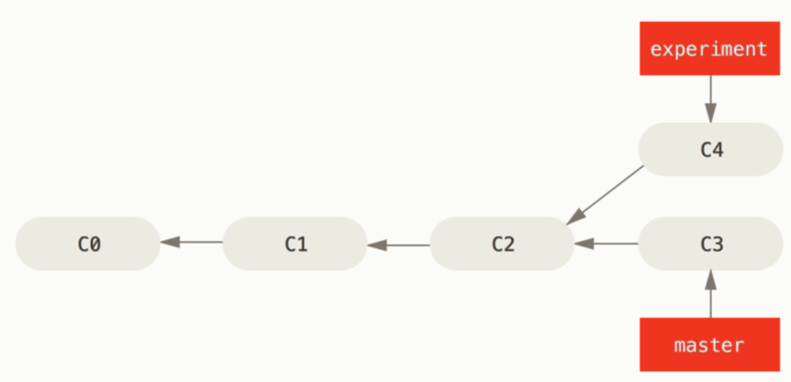
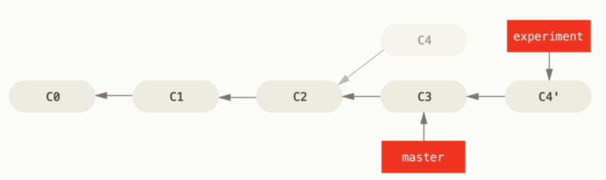
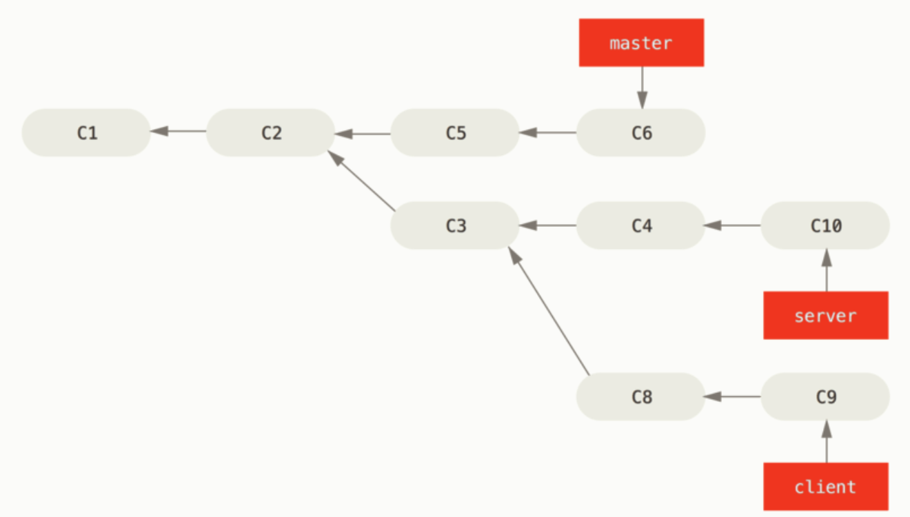
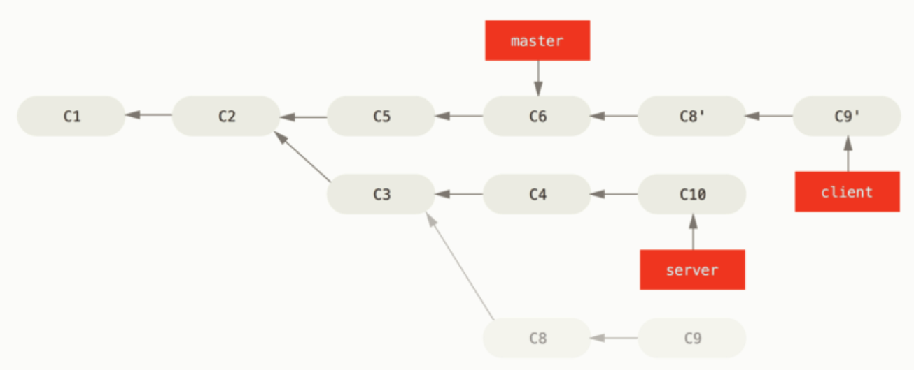
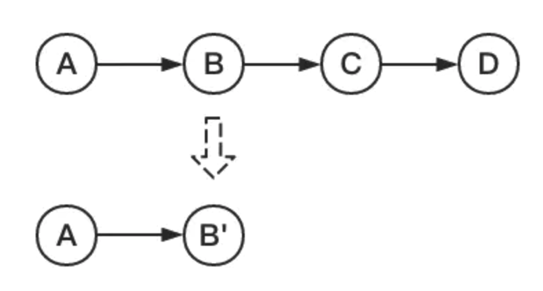
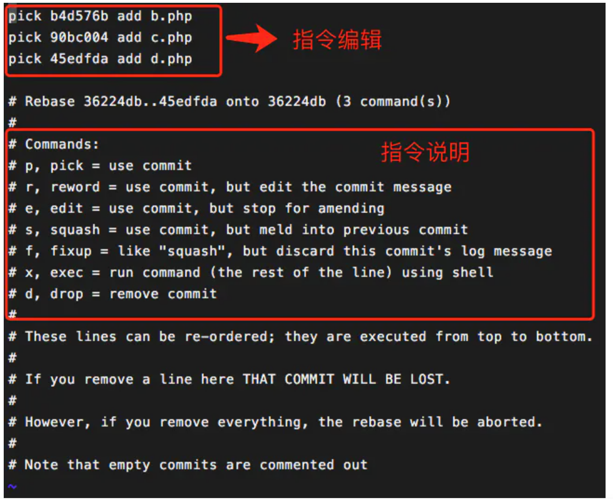
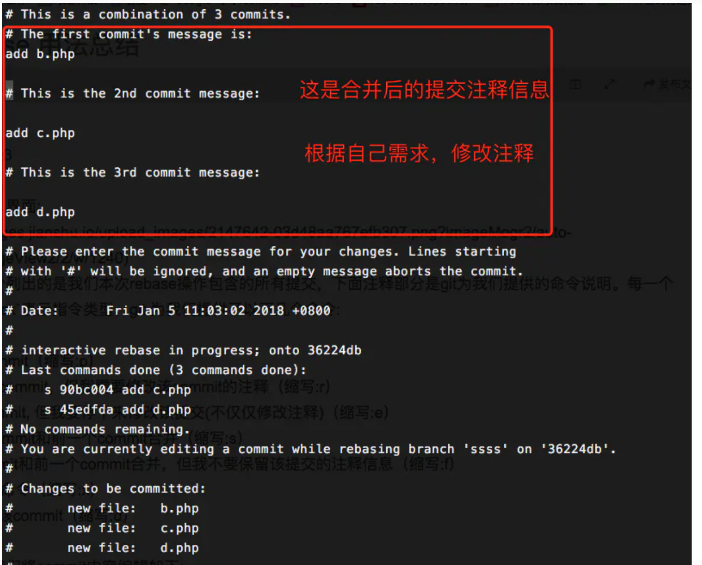
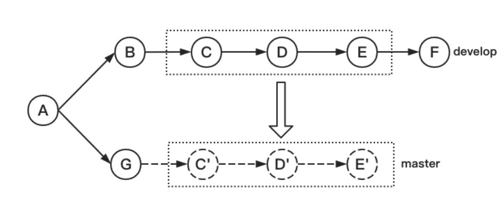

### 1. `git checkout`

`git checkout <loc>`相当于是将当前的`HEAD`指针重新指向`<loc>`位置。其中的`<loc>`可以是：

- 某一个分支的名字，比如`git checkout master`，就将`HEAD`指向了`master`分支指向的提交
- 某一个提交的哈希值，比如`git checkout f24c`，就将`HEAD`指向了哈希值为`f24c`的提交
- 利用分支进行相对寻址。
  - `git checkout master^`，将`HEAD`指向`master`分支的前一个提交
  - `git checkout master~n`，将`HEAD`指向`master`分支向前的第`n`个提交

`git checkout -b <new branch>`：从当前`HEAD`指向的提交，新建名称为`new branch`的分支，并切换到这个分支。相当于一下两个操作：

- `git branch <new branch>`：新建一个分支
- `git checkout <new branch>`：切换到这个新建的分支

综上所述，要想从某个历史提交重新开一个分支的话，可以先使用`git checkout `将`HEAD`设置到那个提交，然后使用`git checkout -b`新建一个分支。

### 2. `git rebase`

`git rebase`是整理提交记录的一个非常重要的方法。[官方文档](https://git-scm.com/book/zh/v2/Git-%E5%88%86%E6%94%AF-%E5%8F%98%E5%9F%BA)

顾名思义，它的操作就是将某一段提交做的修改操作放到一个特定的提交后面。

#### 2.1 将提交变成线性的

基于`C2`新建了一个分支`experiment`，并且在这个分支上执行了一次提交，到达了`C4`这个状态。

然后我们希望和`master`合并的时候，发现`master`有人远程提交了一个版本。`pull`之后，`master`指向了`C3`。

我们基于`C2`做了一些修改，如果用`merge`操作的话，会使得记录分叉，不美观。

这个时候可以使用`rebase`命令，比如当前分支为`experiment`， `git rebase master`这个操作会：

1. 找到`master`分支和`experiment`分支的最近公共祖先`C2`
2. 将`C2`到`experiment`分支的提交，在`master`分支指向的记录后面再提交一次，如果有冲突的话解决冲突即可。

这样的话，在`master`分支上就看不到分叉的提交记录了。

#### 2.2 选择一段提交放到另一个分支上面

使用`git rebase --onto master server client`可以将从`client`和`server`最近公共祖先到`client`的所有提交，放到`master`分支之后。

#### 2.3将多个commit合并为一个commit

[参考文档1](https://www.jianshu.com/p/571153f5daa1)

[参考文档2](https://juejin.cn/post/6844903600976576519)

[参考文档3](https://www.jianshu.com/p/4a8f4af4e803)

我们再开发的过程中可能有非常多的小的`commit`，这些`commit`都直接放到`master`上不太美观。我们可以先将这些小`commit`合并为一个`commit`，然后再进行提交。

使用的命令为`git rebase -i  [startpoint]  [endpoint] `

其中`-i`的意思是`--interactive`，即弹出交互式的界面让用户编辑完成合并操作，`[startpoint]`  `[endpoint]`则指定了一个编辑区间，如果不指定`[endpoint]`，则该区间的终点默认是当前分支`HEAD`所指向的`commit`(注：该区间指定的是一个前开后闭的区间)。

然后显示下面的交互界面

将需要保留的`commit`前面保留`pick`，将想要合并的前面保留`squash`。

然后按照VIM的保存即可。

然后进行注释修改界面。

编辑完保存就合并了`commit`。

#### 2.4 将一段commit放到其他的提交上。

`git rebase   [startpoint]   [endpoint]  --onto  [branchName] `

区间的定义任然是前开后闭，可以使用相对寻址来进行操作。

比如`git  rebase   90bc0045b^   5de0da9f2   --onto master`将`90bc0045b`到`5de0da9f2`之间的`commit`放到`master`分支上。

### 3. 回滚相关操作

#### 3.1 还没有`add`

`git checkout -- <file name>`

#### 3.2 已经`add`了，还没有`commit`

`git reset HEAD <file name>`

### 4. `git stash`

当当前有工作没有`commit`(包括工作区和暂存区的修改)。但是又需要切换到另一个分支去执行一些操作。

这个时候可以使用`git stash`将当前没有`commit`的修改压入一个栈中，然后回来之后再恢复现场。

`git stash`直接存储，一般使用`git stash save <message>`来添加一些说明

`git stash pop`，将栈顶的第一个删除，并应用到当前的提交上。

`git stash apply`,和`pop`类似，但是不会将其在栈顶删除。

`git stash list`，查看缓存

`git stash drop`删除缓存

`git stash clear`，清空缓存

[参考文献](https://www.cnblogs.com/tocy/p/git-stash-reference.html)

