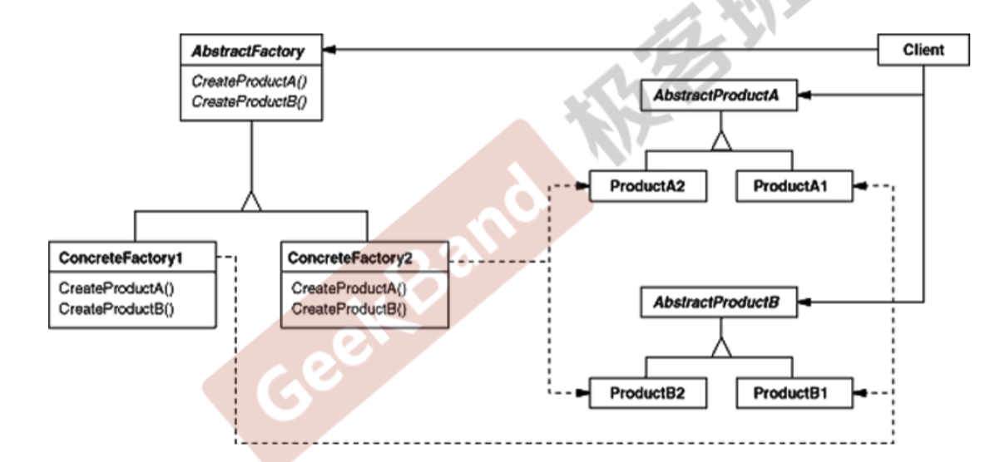

## 抽象工厂方法

> 抽象工厂方法和工厂方法类似，都是绕开常规对象创建方法new，提供一种封装机制。工厂方法解决的单一对象创建的问题，在软件系统中，经常面临着**一系列**相互依赖的对象的创建工作，也就是这些对象要变的话就一起变，同时，由于需求的变化，往往存在着更多系列对象的创建工作。

> 抽象工厂方法就是，提供一个接口，让该接口负责创建一系列"相关或者相互依赖的对象"，无需指定他们具体的类。

#### 代码实例

在DAO层，需要数据库连接，SQL语句执行器以及DataReader等对象。这些对象是和要访问的数据里类型强相关的。比如SqlLite、MySQL、Oracle等。而且这些类要变的话，就是都要变成对应的类型。下面是一个写死的代码

```c++
class EmployeeDAO{
    
public:
    vector<EmployeeDO> GetEmployees(){
        SqlConnection* connection =
            new SqlConnection();  // 直接new，写死
        connection->ConnectionString = "...";

        SqlCommand* command =
            new SqlCommand();  // 直接new，写死
        command->CommandText="..."; 
        command->SetConnection(connection);

        SqlDataReader* reader = command->ExecuteReader();  
        while (reader->Read()){
        }
    }
};
```

首先根据之前学习的工厂方法，以及面向接口编程的思想，我们可以很容易重构出如下的代码

```c++
//数据库访问有关的基类，定义一系列基类。
class IDBConnection{
    
};
class IDBConnectionFactory{  // 定义一系列工厂类的基类。
public:
    virtual IDBConnection* CreateDBConnection()=0;
};


class IDBCommand{
    
};
class IDBCommandFactory{
public:
    virtual IDBCommand* CreateDBCommand()=0;
};


class IDataReader{
    
};
class IDataReaderFactory{
public:
    virtual IDataReader* CreateDataReader()=0;
};


// 创建支持一系列具体数据库的子类
//支持SQL Server
class SqlConnection: public IDBConnection{
    
};
class SqlConnectionFactory:public IDBConnectionFactory{
    
};


class SqlCommand: public IDBCommand{
    
};
class SqlCommandFactory:public IDBCommandFactory{
    
};


class SqlDataReader: public IDataReader{
    
};
class SqlDataReaderFactory:public IDataReaderFactory{
    
};

//支持Oracle
class OracleConnection: public IDBConnection{
    
};

class OracleCommand: public IDBCommand{
    
};

class OracleDataReader: public IDataReader{
    
};


class EmployeeDAO{
    IDBConnectionFactory* dbConnectionFactory;  // 修改为工厂基类
    IDBCommandFactory* dbCommandFactory;
    IDataReaderFactory* dataReaderFactory;  // 这些工厂基类在构造函数内部需要初始化
    
    
public:
    vector<EmployeeDO> GetEmployees(){
        IDBConnection* connection =
            dbConnectionFactory->CreateDBConnection();
        connection->ConnectionString("...");

        IDBCommand* command =
            dbCommandFactory->CreateDBCommand();
        command->CommandText("...");
        command->SetConnection(connection); //关联性

        IDBDataReader* reader = command->ExecuteReader(); //关联性
        while (reader->Read()){

        }

    }
};
```

上面的代码确实解决了客户端代码和类型的强耦合关系，但是各个类之间的关系并没有很好的解决，比如有可能用户传入了一个SQL的Connection对象，但是配套的确实MySQL的Command对象。可以将这些相互依赖的对象通过抽象工厂方法进一步处理。

```c++

//数据库访问有关的基类
class IDBConnection{
    
};

class IDBCommand{
    
};

class IDataReader{
    
};

// 将相关的类放到一个工厂类中
class IDBFactory{
public:
    virtual IDBConnection* CreateDBConnection()=0;
    virtual IDBCommand* CreateDBCommand()=0;
    virtual IDataReader* CreateDataReader()=0;
    
};


//支持SQL Server
class SqlConnection: public IDBConnection{
    
};
class SqlCommand: public IDBCommand{
    
};
class SqlDataReader: public IDataReader{
    
};

// 实例化创建一系列相关联对象的工厂
class SqlDBFactory:public IDBFactory{
public:
    virtual IDBConnection* CreateDBConnection()=0;
    virtual IDBCommand* CreateDBCommand()=0;
    virtual IDataReader* CreateDataReader()=0;
 
};

//支持Oracle
class OracleConnection: public IDBConnection{
    
};

class OracleCommand: public IDBCommand{
    
};

class OracleDataReader: public IDataReader{
    
};


class EmployeeDAO{
    IDBFactory* dbFactory;  // 在Client中只需要通过这一个工厂类就可以创建一系列相关联的对象
    
public:
    vector<EmployeeDO> GetEmployees(){
        IDBConnection* connection =
            dbFactory->CreateDBConnection();  // 通过工厂方法创建
        connection->ConnectionString("...");

        IDBCommand* command =
            dbFactory->CreateDBCommand();    // 通过工厂方法创建
        command->CommandText("...");
        command->SetConnection(connection); //关联性

        IDBDataReader* reader = command->ExecuteReader(); //关联性
        while (reader->Read()){

        }

    }
};
```

### UML图



产品A和B是相关联的一系列产品，右侧的Client通过`AbstractProductA`和`AbstractProductB`依赖产品A和B，但是A和B必须是一系列的产品，在通过左侧的`COncreteFactory1`来提供具体的A和B。

顶层的框架都是依赖抽象的。比如`Client`依赖`AbstractFactory`和`AbstractProductA`，`AbstractProductB`，然后通过子类化这些基类，从而实现功能扩展，且修改封闭。

### 总结

1. 如果没有应对“多系列对象构建”的需求变化，则完全没有必要使用抽象工厂方法，简单工厂完全可以。
2. “系列对象”指的是某以特定系列下的对象之间有相互依赖、或作用关系。不同系列的对象之间不能相互依赖。
3. 抽象工厂模式主要在于应对**新系列**的需求变动，缺点是难以应对“新对象”的需求变动，也就是如果想加新对象的话，则破坏了上面的抽象的部分。

